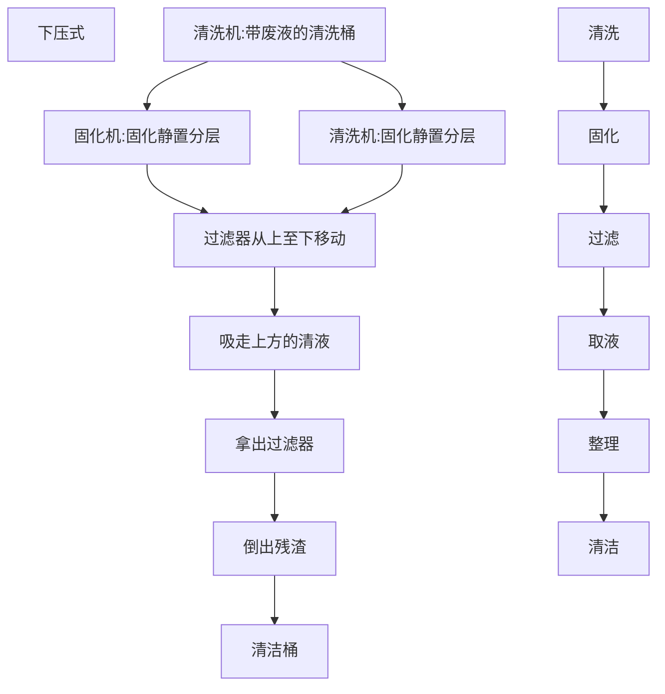
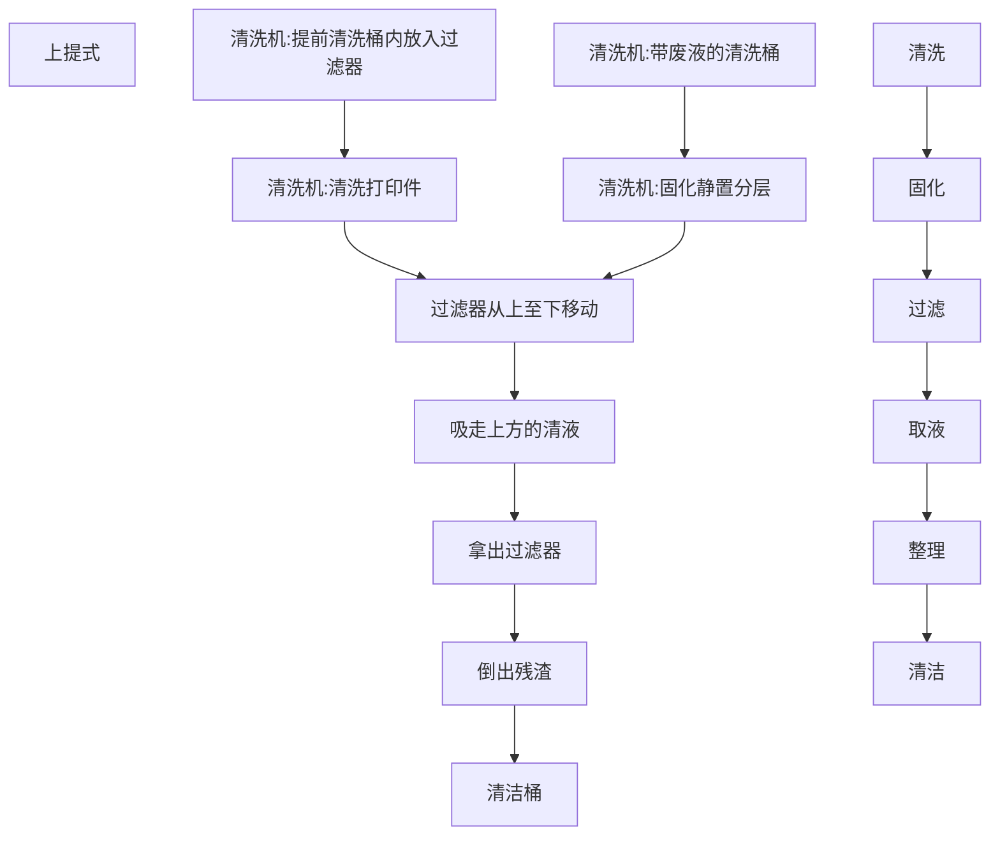

```mermaid
graph TD;
	下压式;
	清洗机:带废液的清洗桶-->固化机:固化静置分层-->过滤器从上至下移动-->吸走上方的清液-->拿出过滤器-->倒出残渣-->清洁桶;
	清洗机:带废液的清洗桶-->清洗机:固化静置分层-->过滤器从上至下移动;
	
	清洗-->固化-->过滤-->取液-->整理-->清洁
	
```

```mermaid
graph TD;
	上提式;
	清洗机:提前清洗桶内放入过滤器-->清洗机:清洗打印件-->过滤器从上至下移动-->吸走上方的清液-->拿出过滤器-->倒出残渣-->清洁桶;
	清洗机:带废液的清洗桶-->清洗机:固化静置分层-->过滤器从上至下移动;
	
	清洗-->固化-->过滤-->取液-->整理-->清洁
```

