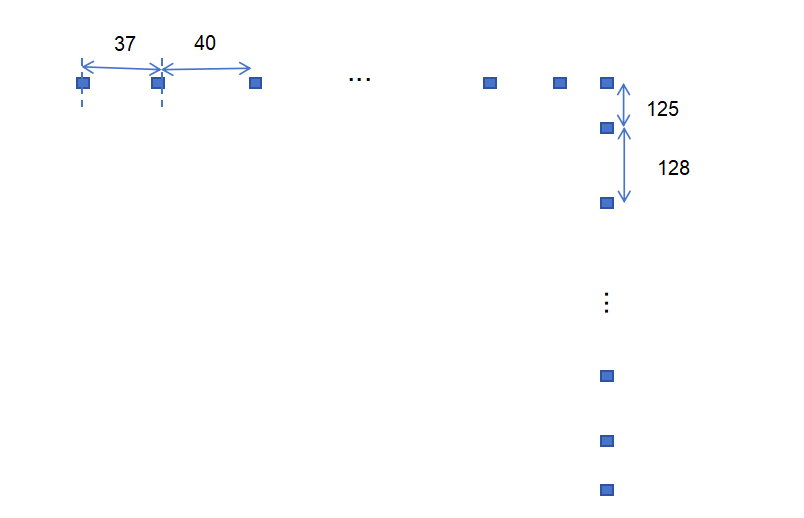
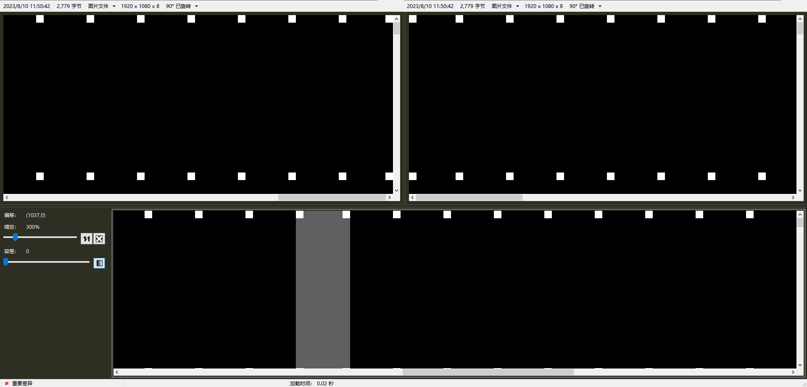
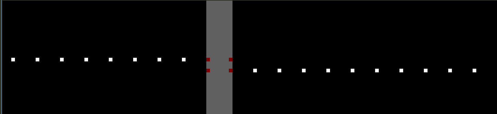
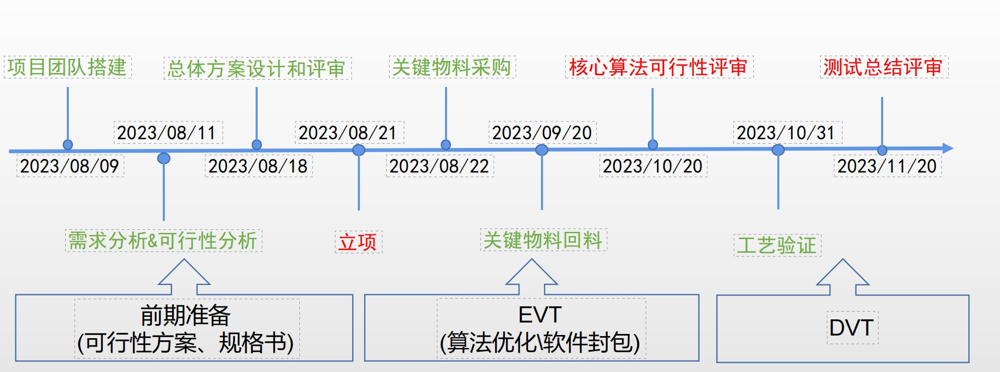

A3D快速标定

[TOC]

# A3D光机投图及标定图

## A3D标定投图[文件](E:\快速标定\a3d\标定图及标定板设计图)

1. 整张图（1920x2117）小方格数量：横向：54个；竖向16个

2. 单个小方格像素尺寸：6x6

3. 单个光机投图小方格数量：横向：28个；竖向：16个

## 对应标定板尺寸：

1. 横向：

37 * 0.075 = 2.775

40 * 0.075 = 3.0

2. 竖向：

9.375

9.6

## 两个光机拼接：

- 左光机：横向：1080， 竖向：1920

- 右光机：横向：1080， 竖向：1920

- 拼接区：重叠43个像素

即：

- 横向：1037 + 43 + 1037=2117

- 竖向：1920

- 幅面尺寸：

- 横向：2117 * 0.075 = 158.775

- 竖向：1920*0.075 = 144

如下图所示：

1. 左光机不动，右光机下移

# 项目时间节点

## 总体方案设计与评审：

1. 开会前会议室准备好线缆连接等

2. 拉会

3. 完成ppt

4. 准备好ppt内容素材

5. 知道准备哪些：机械结构，辅助光源，电气，算法

6. 机械结构

   - 测试验证：旋转相机

   - 设计

   - 打样

7. 辅助光源

   - 光源打样

   - 光源固定结构测试
     - 拍图
       - 查看灰度，调节光强

8. 电气（mapx，mapy只能修改之后拷贝进去，如何优化做到对mapx及mapy无感知）

   - 相机：通讯线，电源线

   - 电脑：控制双光机投图

   - 双光机：

9. 算法
   - 流程图

进度：08.21完成总体方案评审，进入开发阶段

结论：结构等和a2d结构类似，算法进入开发，注意优化点，标定板摆放方式，选点等

## 软件开发：

1. 在原有a2d的算法基础上，另开分支，进行修改成a3d的算法方案
2. 增加a3d标定板及光机投图参数；
3. 采图进行测试；
4. 调节参数；

## 测试验证：

1. 搭建a3d测试平台及拍图

   - 机械：
     - 安装相机模组
     - 安装辅助光源
   - 电气
     - 2根网线
   - 软件：
     - a3d光机控制投图软件
     - LBAS相机拍图软件
   - 图片：
     - 边框图
     - 标定图
   - 工具：
     - 1台电脑
     - 1块a3d标定板

   - 步骤：
     1. 接线
        1. a3d电源线——插座
        2. a3d网线——网络接口
        3. 相机电源线——插座
        4. 相机网线——电脑
        5. 辅助光源电源线——插座
     2. 调节相机高度（目前暂定215mm）；
     3. 调节相机清晰度（使用标定板，利用LBAS相机拍图软件查看标定板中间黑点，将黑点放至最大，调节焦距直到黑点清晰为止）；
     4. 使用a3d光机控制投图软件打开左光机，调节电流（边框在图片中清晰可见），投边框图，关辅助光源，打开LBAS相机拍图软件拍图，图片命名为border_left；
     5. 使用a3d光机控制投图软件打开右光机，调节电流（边框在图片中清晰可见），投边框图，关辅助光源，打开LBAS相机拍图软件拍图，图片命名为border_right；
     6. 左右光机同时投标定图，错开放置标定板；
     7. 保持标定板不动，左光机投标定图，右光机不投图，打开辅助光源，打开LBAS相机拍图软件拍图，图片命名为calib_left；
     8. 保持标定板不动，右光机投标定图，左光机不投图，打开辅助光源，打开LBAS相机拍图软件拍图，图片命名为calib_right；
     9. 将图片打包压缩发送。

2. 根据图片运算，生成位置偏移和角度偏移；
   - 测试程序，能否生成？
     - 

3. 使用小工具写入偏移后再投图拍图
4. 再次根据图片运算，生成位置偏移和角度偏移；
5. 上述流程完整跑通过后，再将a3d设备推至标定机旁，全流程跑一遍然后使用标定机复核
6. 

## 产品开发：

提前规划时间

## 优化：

1. 提前对风险点进行分析，构思方案，比如点的识别精度和标定机不匹配；
2. 根据具体问题进行分析；

### 选点计算（选择哪些点）

### 标定板摆放方式

### 左右光机分别调节一部分

