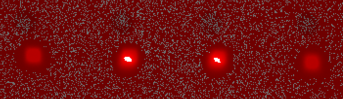

A3D快速标定

[TOC]

# A3D光机投图及标定图

## A3D标定投图[文件](E:\快速标定\a3d\标定图及标定板设计图)

1. 整张图（1920x2117）小方格数量：横向：54个；竖向16个

2. 单个小方格像素尺寸：6x6

3. 单个光机投图小方格数量：横向：28个；竖向：16个

## 对应标定板尺寸：

单光机幅面

1. 横向：28个点，27段距离

37 * 0.075 = 2.775（首位两段）

40 * 0.075 = 3.0（25段）

2. 竖向：

9.375

9.6

## 两个光机拼接：

- 左光机：横向：1080， 竖向：1920

- 右光机：横向：1080， 竖向：1920

- 拼接区：重叠43个像素

即：

- 横向：1037 + 43 + 1037=2117

- 竖向：1920

- 幅面尺寸：

- 横向：2117 * 0.075 = 158.775

- 竖向：1920*0.075 = 144

如下图所示：

1. 左光机不动，右光机下移

# 物料需求

1. A3D标定板
2. 磁吸座

# 项目时间节点

## 总体方案设计与评审：

1. 开会前会议室准备好线缆连接等

2. 拉会

3. 完成ppt

4. 准备好ppt内容素材

5. 知道准备哪些：机械结构，辅助光源，电气，算法

6. 机械结构

   - 测试验证：旋转相机

   - 设计

   - 打样

7. 辅助光源

   - 光源打样

   - 光源固定结构测试
     - 拍图
       - 查看灰度，调节光强

8. 电气（mapx，mapy只能修改之后拷贝进去，如何优化做到对mapx及mapy无感知）

   - 相机：通讯线，电源线

   - 电脑：控制双光机投图

   - 双光机：

9. 算法
   - 流程图

进度：08.21完成总体方案评审，进入开发阶段

结论：结构等和a2d结构类似，算法进入开发，注意优化点，标定板摆放方式，选点等

## 软件开发：

1. 在原有a2d的算法基础上，另开分支，进行修改成a3d的算法方案
2. 增加a3d标定板及光机投图参数；
3. 采图进行测试；
4. 调节参数；

## 测试验证：

1. 搭建a3d测试平台及拍图

   - 机械：
     - 安装相机模组
     - 安装辅助光源
   - 电气
     - 2根网线
   - 软件：
     - a3d光机控制投图软件
     - LBAS相机拍图软件
   - 图片：
     - 边框图
     - 标定图
   - 工具：
     - 1台电脑
     - 1块a3d标定板

   - 步骤：
     1. 接线
        1. a3d电源线——插座
        2. a3d网线——网络接口
        3. 相机电源线——插座
        4. 相机网线——电脑
        5. 辅助光源电源线——插座
     2. 调节相机高度（目前暂定195mm）；
     3. 调节相机清晰度（使用标定板，利用LBAS相机拍图软件查看标定板中间黑点，将黑点放至最大，调节焦距直到黑点清晰为止）；
     4. 使用a3d设备Form界面工具，选择左光机，设置电流为900（边框在图片中清晰可见），投边框图，关辅助光源，打开LBAS相机拍图软件拍图，图片命名为border_left；
     5. 使用a3d设备Form界面工具，选择右光机，设置电流为900（边框在图片中清晰可见），投边框图，关辅助光源，打开LBAS相机拍图软件拍图，图片命名为border_right；
     6. 左右光机同时投标定图，错开放置标定板；
     7. 保持标定板不动，左光机投标定图，右光机不投图，打开辅助光源，打开LBAS相机拍图软件拍图，图片命名为calib_left；
     8. 保持标定板不动，右光机投标定图，左光机不投图，打开辅助光源，打开LBAS相机拍图软件拍图，图片命名为calib_right；
     9. 将图片打包压缩发送。

2. 根据图片运算，生成位置偏移和角度偏移；
   - 测试程序，能否生成？
     - 

3. 使用小工具写入偏移后再投图拍图
4. 再次根据图片运算，生成位置偏移和角度偏移；
5. 上述流程完整跑通过后，再将a3d设备推至标定机旁，全流程跑一遍然后使用标定机复核

### 注意！！

1. a3d标定中偏置数据使用逻辑：

​	标定文件解出来时，先作用旋转，再作用平移

2. 使用a3d标定软件投图时，给左光机的图片需要左旋转，给右光机的图片需要右旋转
3. 使用a3d上位机投图时，给左光机的图片需要左旋转，给右光机的图片需要左旋转。
4. 快速标定时的投光电流要和标定机复检电流保持一致，电流大小会影响标定结果
5. 标定机复检时，光机投光时间会影响标定复检结果，如果标定的时候未预热，那么复检的时候不要预热。否则标定复检结果会有影响。

## 产品开发：

提前规划时间

## 优化：

1. 提前对风险点进行分析，构思方案，比如点的识别精度和标定机不匹配；
2. 使用畸变矫正后的相机镜头拍图计算
3. 前置条件：
   1. 识别到偏差大于5个像素即退机，不需要标定；
   2. 单个幅面内的标定数据不能发生改变，光机不能发生面外旋转

~~201.91设备的标定文件偏移量0826~~

~~x：2.5329333329999999e+00~~

~~y：1.4577333330000000e+00~~

~~angle：1.1866655399999999e-01~~

高度195，取16行2列点计算

计算第一版：

dx: 1.9286872943242404, dy: 3.0312252044678654
d_angle: 0.08779924

迭代产生第2版

dx: -0.7015399138132805, dy: -0.8473364512125325
d_angle: 0.10601744

效果变差

**201.91设备的标定文件偏移量0905（对右光机作用）**

x: 2.4445333329999999e+00

y: 1.6736000000000000e+00

angle: 1.2933936500000001e-01

h:280高度下，取4行2列点计算

dx: 1.79186503092448

dy: 3.3282057444254676

d_angle: 0.0614507

h:195高度下，取4行2列点计算

l_x = 0.072694241
l_y = 1.27080889
l_angle_b = -0.620087
l_angle_w = -0.490044

r_x = -0.076607379
r_y = 1.034839734
r_angle_b = -0.675152
r_angle_w = -0.359965

dx: 1.990688266666667

dy: 3.146255413333335

d_angle: -0.18514399999999992

修正后：

l_x = 0.096434474
l_y = 1.07960549
l_angle_b = -0.255635
l_angle_w = -0.473508

r_x = 0.120628052
r_y = 0.960694745
r_angle_b = -0.448228
r_angle_w = -0.94021

dx: -0.32258103999999993

dy: 1.5854766000000013

d_angle: 0.274109

第2次修正

l_x = 0.089872584
l_y = 1.079481244
l_angle_b = -0.291686
l_angle_w = -0.47675

r_x = 0.084064072
r_y = 1.262716278
r_angle_b = -0.401722
r_angle_w = -0.506149

dx: 0.07744682666666669,

dy: -2.443133786666669

d_angle: -0.08063700000000007

第3次修正

l_x = 0.094018843
l_y = 1.088853702
l_angle_b = -0.232074
l_angle_w = -0.369313

r_x = 0.094958201
r_y = 1.015248373
r_angle_b = -0.416715
r_angle_w = -0.757254

dx: -0.01252477333333335

dy: 0.9814043866666674

d_angle: 0.20329999999999998

第四次计算

使用左右光机各中心区域6x6的点计算

使用2x2的点计算

l_x = -0.129206397
l_y = -1.333450049
l_angle_b = -0.0603534
l_angle_w = -0.0930923

r_x = -0.28072919
r_y = -1.544694126
r_angle_b = -0.282052
r_angle_w = -0.397551

offset_x = 2.020303906666667
offset_y = 2.8165876933333323
angle = 0.08276009999999996

------

使用6x6的点计算角度

l_x = -0.129213743
l_y = -1.333455175
l_angle_b = -0.0606093
l_angle_w = -0.0181224

r_x = -0.280725844
r_y = -1.544698
r_angle_b = -0.216795
r_angle_w = -0.262181

dx: 2.020161346666667,

dy: 2.8165709999999975

d_angle: 0.0878729

------

使用2x2点计算角度的结果拼接后拍图

并计算

使用2x2的点计算角度

l_x = -0.133140385
l_y = -1.317648739
l_angle_b = -0.133826
l_angle_w = -0.177196

r_x = -0.125013201
r_y = -1.332152188
r_angle_b = -0.113446
r_angle_w = -0.227286

dx: -0.10836245333333347, dy: 0.19337932000000002
d_angle: 0.07046999999999999

------

使用6x6的点计算角度

l_x = -0.133135647
l_y = -1.317636013
l_angle_b = -0.121658
l_angle_w = -0.110405

r_x = -0.125038765
r_y = -1.332146108
r_angle_b = -0.195981
r_angle_w = -0.188416

dx: -0.10795842666666666, dy: 0.19346793333333484
d_angle: 0.0036880000000000107

------

相机畸变矫正后：

l_x = -0.124685779
l_y = -1.336885899
l_angle_b = 0.00488973
l_angle_w = 0.0512668

r_x = -0.279260516
r_y = -1.541042864
r_angle_b = -0.228371
r_angle_w = -0.325556

dx: 2.0609964933333336, dy: 2.7220928666666655
d_angle: 0.14356207

使用diffCenter方式

l_x = -0.126088
l_y = -1.31991
l_angle_b = 0.00488973
l_angle_w = 0.0512668

r_x = -0.280944
r_y = -1.54265
r_angle_b = -0.228371
r_angle_w = -0.325556

dx: 2.064746666666667, dy: 2.969866666666669
d_angle: 0.14356207
d_angle_white: 0.3768228

左右双光机

第1组：

l_x = -0.142655
l_y = -1.44669
l_angle_b = -0.0376902
l_angle_w = 0.0876178

r_x = -0.317354
r_y = -1.79439
r_angle_b = -0.0371847
r_angle_w = -0.0058458

dx: 2.3293200000000005, dy: 4.635999999999999
d_angle: 0.0939691

第2组

l_x = -0.138854
l_y = -1.45431
l_angle_b = 0.0574868
l_angle_w = 0.142095

r_x = -0.317893
r_y = -1.79002
r_angle_b = -0.124715
r_angle_w = -0.107374

dx: 2.3871866666666666, dy: 4.476133333333333
d_angle: 0.06726719999999999

------

使用右光机计算

6x6点阵

l_x = -0.151485
l_y = -0.167165
l_angle_b = -1.04287
l_angle_w = -1.15913

r: dx=2.0198, dy=2.2288666666666668, angle=0.11626000000000003

10x10点阵

r_x = -0.140722
r_y = -0.143903
r_angle_b = 0.090761
r_angle_w = -0.073537

r: dx=1.8762933333333336, dy=1.9187066666666668, angle=0.164298

16x16点阵

r_x = -0.145378
r_y = -0.159311
r_angle_b = 0.0785213
r_angle_w = -0.0667568

r: dx=1.9383733333333335, dy=2.124146666666667, angle=0.14527810000000002

### 选点计算（选择哪些点）

1. x及y方向上的偏差选择哪些点
2. 旋转角度选择哪些点

### 标定板摆放方式

### 左右光机分别调节一部分

calibrate: "dx":-0.038200293831403442,"dy":0.022009162274964411}

data: {"Lx":9.1031266508661037,"Ly":-5.3380008402303414}

data:origin {"Ox":7.4780152385069325,"Oy":-5.1150562115327833}

data-c: {"Lx":1.6243155938345133,"Ly":-0.2358772692664779}

data-c {"Ox":0.0006881457554751419,"Oy":-0.0041542442061288654}

jlog: {"Lx":9.1031266508661037,"Ly":-5.3380008402303414}

只用左光机或右光机的border，

左光机一列

右光机一列

**使用16行2列**

计算角度

作用于右光机旋转后再投光计算偏移

先计算角度

**angle=0.131164826**

然后投图，拍图，计算中心偏差

**diffCenter_mm: [-0.15551, -0.155757]**

计算结果

**r: dx=2.073466666666667, dy=2.07676, angle=0**

验证一版

**angle=-0.011943888**

此时

左右拼接区偏差

**diffCenter_mm: [0.0225922, 0.000314249]（偏差小于半个像素）**

r: dx=-0.30122933333333335, dy=-0.004189986666666667, angle=0

**使用16行1列**（取中间2行平均值）

使用border图片角度+calib_left角度一起作用于calib_left，使其该列上x轴坐标相同（此时等效于相机横平竖直放置）

先计算角度

**diffAngle: 0.137659**

右光机应用角度投图拍图，计算中心偏差

diffAngle: -0.00899821（此时左右光机单列角度差趋近于0）

**diffCenter_mm: [-0.150923, -0.137126]**

计算右光机应偏移像素

**r: dx=2.012306666666667, dy=1.8283466666666668, angle=0**

验证一版

对右光机作用角度及偏移后拍图

diffAngle: -0.0164047

diffCenter_mm: [-0.00819943, -0.00757098]

查看此时拼接区的位置偏移

上面有点超过标准

再次调整角度

0.137659-0.0164047=0.1212543

投图拍图

diffCenter_mm: [-0.144135, -0.15373]

r: dx=1.9278933333333335, dy=2.0286, angle=0

diffAngle: 0.00930371

diffCenter_mm: [0.00423645, 0.00332415]

**使用16行1列**（取16行平均值）

使用border图片角度+calib_left角度一起作用于calib_left，使其该列上x轴坐标相同（此时等效于相机横平竖直放置）

先计算角度

**diffAngle: 0.137659**

右光机应用角度投图拍图，计算中心偏差

diffAngle: -0.00645853（此时左右光机单列角度差趋近于0）

**diffCenter_mm: [-0.148556, -0.148043]**

计算右光机应偏移像素

**r: dx=1.9807466666666667, dy=1.973906666666667, angle=0**

diffAngle: 0.12631

**IP 201.52设备（设备2）**

场内标定机测试偏差

左光机：

dx: 2.0

dy: -2.0

angle:0

右光机：

dx：-1.5287999999999999e+00

dy：1.8186666670000000e+00

angle：-1.2688491000000000e-02

快速标定

diffAngle: 0

diffCenter_mm: [0.260881, -0.30568]

r: dx=-3.478413333333333, dy=4.075733333333334, angle=0
**half of l: dx=1.7392066666666666, dy=-2.037866666666667, angle=0.0**
**half of r: dx=-1.7392066666666666, dy=2.037866666666667, angle=0.0**

**IP 201.47设备（设备3）**

场内标定机测试偏差

左光机：

dx: 9.9533333300000004e-01

dy: -1.4394666670000000e+00

angle: 0

右光机：

dx：0

dy：0

angle：-1.3685502999999999e-01

快速标定：

angle：-0.127579

旋转角度后：

 diffAngle: -0.00438652

diffCenter_mm: [0.113018, -0.139393]

r: dx=-1.5069066666666666, dy=1.8585733333333332, angle=0
half of r: dx=-0.7534533333333333, dy=0.9292866666666666, angle=0
half of l: dx=0.7534533333333333, dy=-0.9292866666666666, angle=0

再测一遍，电流为700，

diffAngle: -0.146675

r: dx=-0.0, dy=-0.0, angle=-0.146675
half of l: dx=0.0, dy=0.0, angle=0.0733375
half of r: dx=-0.0, dy=-0.0, angle=-0.0733375

左右两边作用相同角度旋转后拍图

diffAngle: 0.00713965

diffCenter_mm: [0.0642756, -0.0458003]

r: dx=-0.8570080000000001, dy=0.6106706666666667, angle=-0.146675
half of l: dx=0.42850400000000005, dy=-0.30533533333333335, angle=0.0733375
half of r: dx=-0.42850400000000005, dy=0.30533533333333335, angle=-0.0733375

第3遍

diffAngle: -0.134729

r: dx=-0.8570080000000001, dy=0.6106706666666667, angle=-0.134729
half of l: dx=0.42850400000000005, dy=-0.30533533333333335, angle=0.0673645
half of r: dx=-0.42850400000000005, dy=0.30533533333333335, angle=-0.0673645

左右两边作用相同角度旋转后拍图

diffAngle: -0.0102861

diffCenter_mm: [0.098771, -0.0487693]

r: dx=-1.3169466666666667, dy=0.6502573333333334, angle=-0.134729
**half of l: dx=0.6584733333333334, dy=-0.3251286666666667, angle=0.0673645**
**half of r: dx=-0.6584733333333334, dy=0.3251286666666667, angle=-0.0673645**

**IP 201.91设备（设备1）**

diffAngle: 0.137451

只右光机旋转角度

diffAngle: -0.000394512

diffCenter_mm: [-0.145687, -0.145687]

r: dx=1.9424933333333336, dy=1.9424933333333336, angle=0.137451
half of r: dx=0.9712466666666668, dy=0.9712466666666668, angle=0.0687255
half of l: dx=-0.9712466666666668, dy=-0.9712466666666668, angle=-0.0687255

左右光机均旋转一半角度

diffAngle: -0.0114283

diffCenter_mm: [-0.143873, -0.232018]

r: dx=1.9183066666666668, dy=3.0935733333333335, angle=0.137451
**half of l: dx=-0.9591533333333334, dy=-1.5467866666666668, angle=-0.0687255**
**half of r: dx=0.9591533333333334, dy=1.5467866666666668, angle=0.0687255**

左及右光机分别旋转到各自竖直位置（该方法效果差）

l: angle_16rows: -0.0248501（作用于光机时，要添加负号，反方向）

r: angle_16rows: -0.165621

左右光机旋转以上角度后拍图计算

l: angle_16rows: 0

r:  -0.000872173

diffCenter_mm: [-0.144298, -0.114236]

r: dx=1.9239733333333335, dy=1.5231466666666669, angle=0
half of l: dx=-0.9619866666666668, dy=-0.7615733333333334, angle=0.0
half of r: dx=0.9619866666666668, dy=0.7615733333333334, angle=0.0

左右光机各作用各自角度和平移后

l: angle_16rows: -0.0122114

r: angle_16rows: -0.00835489

diffCenter_mm: [-0.00424248, 0.00462816]

[-0.00532602, -0.00532602]
