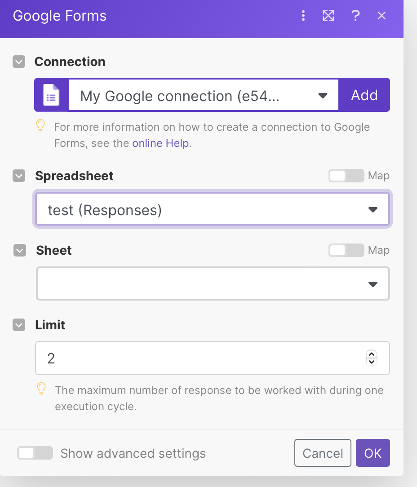
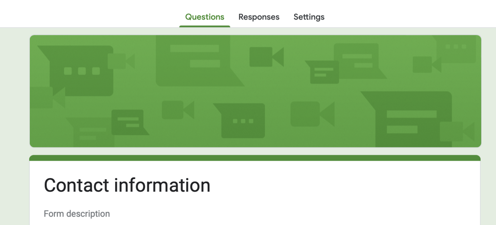

To use the JuicySMS API, you'll need to follow these steps:

1. Sign up for a JuicySMS account.

2. Log in to your account and navigate to the API settings.

3. Generate your API key, which you will use to authenticate your API requests.

4. Use the API documentation to determine the API endpoints and parameters you need to use.

   1. API endpoints are specific URLs or web addresses that represent a resource or functionality within an API. They are used to make requests to an API in order to access or manipulate the resource or functionality associated with that endpoint.

      For example, in a weather API, the endpoint "/weather/forecast" might be used to retrieve the forecast for a particular location. The endpoint "/weather/conditions" might be used to retrieve current weather conditions.

      API endpoints typically accept parameters, such as query parameters or request body parameters, which are used to specify additional details about the requested resource or functionality. The response from the API will typically include data that corresponds to the resource or functionality accessed via the endpoint.

5. Make API requests using your preferred programming language and the appropriate HTTP method (e.g., POST, GET).

   1. The appropriate HTTP method to use in an API request will depend on the action you want to perform and the resource you want to interact with.

      The most commonly used HTTP methods in API requests are:

      1. GET - used to retrieve data from a resource
      2. POST - used to submit data to be processed or stored by a resource
      3. PUT - used to update data in a resource
      4. DELETE - used to delete data from a resource

      There are also other HTTP methods that can be used in API requests, such as PATCH, HEAD, and OPTIONS, among others.

      When using an API, it's important to ensure that you are using the appropriate HTTP method for the action you want to perform. Using the wrong method can lead to errors or unexpected behavior. The API documentation should provide guidance on which method to use for each endpoint.

6. Parse the JSON response from the API to get the information you need.

   1. When an API returns a response, it is typically in a format that can be easily parsed by a computer program, such as JSON (JavaScript Object Notation). Parsing the JSON response means extracting the data from the JSON format and converting it into a format that can be used by your program.

      To parse a JSON response, you need to use a JSON parsing library or method in your programming language. This library will typically provide a way to convert the JSON data into a format that can be used by your program, such as a dictionary, list, or object.

      Once the JSON response has been parsed, you can then access the data it contains and use it in your program. For example, if the API returns a JSON response containing information about a user, you might parse the JSON and extract the user's name, email address, and other details, and use this information in your program.

      In summary, parsing the JSON response means extracting the data from the JSON format and making it usable by your program.

Keep in mind that the specific steps and requirements for using the JuicySMS API may vary depending on the specific use case, so it's important to review the API documentation thoroughly and ensure that you are following best practices for API usage and security.

google form 和 make结合使用

Spreadsheet 下拉没有任何表格时，此时google form的response未创建好

Responses 选项卡中创建一个spreadsheet

