23/1/8 自动校准整改。自动校准整改结果如下：

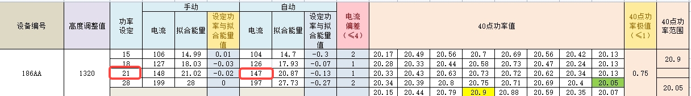

1/8至2/2，一共打印了10板模型（ HP 2.0 2版，SG 2版，Temp 2.0 C&B 4版，TF 2.0 2版），无打印异常反馈。

从02.03——03.25，开始反馈打印异常：

分层、掉板、缺失

2023-03-07，之前日志已自动删除

21W的设置电流

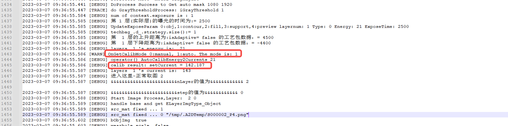

2023-03-22

21W的设置电流

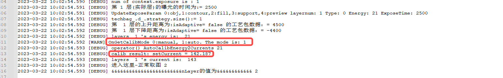

2023-03-22 做了自动校准

2023-04-03 15:13 手动光强校准，并复核每个点均在21±0.2范围内

2023-04-03 15：25 自动光强校准：

如何检测自动校准后的光强值的？

打印

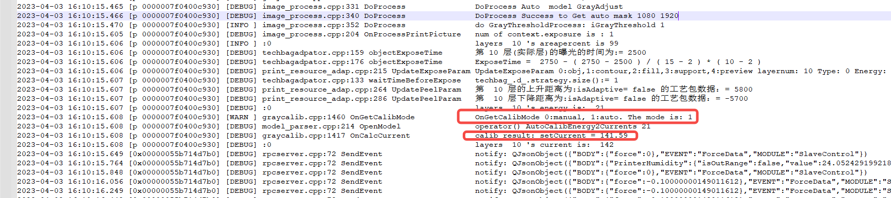

2023-04-04

模拟打印

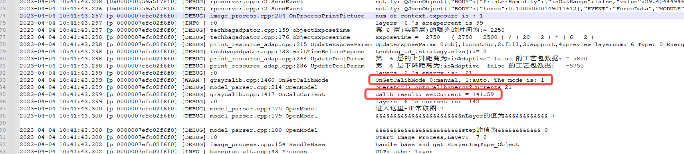

模拟打印光强：

指定投图光强：

测试界面检测光强

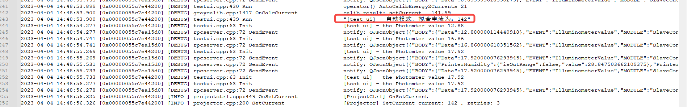

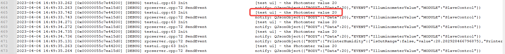

测试界面检测21W光强只有20W

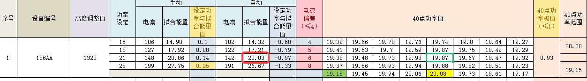

2023-04-04 16：16 开始自动校准

做完首次校准，然后做了多次自动mask的手动PI，未做再次自动校准

修正流程，按全流程，首次自校，自动mask手动pi，再次自校

光强正常

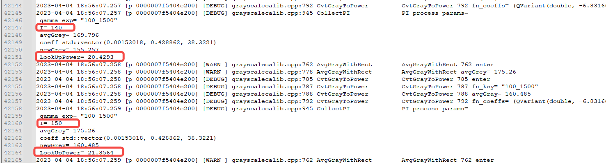

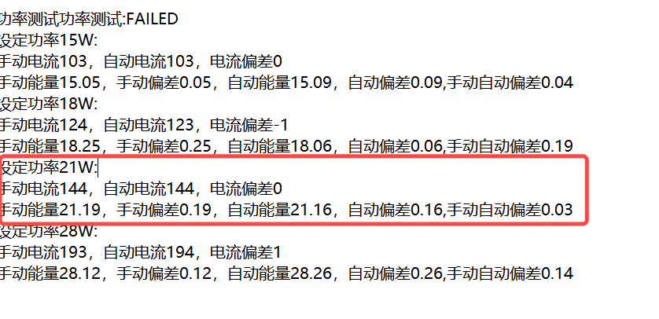

可能是由于自动校准光环境变化较大导致灰度偏差较大，从而导致光强在设定值21W时达不到21W

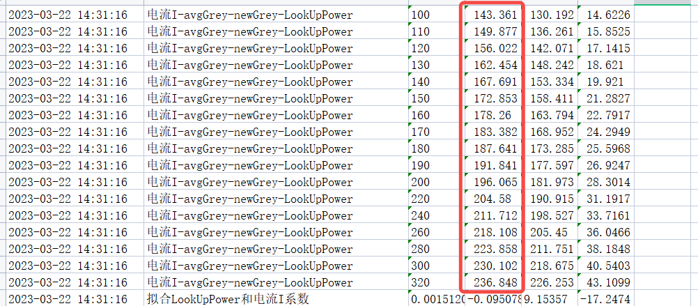

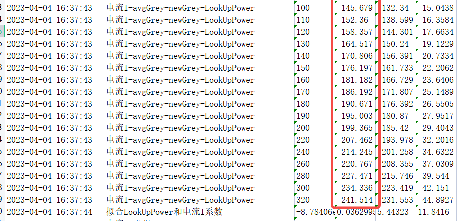

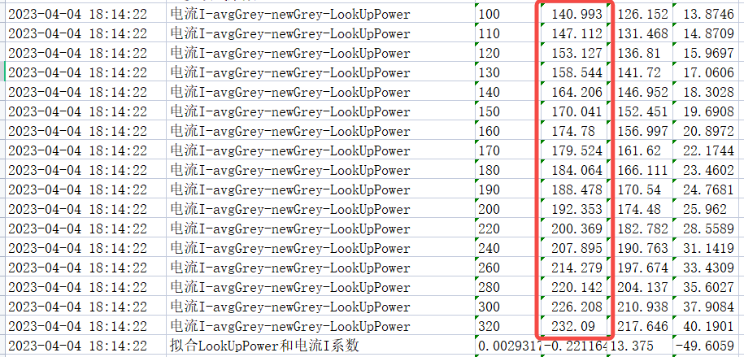

