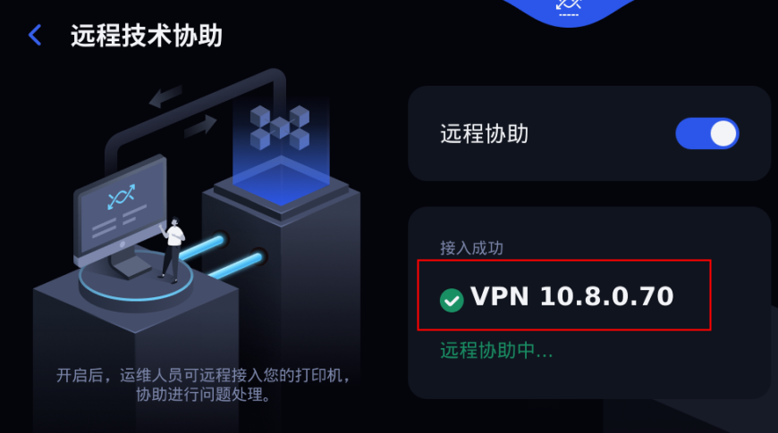
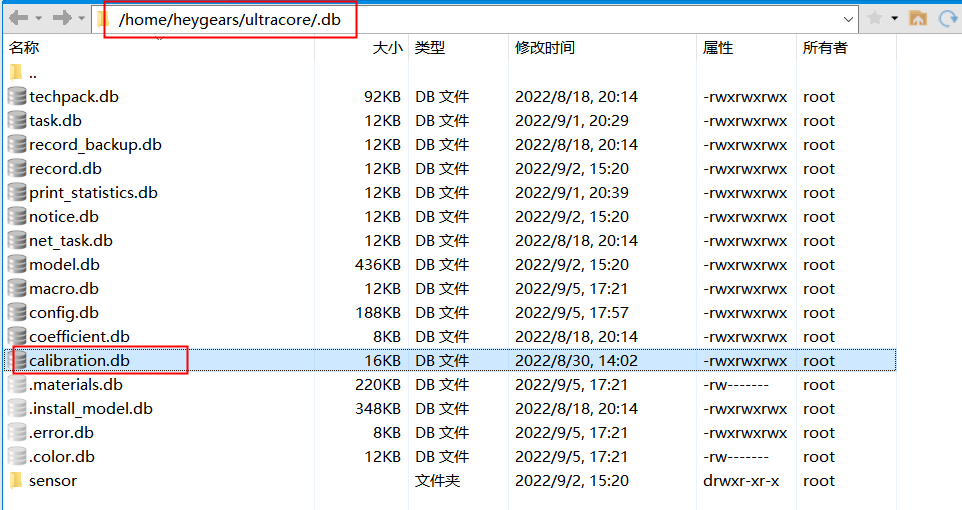
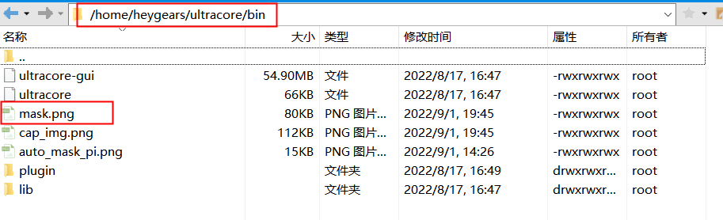
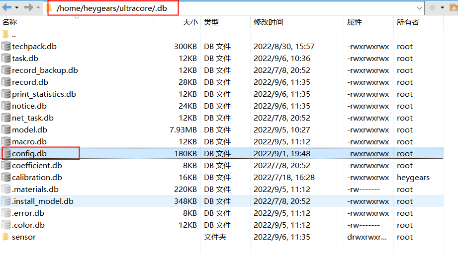

### ChairSide已发货设备自动均匀性校准整改方案流程

已发货设备软件版本：

- V1.2.5.12版本：自动均匀性校准使用的灰度拟合是一次关系式，该参数在autograycalib.json中进行配置

#### 整改流程

**软件运维：**

已知设备SN码，软件运维同事下发V1.3.0.3版本软件，客户Cloud软件升级到V1.3.0.3（下发时间由整改同事确定）

**场内电脑：**

1. 客户开启远程协助，并告知VPN地址，场内进行远程连接

   - 远程连接VPN界面

   

2. 备份客户设备 /home/heygears/.clinic下的autograycalib.json后并删除

   - autograycalib.json文件路径：/home/heygears/.clinic

3. 重启设备

4. 客户使用相机模组进行自动均匀性校准（若SN不匹配则终止整改）（客户开始自动校准的时间由整改同事确定）

5. 场内电脑进入指定路径下获取生成的mask、手动数据及日志

   - 手动数据获取路径：

   

   - 自动均匀性mask获取路径：

   

   - 日志获取路径 `/home/heygears/ultracore/log`

6. 将calibration.db中的手动PI数据和手动灰度数据分别导出为csv文件格式

   - 对手动PI进行三次拟合，将指定列表中的电流I复制进入，求得此指定电流列表下的光强P；

   - 对灰度数据使用脚本 `csv_gray_to_mask.py`将灰度数据转换成手动mask

7. 将自动mask和手动mask_24一起放入pycharm程序中（auto_calibration_data_collecting文件夹下），获取两者中心灰度值；

8. 使用脚本`cs_whole_process_data_collecting.py`提取日志中IG数据，将IG数据及相机模组母光源数据复制到CS出货整改模板中，进行数据拟合得到GG参数；

9. 使用序列化软件转换GG参数

10. 更改config.db ，并将修改好的db文件覆盖原db文件，同时使用md5对比是否原文件覆盖成功

    - config.db路径

    

11. sync同步并sudo reboot重启

12. 客户再做一次自动均匀性校准

13. 查看日志确认是否修改

    - 日志获取路径 `/home/heygears/ultracore/log`
    - 查询关键字：`gg_coeffs_list`

14. 整改结束

