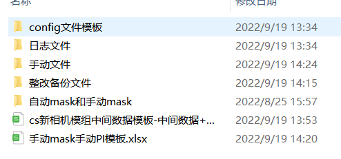
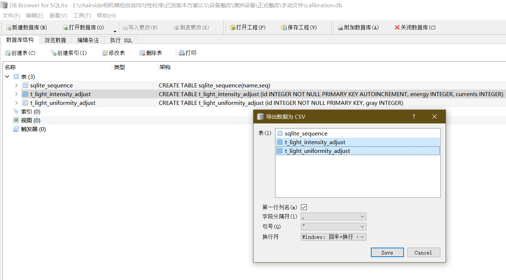
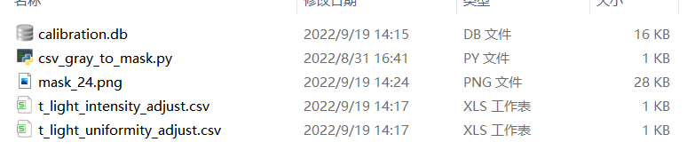
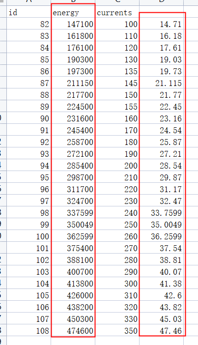
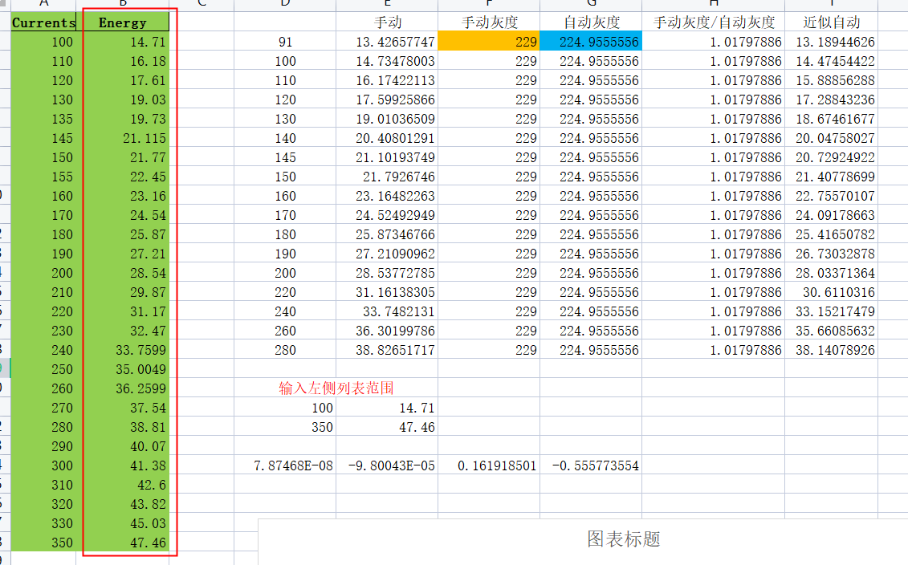
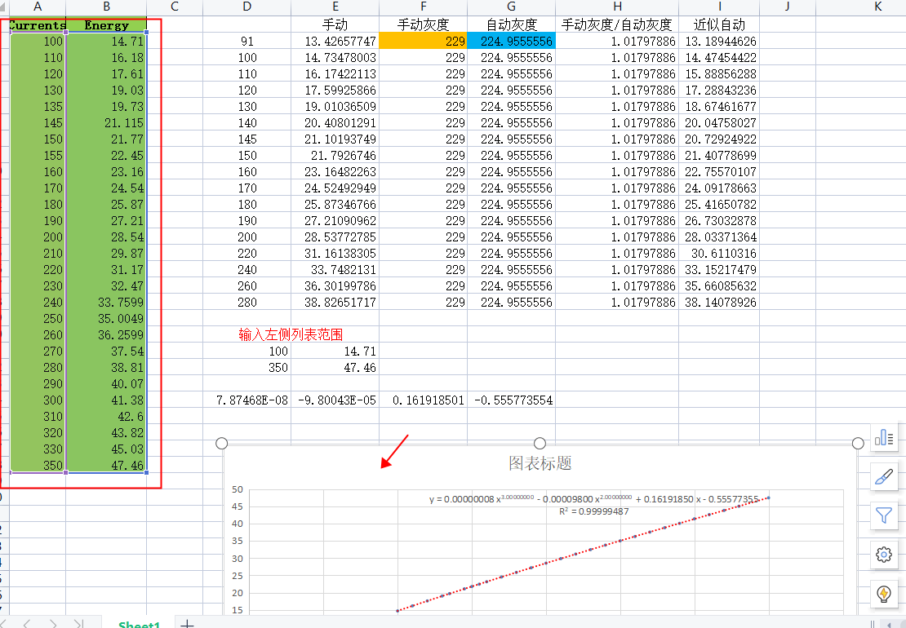
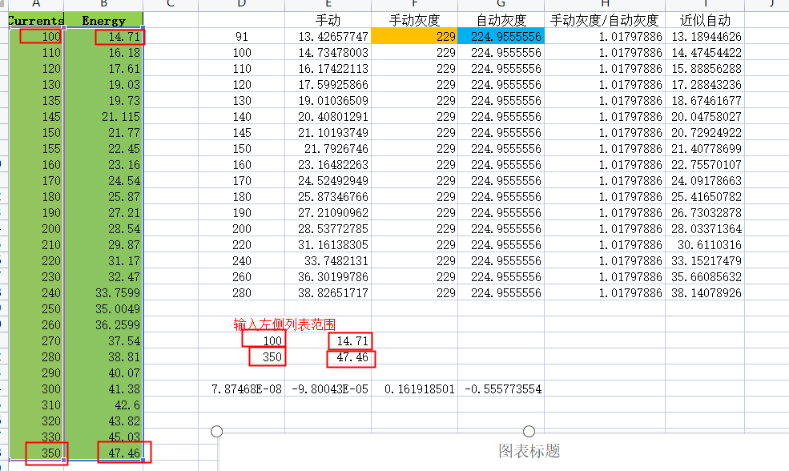
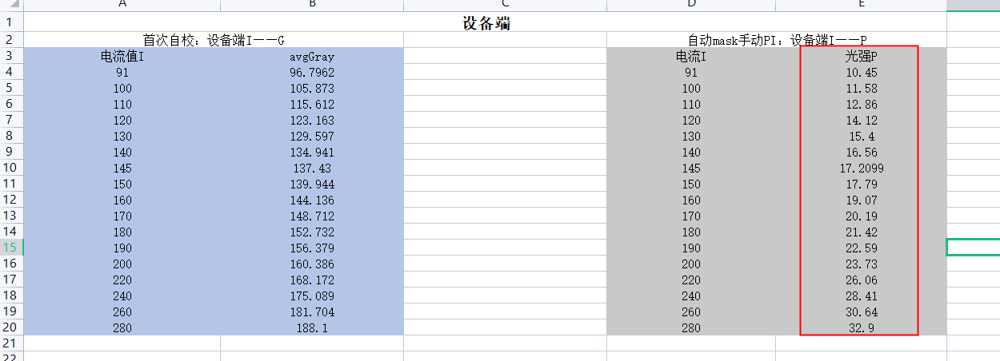
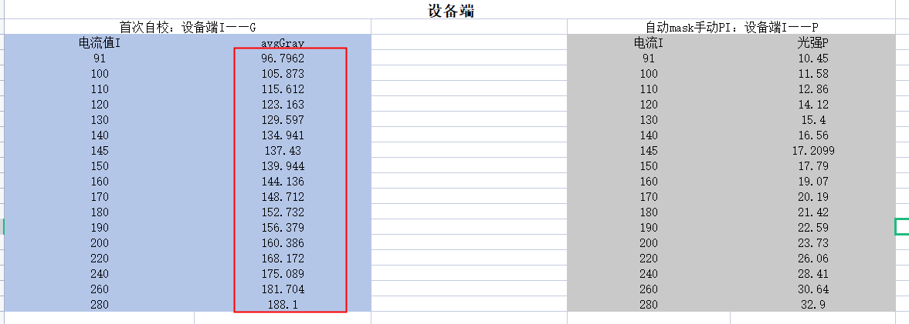

### ChairSide已发货设备自动均匀性校准整改方案流程

已发货设备软件版本：

- V1.2.5.12版本：自动均匀性校准使用的灰度拟合是一次关系式，该参数在autograycalib.json中进行配置

#### 整改流程

**软件运维：**

已知设备SN码，软件运维同事下发V1.3.0.3版本软件

**场内电脑：**

1. 客户Cloud软件升级到V1.3.0.3（下发时间由整改同事确定），并重启

2. 重启后，通知客户开启远程协助，并告知VPN地址

   - 远程连接VPN界面

   

3. 通知客户拿出**校准料盘**，使用相机模组进行自动均匀性校准（若SN不匹配则终止整改）（客户开始自动均匀性校准的时间由整改同事确定）（若客户自动均匀性校准时出现`光机校准失败——校准镜头异常，请重新安装镜头`错误信息，则通知客户重启设备，再次做自动均匀性校准）

4. 场内电脑进入指定路径下获取生成的mask、手动数据及日志

   - 手动数据获取路径：

   

   - 自动均匀性mask获取路径：

   

   - 日志获取路径： `/home/heygears/ultracore/log`

5. 将calibration.db中的手动PI数据及均匀性数据导出为csv文件格式

   - 对手动PI进行三次拟合，将指定列表中的电流I复制进入，求得此指定电流列表下的光强P；
   - 将均匀性数据生成一张手动mask

6. 将自动mask和手动mask一起放入pycharm程序中，获取两者中心灰度值，利用灰度比值法，获取自动mask下的IP数据；

7. 使用脚本`cs_whole_process_data_collecting.py`提取日志中IG数据，将IG数据， IP数据和相机模组母光源数据复制到CS出货整改模板中，进行数据拟合得到GG参数；

8. 使用序列化软件转换GG参数

9. 更改config.db ，并将修改好的db文件覆盖原db文件，同时使用md5对比是否原文件覆盖成功

   - config.db路径

   

10. 备份客户设备 /home/heygears/.clinic下的autograycalib.json后并删除

   - autograycalib.json文件路径：/home/heygears/.clinic 

11. sync同步并sudo reboot重启

12. 通知客户再次打开远程连接，并再做一次自动均匀性校准

13. 查看日志确认是否修改

    - 日志获取路径 `/home/heygears/ultracore/log`
    - 查询关键字：`gg_coeffs_list`

14. 断开远程连接，整改结束

数据整改：

连接客户设备后，将对应数据放入指定文件夹

其中：

- 手动文件

  手动数据获取路径：

  

将calibration.db文件导出为csv文件

然后运行csv_gray_to_mask.py，生成文件mask_24.png

打开t_light_intensity_adjust.csv，将energy栏的数值乘1e-4，获得右边栏的能量值

然后将该栏数据放入手动mask手动PI模板中的Energy栏中

接着点击图表，查看图表数据框是否在所有数据范围中

并确定“输入左侧列表范围”中四个值分别对应左边列表的四个值，从而下方的系数和图表中的系数相同，从而生成手动光强P

然后使用cs_center_gray_capturing.py脚本获取自动校准生成的mask和手动的mask_24中心灰度值，然后复制进入表格对应位置的手动灰度和自动灰度，就可以获得最后一栏的近似自动光强P，将该近似自动光强P复制粘贴放入cs_发货整改excel中的自动mask手动PI：设备端I——P的光强P中

获取设备端IG数据

客户做完自动均匀性校准后，获取日志文件，然后使用cs_whole_process_data_collecting.py脚本运行，获取设备端IG数据，将灰度G数据复制粘贴放入cs_发货整改excel中的首次自校：设备端I——G的avgGray中

cs_发货整改excel的使用及拟合参数序列化

见word文件

拟合参数写入config.db文件，同时确定其他参数如缩放系数是否正确，并将config.db先上传指Downloads路径下，然后使用命令行操作sudo cp /home/heygears/Downloads/config.db /home/heygears/ultracore/.db，最后在/home/heygears/ultracore/.db路径下打开config.db，查看是否是写入的正确参数

复核拟合参数是否成功写入

整改完成后客户会再做一次自动均匀性校准，打开日志文件，搜索关键字gg_coeffs_list，若参数和写入参数一致，则更改成功

