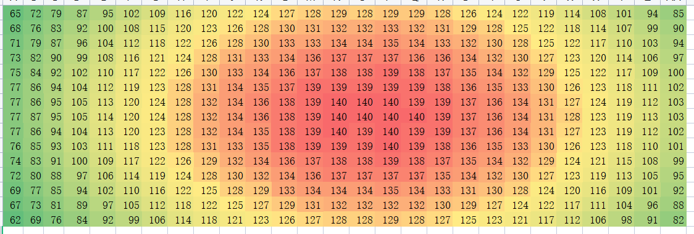

1. ~~2号母光源上拍图测试~~
   - ~~作图~~
     - ~~母光源上图片方格大小：100x100，数量为27x15~~
     - ~~CS设备上需要方格的物理尺寸相同：120x120，数量为1920/120 = 16， 1080/120 = 9~~
   - ~~2号母光源的不同电流列表文件制作~~
   - ~~测试~~
     - ~~相机模组使用gamma100~~

------

1. **均匀性优化全流程示意图**

   

2. ~~母光源上投图~~
   1. ~~2号母光源~~
   2. ~~优盘~~
   3. ~~电脑Linux~~
   4. ~~相机模组：用gamma100参数~~
   5. ~~调高度治具：160~~
   6. ~~背光膜~~
   7. ~~图片~~

3. ~~设备上投图~~
   1. ~~cs设备~~
   2. ~~相机模组~~
   3. ~~电脑Linux~~
   4. ~~优盘~~
   5. ~~调高度治具~~
   6. ~~背光膜~~
   7. ~~图片~~
4. ~~发送图片~~
   1. ~~钉钉传图~~

均匀性优化

- [ ] 流程
  - [ ] 母光源上G-P-（x,y）建模

  - [ ] 反算

- [ ] 算法程序测试，找到中间数据
- [ ] 设备上不同情况下拍图测试

CSP模组制作

1. ~~开模件~~
2. ~~镜头~~
3. ~~开孔~~
4. 测试
   1. ~~母光源拍图~~
   2. 协调三台CSP设备，拍图
   3. csp测试验证
      1. 

~~CS第三台设备复核~~

两台母光源中间数据

- 拍下的图片检测
- 拟合效果检测
- 位置变动导致的偏差

拍图第一张灰度偏低

- 可能原因：
  - 光机初始能量较低，
- 解决办法：
  - 先投白图，预热1分钟，关闭投图再放背光膜，从第16张图开始逆序投图（最后一张图对幅面影响小）

背光膜投图第一张验证

- 光机（即光强变化，在第一张图的光强低，进行预热3分钟）
  - 不预热
  - 投白图预热3min
  - 投黑图预热3min
- 背光膜（新膜、旧膜（光机投白图照射3min））
  - 新膜
  - 旧膜
- 相机

|                |        光机        | 背光膜 |                             流程                             |
| :------------: | :----------------: | :----: | :----------------------------------------------------------: |
|                |       不预热       |   新   | 1. **不预热**；2. 放上**新背光膜**；3. 按顺序从第1张至16张投图 |
|  **光强影响**  | ~~投白图预热3min~~ | ~~新~~ | ~~1. 投**白图**预热3min后；2. **关闭投图**；3. 放上**新背光膜**；4. 按顺序从第1张至16张投图~~ |
|                |   投黑图预热3min   |   新   | 1. 投**黑图**预热3min；2. **关闭投图**；3. 放上**新背光膜**；4. 按顺序从第1张至16张投图 |
|   * 增加1组    |   投黑图预热3min   |   新   | 1. 投**黑图**预热3min；2. **不关闭投图**；3. 放上**新背光膜**；4. 按顺序从第1张至16张投图 |
|                |                    |        |                                                              |
|                |       不预热       |   旧   |  1. 不预热；2. 放上**旧背光膜**；3. 按顺序从第1张至16张投图  |
|                |   投白图预热3min   |   旧   | 1. 投**白图**预热3min后；2. **关闭投图**；3. 放上**旧背光膜**；4. 按顺序从第1张至16张投图 |
| **背光膜影响** |   投黑图预热3min   |   旧   | 1. 投**黑图**预热3min；2. **关闭投图**；3. 放上**旧背光膜**；4. 按顺序从第1张至16张投图 |
|                |   投黑图预热3min   |   旧   | 1. 投**黑图**预热3min；2. **不关闭投图**；3. 放上**旧背光膜**；4. 按顺序从第1张至16张投图 |
|                |                    |        |                                                              |

验证回归模型生成的光强P的偏差

- cs：光强方格9行16列，取平均值转成4行6列的光强进行对比
- csp：光强方格10行18列，取平均值转成5行8列的光强进行对比

测试不同的mask的光强情况

- **测试前先将灰度设置为255状态，检测投图是否翻转**

- cs：**先记录255下各点光强**，再投图测量各点的光强
  - 投图方式：test界面投图
  - 设备1：软件测试，目前可用
  - 设备2：应用测试，
  - 设备3：硬件测试，打印中，目前不可用
- csp：**先记录255下各点光强**，再投图测量各点的光强
  - 投图方式：优盘投图
  - 设备1：硬件测试左2，测试中，目前不可用
  - 设备2：硬件测试右1，目前可用
  - 设备3：光学实验室，目前可用
- 输出excel
- 工具：
  - 光度计
  - 电脑
  - 光强读取软件
- 流程：
  - 先设置灰度值为255，测试各点光强记录在excel中
  - 然后投与过灰度的圆斑图，先用not_flip测试一下是否翻转，如果翻转的话使用flip图片投图
  - 测试各点光强记录在excel中

模型验证：均方差——母光源上验证

再拍一组计算均方差

低功率下幅面均匀性测试

采集图片时第一张图片灰度偏低测试：

CS

未烧膜，未预热

母光源上烧膜1min，未预热

母光源

21W

**第2组：中心部分150数值比较明显**

低光强下：18.1494

**中间部分数值142**

低光强下烧膜5min后，未冷却光机开始拍图

上面一组第二次测

恢复到21W，使用烧了的膜（已冷却5min）

21W，又烧了5min后，未冷却光机开始拍图

光机冷却5min后开始拍图

34.73W烧膜1min后，21W下拍图（光机未预热）

34.73W烧膜1min后，21W下拍图（光机预热3min）

CSP

未烧膜，未预热

烧膜后，未预热

烧膜后，预热

第2台设备

未烧膜，未预热

烧膜，未预热

烧膜1min，预热

设备自身烧膜（同时预热）

------

**展示**

CS

未烧膜，未预热

母光源上烧膜1min，未预热

第2台设备

设备端烧膜1min，预热

CSP

未烧膜，未预热

烧膜1min，预热

采用的投图方案：先烧膜1min，然后拍图

CS设备测光源波长及测试波长下相机灰度关系

光斑检测方式：使用和sensor大小一样的光斑移动检测

母光源上相机响应时间多久，灰度可以稳定下来

相机帧率10fps，10张每秒，100ms一张图片

1. 光机先投图，然后打开相机

比较图片：0-1，无灰度变化

2. 先打开相机，然后光机再投图

比较图片：54-55

54-55 ： 100ms， 增加14个灰度

56开始稳定

总结：光机投图后稳定至少200ms，才能开始拍图，拍图时相机只要100ms即可稳定。

263-267 稳定

267-268 增加14个灰度

268之后稳定

CS/CSP中间过程数据对比

|                   | 方案1（白图） | 方案2（小方格） |      |
| ----------------- | ------------- | --------------- | ---- |
| 母光源图片        | 白图          | 小方格          |      |
| 拟合GP函数        |               |                 |      |
| 计算设备端幅面内P |               |                 |      |
| 反算mask          |               |                 |      |

自动校准公差链

下午：

1. 同一台设备同一个相机模组测试旧方案和新方案作对比
2. CSP上测试

