Qt Creator

Qt中每一个类都有一个与其同名的头文件

快速查看帮助：将鼠标指针放到一个类名或函数上，则出现一个提示框显示其简单介绍，按下F1键就可以在编辑器右边快速打开其帮助文档。


### 2.3.1 使用全自动ui界面


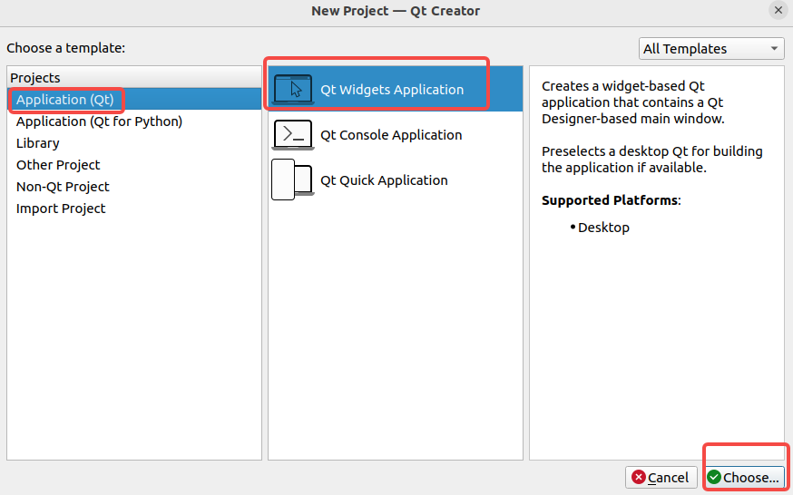


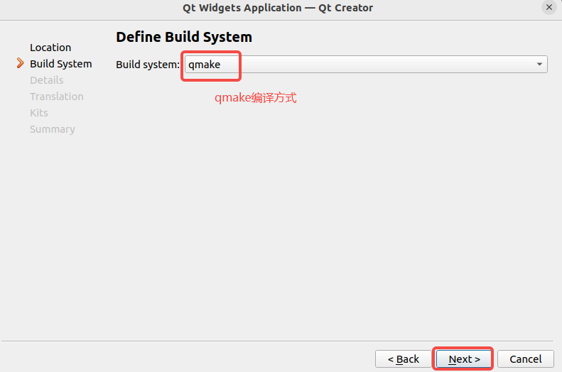


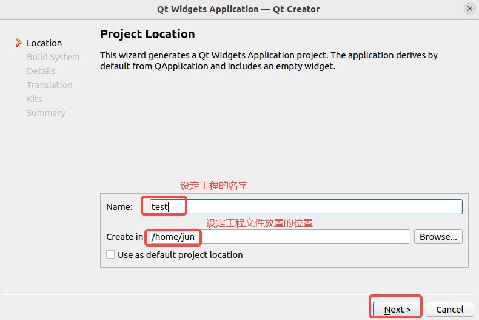


完成后文件形式：

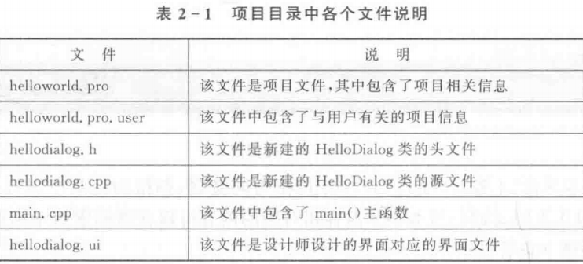

工程名称是创建工程时设定的名称

头文件和源文件的名称是创建工程时设定的类名

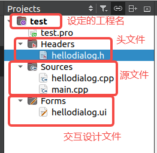


### 2.3.2 使用半自动ui界面

新建空项目

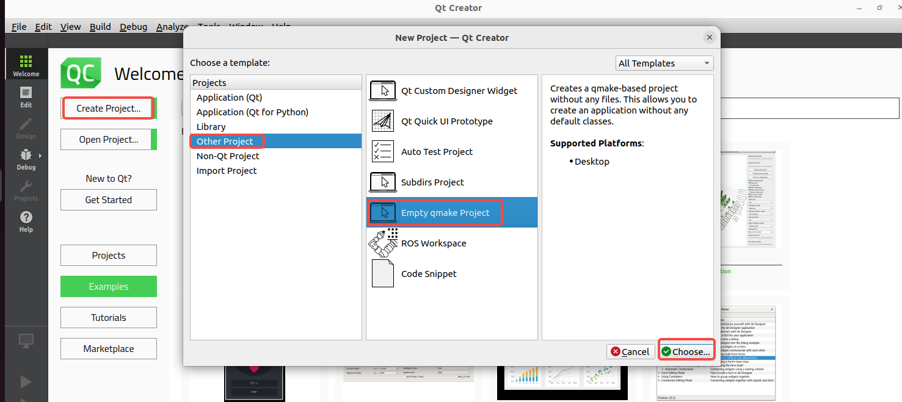


在空项目中添加cpp文件

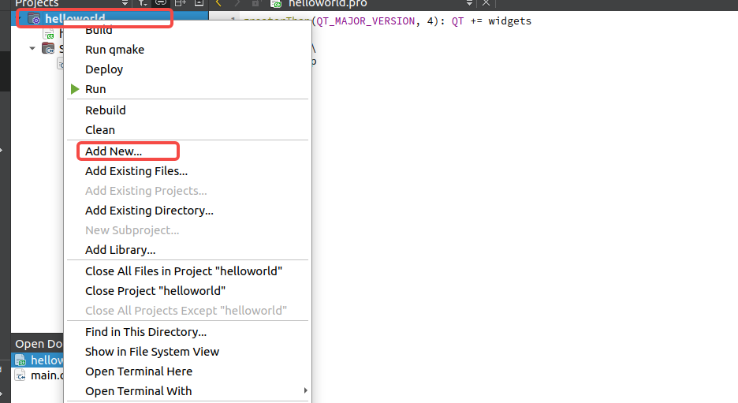


在空项目中添加ui文件

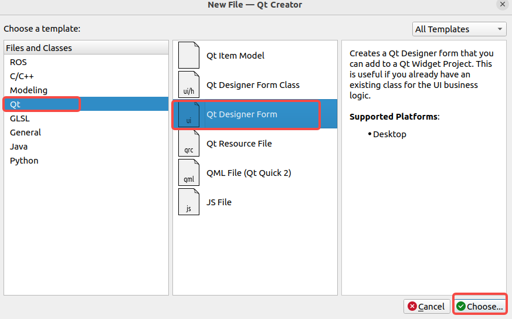

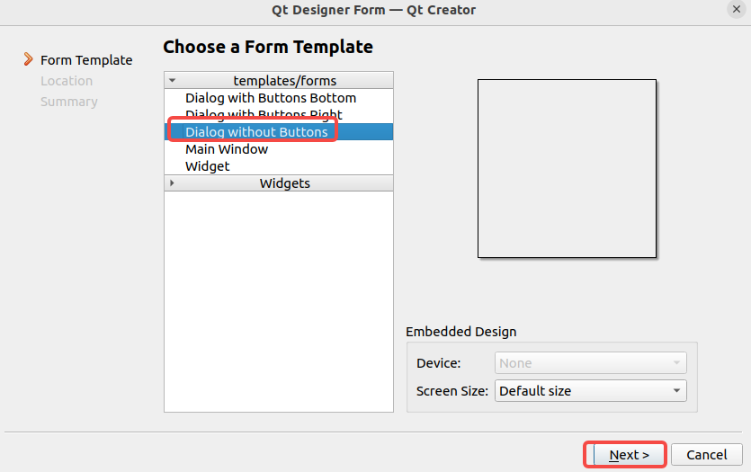

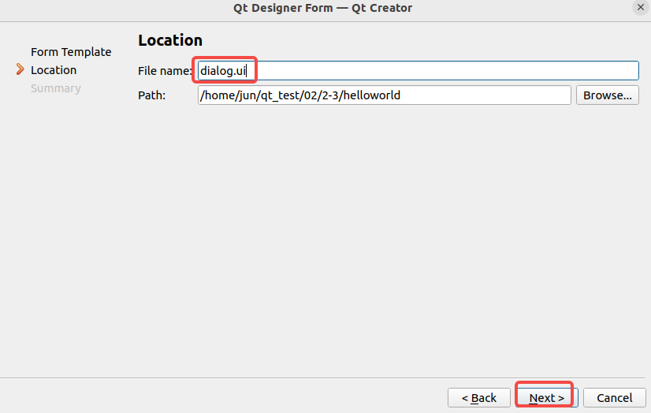

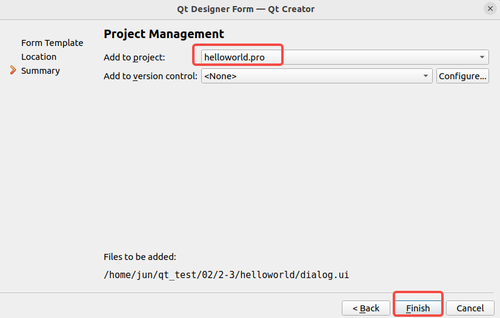

添加ui文件后并进行界面设计，然后点击左下角锤子图标进行build，会在当前项目文件夹下生成debug文件夹，该文件夹内含有该ui的头文件

之后在main文件中添加该头文件即可，例如：`#include "ui_dialog.h"`

### 2.3.3 不使用ui界面

1. 新建一个空工程
2. 加入类

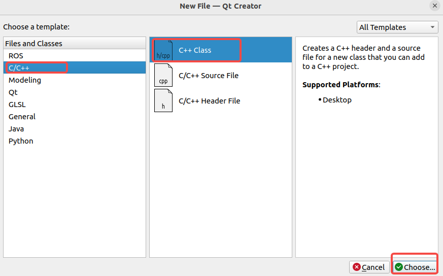

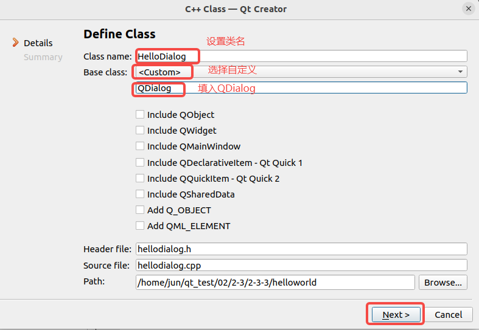

生成的头文件

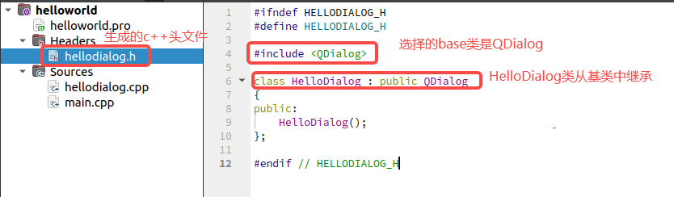

生成的源文件

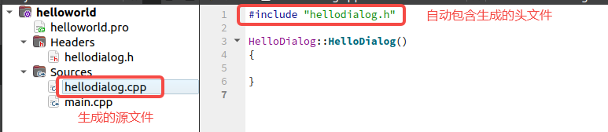

3. 加入main文件

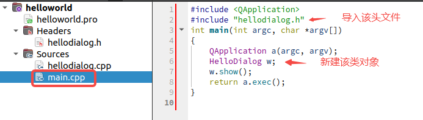

3. 


# 第3章 窗口部件

## 3.1 基础窗口部件QWidget

### 3.1.1 窗口、子部件以及窗口类型

```c++
#include<QtWidgets>

int  main(int argc, char *argv[])
{
    QApplication a(argc, argv);
    
    //新建QWidget类对象，默认parent参赛为0,所以是个窗口
    QWidget *widget = new QWidget();
    
    //设置窗口标题
    widget->setWindowTitle(QObject::tr("i am widget"));
    
    //新建QLabel对象，默认parent参数为0,所以是个窗口
    QLabel *label = new QLabel();

    label->setWindowTitle(QObject::tr("i am label"));
    
    //设置要显示的信息
    label->setText(QObject::tr("label: i am window"));
    
    //label2指定了父窗口为widget，所以不是窗口
    QLabel * label2 = new QLabel(widget);
    
    label2->setText(QObject::tr("label2: i am sub widget of widget"));
    
    //改变部件大小
    label2->resize(250,20);
    
    //在屏幕上显示出来
    label->show();

    widget->show();

    int ret = a.exec();
    
    //释放空间
    delete label;
    delete widget;
    return ret;

}

```

窗口部件（widget）简称部件

Qt中把没有嵌入到其他部件中的部件称为窗口，一般窗口都有边框和标题栏

QMainWindow和大量的QDialog子类是最一般的窗口类型

窗口就是没有父部件的部件，所以又称为顶级部件，与其相对的是非窗口部件，又称子部件，在Qt中大部分部件被用作子部件，嵌入在别的窗口中。


## 调试输出信息

qDebug

1. 使用qDebug函数，不需要添加头文件`#include<QDebug>`

```c++
qDebug("x: %d",x);
qDebug("y: &d", y);
```

2. 使用输出流

使用输出流的方式一次输出多个值，他们的类型可以不同，该种方法必须添加头文件

```c++
qDebug() << "geometry: " << geometry << "frame: " << frame;
```

还可以使用`Qt::endl`换行

```c++
qDebug()<<"pos:" << widget.pos() << Qt::endl <<"rect: " << widget.rect() << Qt::endl << "size: " << widget.size() << Qt::endl <<
        "width: " << widget.width() << Qt::endl << "height: " << widget.height();
```


## 3.2 对话框QDialog

### 3.2.1 模态和非模态对话框

QDialog类是所有对话框窗口类的基类

模态（modal）、非模态（modeless）按照运行对话框时是否还可以和该程序的其他窗口进行交互；

模态对话框：在没有关闭它之前，不能再与同一个应用程序的其他窗口进行交互，比如新建项目时弹出的对话框；

操作方式：

1. 需要调用它的`exec()`函数；
2. 在其前面使用`setModal()`函数

```
QDialog * dialog = 
```

非模态对话框：既可以与它交互，也可以与同一程序中的其他窗口交互

操作方式：使用`new`操作来创建，然后使用`show()`函数显示


### 3.2.2 多窗口切换

使用全自动ui界面创建完成工程后

进入design页面，拖入指定的部件，然后右击，选择go to slot

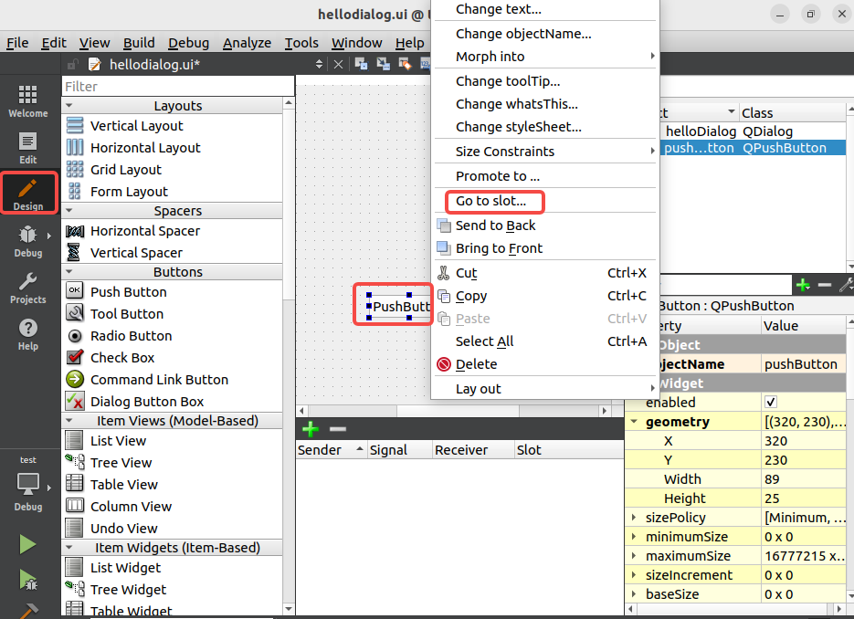


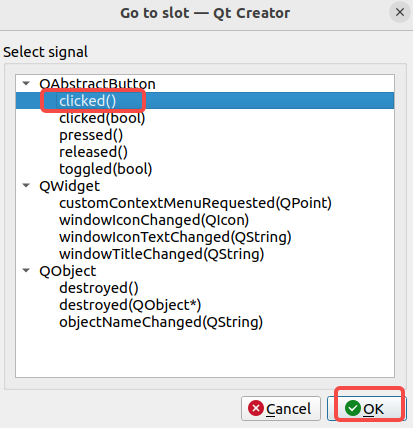

点击OK后

自动跳转到功能定义部分

在窗口对象名同名的类的源文件中自动添加功能函数


并且会自动在窗口对象名同名的类的头文件中添加槽函数声明

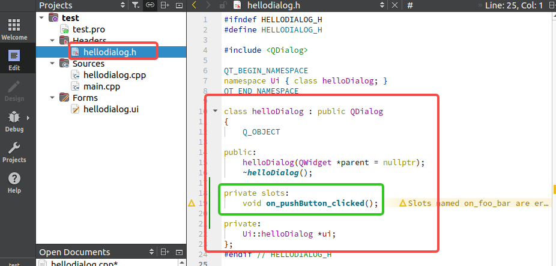


```c++
// 由字符on_发射信号的部件对象名_信号名组成
void MyWidget::on_showChildButton_clicked()
{
    QDialog * dialog = new QDialog(this);
    QLabel *label = new QLabel(dialog);
    label->setText("hello world");
    dialog->show();
}
```


### 3.2.3 标准对话框

#### **颜色对话框**

```c++
void helloDialog::on_pushButton_3_clicked()
{
    //获取指定颜色对话框部件
    //getColor(设置初始颜色、指定父窗口和设置对话框标题)
    QColor color = QColorDialog::getColor(Qt::red, this, tr("color dialog"));
    qDebug() << "color: " << color;
}
```


#### **文件对话框**

```c++
void helloDialog::on_pushButton_4_clicked()
{
    //选择文件或文件夹对话框
    //getOpenFileName(指定父窗口、设置对话框标题、指定默认打开的目录路经、设置文件类型过滤器)
    QString fileName = QFileDialog::getOpenFileName(this, tr("file dialog"), "D: ", tr("images(* png * jpg)"));
    qDebug() << "fileName: " << fileName;
}

```


#### 消息对话框

消息对话框QMessageBox类提供了一个模态的对话框来通知用户一些信息，或者向用户提出一个问题并且获取答案。

##### 问题对话框


```c++
void helloDialog::on_pushButton_9_clicked()
{
    int ret1 = QMessageBox::question(this, tr("problem dialog"), tr("do you know qt?"), QMessageBox::Yes,QMessageBox::No);
    if(ret1 == QMessageBox::Yes) qDebug()<<tr("problem");

}

```

该函数返回一个index值

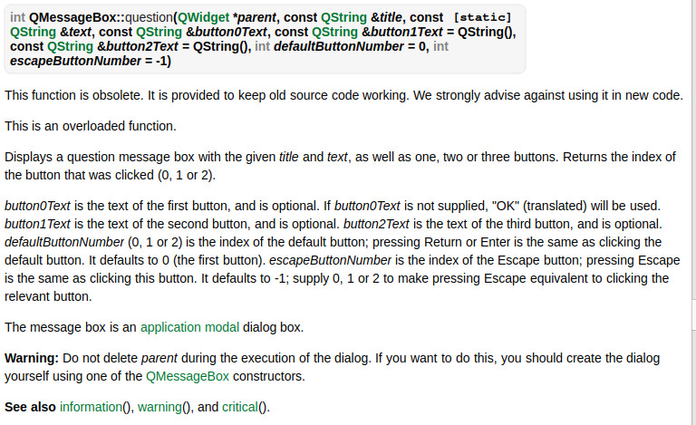


##### 提示对话框

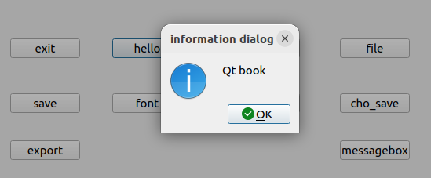

```c++
    int ret2 = QMessageBox::information(this, tr("information dialog"), tr("Qt book"), QMessageBox::Ok);
    if(ret2 == QMessageBox::Ok) qDebug()<<"information"<<endl;
```


##### 警告对话框

##### 错误对话框

##### 关于对话框


#### 向导对话框

1. 在窗口类的头文件中添加头文件`#include <QWizard>`
2. 添加private类型函数声明

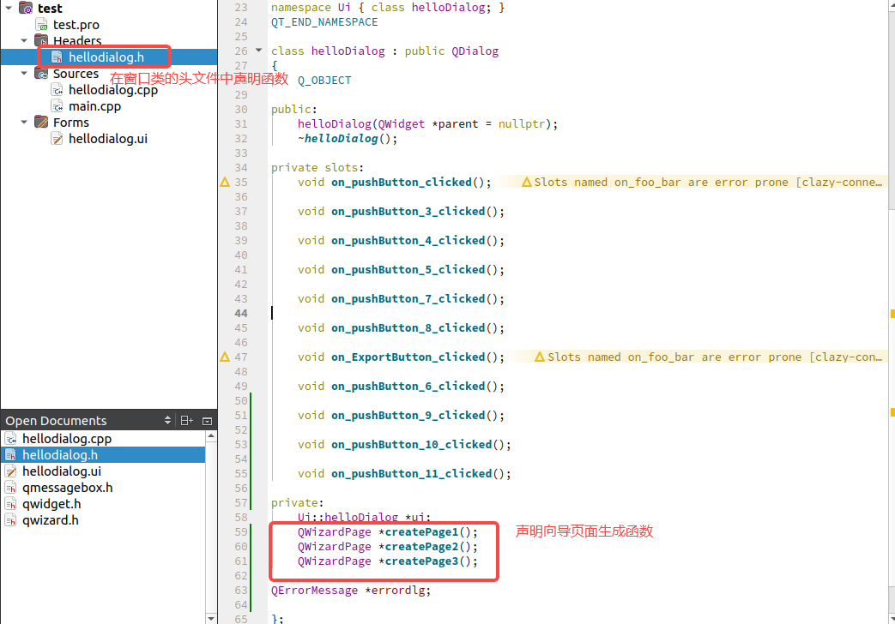

3. 在窗口类的源文件中对函数进行定义

直接在头文件中添加源文件的定义

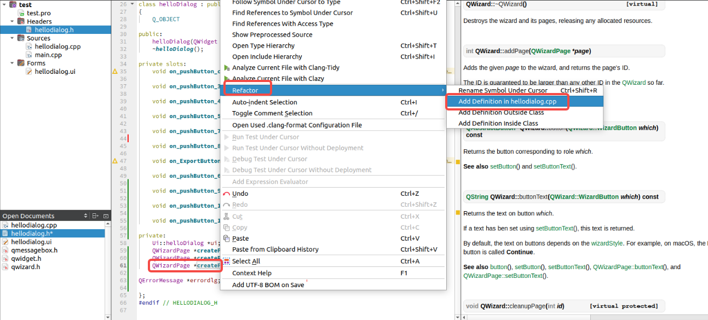


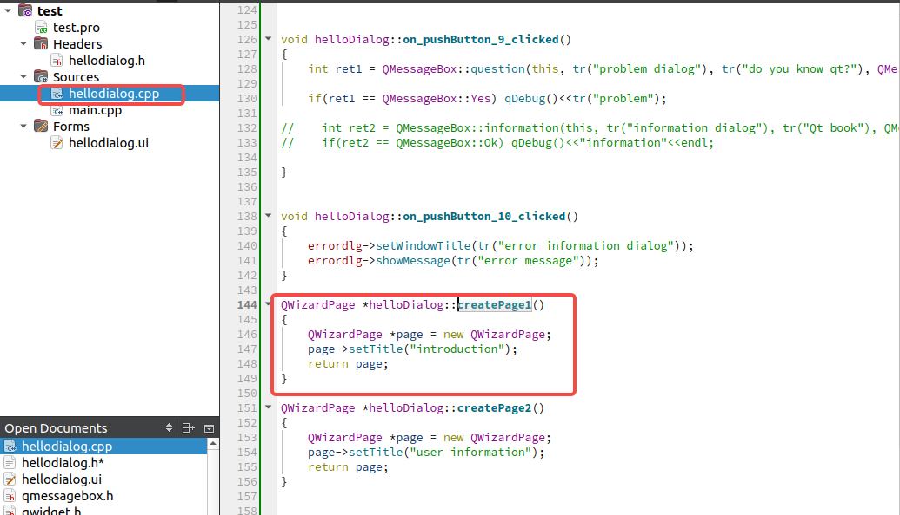

```c++
// 定义返回值为QWizardPage类对象的指针函数，该函数返回一个指向QWizardPage类的指针
QWizardPage *helloDialog::createPage1()
{
    QWizardPage *page = new QWizardPage;
    page->setTitle("introduction");
    return page;
}
```

4. 窗口界面添加按钮，并建立槽函数

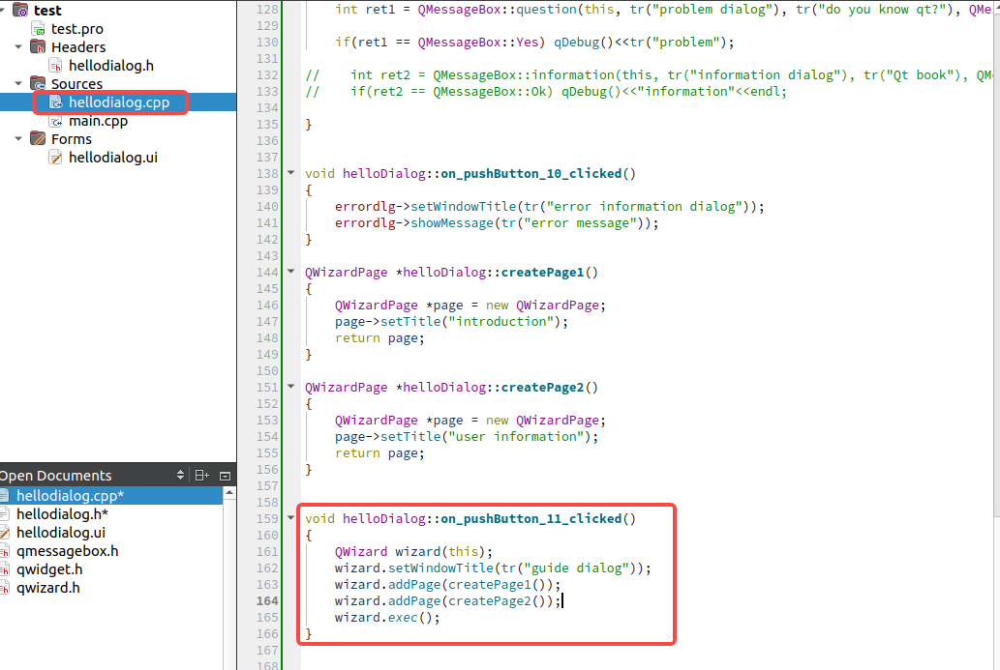

```c++
void helloDialog::on_pushButton_11_clicked()
{
    //基于this构建一个向导
    QWizard wizard(this);
    wizard.setWindowTitle(tr("guide dialog"));
    wizard.addPage(createPage1());
    wizard.addPage(createPage2());
    wizard.exec();
}
```


## 3.3 其他窗口部件

### 3.3.1 QFrame类族

QFrame类是带有边框的部件的基类

Qt中凡是带有Abstract字样的类都是抽象基类

抽象基类时不能直接使用的，但是可以继承该类实现自己的类，或者使用它提供的子类

#### QLabel

用于显示文本或图片

##### 显示文本

在窗口类的源文件的构造函数中：

```c++
    //设置字体
    QFont font;
    font.setFamily("华文行楷");
    font.setBold(true);
    font.setItalic(true);
    ui->label->setFont(font);
	
	//设置字体太长时进行省略
    QString string = tr("the title is too long, needs to be shorted");
    QString str = ui->label->fontMetrics().elidedText(string, Qt::ElideRight, 180);
    ui->label->setText(str);

```

##### 显示图片 (静态图)

源文件中添加头文件 `#include <QPixmap>`

设置label的属性

`ui->label->setPixmap(QPixmap("/home/rk/Pictures/heygears.png"));`

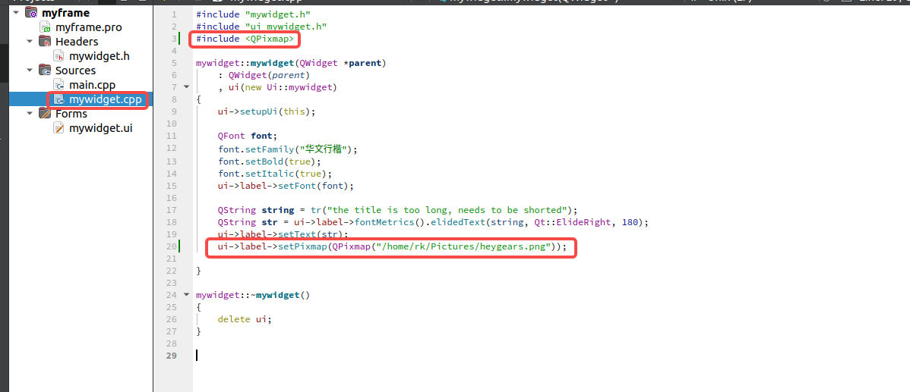

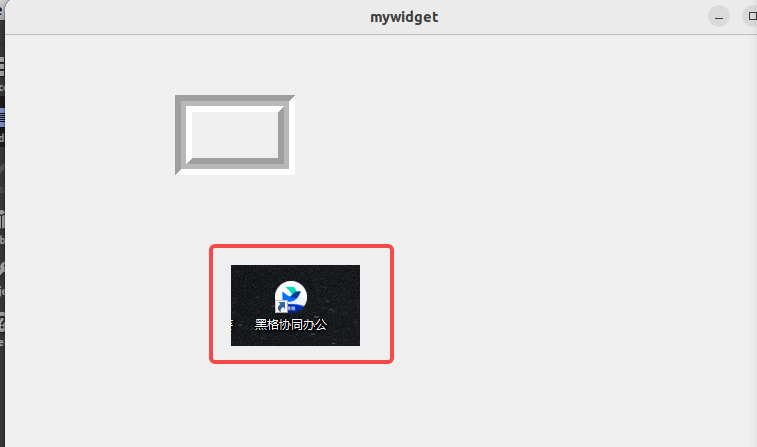

##### 显示图片（动态图）

源文件中添加头文件 `#include <QMovie>`

设置label的属性

```c++
    //添加动态图片
    QMovie *movie = new QMovie("xx");
    ui->label->setMovie(movie);
    movie->start();
```

#### QLCDNumber

拖动LCD Number部件到界面

部件属性栏设置

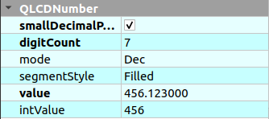


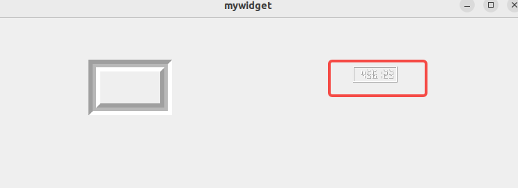

#### QStackedWidget

该类提供一个部件栈，可以有多个界面，每个界面可以拥有自己的部件，不过每次只能显示一个界面。

这个部件需使用QComboBox或QListWidget来选择它的各个页面

效果：

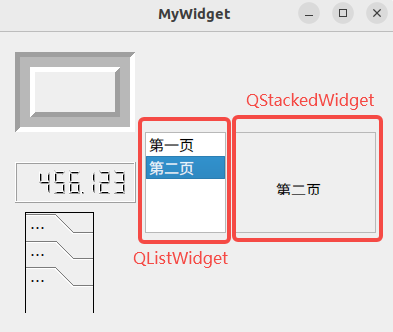

信号和槽设计界面：

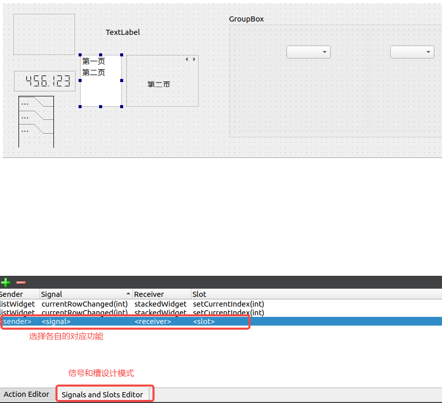

 

### 3.3.2 按钮部件

1. QPushButton
2. QCheckBox, QRadioButton和QGroupBox

QCheckBox：可以选择多项

QRadioButton：只能选择一项

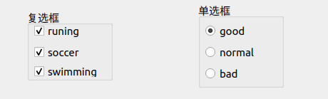
