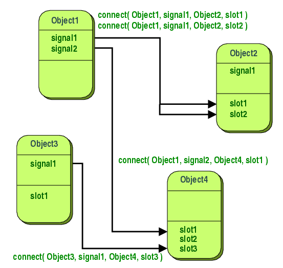

信号与槽机制

[Signals & Slots | Qt Core 6.5.1](https://doc.qt.io/qt-6/signalsandslots.html)

1、信号需符合以下规则

- 信号使用signals关键字声明，在其后面有一个冒号“:”，在其前面不能有public、private、protected访问控制符，信号默认是public的。
- 信号只需像函数那样声明即可，其中可以有参数，参数的主要作用是用于和槽的通信，这就像普通函数的参数传递规则一样。信号虽然像函数，但是对他的调用方式不一样，信号需要使用emit关键字发送。
- 信号只需声明，不能对其进行定义，信号是由moc自动生成的。
- 信号的返回值只能是void类型的。

2、声明槽需符合以下规则

- 声明槽需要使用slots关键字，在其后面有一个冒号“:”，且槽需使用public、private、protected访问控制符之一。
- 槽就是一个普通的函数，可以像使用普通函数一样进行使用，槽与普通函数的主要区别是，槽可以与信号关联

3、发射信号需符合以下规则：

- 发射信号需要使用emit关键字，注意，在emit后面不需要冒号。
- emit发射的信号使用的语法与调用普通函数相同，比如有一个信号为void f(int)，则发送的语法为：emit f(3);
- 当信号被发射时，与其相关联的槽函数会被调用(注意：信号和槽需要使用QObject::connect函数进行关联之后，发射信号后才会调用相关联的槽函数)。
- 注意：因为信号位于类之中，因此发射信号的位置需要位于该类的成员函数中或该类能见到信号的标识符的位置。

## 信号和槽的关系

- 槽的参数的类型需要与信号参数的类型相对应，
- 槽的参数不能多余信号的参数，因为若槽的参数更多，则多余的参数不能接收到信号传递过来的值，若在槽中使用了这些多余的无值的参数，就会产生错误。
- 若信号的参数多余槽的参数，则多余的参数将被忽略。
- 一个信号可以与多个槽关联，多个信号也可以与同一个槽关联，信号也可以关联到另一个信号上。
- 若一个信号关联到多个槽时，则发射信号时，槽函数按照关联的顺序依次执行。
- 若信号连接到另一个信号，则当第一个信号发射时，会立即发射第二个信号。

因Qt在其类库中预定义了很多信号和槽，因此在Qt中可以仅使用Qt类库中预定义的信号和槽，也可以只使用Qt类库中预定义的信号而使用自已的槽，也可以使用Qt类库中预定义的槽来响应自已定义的信号，当然，槽和信号也都可以使用自定义的

信号槽连接方式

1. autoconnection 自动连接，默认值

如果信号的发送者和信号的接收者的对象属于同一个线程，者工作方式与直接连接方式相同，否则工作方式与排队方式相同。

2. direct connection 直接连接

当信号发出后，相应的槽函数将立即被调用；

emit语句后的代码将在所有槽函数执行完毕后被执行，信号与槽函数关系类似于函数调用，同步执行。

由于`Qt::DirectConnection`是同步的，因此在槽函数执行过程中，从发送信号的对象返回的任何结果都将阻塞，并且如果槽函数执行时间过长，可能会导致界面冻结或响应延迟。

适用于单线程环境和需要立即处理的情况，但需要注意可能的阻塞和潜在的性能影响。

3. queued connection 排队连接

当信号发出后，排队到信号队列中，需要等到接收对象所属线程的事件循环取得控制权时才取得该信号，调用相应的槽函数。

emit语句后的代码将在发出信号后立即被执行，无需等待槽函数执行完毕；

此时信号被塞到信号队列里了，信号与槽函数关系类似于消息通信，异步执行。

通过使用`Qt::QueuedConnection`，信号与槽之间的通信是线程安全的，因为信号的发出和槽函数的执行都在目标对象所属的线程上进行。这对于跨越不同线程的对象之间的通信非常有用，因为它避免了数据竞争和并发访问问题。

这种连接类型适用于多线程环境和需要异步处理的场景，能够避免界面冻结和保持更好的响应性。

4. blocking queued connection 阻塞的排队方式

