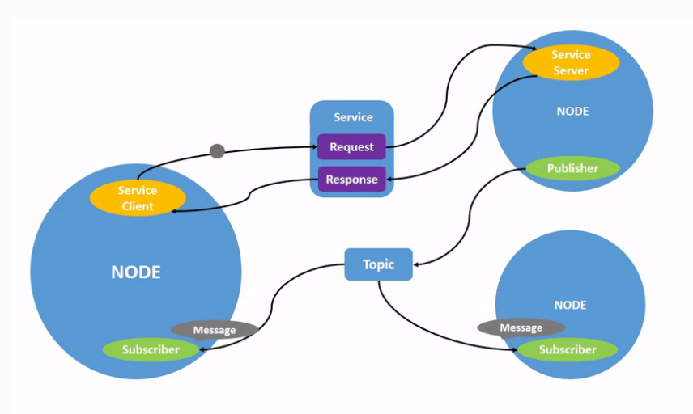
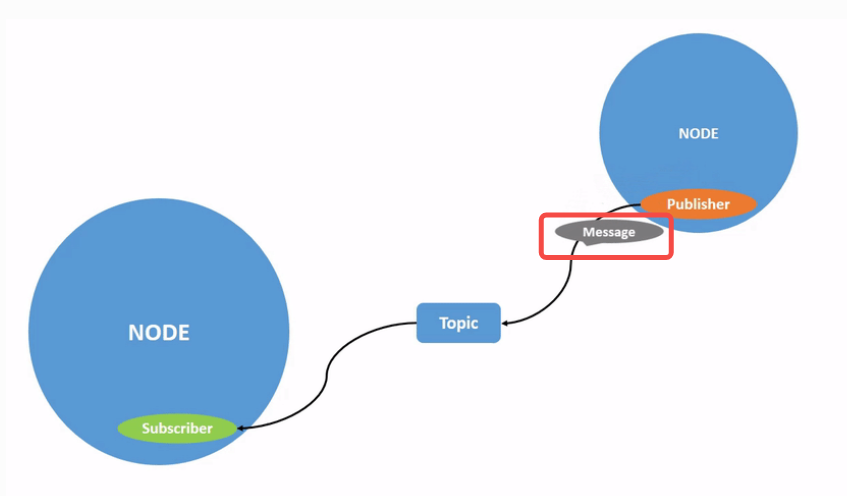
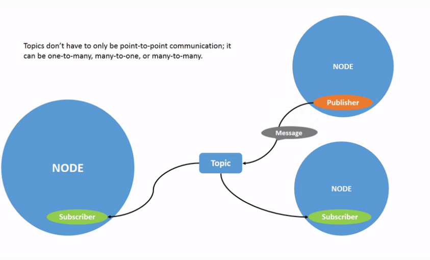
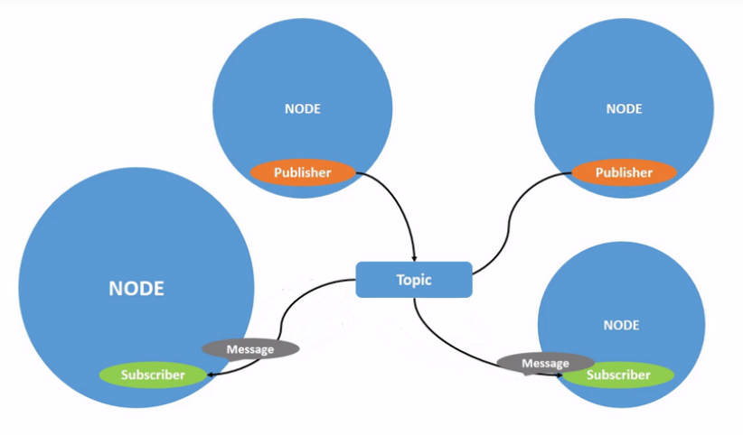
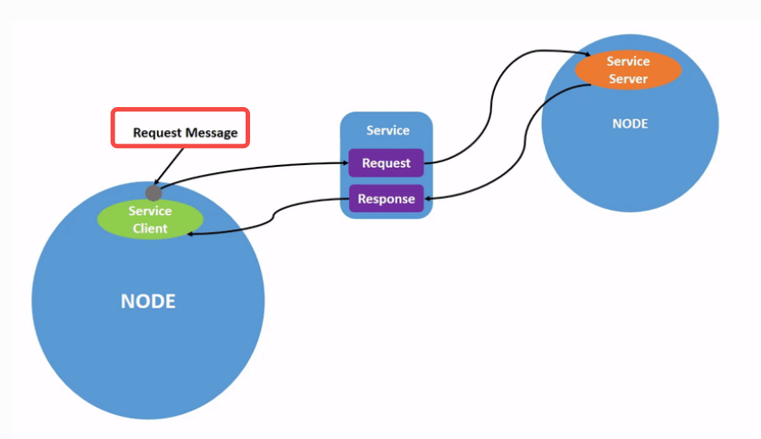
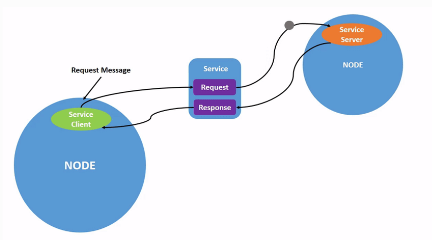
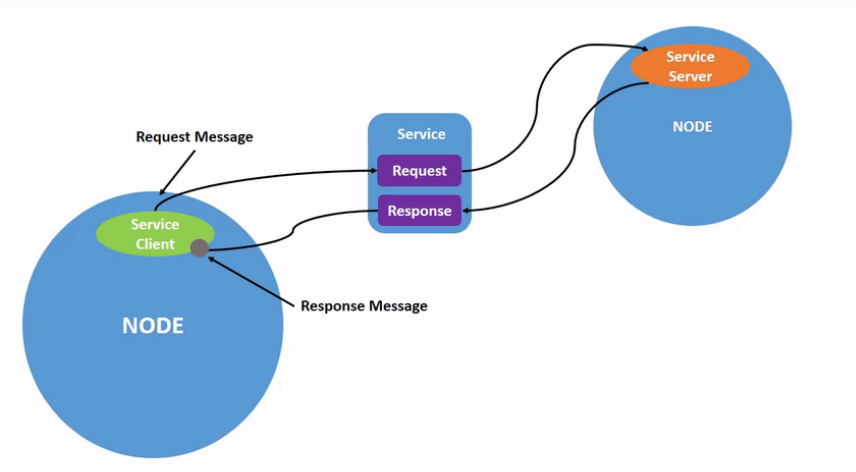
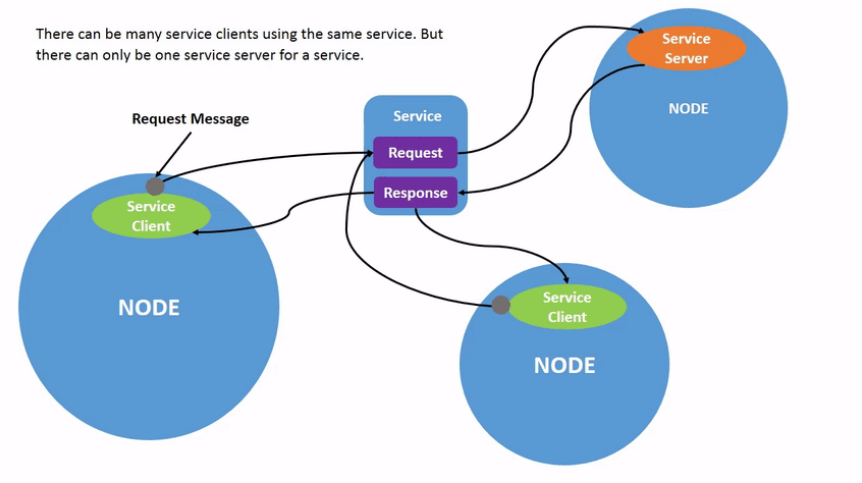

# ROS2


“Workspace” is a ROS term for the location on your system where you’re developing with ROS 2.

The core ROS 2 workspace is called the underlay. 

Subsequent local workspaces are called overlays.


 `ROS_LOCALHOST_ONLY` environment variable allows you to limit ROS 2 communication to localhost only. This means your ROS 2 system, and its topics, services, and actions will not be visible to other computers on the local network.


## node

Nodes in ROS 2

Each node in ROS should be responsible for a single, modular purpose, e.g. controlling the wheel motors or publishing the sensor data from a laser range-finder.

Each node can send and receive data from other nodes via topics, services, actions, or parameters.



A full robotic system is comprised of many nodes working in concert. 

 In ROS 2, a single executable (C++ program, Python program, etc.) can contain one or more nodes.


The command `ros2 run` launches an executable from a package.

```
ros2 run <package_name> <executable_name>
```

例如：

To run turtlesim, open a new terminal, and enter the following command:

```
ros2 run turtlesim turtlesim_node
```


列出所有节点

```
ros2 node list
```

will show you the names of all running nodes. 


### remapping

[Remapping](https://design.ros2.org/articles/ros_command_line_arguments.html#name-remapping-rules) allows you to reassign default node properties, like node name, topic names, service names, etc., to custom values. 

例如

Now, let’s reassign the name of our `/turtlesim` node. In a new terminal, run the following command:

```
ros2 run turtlesim turtlesim_node --ros-args --remap __node:=my_turtle
```


获取更多关于node的信息

 access more information about them with:

```
ros2 node info <node_name>
```

`ros2 node info` returns a list of subscribers, publishers, services, and actions. i.e. the ROS graph connections that interact with that node. 


## Topics

ROS 2 breaks complex systems down into many modular nodes. Topics are a vital element of the ROS graph that act as a bus for nodes to exchange messages.




A node may publish data to any number of topics and simultaneously have subscriptions to any number of topics.





### 查看所有的topic： `ros2 topic list` 

Running the `ros2 topic list` command in a new terminal will return a list of all the topics currently active in the system:

```
/parameter_events
/rosout
/turtle1/cmd_vel
/turtle1/color_sensor
/turtle1/pose
```


### 查看所有的topic及topic中的数据类型：`ros2 topic list -t` 

will return the same list of topics, this time with the topic type appended in brackets:

[]：方框中为话题类型

```
/parameter_events [rcl_interfaces/msg/ParameterEvent]
/rosout [rcl_interfaces/msg/Log]
/turtle1/cmd_vel [geometry_msgs/msg/Twist]
/turtle1/color_sensor [turtlesim/msg/Color]
/turtle1/pose [turtlesim/msg/Pose]
```

These attributes, particularly the type, are how nodes know they’re talking about the same information as it moves over topics.


### 查看topic中的数据信息：ros2 topic echo

To see the data being published on a topic, use:

```
ros2 topic echo <topic_name>
```

例如

Since we know that `/teleop_turtle` publishes data to `/turtlesim` over the `/turtle1/cmd_vel` topic, let’s use `echo` to introspect that topic:

```
ros2 topic echo /turtle1/cmd_vel
```


### 查看topic中的数据类型及发布订阅者数量信息：ros2 topic info

例如

```
ros2 topic info /turtle1/cmd_vel
```

Which will return:

```
Type: geometry_msgs/msg/Twist
Publisher count: 1
Subscription count: 2
```


### 查看topic中数据类型的具体数据结构：`ros2 interface show <msg type>`

Nodes send data over topics using messages. Publishers and subscribers must send and receive the same type of message to communicate.

The topic types we saw earlier after running `ros2 topic list -t` let us know what message type is used on each topic. Recall that the `cmd_vel` topic has the type:

```
geometry_msgs/msg/Twist
```


This means that in the package `geometry_msgs` there is a `msg` called `Twist`.

Now we can run `ros2 interface show <msg type>` on this type to learn its details. Specifically, what structure of data the message expects.

```
ros2 interface show geometry_msgs/msg/Twist
```


For the message type from above it yields:

```
# This expresses velocity in free space broken into its linear and angular parts.

    Vector3  linear
            float64 x
            float64 y
            float64 z
    Vector3  angular
            float64 x
            float64 y
            float64 z
```


This tells you that the `/turtlesim` node is expecting a message with two vectors, `linear` and `angular`, of three elements each. If you recall the data we saw `/teleop_turtle` passing to `/turtlesim` with the `echo` command, it’s in the same structure:

```
linear:
  x: 2.0
  y: 0.0
  z: 0.0
angular:
  x: 0.0
  y: 0.0
  z: 0.0
  ---
```


### 发布topic：`ros2 topic pub <topic_name> <msg_type> '<args>' `

The `'<args>'` argument is the actual data you’ll pass to the topic, in the structure you just discovered in the previous section.

It’s important to note that this argument needs to be input in YAML syntax. Input the full command like so:

单次运动

```
ros2 topic pub --once /turtle1/cmd_vel geometry_msgs/msg/Twist "{linear: {x: 2.0, y: 0.0, z: 0.0}, angular: {x: 0.0, y: 0.0, z: 1.8}}"
```

`--once` is an optional argument meaning “publish one message then exit”.

连续运动

So, to get the turtle to keep moving, you can run:

```
ros2 topic pub --rate 1 /turtle1/cmd_vel geometry_msgs/msg/Twist "{linear: {x: 2.0, y: 0.0, z: 0.0}, angular: {x: 0.0, y: 0.0, z: 1.8}}"
```

The difference here is the removal of the `--once` option and the addition of the `--rate 1` option, which tells `ros2 topic pub` to publish the command in a steady stream at 1 Hz.


### 查看topic中数据发布频率：`ros2 topic hz <topic name>`

For one last introspection on this process, you can view the rate at which data is published using:

```
ros2 topic hz /turtle1/pose
```


It will return data on the rate at which the `/turtlesim` node is publishing data to the `pose` topic.

```
average rate: 59.354
  min: 0.005s max: 0.027s std dev: 0.00284s window: 58
```

Recall that you set the rate of `turtle1/cmd_vel` to publish at a steady 1 Hz using `ros2 topic pub --rate 1`. If you run the above command with `turtle1/cmd_vel` instead of `turtle1/pose`, you will see an average reflecting that rate.


## Services

Services are another method of communication for nodes in the ROS graph. Services are based on a call-and-response model versus the publisher-subscriber model of topics. While topics allow nodes to subscribe to data streams and get continual updates, services only provide data when they are specifically called by a client.








service server 和 service client的关系



### 查看当前活跃的所有services：`ros2 service list`

Running the `ros2 service list` command in a new terminal will return a list of all the services currently active in the system:

```
/clear
/kill
/reset
/spawn
/teleop_turtle/describe_parameters
/teleop_turtle/get_parameter_types
/teleop_turtle/get_parameters
/teleop_turtle/list_parameters
/teleop_turtle/set_parameters
/teleop_turtle/set_parameters_atomically
/turtle1/set_pen
/turtle1/teleport_absolute
/turtle1/teleport_relative
/turtlesim/describe_parameters
/turtlesim/get_parameter_types
/turtlesim/get_parameters
/turtlesim/list_parameters
/turtlesim/set_parameters
/turtlesim/set_parameters_atomically
```


### 查看service的数据类型：`ros2 service type <service_name>`

Let’s take a look at turtlesim’s `/clear` service. In a new terminal, enter the command:

```
ros2 service type /clear
```


Which should return:

```
std_srvs/srv/Empty
```


The `Empty` type means the service call sends no data when making a request and receives no data when receiving a response.


### 查看当前活跃service的数据类型：`ros2 service list -t`

To see the types of all the active services at the same time, you can append the `--show-types` option, abbreviated as `-t`, to the `list` command:

```
ros2 service list -t
```

Which will return:

```
/clear [std_srvs/srv/Empty]
/kill [turtlesim/srv/Kill]
/reset [std_srvs/srv/Empty]
/spawn [turtlesim/srv/Spawn]
...
/turtle1/set_pen [turtlesim/srv/SetPen]
/turtle1/teleport_absolute [turtlesim/srv/TeleportAbsolute]
/turtle1/teleport_relative [turtlesim/srv/TeleportRelative]
...
```


### 查看指定数据类型对应的service：`ros2 service find <type_name>`

If you want to find all the services of a specific type, you can use the command:

```
ros2 service find <type_name>
```


For example, you can find all the `Empty` typed services like this:

```
ros2 service find std_srvs/srv/Empty
```


Which will return:

```
/clear
/reset
```


### 查看service中数据类型的具体数据结构：`ros2 interface show <type_name>`

You can call services from the command line, but first you need to know the structure of the input arguments.

```
ros2 interface show <type_name>
```


Try this on the `/clear` service’s type, `Empty`:

```
ros2 interface show std_srvs/srv/Empty
```


Which will return:

```
---
```


The `---` separates the request structure (above) from the response structure (below). 

But, as you learned earlier, the `Empty` type doesn’t send or receive any data. So, naturally, its structure is blank.

Let’s introspect a service with a type that sends and receives data, like `/spawn`. From the results of `ros2 service list -t`, we know `/spawn`’s type is `turtlesim/srv/Spawn`.

To see the request and response arguments of the `/spawn` service, run the command:

```
ros2 interface show turtlesim/srv/Spawn
```


Which will return:

```
float32 x
float32 y
float32 theta
string name # Optional.  A unique name will be created and returned if this is empty
---
string name
```


The information above the `---` line tells us the arguments needed to call `/spawn`. `x`, `y` and `theta` determine the 2D pose of the spawned turtle, and `name` is clearly optional.

The information below the line isn’t something you need to know in this case, but it can help you understand the data type of the response you get from the call.


### 申请service：`ros2 service call <service_name> <service_type> <arguments>`

Now that you know what a service type is, how to find a service’s type, and how to find the structure of that type’s arguments, you can call a service using:

```
ros2 service call <service_name> <service_type> <arguments>
```


The `<arguments>` part is optional. For example, you know that `Empty` typed services don’t have any arguments:

```
ros2 service call /clear std_srvs/srv/Empty
```


This command will clear the turtlesim window of any lines your turtle has drawn.


Now let’s spawn a new turtle by calling `/spawn` and setting arguments. Input `<arguments>` in a service call from the command-line need to be in YAML syntax.

Enter the command:

```
ros2 service call /spawn turtlesim/srv/Spawn "{x: 2, y: 2, theta: 0.2, name: ''}"
```


You will get this method-style view of what’s happening, and then the service response:

```
requester: making request: turtlesim.srv.Spawn_Request(x=2.0, y=2.0, theta=0.2, name='')

response:
turtlesim.srv.Spawn_Response(name='turtle2')
```


Your turtlesim window will update with the newly spawned turtle right away:


## Parameters

