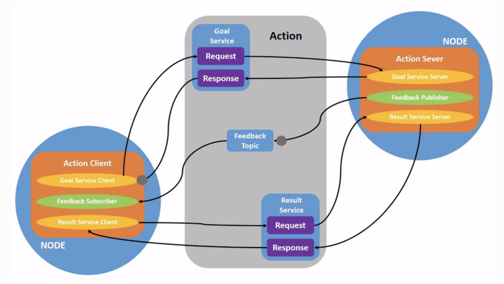

# ROS2


“Workspace” is a ROS term for the location on your system where you’re developing with ROS 2.

The core ROS 2 workspace is called the underlay. 

Subsequent local workspaces are called overlays.


 `ROS_LOCALHOST_ONLY` environment variable allows you to limit ROS 2 communication to localhost only. This means your ROS 2 system, and its topics, services, and actions will not be visible to other computers on the local network.


## node

Nodes in ROS 2

Each node in ROS should be responsible for a single, modular purpose, e.g. controlling the wheel motors or publishing the sensor data from a laser range-finder.

Each node can send and receive data from other nodes via topics, services, actions, or parameters.


A full robotic system is comprised of many nodes working in concert. 

 In ROS 2, a single executable (C++ program, Python program, etc.) can contain one or more nodes.


The command `ros2 run` launches an executable from a package.

```
ros2 run <package_name> <executable_name>
```

例如：

To run turtlesim, open a new terminal, and enter the following command:

```
ros2 run turtlesim turtlesim_node
```


列出所有节点

```
ros2 node list
```

will show you the names of all running nodes. 


### remapping

[Remapping](https://design.ros2.org/articles/ros_command_line_arguments.html#name-remapping-rules) allows you to reassign default node properties, like node name, topic names, service names, etc., to custom values. 

例如

Now, let’s reassign the name of our `/turtlesim` node. In a new terminal, run the following command:

```
ros2 run turtlesim turtlesim_node --ros-args --remap __node:=my_turtle
```


获取更多关于node的信息

 access more information about them with:

```
ros2 node info <node_name>
```

`ros2 node info` returns a list of subscribers, publishers, services, and actions. i.e. the ROS graph connections that interact with that node. 


## Topics

ROS 2 breaks complex systems down into many modular nodes. Topics are a vital element of the ROS graph that act as a bus for nodes to exchange messages.


A node may publish data to any number of topics and simultaneously have subscriptions to any number of topics.


### 查看所有的topic： `ros2 topic list` 

Running the `ros2 topic list` command in a new terminal will return a list of all the topics currently active in the system:

```
/parameter_events
/rosout
/turtle1/cmd_vel
/turtle1/color_sensor
/turtle1/pose
```


### 查看所有的topic及topic中的数据类型：`ros2 topic list -t` 

will return the same list of topics, this time with the topic type appended in brackets:

[]：方框中为话题类型

```
/parameter_events [rcl_interfaces/msg/ParameterEvent]
/rosout [rcl_interfaces/msg/Log]
/turtle1/cmd_vel [geometry_msgs/msg/Twist]
/turtle1/color_sensor [turtlesim/msg/Color]
/turtle1/pose [turtlesim/msg/Pose]
```

These attributes, particularly the type, are how nodes know they’re talking about the same information as it moves over topics.


### 查看topic中的数据信息：ros2 topic echo

To see the data being published on a topic, use:

```
ros2 topic echo <topic_name>
```

例如

Since we know that `/teleop_turtle` publishes data to `/turtlesim` over the `/turtle1/cmd_vel` topic, let’s use `echo` to introspect that topic:

```
ros2 topic echo /turtle1/cmd_vel
```


### 查看topic中的数据类型及发布订阅者数量信息：ros2 topic info

例如

```
ros2 topic info /turtle1/cmd_vel
```

Which will return:

```
Type: geometry_msgs/msg/Twist
Publisher count: 1
Subscription count: 2
```


### 查看topic中数据类型的具体数据结构：`ros2 interface show <msg type>`

Nodes send data over topics using messages. Publishers and subscribers must send and receive the same type of message to communicate.

The topic types we saw earlier after running `ros2 topic list -t` let us know what message type is used on each topic. Recall that the `cmd_vel` topic has the type:

```
geometry_msgs/msg/Twist
```


This means that in the package `geometry_msgs` there is a `msg` called `Twist`.

Now we can run `ros2 interface show <msg type>` on this type to learn its details. Specifically, what structure of data the message expects.

```
ros2 interface show geometry_msgs/msg/Twist
```


For the message type from above it yields:

```
# This expresses velocity in free space broken into its linear and angular parts.

    Vector3  linear
            float64 x
            float64 y
            float64 z
    Vector3  angular
            float64 x
            float64 y
            float64 z
```


This tells you that the `/turtlesim` node is expecting a message with two vectors, `linear` and `angular`, of three elements each. If you recall the data we saw `/teleop_turtle` passing to `/turtlesim` with the `echo` command, it’s in the same structure:

```
linear:
  x: 2.0
  y: 0.0
  z: 0.0
angular:
  x: 0.0
  y: 0.0
  z: 0.0
  ---
```


### 发布topic：`ros2 topic pub <topic_name> <msg_type> '<args>' `

The `'<args>'` argument is the actual data you’ll pass to the topic, in the structure you just discovered in the previous section.

It’s important to note that this argument needs to be input in YAML syntax. Input the full command like so:

单次运动

```
ros2 topic pub --once /turtle1/cmd_vel geometry_msgs/msg/Twist "{linear: {x: 2.0, y: 0.0, z: 0.0}, angular: {x: 0.0, y: 0.0, z: 1.8}}"
```

`--once` is an optional argument meaning “publish one message then exit”.

连续运动

So, to get the turtle to keep moving, you can run:

```
ros2 topic pub --rate 1 /turtle1/cmd_vel geometry_msgs/msg/Twist "{linear: {x: 2.0, y: 0.0, z: 0.0}, angular: {x: 0.0, y: 0.0, z: 1.8}}"
```

The difference here is the removal of the `--once` option and the addition of the `--rate 1` option, which tells `ros2 topic pub` to publish the command in a steady stream at 1 Hz.


### 查看topic中数据发布频率：`ros2 topic hz <topic name>`

For one last introspection on this process, you can view the rate at which data is published using:

```
ros2 topic hz /turtle1/pose
```


It will return data on the rate at which the `/turtlesim` node is publishing data to the `pose` topic.

```
average rate: 59.354
  min: 0.005s max: 0.027s std dev: 0.00284s window: 58
```

Recall that you set the rate of `turtle1/cmd_vel` to publish at a steady 1 Hz using `ros2 topic pub --rate 1`. If you run the above command with `turtle1/cmd_vel` instead of `turtle1/pose`, you will see an average reflecting that rate.


## Services

Services are another method of communication for nodes in the ROS graph. Services are based on a call-and-response model versus the publisher-subscriber model of topics. While topics allow nodes to subscribe to data streams and get continual updates, services only provide data when they are specifically called by a client.


service server 和 service client的关系


### 查看当前活跃的所有services：`ros2 service list`

Running the `ros2 service list` command in a new terminal will return a list of all the services currently active in the system:

```
/clear
/kill
/reset
/spawn
/teleop_turtle/describe_parameters
/teleop_turtle/get_parameter_types
/teleop_turtle/get_parameters
/teleop_turtle/list_parameters
/teleop_turtle/set_parameters
/teleop_turtle/set_parameters_atomically
/turtle1/set_pen
/turtle1/teleport_absolute
/turtle1/teleport_relative
/turtlesim/describe_parameters
/turtlesim/get_parameter_types
/turtlesim/get_parameters
/turtlesim/list_parameters
/turtlesim/set_parameters
/turtlesim/set_parameters_atomically
```


### 查看service的数据类型：`ros2 service type <service_name>`

Let’s take a look at turtlesim’s `/clear` service. In a new terminal, enter the command:

```
ros2 service type /clear
```


Which should return:

```
std_srvs/srv/Empty
```


The `Empty` type means the service call sends no data when making a request and receives no data when receiving a response.


### 查看当前活跃service的数据类型：`ros2 service list -t`

To see the types of all the active services at the same time, you can append the `--show-types` option, abbreviated as `-t`, to the `list` command:

```
ros2 service list -t
```

Which will return:

```
/clear [std_srvs/srv/Empty]
/kill [turtlesim/srv/Kill]
/reset [std_srvs/srv/Empty]
/spawn [turtlesim/srv/Spawn]
...
/turtle1/set_pen [turtlesim/srv/SetPen]
/turtle1/teleport_absolute [turtlesim/srv/TeleportAbsolute]
/turtle1/teleport_relative [turtlesim/srv/TeleportRelative]
...
```


### 查看指定数据类型对应的service：`ros2 service find <type_name>`

If you want to find all the services of a specific type, you can use the command:

```
ros2 service find <type_name>
```


For example, you can find all the `Empty` typed services like this:

```
ros2 service find std_srvs/srv/Empty
```


Which will return:

```
/clear
/reset
```


### 查看service中数据类型的具体数据结构：`ros2 interface show <type_name>`

You can call services from the command line, but first you need to know the structure of the input arguments.

```
ros2 interface show <type_name>
```


Try this on the `/clear` service’s type, `Empty`:

```
ros2 interface show std_srvs/srv/Empty
```


Which will return:

```
---
```


The `---` separates the request structure (above) from the response structure (below). 

But, as you learned earlier, the `Empty` type doesn’t send or receive any data. So, naturally, its structure is blank.

Let’s introspect a service with a type that sends and receives data, like `/spawn`. From the results of `ros2 service list -t`, we know `/spawn`’s type is `turtlesim/srv/Spawn`.

To see the request and response arguments of the `/spawn` service, run the command:

```
ros2 interface show turtlesim/srv/Spawn
```


Which will return:

```
float32 x
float32 y
float32 theta
string name # Optional.  A unique name will be created and returned if this is empty
---
string name
```


The information above the `---` line tells us the arguments needed to call `/spawn`. `x`, `y` and `theta` determine the 2D pose of the spawned turtle, and `name` is clearly optional.

The information below the line isn’t something you need to know in this case, but it can help you understand the data type of the response you get from the call.


### 申请service：`ros2 service call <service_name> <service_type> <arguments>`

Now that you know what a service type is, how to find a service’s type, and how to find the structure of that type’s arguments, you can call a service using:

```
ros2 service call <service_name> <service_type> <arguments>
```


The `<arguments>` part is optional. For example, you know that `Empty` typed services don’t have any arguments:

```
ros2 service call /clear std_srvs/srv/Empty
```


This command will clear the turtlesim window of any lines your turtle has drawn.


Now let’s spawn a new turtle by calling `/spawn` and setting arguments. Input `<arguments>` in a service call from the command-line need to be in YAML syntax.

Enter the command:

```
ros2 service call /spawn turtlesim/srv/Spawn "{x: 2, y: 2, theta: 0.2, name: ''}"
```


You will get this method-style view of what’s happening, and then the service response:

```
requester: making request: turtlesim.srv.Spawn_Request(x=2.0, y=2.0, theta=0.2, name='')

response:
turtlesim.srv.Spawn_Response(name='turtle2')
```


Your turtlesim window will update with the newly spawned turtle right away:


## Parameters

A parameter is a configuration value of a node. You can think of parameters as node settings. A node can store parameters as integers, floats, booleans, strings, and lists. In ROS 2, each node maintains its own parameters.


### 查看node的参数parameter：`ros2 param list`

To see the parameters belonging to your nodes, open a new terminal and enter the command:

```
ros2 param list
```


You will see the node namespaces, `/teleop_turtle` and `/turtlesim`, followed by each node’s parameters:

```
/teleop_turtle:
  qos_overrides./parameter_events.publisher.depth
  qos_overrides./parameter_events.publisher.durability
  qos_overrides./parameter_events.publisher.history
  qos_overrides./parameter_events.publisher.reliability
  scale_angular
  scale_linear
  use_sim_time
/turtlesim:
  background_b
  background_g
  background_r
  qos_overrides./parameter_events.publisher.depth
  qos_overrides./parameter_events.publisher.durability
  qos_overrides./parameter_events.publisher.history
  qos_overrides./parameter_events.publisher.reliability
  use_sim_time
```


### 查看参数的类型及当前值：`ros2 param get <node_name> <parameter_name>`

To display the type and current value of a parameter, use the command:

```
ros2 param get <node_name> <parameter_name>
```


Let’s find out the current value of `/turtlesim`’s parameter `background_g`:

```
ros2 param get /turtlesim background_g
```


Which will return the value:

```
Integer value is: 86
```


Now you know `background_g` holds an integer value.

If you run the same command on `background_r` and `background_b`, you will get the values `69` and `255`, respectively.


### 设置参数的值：`ros2 param set <node_name> <parameter_name> <value>`

To change a parameter’s value at runtime, use the command:

```
ros2 param set <node_name> <parameter_name> <value>
```


Let’s change `/turtlesim`’s background color:

```
ros2 param set /turtlesim background_r 150
```


Your terminal should return the message:

```
Set parameter successful
```

Setting parameters with the `set` command will only change them in your current session, not permanently. However, you can save your settings and reload them the next time you start a node.


### 输出某节点node所有的当前参数值：`ros2 param dump <node_name>`

You can view all of a node’s current parameter values by using the command:

```
ros2 param dump <node_name>
```


The command prints to the standard output (stdout) by default but you can also redirect the parameter values into a file to save them for later. To save your current configuration of `/turtlesim`’s parameters into the file `turtlesim.yaml`, enter the command:


### 输出参数到某文件：

```
ros2 param dump /turtlesim > turtlesim.yaml
```


You will find a new file in the current working directory your shell is running in. If you open this file, you’ll see the following content:

```
/turtlesim:
  ros__parameters:
    background_b: 255
    background_g: 86
    background_r: 150
    qos_overrides:
      /parameter_events:
        publisher:
          depth: 1000
          durability: volatile
          history: keep_last
          reliability: reliable
    use_sim_time: false
```


Dumping parameters comes in handy if you want to reload the node with the same parameters in the future.


### 导入文件中的参数到节点node中：`ros2 param load <node_name> <parameter_file>`

You can load parameters from a file to a currently running node using the command:

```
ros2 param load <node_name> <parameter_file>
```


To load the `turtlesim.yaml` file generated with `ros2 param dump` into `/turtlesim`node’s parameters, enter the command:

```
ros2 param load /turtlesim turtlesim.yaml
```


Your terminal will return the message:

```
Set parameter background_b successful
Set parameter background_g successful
Set parameter background_r successful
Set parameter qos_overrides./parameter_events.publisher.depth failed: parameter 'qos_overrides./parameter_events.publisher.depth' cannot be set because it is read-only
Set parameter qos_overrides./parameter_events.publisher.durability failed: parameter 'qos_overrides./parameter_events.publisher.durability' cannot be set because it is read-only
Set parameter qos_overrides./parameter_events.publisher.history failed: parameter 'qos_overrides./parameter_events.publisher.history' cannot be set because it is read-only
Set parameter qos_overrides./parameter_events.publisher.reliability failed: parameter 'qos_overrides./parameter_events.publisher.reliability' cannot be set because it is read-only
Set parameter use_sim_time successful
```


### 节点node启动时导入参数：`ros2 run <package_name> <executable_name> --ros-args --params-file <file_name>`

To start the same node using your saved parameter values, use:

```
ros2 run <package_name> <executable_name> --ros-args --params-file <file_name>
```


This is the same command you always use to start turtlesim, with the added flags `--ros-args` and `--params-file`, followed by the file you want to load.


```
ros2 run turtlesim turtlesim_node --ros-args --params-file turtlesim.yaml
```


The turtlesim window should appear as usual, but with the purple background you set earlier.


## Actions 

Actions are one of the communication types in ROS 2 and are intended for long running tasks. They consist of three parts: a goal, feedback, and a result.

Actions are built on topics and services. Their functionality is similar to services, except actions can be canceled. They also provide steady feedback, as opposed to services which return a single response.

Actions use a client-server model, similar to the publisher-subscriber model (described in the [topics tutorial](https://docs.ros.org/en/humble/Tutorials/Beginner-CLI-Tools/Understanding-ROS2-Topics/Understanding-ROS2-Topics.html)). An “action client” node sends a goal to an “action server” node that acknowledges the goal and returns a stream of feedback and a result.




### 查看节点node提供的动作actions：`ros2 node info <node_name>`

To see the list of actions a node provides, `/turtlesim` in this case, open a new terminal and run the command:

```
ros2 node info /turtlesim
```


Which will return a list of `/turtlesim`’s subscribers, publishers, services, action servers and action clients:

```
/turtlesim
  Subscribers:
    /parameter_events: rcl_interfaces/msg/ParameterEvent
    /turtle1/cmd_vel: geometry_msgs/msg/Twist
  Publishers:
    /parameter_events: rcl_interfaces/msg/ParameterEvent
    /rosout: rcl_interfaces/msg/Log
    /turtle1/color_sensor: turtlesim/msg/Color
    /turtle1/pose: turtlesim/msg/Pose
  Service Servers:
    /clear: std_srvs/srv/Empty
    /kill: turtlesim/srv/Kill
    /reset: std_srvs/srv/Empty
    /spawn: turtlesim/srv/Spawn
    /turtle1/set_pen: turtlesim/srv/SetPen
    /turtle1/teleport_absolute: turtlesim/srv/TeleportAbsolute
    /turtle1/teleport_relative: turtlesim/srv/TeleportRelative
    /turtlesim/describe_parameters: rcl_interfaces/srv/DescribeParameters
    /turtlesim/get_parameter_types: rcl_interfaces/srv/GetParameterTypes
    /turtlesim/get_parameters: rcl_interfaces/srv/GetParameters
    /turtlesim/list_parameters: rcl_interfaces/srv/ListParameters
    /turtlesim/set_parameters: rcl_interfaces/srv/SetParameters
    /turtlesim/set_parameters_atomically: rcl_interfaces/srv/SetParametersAtomically
  Service Clients:

  Action Servers:
    /turtle1/rotate_absolute: turtlesim/action/RotateAbsolute
  Action Clients:
```


Notice that the `/turtle1/rotate_absolute` action for `/turtlesim` is under `ActionServers`. This means `/turtlesim` responds to and provides feedback for the `/turtle1/rotate_absolute` action.

The `/teleop_turtle` node has the name `/turtle1/rotate_absolute` under `ActionClients` meaning that it sends goals for that action name. To see that, run:

```
ros2 node info /teleop_turtle
```


Which will return:

```
/teleop_turtle
  Subscribers:
    /parameter_events: rcl_interfaces/msg/ParameterEvent
  Publishers:
    /parameter_events: rcl_interfaces/msg/ParameterEvent
    /rosout: rcl_interfaces/msg/Log
    /turtle1/cmd_vel: geometry_msgs/msg/Twist
  Service Servers:
    /teleop_turtle/describe_parameters: rcl_interfaces/srv/DescribeParameters
    /teleop_turtle/get_parameter_types: rcl_interfaces/srv/GetParameterTypes
    /teleop_turtle/get_parameters: rcl_interfaces/srv/GetParameters
    /teleop_turtle/list_parameters: rcl_interfaces/srv/ListParameters
    /teleop_turtle/set_parameters: rcl_interfaces/srv/SetParameters
    /teleop_turtle/set_parameters_atomically: rcl_interfaces/srv/SetParametersAtomically
  Service Clients:

  Action Servers:

  Action Clients:
    /turtle1/rotate_absolute: turtlesim/action/RotateAbsolute
```


###  查看ROS活动中所有的动作actions：`ros2 action list`

To identify all the actions in the ROS graph, run the command:

```
ros2 action list
```


Which will return:

```
/turtle1/rotate_absolute
```


This is the only action in the ROS graph right now. It controls the turtle’s rotation, as you saw earlier. You also already know that there is one action client (part of `/teleop_turtle`) and one action server (part of `/turtlesim`) for this action from using the `ros2 node info <node_name>` command.


### 查看动作actions的数据类型：`ros2 action list -t`

Actions have types, similar to topics and services. To find `/turtle1/rotate_absolute`’s type, run the command:

```
ros2 action list -t
```


Which will return:

```
/turtle1/rotate_absolute [turtlesim/action/RotateAbsolute]
```


In brackets to the right of each action name (in this case only `/turtle1/rotate_absolute`) is the action type, `turtlesim/action/RotateAbsolute`. You will need this when you want to execute an action from the command line or from code.


### 查看动作action的clients和servers：`ros2 action info <action_name>`

You can further introspect the `/turtle1/rotate_absolute` action with the command:

```
ros2 action info /turtle1/rotate_absolute
```


Which will return

```
Action: /turtle1/rotate_absolute
Action clients: 1
    /teleop_turtle
Action servers: 1
    /turtlesim
```


This tells us what we learned earlier from running `ros2 node info` on each node: The `/teleop_turtle` node has an action client and the `/turtlesim` node has an action server for the `/turtle1/rotate_absolute` action.


### 查看动作action的数据结构：`ros2 interface show <action_type>`

One more piece of information you will need before sending or executing an action goal yourself is the structure of the action type.

Recall that you identified `/turtle1/rotate_absolute`’s type when running the command `ros2 action list -t`. Enter the following command with the action type in your terminal:

```
ros2 interface show turtlesim/action/RotateAbsolute
```


Which will return:

```
# The desired heading in radians
float32 theta
---
# The angular displacement in radians to the starting position
float32 delta
---
# The remaining rotation in radians
float32 remaining
```


The section of this message :

above the first `---` is the structure (data type and name) of the goal request. 

The next section is the structure of the result. 

The last section is the structure of the feedback.


### 发送动作action信息：`ros2 action send_goal <action_name> <action_type> <values>`

Now let’s send an action goal from the command line with the following syntax:

```
ros2 action send_goal <action_name> <action_type> <values>
```


`<values>` need to be in YAML format.

Keep an eye on the turtlesim window, and enter the following command into your terminal:

```
ros2 action send_goal /turtle1/rotate_absolute turtlesim/action/RotateAbsolute "{theta: 1.57}"
```


You should see the turtle rotating, as well as the following message in your terminal:

```
Waiting for an action server to become available...
Sending goal:
   theta: 1.57

Goal accepted with ID: f8db8f44410849eaa93d3feb747dd444

Result:
  delta: -1.568000316619873

Goal finished with status: SUCCEEDED
```


All goals have a unique ID, shown in the return message. You can also see the result, a field with the name `delta`, which is the displacement to the starting position.

To see the feedback of this goal, add `--feedback` to the `ros2 action send_goal`command:

```
ros2 action send_goal /turtle1/rotate_absolute turtlesim/action/RotateAbsolute "{theta: -1.57}" --feedback
```


Your terminal will return the message:

```
Sending goal:
   theta: -1.57

Goal accepted with ID: e6092c831f994afda92f0086f220da27

Feedback:
  remaining: -3.1268222332000732

Feedback:
  remaining: -3.1108222007751465

…

Result:
  delta: 3.1200008392333984

Goal finished with status: SUCCEEDED
```


You will continue to receive feedback, the remaining radians, until the goal is complete.


## launch multiple nodes at once

### Running a Launch File

Open a new terminal and run:

```
ros2 launch turtlesim multisim.launch.py
```


This command will run the following launch file:

```
# turtlesim/launch/multisim.launch.py

from launch import LaunchDescription
import launch_ros.actions

def generate_launch_description():
    return LaunchDescription([
        launch_ros.actions.Node(
            namespace= "turtlesim1", package='turtlesim', executable='turtlesim_node', output='screen'),
        launch_ros.actions.Node(
            namespace= "turtlesim2", package='turtlesim', executable='turtlesim_node', output='screen'),
    ])
```


Note

The launch file above is written in Python, but you can also use XML and YAML to create launch files. You can see a comparison of these different ROS 2 launch formats in [Using Python, XML, and YAML for ROS 2 Launch Files](https://docs.ros.org/en/humble/How-To-Guides/Launch-file-different-formats.html).


## 记录活动

查看topic

`ros2 bag` can only record data from published messages in topics. To see the list of your system’s topics, open a new terminal and run the command:

```
ros2 topic list
```


Which will return:

```
/parameter_events
/rosout
/turtle1/cmd_vel
/turtle1/color_sensor
/turtle1/pose
```


In the topics tutorial, you learned that the `/turtle_teleop` node publishes commands on the `/turtle1/cmd_vel` topic to make the turtle move in turtlesim.

To see the data that `/turtle1/cmd_vel` is publishing, run the command:

```
ros2 topic echo /turtle1/cmd_vel
```


Nothing will show up at first because no data is being published by the teleop. Return to the terminal where you ran the teleop and select it so it’s active. Use the arrow keys to move the turtle around, and you will see data being published on the terminal running `ros2 topic echo`.

```
linear:
  x: 2.0
  y: 0.0
  z: 0.0
angular:
  x: 0.0
  y: 0.0
  z: 0.0
  ---
```


记录单个topic信息：`ros2 bag record <topic_name>`

To record the data published to a topic use the command syntax:

```
ros2 bag record <topic_name>
```


Before running this command on your chosen topic, open a new terminal and move into the `bag_files` directory you created earlier, because the rosbag file will save in the directory where you run it.

Run the command:

```
ros2 bag record /turtle1/cmd_vel
```


You will see the following messages in the terminal (the date and time will be different):

```
[INFO] [rosbag2_storage]: Opened database 'rosbag2_2019_10_11-05_18_45'.
[INFO] [rosbag2_transport]: Listening for topics...
[INFO] [rosbag2_transport]: Subscribed to topic '/turtle1/cmd_vel'
[INFO] [rosbag2_transport]: All requested topics are subscribed. Stopping discovery...
```


记录多个topics信息：

You can also record multiple topics, as well as change the name of the file `ros2 bag`saves to.

Run the following command:

```
ros2 bag record -o subset /turtle1/cmd_vel /turtle1/pose
```


The `-o` option allows you to choose a unique name for your bag file. The following string, in this case `subset`, is the file name.

To record more than one topic at a time, simply list each topic separated by a space.


查看bag信息：`ros2 bag info <bag_file_name>`

You can see details about your recording by running:

```
ros2 bag info <bag_file_name>
```


Running this command on the `subset` bag file will return a list of information on the file:

```
ros2 bag info subset
```


```
Files:             subset.db3
Bag size:          228.5 KiB
Storage id:        sqlite3
Duration:          48.47s
Start:             Oct 11 2019 06:09:09.12 (1570799349.12)
End                Oct 11 2019 06:09:57.60 (1570799397.60)
Messages:          3013
Topic information: Topic: /turtle1/cmd_vel | Type: geometry_msgs/msg/Twist | Count: 9 | Serialization Format: cdr
                 Topic: /turtle1/pose | Type: turtlesim/msg/Pose | Count: 3004 | Serialization Format: cdr
```


To view the individual messages, you would have to open up the database, in this case sqlite3, to examine it, which is beyond the scope of ROS 2.


回放bag记录信息：`ros2 bag play <bag_file_name>`

Before replaying the bag file, enter `Ctrl+C` in the terminal where the teleop is running. Then make sure your turtlesim window is visible so you can see the bag file in action.

Enter the command:

```
ros2 bag play subset
```


The terminal will return the message:

```
[INFO] [rosbag2_storage]: Opened database 'subset'.
```


Your turtle will follow the same path you entered while recording (though not 100% exactly; turtlesim is sensitive to small changes in the system’s timing).
