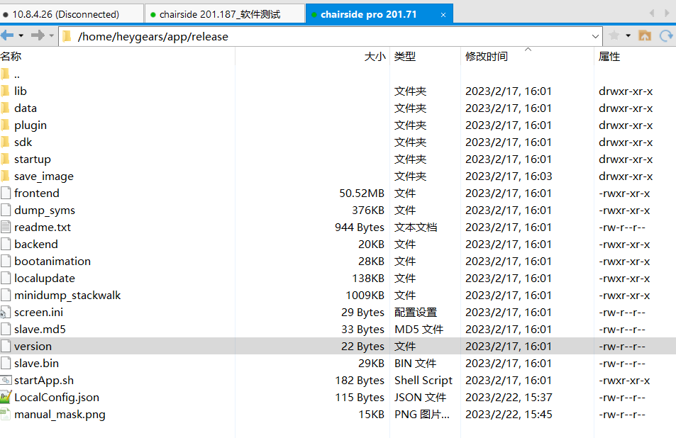

blacklist 修改位置

/home/heygears/app/release/plugin

获取自动均匀性校准图片tmp路径设置

机台设置tmp路径，获取I——P关系

`/home/heygears/app/release/`

日志读取路径

`/home/heygears/.heygears/logs`

**chairside pro文件路径：**

| 序号                                        | 文件名                     | 文件路径                         |
| ------------------------------------------- | -------------------------- | -------------------------------- |
| 1. 自动mask手动PI时采集的电流I和光强P离散值 | autoenergycalibparams.json | /home/heygears/.heygears/configs |
| 2. 手动均匀性校准及光强校准数据             | energycalibparams.json     | /home/heygears/.heygears/configs |
| 3. 自动均匀性校准拟合的GG参数               | hg_autocalib.db            | /home/heygears/.heygears/db      |

| autoenergycalibparams.json | /home/heygears/.heygears/configs |
| -------------------------- | -------------------------------- |
| energycalibparams.json     | /home/heygears/.heygears/configs |
| cap_img.png                | /home/heygears/app/release       |
| hg_autocalib.db            | /home/heygears/.heygears/db      |

出现0005错误相机通讯异常时，可能是相机通讯接线没有接上

查看CSP软件版本号

命令行进入`/home/heygears/app/release`

然后`cat version`

