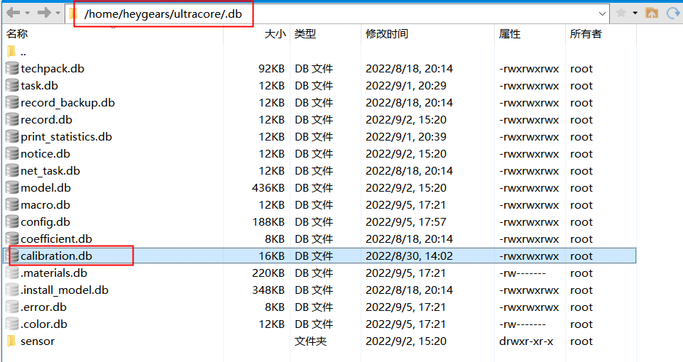

cs端大范围电流光强灰度测试

1. 查看db文件中的PI列表，找到合适的电流，确定电流列表，写入自动校准配置文件autograycalib.json，将文件放入指定路径
   - db文件路径

   

   - autograycalib.json文件路径：/home/heygears/.clinic

2. 新建tmp文件，获取自动校准的数据

   - tmp路径：`/home/heygears/ultracore/bin`该路径下新建一个tmp文件夹

