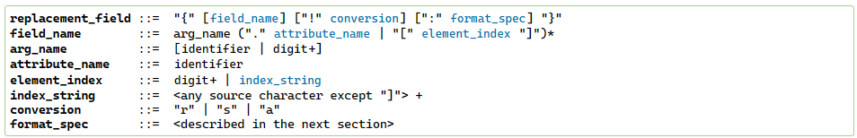

format string syntax

format string中含有由大括号`{}`包裹的replacement field,不在该大括号中的都是字符串字面值，进行原样输出，如果需要在字符串字面值中加入大括号，需要使用双大括号转义`{{` 和`}}`

replacement field的定义



field_name 

field_name以`arg_name`开始，`arg_name`可以是数字或关键字，数字表示位置参数，关键字表示对应名字的关键字参数。关键字后面可以接数字下标索引或者属性表达式，

`arg_name`可以被当作数字的判断条件：将该数字使用引号变成字符串后，调用`str.isdecimal()`方法，如果返回true，则是数字

例如

'1' 是一个十进制字符，所以返回 True

```
print('1'.isdecimal())  # 输出: True
```

'a' 不是一个十进制字符，所以返回 False

```
print('a'.isdecimal())  # 输出: False
```

'1a' 含有非十进制字符，所以返回 False

```
print('1a'.isdecimal())  # 输出: False
```


如果`arg_name`是数字，且是按0，1，2等依次增大，则可以省略掉数字,使用数字作为参数名时，我们实际上是在指定这些参数在参数列表中的位置。如果我们按照顺序（0, 1, 2, ...）指定了所有的参数名，那么我们可以选择省略它们，Python会自动按照这个顺序插入参数。

例如

```python
print("{} {} {}".format('apple', 'banana', 'cherry'))
print("{0} {1} {2}".format('apple', 'banana', 'cherry'))
```


在格式化字符串中不能直接使用带引号的字符串作为参数名（arg_name）。因为`arg_name`不是由引号界定的，你不能用任意的字符串作为字典键来引用它们。

例如，假设我们有一个字典`{'10': 'ten', ':-]': 'smile'}`，我们不能直接在格式化字符串中使用 `'10'` 或 `'[:-]'` 作为参数名来引用字典中的值，因为这些字符串包含特殊字符或数字，这会导致语法错误。

字典格式化字符串使用方式

```python
params = {'a': 'apple', 'b': 'banana', 'c': 'cherry'}
print("{a} {b} {c}".format(**params))
```

如果类似使用

```python
params = {'10': 'ten', ':-]': 'smile'}
print("{10} {:-]}".format(**params))
```

肯定会产生语法错误。

但是我们可以通过以下方式来解决这个问题：

```python
data = {'10': 'ten', ':-]': 'smile'}

# 使用正确的键来格式化字符串
print("{ten} {smile}".format(ten=data['10'], smile=data[':-]']))
```

在这个例子中，我们通过指定参数名（ten 和 smile）和相应的参数值（从字典中获取）来正确格式化字符串。

但如果我们尝试直接在格式化字符串中使用 `'10'` 或 `'[:-]'` 作为参数名来引用字典中的值，就会遇到问题，因为这样的字符串不能直接用作参数名。我们必须在`format()`方法中明确指定参数名和对应的参数值来避免这个问题。


例如

```
"First, thou shalt count to {0}"  # References first positional argument
"Bring me a {}"                   # Implicitly references the first positional argument
"From {} to {}"                   # Same as "From {0} to {1}"
"My quest is {name}"              # References keyword argument 'name'
"Weight in tons {0.weight}"       # 'weight' attribute of first positional arg
"Units destroyed: {players[0]}"   # First element of keyword argument 'players'.
```


*conversion* field

在formating之前进行类型强制转换

`!s`对参数调用`str()`

`!r`对参数调用`repr()`

`!a`对参数调用`ascii()`

例如

```
"Harold's a clever {0!s}"        # Calls str() on the argument first
"Bring out the holy {name!r}"    # Calls repr() on the argument first
"More {!a}"                      # Calls ascii() on the argument first
```


 *format_spec* field

确定数值如何表示，包括该区域宽度，对齐方式，补充形式，小数精度等等。

该field中还可以含有内置的replacement field，replacement field中含有field name， conversion flag和format spec，但是不能再进一步内置replacement field。replacement field会在format_spec发生作用之前发生


### Format Specification Mini-Language

用于replacement field中的 *format_spec* field，也可以直接用于内建函数`format()`

```
format_spec     ::=  [[fill]align][sign]["z"]["#"]["0"][width][grouping_option]["." precision][type]
fill            ::=  <any character>
align           ::=  "<" | ">" | "=" | "^"
sign            ::=  "+" | "-" | " "
width           ::=  digit+
grouping_option ::=  "_" | ","
precision       ::=  digit+
type            ::=  "b" | "c" | "d" | "e" | "E" | "f" | "F" | "g" | "G" | "n" | "o" | "s" | "x" | "X" | "%"
```

align：设置了该值的话，就可以设置fill值

fill：可以为任意字符，但是当进行f-string方式或`str.format()`方式格式化字符串时，不能为`{`或`}`，如果没有的话，默认为空格符；但是可以在嵌套了replacement field中插入`{}`

在Python的字符串格式化中，你可以在一个替换字段中嵌套另一个替换字段。这允许你在一个字段中组合多个值或进行更复杂的格式化。下面是一个示例：

```python
name = "Alice"
age = 25

result = f"{name} is {age:{4 if age < 100 else 3}} years old."
print(result) # 输出: "Alice is   25 years old."
```

在上面的例子中，我们在一个替换字段中嵌套另一个替换字段来决定年龄值应该有多少个字符宽。如果年龄小于100，我们使用4个字符的宽度来显示年龄（这将在年龄前面添加一些空格），否则我们使用3个字符的宽度。


alignment options:

`<`：在指定空间中，强制左对齐（默认对大多数对象）；

`>`：在指定空间中，强制右对齐（默认对数字）；

`=`：强制增加padding在sign和数字中间，例如`‘+000000120’`，只用于数值类型

`^`：在指定空间中，居中对齐


width：除非定义了最小空间field width多大，否则field width总和数据的width一致，此时，对齐选项就没有意义


sign：仅对数值类型有效，

`+`：对正数及负数都需要添加正数符号和负数符号；

`-`：只对负数添加负数符号（默认这种方式）

space：正数前面加上空格符，负数前面加上负数符号

`z`：在Python的字符串格式化中，`'z'`选项用于在格式精度四舍五入后将负零浮点值强制转换为正零。这里提供一个例子来解释这个选项如何工作：

```python
value = -0.0000001
formatted_value = format(value, '.0z')
print(formatted_value) # 输出: "0.0"
```

在上述示例中，我们有一个非常接近于零但略小于零的值（-0.0000001）。我们使用`.0z`作为格式规范，它表示我们想要一个精确到0位小数的结果，并使用`'z'`选项来强制任何结果为负零的值转换为正零。

所以，尽管原始值是一个非常小的负数，但它在四舍五入到0位小数后变成了-0.0。然后，由于我们使用了`'z'`选项，它被进一步转换为0.0。

这个选项可以用在你想避免在你的输出中出现负零的情况时，保持输出的美观和一致。


template strings

模板字符串提供了更简单的字符串替换方法，这在PEP 292中有详细描述。模板字符串的一个主要用例是用于国际化（i18n），因为在这种情境下，更简单的语法和功能使其比Python中其他内置的字符串格式化工具更易于翻译。

例如，flufl.i18n包就是建立在模板字符串基础上的用于国际化的库。

简单来说，模板字符串允许你创建一个有特定语法的字符串，这可以让你在之后方便地通过提供相应的值来替换模板中的某些部分。这对于需要多种语言支持的应用程序来说特别有用，因为它可以让你轻松地将特定的字符串翻译成多种语言，而不改变代码的其他部分。

基于`$`替换

- `$$`转义字符，用一个`$`代替
- `$identifier`命名一个占位符，用于和`identifier`的键的值做对应匹配，`"identifier"`被限制为大小写不敏感的ASCII字母数字字符（包括下划线），并以下划线或字母开头，`$`后的第一个非标识符字母终止该占位标志。
- `${identifier}`等价于`$identifier`

class string.Template(template)： 构造函数使用template string作为唯一参数

- **substitute**(*mapping={}*, */*, ***kwds*)

  执行template substitution，返回一个新字符串，mapping是一个字典类似的对象，其中的key和template中的placeholder对应，这样就可以使用key对应的value替换placeholder中的值。或者，也可以提供关键字参数，其中关键字就是placeholder

- **safe_substitute**(*mapping={}*, */*, ***kwds*)

  类似substitute，但是mapping中没有key和placeholder对应时，不会报错，而是会将placeholder原样显示出来，并且，任何形式出现的`$`都会原样显示出来

  
