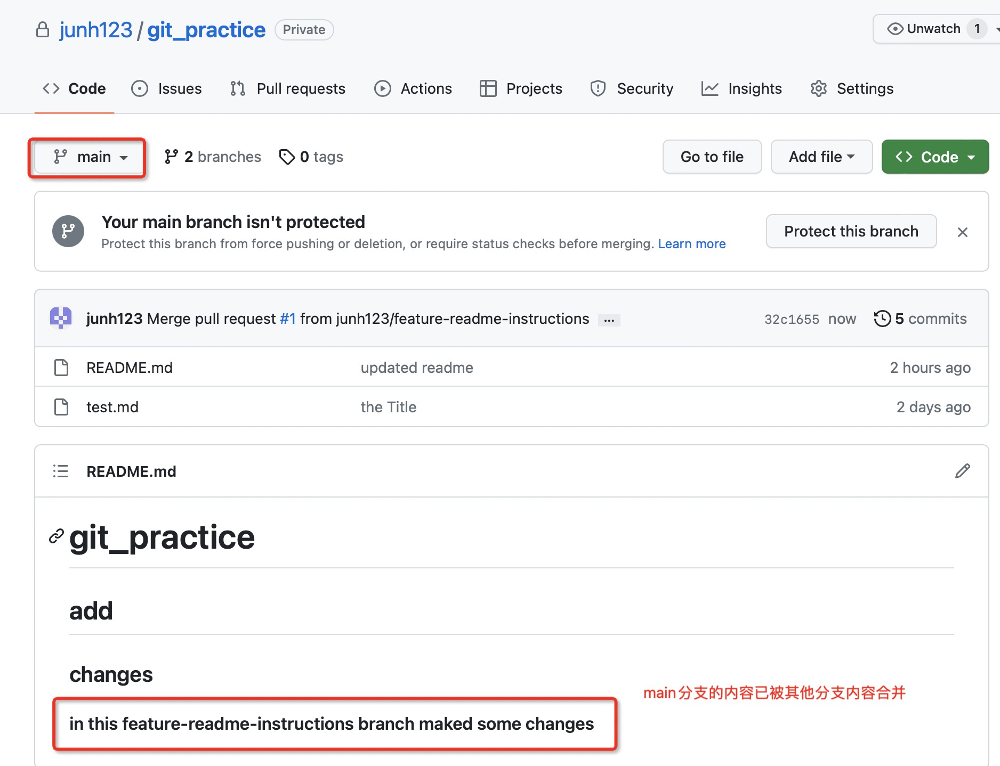

在VS Code中将使用git

代码提交

一、从远端下载代码仓库

1. 将远端代码仓库下载下来


2. 进入到下载下来的远端文件夹内，查看文件信息（必须有git文件夹才能查看git状态），及git状态


3. 代码仓库中的文件修改后，查看修改的文件


4. 代码仓库中新增文件


5. 添加git变化


6. 记录了变化之后可以提交了（交代what and why）


7. 上传到远端（注意github分支名是main）

   origin是git的仓库，main是分支名

   

上传成功后，GitHub上显示的信息


二、本地代码仓库（此时无git）

1. 新建路径


2. git初始化


3. 查看文件的git状态


4. 添加git变化


5. 提交git变化


6. 上传git变化（由于远端无此仓库，上传会出现错误，需要先在远端新建仓库）


7. 在远端新建仓库


8. 将远端仓库和本地仓库建立连接，并查看连接的远端仓库（）

```c++
git remote -v (小写v)
```


9. 上传到远端（显示出错）


因为此时该本地仓库的分支名是master，不是main

见步骤3:


10. 上传至远端分支master


还可以：将当前分支强行命名为main分支


11. 远端显示


分支

1. 查看当前路径的分支情况


2. 创建新分支，并选择该分支


3. 切换分支


4. 切换分支


5. 在该分支上修改路径中的文件


6. 保存及提交变化记录


7. 切换到另一分支main，main分支无修改


8. 分支比较


分支合并

将feature-readme-instructions分支合并到main分支之前

先将feature-readme-instructions分支上传到远端


需要设置上游，再上传


GitHub界面合并分支

1. 合并请求


2. 创建合并


3. 进行合并


4. 确认合并


合并结果



合并分支到主分支main后拉到本地

1. 切换到主分支main


2. 从远端拉到本地


3. 从分支合并到主分支后，即可删除从分支


冲突解决

1. 


2. 


3. 


（这两分支都在本地的同一文件的同一位置做了修改，因此产生了冲突，必须提交修改后才能切换分支）

4. 


5. 


6. 


7. 修改


8. 


撤销

1. 


2. 


3. 提交了变化记录


4. 重置

HEAD：指代上一次提交的commit

1:表示commit的上一步


5. 


6. 

 


查看远端的更新

git fetch origin

查看有哪些更改

git diff origin/master

确认可以即可合并

*git merge origin/master* 

