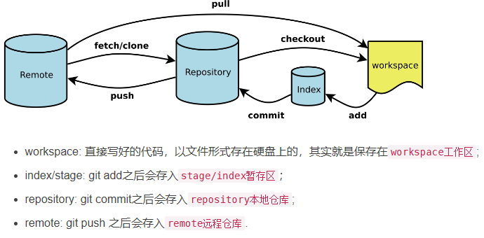
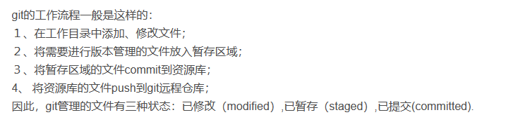
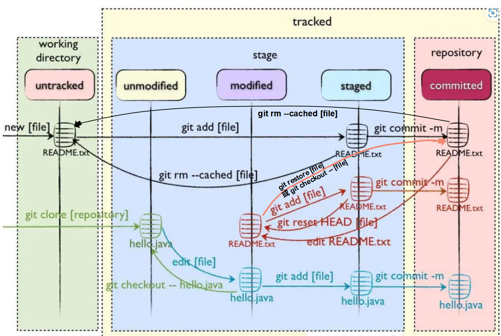
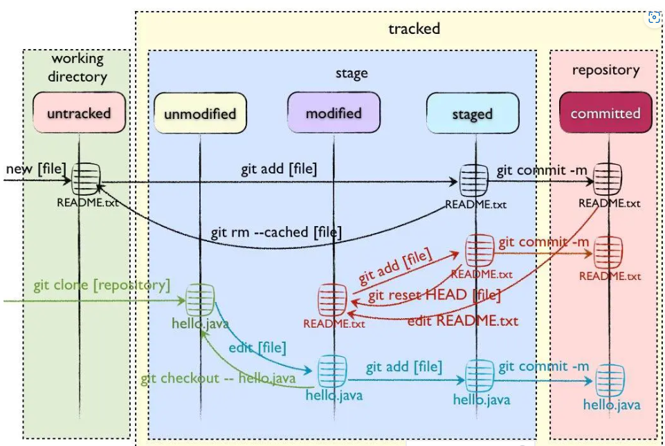
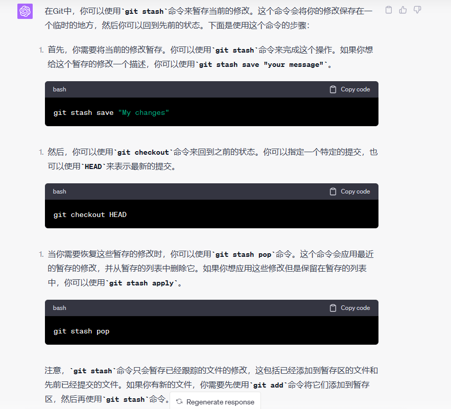
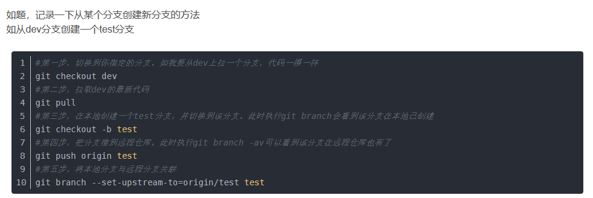

git总结

查看远端的更新

git fetch origin

查看有哪些更改

git diff origin/master

确认可以即可合并

*git merge origin/master* 


工作区workspace:

stage暂存区：

repository本地仓库：

remote远端仓库：





文件的三种状态：

untracked：未跟踪状态，此文件在文件夹中，在工作区

- （前进）staged：通过git add命令状态变为staged，将文件放入暂存区
- （后退）无法后退

modified：已修改状态（将本地仓库中的文件修改后即为该状态），仅仅是修改，没有进行其他操作，存放在暂存区，状态为modified。

- （前进）staged：通过git add 将状态变为staged
- （后退）unmodify：通过git checkout，即从本地仓库中取出文件，覆盖当前修改，丢弃修改，回到unmodify状态，或者通过git restore丢弃修改。

staged：暂存状态，存放在暂存区，状态为staged。

- （前进）unmodify：通过git commit，将文件放入本地仓库
- （后退）modified：通过git reset HEAD filename，取消暂存，变成modified
- （后退两步）untracked：通过git rm --cached filename，将文件放入工作区，状态变成untracked，不删除本地文件，只删除git记录，并且不要git记录
  - git rm filename， 既删除本地文件，也删除git记录。

unmodify：未修改状态，文件在本地仓库，状态为unmodify（本地仓库）

- （前进）：通过修改，状态变为modified，文件进入在暂存区；
- （后退）：通过git rm --cached filename， 将文件放入工作区，状态变成untracked。

该图片为在原图上经过修改后的



原图：



本地仓库的代码修改完成后，想查看修改了哪些地方

`git diff`：此命令比较的是工作区中当前文件和暂存区域快照之间的差异。 也就是修改之后还没有暂存起来的变化内容


暂存文件




在某个分支下切换到某个commit

git checkout commit_id

切换到该分支后，再没有做任何修改的时候，想切换到当前代码，使用git checkout 当前分支名


比较两个commit之间的差异

git diff hash1 hash2 --stat ：会列出有差异的文件

要查看文件具体差异点

git diff hash1 hash2 


将远程分支拉到本地上，并到该分支上：

`git checkout -b serverfix origin/serverfix`

例如：使用git clone将某个仓库克隆到本地了，然而这个仓库只是所有分支中的一个分支，此时可以使用上面命令拉取其他分支代码

使用clone将master分支拉到本地上了，但是需要另外一个分支r818，则可以使用

`git checkout -b r818 origin/r818`


从远程仓库拉取某个版本，及其子模块

```
heygears@heygears-ubuntu:~/tools/boost$ git status 
On branch master
Your branch is up to date with 'origin/master'.

nothing to commit, working tree clean
heygears@heygears-ubuntu:~/tools/boost$ git branch 
* master
heygears@heygears-ubuntu:~/tools/boost$ git checkout 

Display all 205 possibilities? (y or n)

heygears@heygears-ubuntu:~/tools/boost$ git checkout boost-1.78.0

heygears@heygears-ubuntu:~/tools/boost$ 

heygears@heygears-ubuntu:~/tools/boost$ git submodule init 

heygears@heygears-ubuntu:~/tools/boost$ git submodule update 
```


从某一个分支的基础上创建新分支


