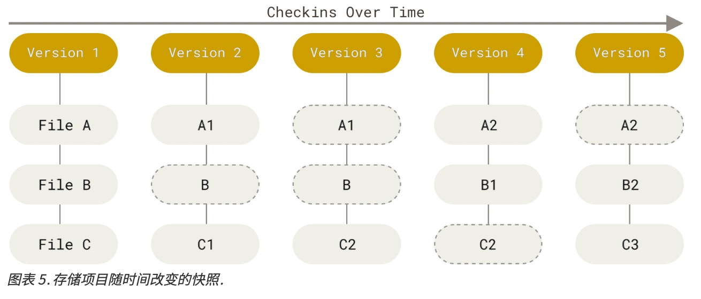
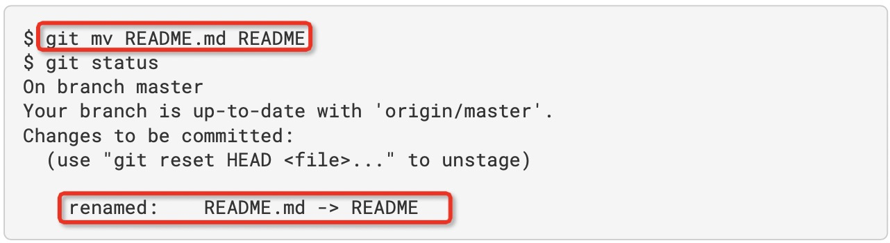
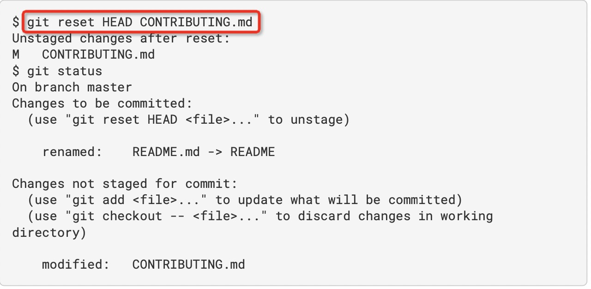
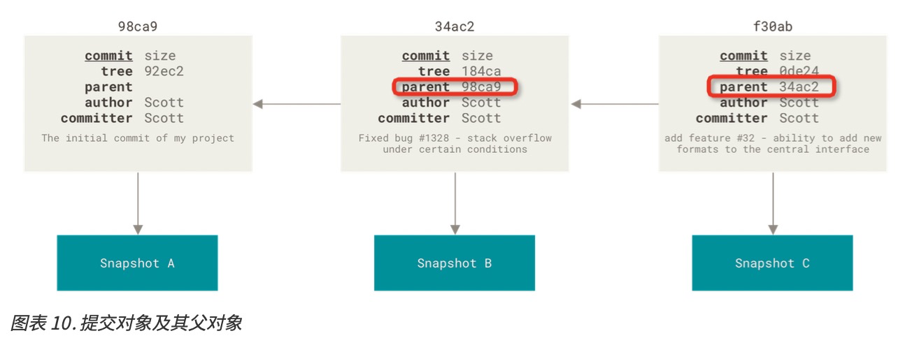
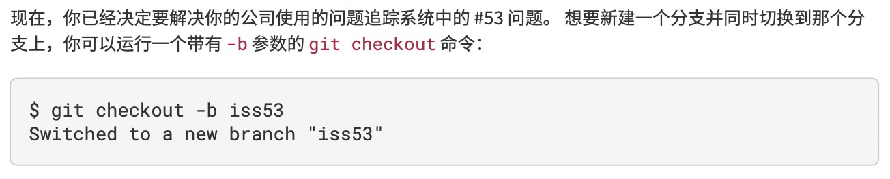

# 起步

## **版本控制**

是一种记录一个或若干文件内容变化，以便将来查阅特定版本修订情况的系统。

补丁：文件修订前后的变化

## **集中化的版本控制系统**（Centralized Version Control Systems）

让不同系统上的开发者协同工作

有一个单一的集中管理的服务器，保存所有文件的修订版本，而协同工作的人们都通过客户端连到这台服务器，取出最新的文件或提交更新


缺点：

1. 中央服务器单点故障会导致其他客户端无法工作；
2. 中心数据库所在磁盘发生损坏，又没有备份，将丢失所有数据

## **分布式版本控制系统**（Distributed Version Control System）

客户端并不只是提取最新版本的文件快照，而是把代码仓库完整地镜像下来，包括完整地历史记录。这样一来，任何一处协同工作用的服务器发生故障，事后都可以用任何一个镜像出来的本地仓库恢复。因为每一次克隆操作，实际都是一次对代码仓库的完整备份。


## git是什么

**直接记录快照，而非差异比较**

Git和其他版本控制系统(CVS、Subversion、Perforce、Bazaar 等）的主要差别在于Git对待数据的方式

- **其他版本控制系统**

以文件变更列表的方式存储信息，将他们存储的信息看作是一组基本文件和每个文件随时间逐步积累的差异（基于差异（delta-based）的版本控制）


- **Git**

把数据看作是对小型文件系统的一系列快照。

在Git中，每当你提交更新或保存项目状态时，它基本上就会对当时的全部文件创建一个快照并保存这个快照的索引。

如果文件没有修改，Git不再重新存储该文件，而是只保留一个链接指向之前存储的文件。

Git对待数据更像是一个**快照流**



**近乎所有操作都是本地执行**


在Git中的绝大多数操作都只需要访问本地文件和资源，一般不需要来自网络上的其他计算机信息。因为你在本地磁盘上就有项目的完整历史，Git会查找到以前的文件做一次本地的差异计算，而不是由远程服务器处理或从远程服务器拉回旧版文件再来本地处理。

**Git保证完整性**

git中所有的数据在存储前都计算校验和，然后以校验和来引用。这意味着不可能在git不知情时更改任何文件内容或目录内容。

git数据库中保存的信息都是以文件内容的哈希值来索引，而不是文件名。

**git一般只添加数据**

你执行的git操作，几乎只往git数据库中添加数据，很难使用git从数据库中删除数据。

**三种状态**

git有三种状态，你的文件可能处于其中之一：

- 已提交（committed）：数据已安全地保存在本地数据库中；
- 已修改（modified）：修改了文件，但还没保存到数据库中；
- 已暂存（staged）：对一个已修改文件的当前版本做了标记，使之包含在下次提交的快照中。

从而使git项目有三个阶段：工作区、暂存区和git目录


- 工作区：对项目的某个版本独立提取出来的内容。这些从git仓库的压缩数据库中提取出来的文件，放在磁盘上供你使用或修改。
- 暂存区（.git文件夹中index文件）：是一个文件，保存了下次将要提交的文件列表信息，一般在git仓库目录中。在git仓库目录中叫做“索引”
- git仓库目录（.git文件夹）：git用来保存项目的元数据和对象数据库的地方。这是git中最重要的部分，从其他计算机克隆仓库时，复制的就是这里的数据。

**git工作流程**

1. 在工作区中修改文件；
2. 将你想要下次提交的更改选择性地暂存，这样只会将更改的部分添加到暂存区；
3. 提交更新，找到暂存区的文件，将快照永久性存储到git目录（.git文件夹）。

如果自上次检出后，作了修改但还没有放到暂存区，就是**已修改**状态；

如果文件已修改并放入暂存区，就属于**已暂存**状态；

如果git目录中保存着特定版本的文件，就属于**已提交**状态。


### git配置

git自带一个`git config`工具来帮助设置控制git外观和行为的配置变量。这些变量存储在三个不同的位置：

1. `/etc/gitconfig`文件：包含系统上每一个用户及他们仓库的通用配置。如果在执行`git config`时带上`--system`选项，那么它就会读写该文件中的配置变量。
2. `~/.gitconfig`或`~/.config/git/config`文件：只针对当前用户。可以传递`--global`选项让git读写此文件，这会对你系统上所有的仓库生效。
3. 当前使用仓库的git目录中的`config`文件（即`.git/config`）：针对该仓库。你可以传递`--local`选项让git强制读写此文件。默认情况下用的就是它。（需要进入某个git仓库中才能让该选项生效）

每一个级别会覆盖上一级别的配置，所以`.git/config`的配置变量会覆盖`/etc/gitconfig`中的配置变量。

通过以下命令查看所有的配置以及它们所在的文件:

```shell
git config --list --show-origin
```

#### 配置用户信息

安装完git后，首先设置你的用户名和邮件地址，因为每个git提交都会使用这些信息，它们会写入到你的每一次提交中，不可更改：

```
git config --global user.name "John Doe"
git config --global user.email johndoe@example.com
```

#### 配置文本编辑器

当git需要你输入信息时，就会调用它，若未配置，则使用操作系统默认的文本编辑器

如果你想使用不同的文本编辑器，例如 Emacs，可以这样做:

```
git config --global core.editor emacs
```

#### 检查配置信息

`git config --list`：列出所有git能找到的配置

` git config <key>`：检查git的某一项配置

```
git config user.name
```

#### 获取帮助

```shell
git help <verb>
git <verb> --help
man git-<verb>
```

例如，要想获得git config命令的手册，执行

```
git help config
```

此外，如果你不需要全面的手册，只需要可用选项的快速参考，那么可以用 -h 选项获得更简明的 “help”

例如

```shell
git add -h
```

## git基础

### 获取git仓库（.git文件夹）

两种方式获得git项目仓库

1. 将尚未进行版本控制的本地目录转换为git仓库；
2. 从其他服务器克隆一个已存在的git仓库。

#### 将尚未进行版本控制的本地目录转换为git仓库

```
git init //在当前文件夹中创建一个名为.git的子目录
```

但是当前文件夹中的文件还没有被跟踪，因此需要追踪这些文件并初始提交

```
git add . //追踪所有文件
git commit -m 'initial project version' //提交
```

#### 从其他服务器克隆一个已存在的git仓库

克隆仓库: `git clone <url>`

```
git clone https://github.com/libgit2/libgit2
```

如果你想在克隆远程仓库的时候，自定义本地仓库的名字，你可以通过额外的参数指定新的目录名

```
git clone https://github.com/libgit2/libgit2 mylibgit

```

### 记录每次更新到仓库

工作目录下的每一个文件都不外乎两种状态：已跟踪或未跟踪

已跟踪：已被纳入了版本控制的文件，在上一次快照中有它们的记录，在工作一段时间后，它们的状态可能是未修改，已修改，或已放入暂存区。

未跟踪：工作目录中除了已跟踪的文件外，其他文件都是未跟踪文件，它们既不存在于上次快照的记录中，也没有被放入暂存区。

编辑过某些文件之后，由于自上次提交后你对它们做了修改，Git 将它们标记为已修改文件。 在工作时，你可以 选择性地将这些修改过的文件放入暂存区，然后提交所有已暂存的修改，如此反复。


### 检查当前文件状态

查看哪些文件处于什么状态

```
git status 
```

例如

```
$git status
On branch master
Your branch is up-to-date with 'origin/master'.
nothing to commit, working directory clean
```

说明：

1. 你现在的工作目录相当干净。换句话说，所有已跟踪文件在上次提交后都未被更改过。
2. 当前目录下没有出现任何处于未跟踪状态的新文件，否则 Git 会在这里列出来
3. 显示了当前所在分支，并告诉你这个分支同远程服务器上对应的分支没有偏离

若在当前目录下添加新文件README


`Untracked files:`未追踪的文件

表示git在之前的快照（提交）中没有这些文件


#### 跟踪新文件

开始跟踪一个文件： `git add`


在` Changes to be committed` 这行下面的，就说明是已暂存状态


#### 暂存已修改的文件

暂存操作会 为每一个文件计算校验和，然后会把当前版本的文件快照保存到 Git 仓库中 (Git 使用 blob 对象来保存它们)，最终将校验和加入到暂存区域等待提交


`Changes not staged for commit`这行下面，说明已跟踪文件的内容发发生了变化，但还没有放到暂存区

暂存更新: `git add`, 将这个命令理解为“精确地将内容添加到下一次提交中”而不是“将一个文件添加到项目中”要更加合适

这是个多功能命令:

1. 可以用它开始跟踪新文件
2. 把已跟踪的文件放到暂存区
3. 还能用于合并时把有冲突的文件标记为已解决状态等

#### 状态简览

`git status -s` 命令或 `git status --short` 命令： 缩短状态命令的输出


输出中有两栏：

左栏指明了暂存区的状态，右栏指明了工作区的状态

A：新添加到暂存区的文件

M：修改过的文件

??：新添加的未追踪的文件

例如，上面的状态报告显示: 

`README` 文件 在工作区已修改但尚未暂存，

`lib/simplegit.rb` 文件已修改且已暂存。 

`Rakefile` 文件已修改，暂存后又作了修改，因此该文件的修改中既有已暂存的部分，又有未暂存的部分。

#### 忽略文件

一般我们总会有些文件无需纳入 Git 的管理，也不希望它们总出现在未跟踪文件列表

通常都是些自动生成的文 件，比如日志文件，或者编译过程中创建的临时文件等

 在这种情况下，我们可以创建一个名为 .gitignore 的文件，列出要忽略的文件的模式


文件` .gitignore` 的格式规范如下:

• 所有空行或者以 `#` 开头的行都会被 Git 忽略。
 • 可以使用标准的 glob 模式匹配，它会递归地应用在整个工作区中。
 • 匹配模式可以以(`/`)开头防止递归。
 • 匹配模式可以以(`/`)结尾指定目录。
 • 要忽略指定模式以外的文件或目录，可以在模式前加上叹号(`!`)取反。

所谓的 glob 模式是指 shell 所使用的简化了的正则表达式。 

星号(`*`)匹配零个或多个任意字符;

`[abc]` 匹配 任何一个列在方括号中的字符 (这个例子要么匹配一个 a，要么匹配一个 b，要么匹配一个 c); 

问号(`?`)只 匹配一个任意字符;

如果在方括号中使用短划线分隔两个字符， 表示所有在这两个字符范围内的都可以匹配 (比如 [`0-9`] 表示匹配所有 0 到 9 的数字)。 

使用两个星号(`**`)表示匹配任意中间目录，比如 `a/**/z` 可以 匹配 `a/z` 、 `a/b/z` 或 `a/b/c/z` 等。

例如


#### 查看已暂存和未暂存的修改

想知道具体修改了什么地方：`git diff`(其后不加参数)

此命令比较的是工作目录中当前文件和暂存区域快照之间的差异。 也就是修改之后还没有暂存起来的变化内容

通常可能会用它来回答这两个问题:

1. 当前做的哪些更新尚未暂存? 
2. 有哪些更新已暂存并准备好下次提交?

虽然git status已经通过在相应栏下列出文件名的方式回答了这个问 题，但git diff能通过文件补丁的格式更加具体地显示哪些行发生了改变。

**当前做的哪些更新尚未暂存?** 

假如再次修改 README 文件后暂存，然后编辑 CONTRIBUTING.md 文件后先不暂存， 运行 status 命令将会看 到:


要查看尚未暂存的文件更新了哪些部分，不加参数直接输入`git diff`:


若要查看已暂存的将要添加到下次提交里的内容，可以用 `git diff --staged` 命令。 这条命令将比对已暂存文件与最后一次提交的文件差异.

请注意，`git diff` 本身只显示尚未暂存的改动，而不是自上次提交以来所做的所有改动。 所以有时候你一下子暂 存了所有更新过的文件，运行git diff后却什么也没有，就是这个原因。

总结：

`git diff`——工作区和暂存区比较；

`git diff --staged`(或`git diff --cached`)——暂存区和已提交到git仓库的版本比较


`git difftool`配置

使用 `git difftool --tool-help` 命令来看你的系统 支持哪些 Git Diff 插件。


### 提交更新

`git commit`

暂存区准备就绪后，就可以提交了

```
git commit
```

这样会启动你选择的文本编辑器来输入提交说明。


可以看到，默认的提交消息包含最后一次运行git status的输出，放在注释行里，另外开头还有一个空行， 供你输入提交说明

另外，你也可以在 commit 命令后添加 -m 选项，将提交信息与命令放在同一行

```
git commit -m "title"
```

请记住，提交时记录的是放在暂存区域的快照。 任何还未暂存文件的仍然保持已修改状态，可以在下次提交时 纳入版本管理。 

每一次运行提交操作，都是对你项目作一次快照，以后可以回到这个状态，或者进行比较。

**跳过使用暂存区域**

尽管使用暂存区域的方式可以精心准备要提交的细节，但有时候这么做略显繁琐

`git commit -a`: Git 就会自动把所有已经跟踪过的文件暂存 起来一并提交，从而跳过git add步骤


### 移除文件

1. 既删除本地文件，也删除git记录

从已跟踪文件清单中移除(确切地说，是从暂存区域移除)：`git rm`

`git rm`会连带从工作目录中删除指定的文件，这样以后就不会出现在未跟踪文件清 单中了

如果只是简单地从工作目录中手工删除文件，运行 git status 时就会在 “Changes not staged for commit” 部分(也就是 未暂存清单)看到:


然后再运行git rm记录此次移除文件的操作:


强制删除：`git rm -f`

如果要删除之前修改过或已经放到暂存区的文件，则必须使用 强制删除选项 -f(译注:即 force 的首字母)。 这是一种安全特性，用于防止误删尚未添加到快照的数据，这 样的数据不能被 Git 恢复。

2. 不删除本地文件，只删除git记录

`git rm --cached file.name`

我们想把文件从 Git 仓库中删除(亦即从暂存区域移除)，但仍然希望保留在当前工作目录 中。 换句话说，你想让文件保留在磁盘，但是并不想让 Git 继续跟踪，比如当你忘记添加 .gitignore 文件，不小 心把一个很大的日志文件或一堆 .a 这样的编译生成文件添加到暂存区时，这一做法尤其有用

例如

```
git rm --cached README
```

git rm命令后面可以列出文件或者目录的名字，也可以使用glob模式。比如: 

```
git rm log/\*.log
```

注意到星号 * 之前的反斜杠 \， 因为 Git 有它自己的文件模式扩展匹配方式，所以我们不用 shell 来帮忙展开。 此命令删除 log/ 目录下扩展名为 .log 的所有文件。 类似的比如:

```
git rm \*~
```

该命令会删除所有名字以 ~ 结尾的文件。

#### 重新命名

`git mv`

例如

```
git mv file_from file_to
```



#### 查看提交历史

列出所有提交：`git log`


不传入任何参数的默认情况下，git log会按时间先后顺序列出所有的提交，最近的更新排在最上面。

这个命令会列出每个提交的 SHA-1 校验和、作者的名字和电子邮件地址、提交时间以及提交说明。

`git log` 有许多选项可以帮助你搜寻你所要找的提交

- `-p` 或 `--patch`:

  显示每次提交所引入的差异(按 补丁 的格式输出)。 你也可

  以限制显示的日志条目数量，例如使用 -2 选项来只显示最近的两次提交


- `--stat` 选项:附带一系列的总结,每次提交的下面列出所有被修改过的文件、有多少文件被修改了以及被修改过 的文件的哪些行被移除或是添加了。 在每次提交的最后还有一个总结.


- `--pretty`: 使用不同于默认格式的方式展示提交历史
  -  `oneline`: 会将每个提交放在一行显示，在浏览大量的提交时非常有用
  - 还 有 short，full 和 fuller 选项
  - `format`


​	


作者：实际作出修改的人；

提交者：最后将此工作成果提交到仓库的人

当 `oneline` 或 `format` 与另一个 log 选项 --graph 结合使用时尤其有用。 这个选项添加了一些 ASCII 字符串 来形象地展示你的分支、合并历史:


#### 限制输出长度


最后一个很实用的 git log 选项是路径(path)， 如果只关心某些文件或者目录的历史提交，可以在 git log 选项的最后指定它们的路径。 因为是放在最后位置上的选项，所以用两个短划线(--)隔开之前的选项和后面限 定的路径名。

例如


### 撤销操作

注意，有些撤消操作是不可逆的

有时候我们提交完了才发现漏掉了几个文件没有添加，或者提交信息写错了

`git commit --amend`

```
git commit --amend
```

这个命令会将暂存区中的文件提交。 如果自上次提交以来你还未做任何修改(例如，在上次提交后马上执行了 此命令)， 那么快照会保持不变，而你所修改的只是提交信息。

文本编辑器启动后，可以看到之前的提交信息。 编辑后保存会覆盖原来的提交信息。

例如：


#### 取消暂存的文件

例如，你已经修改了两个文件并且想要将它们作为两次独立的修改提交， 但是却意外地输入 git add *暂存了它们两个。如何只取消暂存两个中的一个呢?git status命令提示了你:


取消暂存



#### 撤消对文件的修改

如果你并不想保留对 CONTRIBUTING.md 文件的修改怎么办? 你该如何方便地撤消修改——将它还原成上次提 交时的样子(或者刚克隆完的样子，或者刚把它放入工作目录时的样子)?幸运的是，git status也告诉了 你应该如何做。 在最后一个例子中，未暂存区域是这样:


撤消修改


### 远程仓库的使用

远程仓库是指托管在因特网或其他网络中的你的项目的版本库

#### 查看远程仓库

查看你已经配置的远程仓库服务器:`git remote`

它会列出你指定的每一个远程服务器 的简写。 如果你已经克隆了自己的仓库，那么至少应该能看到 origin ——这是 Git 给你克隆的仓库服务器的默认 名字


显示需要读写远程仓库使用的 Git 保存的简写与其对应的 URL: `git remote -v`


如果你的远程仓库不止一个，该命令会将它们全部列出。 例如，与几个协作者合作的，拥有多个远程仓库的仓 库看起来像下面这样:


#### 添加远程仓库

`git remote add <shortname> <url>`: 添加一个新的远程 Git 仓库，同时指定一个方便使用的简写（远端仓库需要一个简写，默认是origin）


现在你可以在命令行中使用字符串 pb 来代替整个 URL。 例如，如果你想拉取 Paul 的仓库中有但你没有的信 息，可以运行git fetch pb:


#### 从远程仓库中抓取与拉取

`git fetch <remote>`：从远程仓库中获得数据

这个命令会访问远程仓库，从中拉取所有你还没有的数据。 执行完成后，你将会拥有那个远程仓库中所有分支 的引用，可以随时合并或查看。

如果你使用 clone 命令克隆了一个仓库，命令会自动将该仓库添加为远程仓库并默认以 “origin” 为简写，所 以，git fetch origin会抓取克隆(或上一次抓取)后新推送的所有工作

必须注意git fetch命令只会 将数据下载到你的本地仓库——它并不会自动合并或修改你当前的工作。 当准备好时你必须手动将其合并入你的 工作。

如果你的当前分支设置了跟踪远程分支，那么可以用 git pull 命令 来自动抓取后合并该远程分支到当前分支。 这或许是个更加简单舒服的工作流程。

默认情况下，git clone 命 令会自动设置本地 master 分支跟踪克隆的远程仓库的 master 分支(或其它名字的默认分支)。 运行 git pull 通常会从最初克隆的服务器上抓取数据并自动尝试合并到当前所在的分支。

#### 推送到远程仓库

`git push <remote> <branch>`

当你 想要将 master 分支推送到 origin 服务器时(再次说明，克隆时通常会自动帮你设置好那两个名字)， 那么 运行这个命令就可以将你所做的备份到服务器:

```
git push origin master
```

只有当你有所克隆服务器的写入权限，并且之前没有人推送过时，这条命令才能生效。 当你和其他人在同一时 间克隆，他们先推送到上游然后你再推送到上游，你的推送就会毫无疑问地被拒绝。 你必须先抓取他们的工作 并将其合并进你的工作后才能推送。

#### 查看某个远程仓库

`git remote show <remote>`：查看某一个远程仓库的更多信息


它会列出远程仓库的 URL 与跟踪分支的信息

它告诉你：

1. 处于 master 分支
2. 并且如 果运行 git pull， 就会抓取所有的远程引用，然后将远程 master 分支合并到本地 master 分支。 
3. 它也会列 出拉取到的所有远程引用。

#### 远程仓库的重命名与移除

`git remove rename`：修改一个远程仓库的简写名

例如，想要将 pb 重命名为 paul，可以用 git remote rename这样做:


`git remote remove`或`git remote rm`：移除一个远程仓库


### 打标签

Git 可以给仓库历史中的某一个提交打上标签，以示重要

## git分支

#### 分支简介

在进行提交操作时，Git 会保存一个提交对象(commit object)。 知道了 Git 保存数据的方式，我们可以很自 然的想到——

该提交对象会包含一个指向暂存内容快照的指针。 但不仅仅是这样，该提交对象还包含了作者的姓名和邮箱、提交时输入的信息以及指向它的父对象的指针。 首次提交产生的提交对象没有父对象，普通提交操 作产生的提交对象有一个父对象， 而由多个分支合并产生的提交对象有多个父对象。

为了更加形象地说明，我们假设现在有一个工作目录，里面包含了三个将要被暂存和提交的文件。 暂存操作会 为每一个文件计算校验和(使用我们在 起步 中提到的 SHA-1 哈希算法)，然后会把当前版本的文件快照保存到 Git 仓库中 (Git 使用 blob 对象来保存它们)，最终将校验和加入到暂存区域等待提交:

当使用 git commit 进行提交操作时，Git 会先计算每一个子目录(本例中只有项目根目录)的校验和， 然后 在 Git 仓库中这些校验和保存为树对象。随后，Git 便会创建一个提交对象， 它除了包含上面提到的那些信息 外，还包含指向这个树对象(项目根目录)的指针。 如此一来，Git 就可以在需要的时候重现此次保存的快照。

现在，Git 仓库中有五个对象:三个 blob 对象(保存着文件快照)、一个 树 对象 (记录着目录结构和 blob 对 象索引)以及一个 提交 对象(包含着指向前述树对象的指针和所有提交信息)。


做些修改后再次提交，那么这次产生的提交对象会包含一个指向上次提交对象(父对象)的指针。



Git 的分支，其实本质上仅仅是指向提交对象的可变指针。 Git 的默认分支名字是 master。


#### 分支创建

`git branch`

例如

```
git branch testing
```


#### HEAD

git是如何知道当前在哪一个分支上呢？

有一个名为HEAD打特殊指针

在 Git 中，它是一个指针，指向当前所在的本地分支(译注:将 HEAD 想象为当前分支的别名)


`git log --oneline --decorate`：查看各个分支当前所指的是那个提交对象


#### 分支切换

`git checkout `

例如：

```
git checkout testing
```


再切换回master分支


这条命令做了两件事。 一是使 HEAD 指回 master 分支，二是将工作目录恢复成 master 分支所指向的快照内 容。


`git log --oneline --decorate --graph --all`：输出你的提交历史、各个分支的指向以及项目的分支分叉情况


### 分支的新建与合并


新建分支




你继续在 #53 问题上工作，并且做了一些提交。 在此过程中，iss53 分支在不断的向前推进，因为你已经检出（checkout）到该分支 (也就是说，你的 HEAD 指针指向了 iss53 分支)


现在你接到那个电话，有个紧急问题等待你来解决。 有了 Git 的帮助，你不必把这个紧急问题和 iss53 的修改 混在一起， 你也不需要花大力气来还原关于 53# 问题的修改，然后再添加关于这个紧急问题的修改，最后将这 个修改提交到线上分支。 你所要做的仅仅是切换回 master 分支。

在你切换分支之前，保持工作目录和暂存区一个干净的状态


这个时候，你的工作目录和你在开始 #53 问题之前一模一样，现在你可以专心修复紧急问题了。 请牢记:当你 切换分支的时候，Git 会重置你的工作目录，使其看起来像回到了你在那个分支上最后一次提交的样子。 Git 会 自动添加、删除、修改文件以确保此时你的工作目录和这个分支最后一次提交时的样子一模一样。


你可以运行你的测试，确保你的修改是正确的，然后将 hotfix 分支合并回你的 master 分支来部署到线上。

#### 合并分支

`git merge`

你可以使用git merge命令来达到上述目的:


在合并的时候，你应该注意到了“快进(fast-forward)”这个词。 由于你想要合并的分支 hotfix 所指向的提 交 C4 是你所在的提交 C2 的直接后继， 因此 Git 会直接将指针向前移动。换句话说，当你试图合并两个分支 时， 如果顺着一个分支走下去能够到达另一个分支，那么 Git 在合并两者的时候， 只会简单的将指针向前推进 (指针右移)，因为这种情况下的合并操作没有需要解决的分歧——这就叫做 “快进(fast-forward)”


#### 删除分支

`git branch -d xxx`

关于这个紧急问题的解决方案发布之后，你准备回到被打断之前时的工作中。 然而，你应该先删除 hotfix 分 支，因为你已经不再需要它了 —— master 分支已经指向了同一个位置。 你可以使用带 -d 选项的 git branch 命令来删除分支:


现在你可以切换回你正在工作的分支继续你的工作，也就是针对 #53 问题的那个分支(iss53 分支)。


你在 hotfix 分支上所做的工作并没有包含到 iss53 分支中。 如果你需要拉取 hotfix 所做的修改，你可以使 用git merge master命令将master分支合并入iss53分支，或者你也可以等到iss53分支完成其使命， 再将其合并回 master 分支。

#### 分支的合并

假设你已经修正了 #53 问题，并且打算将你的工作合并入 master 分支。 为此，你需要合并 iss53 分支到 master 分支，这和之前你合并 hotfix 分支所做的工作差不多。 你只需要检出到你想合并入的分支，然后运行 git merge命令:


这和你之前合并 hotfix 分支的时候看起来有一点不一样。 在这种情况下，你的开发历史从一个更早的地方开 始分叉开来(diverged)。 因为，master 分支所在提交并不是 iss53 分支所在提交的直接祖先，Git 不得不做一些额外的工作。 出现这种情况的时候，Git 会使用两个分支的末端所指的快照(C4 和 C5 )以及这两个分支的公共祖先(C2)，做一个简单的三方合并。


和之前将分支指针向前推进所不同的是，Git 将此次三方合并的结果做了一个新的快照并且自动创建一个新的提

交指向它。 这个被称作一次合并提交，它的特别之处在于他有不止一个父提交。


既然你的修改已经合并进来了，就不再需要 iss53 分支了。 现在你可以在任务追踪系统中关闭此项任务，并删除这个分支。

```
git branch -d iss53
```

#### 遇到冲突时的分支合并

如果你想使用图形化工具来解决冲突，你可以运行git mergetool，该命令会为你启动一个合适的可视化合并 工具，并带领你一步一步解决这些冲突:

### 分支管理

`git branch `：获取当前分支列表


注意 master 分支前的 * 字符:它代表现在检出的那一个分支(也就是说，当前 HEAD 指针所指向的分支)。 这意味着如果在这时候提交，master 分支将会随着新的工作向前移动。

`git branch -v`：查看每一个分支的最后一次提 交


`git branch --merged`：查看哪些分支已经合并到当前分支


在这个列表中分支名字前没有 * 号的分支通常可 以使用git branch -d删除掉;你已经将它们的工作整合到了另一个分支，所以并不会失去任何东西。

`git branch --no-merged`：尚未合并到当前分支的分支


这里显示了其他分支。 因为它包含了还未合并的工作，尝试使用 git branch -d 命令删除它时会失败


### 分支开发工作流


如何避免每次输入密码


### 远程分支

远程引用是对远程仓库的引用（指针），包括分支、标签等等

` git fetch origin`：获取远程分支同步

将远程分支拉下来，并到该分支上：

`git checkout -b serverfix origin/serverfix`
