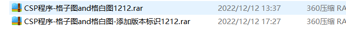

你到底想成为一个什么样的人？

专业通识知识：

硬件设备各方切入时间

1. 机械结构搭建
2. 电气结构搭建
3. 机械、电气联调确定没有问题
4. 嵌入式烧录系统及模块接口
5. C++算法开发

DLP打印

涉及部分：

- 3D模型获取：3维扫描、模型设计

- 前处理：3D模型切片

- 打印：树脂材料、打印机

- 后处理：清洗、固化、上色（消费级）

- 产品使用体验（反馈，从而优化以上各个流程）

打印机部分：光机投光、机械主轴运动、电气控制、算法、工艺包

涉及：光学、机械结构、电气、算法（上位机、下位机）、工艺（系统工程师联系各个部分，将需求转化成可实现落地的技术方案）

全流程还涉及：材料开发、产品应用

## 光学：

主要和光机打交道

光机的主要参数：

价格：决定产品的利润

供应商稳定性：决定之后产品生产的稳定性

性能参数：

波长：树脂打印材料的合适波长

精度（幅面大小、分辨率）：设定光机的投图幅面物理尺寸后（mm），根据光机的分辨率，就知道单个像素的物理大小

对比度：

- 静态对比度：投全幅面白图和黑图，白图光强/黑图光强，越大越好，
- 动态对比度：投棋盘格图，棋盘格图中**所有白图区域光强之和** / 棋盘格图中**所有黑图区域光强之和**

均匀度：幅面越均匀，打印时投出来的光在幅面各个位置是相同光强，对打印质量有保证

PT曲线：光功率稳定性

PI曲线：是否满足打印光强要求、是否有相关关系（根据光强设置电流）

温升

清晰度

## 机械结构：

外观美观：需有ID需求

保护内部：考虑电路板大小，硬件电气确定后才能确定结构

结构设计、实现运动功能：功能需求，需要了解主要产品参数，例如电机、泵等关键参数

3维、2维制图：形态及产品加工

开模：开模修模，周期两个月

加工方式：

- 注塑件
- 压铸
- 冲压
- 失蜡铸造
- 铝挤
- 模切
- 吹塑
- 吸塑

## 电气：

电子元器件，实现控制功能

根据电压、电流要求，设计电路？

电路设计

## 算法：

上位机：控制命令

下位机：执行，比如电机运转，上位机发送指令给下位机，下位机按照指令运动后，再返回结果给上位机

发送命令控制设备

面向操作者

- 前端：界面展示

- 后端：数据处理

## 工艺：

总结打印经验，使用最优方式控制打印过程

为设备参数提供标准

主要是两部分：

1. 工艺策略开发
2. 产品测试验证优化

**工艺策略开发**：比如**M值工艺包**，考虑的是投影截面的复杂程度（截面中实体的数量、距离），而不是截面占比，对打印效率有提升；比如底板策略，抛弃原本的底板层统一使用最安全的打印策略，而选用既可靠、又高效的打印策略

**产品设备测试验证优化**：比如消费级设备测试验证，观察打印件的打印质量；自动校准模块

- 全流程工艺调试
- 

## 应用：

齿科应用：

固定

活动

种植

正畸

## 生产

预研——小批量——量产

预研：

- 成果：预研机

测试

- 硬件测试
- 老化测试

预研转产品的衔接问题：

- 标准制定

- 检验治具

小批量：

EVT : Engineering Verification Test (工程驗證測試階段)

DVT: Design Verification Test (設計驗證測試階段)

PVT: Production Verification Test(生產驗證測試階段)

- DVT1

- DVT2

量产

## 项目：

在现有生产要素的基础上，利用自己的能力，在指定的时间内，达成目标，才算完成项目

项目需求：最后呈现的结果，满足什么指标才算结束，对整个项目如此，将整个项目拆分成子模块，也是如此，确定好各子模块的需求，各领域工程师才能根据需求完成，所以**学会拆分**

项目资源：

- 人力资源：项目团队
  - 项目经理
  - SE
  - 各领域工程师
  - 项目工程师：物料、沟通各方等细节问题

项目时间：

范围、资源

项目需求、资源

CS自动标定、消费级均匀性校准、来料检验

系统工程师：

对整个项目的技术模块非常清楚，机械、算法、光学工程师的需求都能明确，能不能做成，技术风险点在哪里，主要注意力放在技术风险点上。

项目经理：

推动项目前进，比项目成员都先走一步，项目成员做这一步时，能想到下一步，项目成员做下一步时，能想到下下一步。

基础信息：

- 算法：功能算法已开发，产品算法框架无

  - 标定板和投图的摆放关系
  - 关键：**受辅助平行光源影响极大**
  - 相机镜头能接受的高度范围
  - 待拍照幅面内辅助光均匀，光强合适：辅助平行光源摆放要求
  - 想象成一个黑匣子，输入数据，获得想要的结果
  - 找到算法的边界：
    - 在最差的输入数据下，算法结果是什么样的
    - 在最好的输入数据下，算法结果是什么样的
  - 程序运行平台：

- 机械：
  - 高度：如何放入设备，如何保证相机取图的清晰度
    - 工业相机的技术参数
      - 多大高度，确定多大幅面
  - 幅面中心与相机中心对齐
    - 机械微调结构
  - 机械结构固定的平行度要求
  - 稳定平行光源，不受影响
- 光学：
  - 工业相机：
    - **了解相机参数**
    
      - 分辨率（Resolution）：相机每次采集图像的像素点数（Pixels），对于数字相机一般是直接与[光电传感器](https://baike.baidu.com/item/光电传感器/8716436?fromModule=lemma_inlink)的像元数对应的，对于模拟相机则是取决于视频制式，[PAL](https://baike.baidu.com/item/PAL/31344?fromModule=lemma_inlink)制为768*576，[NTSC](https://baike.baidu.com/item/NTSC?fromModule=lemma_inlink)制为640*480，模拟相机已经逐步被数字相机代替，且分辨率已经达到6576*4384。
      - [像素深度](https://baike.baidu.com/item/像素深度?fromModule=lemma_inlink)（Pixel Depth）：即每像素数据的位数，一般常用的是8Bit，对于数字相机机一般还会有10Bit、12Bit、14Bit等。
      - 最大[帧率](https://baike.baidu.com/item/帧率?fromModule=lemma_inlink)（Frame Rate）/[行频](https://baike.baidu.com/item/行频?fromModule=lemma_inlink)（Line Rate）：相机采集传输图像的速率，对于面阵相机一般为每秒采集的[帧数](https://baike.baidu.com/item/帧数?fromModule=lemma_inlink)（Frames/Sec.），对于线阵相机为每秒采集的行数（Lines/Sec.）。
      - 曝光方式（Exposure）和[快门](https://baike.baidu.com/item/快门?fromModule=lemma_inlink)速度（Shutter）：对于线阵相机都是逐行曝光的方式，可以选择固定行频和外触发同步的采集方式，曝光时间可以与行周期一致，也可以设定一个固定的时间；面阵相机有帧曝光、场曝光和滚动行曝光等几种常见方式，数字相机一般都提供外触发采图的功能。快门速度一般可到10微秒，[高速相机](https://baike.baidu.com/item/高速相机?fromModule=lemma_inlink)还可以更快。
      - 像元尺寸（Pixel Size）：像元大小和像元数（分辨率）共同决定了相机靶面的大小。数字相机像元尺寸为3μm~10μm，一般像元尺寸越小，制造难度越大，图像质量也越不容易提高。
      - [光谱响应](https://baike.baidu.com/item/光谱响应?fromModule=lemma_inlink)特性（Spectral Range）：是指该像元传感器对不同光波的敏感特性，一般响应范围是350nm－1000nm，一些相机在靶面前加了一个滤镜，滤除红外光线，如果系统需要对红外感光时可去掉该滤镜。 [1] 
    
      - 接口类型：有Camera Link接口，以太网接口，[1394接口](https://baike.baidu.com/item/1394接口/188595?fromModule=lemma_inlink)、USB接口输出，目前最新的接口有CoaXPress接口。
      - **景深**（英语：Depth of field, DOF）景深是指相机对焦点前后相对清晰的成像范围
    - 可能存在像素数量不够的缺点
    - 自身畸变校正
  - 消费级相机经测试，最好的误差也有0.75个像素
  - 辅助平行光源
  
- 机械结构和光学器件保证输入的数据理想，喂给算法好的数据，才能得到想要的结果

  - 找到输入数据的边界：
    - 最好的输入数据是什么样的
      - 机械安装位置及结构+辅助光源+工业相机

    - 最差的输入数据是什么样的

项目团队：项目团队成员的分工，边界

- 项目工程师：沟通、协调
- 光学工程师
- 算法工程师
- 机械工程师
- 硬件工程师：硬件选型（如电子元器件，显示器，主机等）
- 电气工程师：接线
- 工艺工程师：协助打印进行原型设计的机械结构件，结果

项目进度：04.01 - 09.30

- 项目进度是什么样的，为什么这样？
  - 6个月
  - 确定可行性方案（基于多方案进行讨论评审确定）、技术路线
    - 多花点时间在选择上面，只有选择正确，后面才能做正确，否则会错得更多
    - 打样测试，要抓住关键技术点做选择测试，不是盲目测试
  - 确定概要设计方案（立项）
    - 将技术路线的可行性方案拆解成各专业工程师领域的可行性方案，对他们提出需求，并输出文档
  - 详细方案开发
    - 注意一定把握主线，把全流程先跑通，然后进行各部分优化
      - 比如软件：先开发出主要功能，合并兼容的功能等之后合并
    - 提前分辨出卡住全流程问题的点、提前分辨解决、防止卡住全流程
  - 全流程测试验证
    - 和标定机比对
    - 打印十字件（能否去掉该步骤）
  - 批量测试验证
    - 批量测试才能找到数据规律，准确性及稳定性
    - 理清楚各个测量部件的数量、状态，用的时候随时找到，可用
    - 协调批量设备（根据可测量部件套数、可协调到的人力、使用天数）
- 如何把握项目进度？
  - 每周和上级沟通一次、同步节点、资源和风险
  - 每周通报一次项目周报
    - 注意技术细节保密
    - 抄送：项目成员、产品经理、项目经理、（研发总监、产品总监）
    - 本周时间节点：
      - 人力资源流
      - 项目时间节点流
      - 项目任务流
      - 人——时间——什么事
    - 下周任务

和骏哥每周沟通一次，沟通整体进度、风险、需求

1. 系统性的技术思维
   - 技术链流
   - 最后数据是否符合方案技术路线
2. 加强沟通
   - 找谁沟通
   - 沟通什么
   - 外部资源
3. 项目管理
   - 项目范围
   - 时间节点
   - 团队的明确分工

出现客诉问题如何快速响应？

- 平时做好生产记录
  - 各个物料对应的批次编号

找谁做？

怎么做？

抓住完成事情的主线，尽全力先想清楚如何跑通全流程，关键点在哪些地方，全流程无法跑通的风险点在什么地方，一步一步分析，只做自己职责范围内的事情，如果做了其他事情

- 其他人速度太慢了，他们有时候不在电脑旁边，不能及时获得数据
- 他们提供的数据不全

量化：不要用抽象词汇（如好，坏，多，少来描述，直接用数据来描述）

工程学思维：向小看

- 列清单：将事情列出来
- 排优先级：将清单事情排优先级，只处理优先级最高的事情

系统学思维：向大看

- 抓住最主要的事情，其他事情忽略掉

产品经理确定流程：

- 软件开发——软件测试——工艺验证

做标注的时候要想想之后再看的时候能否想起到底是用哪一个

例如，

下次到底用哪个程序，就不清楚了

