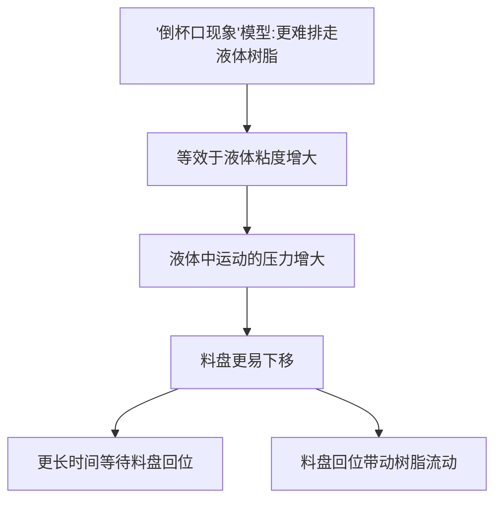

倒杯口问题

**现象：**

在打印过程中，随着打印模型轮廓不断生成，当达到一个临界位置，从此层开始，成型平台运动到接近料盘的指定层厚时，此时曝光，液态树脂变成固体后，打印的模型和料盘表面形成密封腔体

要打印的模型：


过程：


此时中心的腔体和料盘就会组成密封腔体


**导致的问题：**

Stefan公式：两个平行固体圆盘在液体中相对移动的受力情况


$\eta$：粘度

$R$：圆盘半径

$h$：距离高度

$dh/dt$：移动速度


$$
F \propto \frac{\eta R^4} {h^3} \frac{dh}{dt}
$$




打印模型出现倒杯口现象后，此时当模型向下运动，产生这种现象的模型相比不产生这种现象的模型更难将树脂液体排走，等效于液体的粘度增大，此时液体对料盘的作用力会增大，更容易压动料盘下移，从而在曝光前需要更长的等待时间等待料盘上移至指定打印层厚，若此时就曝光，就会导致层厚偏厚。同时，料盘上移又会带动树脂流动，流动的树脂也需要等待时间达到稳定静止状态，如若在树脂未达到稳定静置状态曝光，打印出来的模型表面质量会明显变差。


不仅仅是出现倒杯口现象的模型，任何模型，增加了平台在树脂中的运动时产生的压力，而等待时间又不够的话，都会对打印件表面质量造成影响


**解决办法：**

- 减弱平台在树脂中运动产生的压力
- 增加树脂恢复稳定的时间


- 减弱平台在树脂中运动产生的压力
  - 降低粘度（1. 换低粘度树脂；2. 促进排液——模型开孔）
  - 减小模型接触半径（1. 小尺寸模型；2. 整版模型个数减少）
  - 降低平台运动速度


- 增加树脂恢复稳定的时间
  - 增加等待时间


满版全颌面实心牙模打孔后的力值曲线


6.313/0.05 = 126层


12.851/0.05 = 257层


126-257层出现倒杯口

 


满版全颌面牙模，未打孔，存在倒杯口效应

第200层

```c++
[2022-04-25 16:27:38.149] [TRACE] [ProjectCtrl] [exposure][time]: 1562
[2022-04-25 16:27:38.149] [TRACE] [Projector] LedOff
[2022-04-25 16:27:38.150] [TRACE] [Ddp442x] setLedOnOff
[2022-04-25 16:27:38.150] [TRACE] [Ddp442xApi] GpioOpen
[2022-04-25 16:27:38.150] [TRACE] [Ddp442xApi] OpenWithRetry interfacenum: 2 , pre2retry: 3
[2022-04-25 16:27:38.150] [TRACE] SetLedOnOff
[2022-04-25 16:27:38.151] [TRACE] [ProjectorInterface] close_led success
[2022-04-25 16:27:38.151] [DEBUG] [Projector] LedOff result: no support
[2022-04-25 16:27:38.204] [DEBUG] begin SyncPeel
[2022-04-25 16:27:38.204] [TRACE] OnEnviromentCheck 57 data: QMap(("Projector", QVariant(bool, true))("Screen", QVariant(bool, true)))
[2022-04-25 16:27:38.204] [TRACE] - 200 - [exposure][time] 1619 [exposure][offset time] 119
[2022-04-25 16:27:38.205] [TRACE] command: "ac100118ff00000400000001d227acdc"
[2022-04-25 16:27:38.205] [DEBUG] [ "4K实心全颌面牙模S.ult" ] step: PrintCtrl::PrintStep(Peeling)
[2022-04-25 16:27:38.240] [DEBUG] NotifyComm 通訊返回 "ac100118ff00000400000001d227acdc"
[2022-04-25 16:27:38.313] [TRACE] Slave State change:  "ES-0 OPR-0 OPL-0 NP-1 ZT-0 ZB-0 ZS-0 ZR-0 ZZ-1 ZP-1 CAU-1 CAL-0 CGU-1 CGD-0 TL-1 CAE-0 ZAE-0 SP-1 ST-0 HES-1"  | F- "-42.70"
[2022-04-25 16:27:38.514] [TRACE] Slave State change:  "ES-0 OPR-0 OPL-0 NP-0 ZT-0 ZB-0 ZS-0 ZR-0 ZZ-1 ZP-1 CAU-1 CAL-0 CGU-1 CGD-0 TL-1 CAE-0 ZAE-0 SP-1 ST-0 HES-1"  | F- "52.40"
[2022-04-25 16:27:43.068] [TRACE] slave:
[2022-04-25 16:27:43.069] [TRACE] 	 |--- plateform: 1
[2022-04-25 16:27:43.069] [TRACE] 	 |--- force: -0.7
[2022-04-25 16:27:43.069] [TRACE] 	 |--- temp: 26.1
[2022-04-25 16:27:43.069] [TRACE] 	 |--- humidity: 66.61
[2022-04-25 16:27:43.069] [TRACE] heaint:
[2022-04-25 16:27:43.069] [TRACE] 	 |--- temp: 24.93
[2022-04-25 16:27:43.118] [TRACE] PublishMsgProcess 675 msgkey: "1002"
[2022-04-25 16:27:43.571] [WARN] QModbusDevice::Error(TimeoutError) "Response timeout."
[2022-04-25 16:27:49.634] [TRACE] exe result: "ZAXIS->SEGMENTED_MOTION" "COMMAND_SUCCESS"
[2022-04-25 16:27:49.635] [DEBUG] end SyncPeel
[2022-04-25 16:27:49.635] [TRACE] Escape 0 1376520
[2022-04-25 16:27:49.635] [DEBUG] begin SyncPeel
[2022-04-25 16:27:49.636] [TRACE] command: "ac100118ff00000400000002d367acdc"
[2022-04-25 16:27:49.654] [DEBUG] discard slave return result 
[2022-04-25 16:27:49.672] [DEBUG] discard slave return result 
[2022-04-25 16:27:49.691] [DEBUG] NotifyComm 通訊返回 "ac100118ff00000400000002d367acdc"
[2022-04-25 16:27:51.713] [TRACE] Slave State change:  "ES-0 OPR-0 OPL-0 NP-1 ZT-0 ZB-0 ZS-0 ZR-0 ZZ-1 ZP-1 CAU-1 CAL-0 CGU-1 CGD-0 TL-1 CAE-0 ZAE-0 SP-1 ST-0 HES-1"  | F- "-10.50"
[2022-04-25 16:27:51.813] [TRACE] Slave State change:  "ES-0 OPR-0 OPL-0 NP-0 ZT-0 ZB-0 ZS-0 ZR-0 ZZ-1 ZP-1 CAU-1 CAL-0 CGU-1 CGD-0 TL-1 CAE-0 ZAE-0 SP-1 ST-0 HES-1"  | F- "-7.10"
[2022-04-25 16:27:52.113] [TRACE] Slave State change:  "ES-0 OPR-0 OPL-0 NP-1 ZT-0 ZB-0 ZS-0 ZR-0 ZZ-1 ZP-1 CAU-1 CAL-0 CGU-1 CGD-0 TL-1 CAE-0 ZAE-0 SP-1 ST-0 HES-1"  | F- "-11.70"
[2022-04-25 16:27:52.313] [TRACE] Slave State change:  "ES-0 OPR-0 OPL-0 NP-0 ZT-0 ZB-0 ZS-0 ZR-0 ZZ-1 ZP-1 CAU-1 CAL-0 CGU-1 CGD-0 TL-1 CAE-0 ZAE-0 SP-1 ST-0 HES-1"  | F- "-7.00"
[2022-04-25 16:27:52.813] [TRACE] Slave State change:  "ES-0 OPR-0 OPL-0 NP-1 ZT-0 ZB-0 ZS-0 ZR-0 ZZ-1 ZP-1 CAU-1 CAL-0 CGU-1 CGD-0 TL-1 CAE-0 ZAE-0 SP-1 ST-0 HES-1"  | F- "-11.60"
[2022-04-25 16:27:53.068] [TRACE] slave:
[2022-04-25 16:27:53.068] [TRACE] 	 |--- force: -16.5
[2022-04-25 16:27:53.068] [TRACE] 	 |--- temp: 26.13
[2022-04-25 16:27:53.069] [TRACE] 	 |--- humidity: 66.67
[2022-04-25 16:27:53.069] [TRACE] heaint:
[2022-04-25 16:27:53.069] [TRACE] 	 |--- temp: 24.52
[2022-04-25 16:27:53.136] [TRACE] PublishMsgProcess 675 msgkey: "1002"
[2022-04-25 16:27:54.775] [TRACE] exe result: "ZAXIS->SEGMENTED_MOTION" "COMMAND_SUCCESS"
[2022-04-25 16:27:54.775] [DEBUG] end SyncPeel
[2022-04-25 16:27:54.776] [TRACE] Escape 0 1376520
[2022-04-25 16:27:54.777] [TRACE] [PrintCtrl] peel up: Curlayer: 200 Number: "13"
[2022-04-25 16:27:54.778] [TRACE] [PrintCtrl] speed[0]: 600, distance[0]: 1200
[2022-04-25 16:27:54.779] [TRACE] [PrintCtrl] speed[1]: 300, distance[1]: 3400
[2022-04-25 16:27:54.780] [TRACE] [PrintCtrl] speed[2]: 2000, distance[2]: 4400
[2022-04-25 16:27:54.780] [TRACE] [PrintCtrl] speed[3]: 6000, distance[3]: 12900
[2022-04-25 16:27:54.781] [TRACE] [PrintCtrl] speed[4]: 6000, distance[4]: 12900
[2022-04-25 16:27:54.781] [TRACE] [PrintCtrl] peel down: Curlayer: 200 Number: "13"
[2022-04-25 16:27:54.781] [TRACE] [PrintCtrl] speed[0]: 6000, distance[0]: -8850
[2022-04-25 16:27:54.782] [TRACE] [PrintCtrl] speed[1]: 4000, distance[1]: -10850
[2022-04-25 16:27:54.782] [TRACE] [PrintCtrl] speed[2]: 2000, distance[2]: -11850
[2022-04-25 16:27:54.783] [TRACE] [PrintCtrl] speed[3]: 500, distance[3]: -12650
[2022-04-25 16:27:54.783] [TRACE] [PrintCtrl] speed[4]: 200, distance[4]: -12850
[2022-04-25 16:27:54.783] [TRACE] - 200 - [peel][time] 16573 [peel][offset time] 249
[2022-04-25 16:27:54.784] [DEBUG] [ "4K实心全颌面牙模S.ult" ] step: PrintCtrl::PrintStep(Waiting)
[2022-04-25 16:27:54.838] [TRACE] Slave State change:  "ES-0 OPR-0 OPL-0 NP-1 ZT-0 ZB-0 ZS-1 ZR-0 ZZ-1 ZP-0 CAU-1 CAL-0 CGU-1 CGD-0 TL-1 CAE-0 ZAE-0 SP-1 ST-0 HES-1"  | F- "-100.80"
[2022-04-25 16:27:55.571] [WARN] QModbusDevice::Error(TimeoutError) "Response timeout."
[2022-04-25 16:28:03.068] [TRACE] slave:
[2022-04-25 16:28:03.068] [TRACE] 	 |--- plateform: -1
[2022-04-25 16:28:03.068] [TRACE] 	 |--- force: -44.3
[2022-04-25 16:28:03.068] [TRACE] 	 |--- temp: 26.17
[2022-04-25 16:28:03.068] [TRACE] 	 |--- humidity: 66.82
[2022-04-25 16:28:03.068] [TRACE] heaint:
[2022-04-25 16:28:03.068] [TRACE] 	 |--- temp: 24.93
[2022-04-25 16:28:03.151] [TRACE] PublishMsgProcess 675 msgkey: "1002"
[2022-04-25 16:28:04.277] [TRACE] - 200 - [wait][time] 9500 [wait][offset time] 0
[2022-04-25 16:28:04.278] [TRACE]  ====== Begin Read Model  201 `th Loop ====== 
[2022-04-25 16:28:04.278] [DEBUG] [ "4K实心全颌面牙模S.ult" ] layer done
[2022-04-25 16:28:04.278] [TRACE] UpdateTimecost >>>  3107097 8937 -315  remain layers:  331
[2022-04-25 16:28:04.278] [DEBUG] ReadModel 291
[2022-04-25 16:28:04.279] [DEBUG] the buffer is not Empty
[2022-04-25 16:28:04.279] [DEBUG] [ "4K实心全颌面牙模S.ult" ] step: PrintCtrl::PrintStep(Preprocessing)
[2022-04-25 16:28:04.279] [DEBUG] Read Model Parser Finished!
```


126-257层：

```c++
	行 54926: [2022-04-25 15:55:03.036] [DEBUG] [ "4K实心全颌面牙模S.ult" ] layer start: 126 / 531
	行 55054: [2022-04-25 15:55:30.788] [DEBUG] [ "4K实心全颌面牙模S.ult" ] layer start: 127 / 531
	行 55181: [2022-04-25 15:55:51.093] [DEBUG] [ "4K实心全颌面牙模S.ult" ] layer start: 128 / 531
	行 55309: [2022-04-25 15:56:18.784] [DEBUG] [ "4K实心全颌面牙模S.ult" ] layer start: 129 / 531
	行 55441: [2022-04-25 15:56:46.486] [DEBUG] [ "4K实心全颌面牙模S.ult" ] layer start: 130 / 531
	行 55567: [2022-04-25 15:57:14.184] [DEBUG] [ "4K实心全颌面牙模S.ult" ] layer start: 131 / 531
	行 55690: [2022-04-25 15:57:41.884] [DEBUG] [ "4K实心全颌面牙模S.ult" ] layer start: 132 / 531
	行 55819: [2022-04-25 15:58:09.618] [DEBUG] [ "4K实心全颌面牙模S.ult" ] layer start: 133 / 531
	行 55954: [2022-04-25 15:58:37.297] [DEBUG] [ "4K实心全颌面牙模S.ult" ] layer start: 134 / 531
	行 56090: [2022-04-25 15:59:04.984] [DEBUG] [ "4K实心全颌面牙模S.ult" ] layer start: 135 / 531
	行 56210: [2022-04-25 15:59:32.682] [DEBUG] [ "4K实心全颌面牙模S.ult" ] layer start: 136 / 531
	行 56338: [2022-04-25 16:00:00.382] [DEBUG] [ "4K实心全颌面牙模S.ult" ] layer start: 137 / 531
	行 56474: [2022-04-25 16:00:28.081] [DEBUG] [ "4K实心全颌面牙模S.ult" ] layer start: 138 / 531
	行 56605: [2022-04-25 16:00:55.783] [DEBUG] [ "4K实心全颌面牙模S.ult" ] layer start: 139 / 531
	行 56738: [2022-04-25 16:01:23.480] [DEBUG] [ "4K实心全颌面牙模S.ult" ] layer start: 140 / 531
	行 56865: [2022-04-25 16:01:51.147] [DEBUG] [ "4K实心全颌面牙模S.ult" ] layer start: 141 / 531
	行 56997: [2022-04-25 16:02:18.817] [DEBUG] [ "4K实心全颌面牙模S.ult" ] layer start: 142 / 531
	行 57130: [2022-04-25 16:02:46.496] [DEBUG] [ "4K实心全颌面牙模S.ult" ] layer start: 143 / 531
	行 57263: [2022-04-25 16:03:14.183] [DEBUG] [ "4K实心全颌面牙模S.ult" ] layer start: 144 / 531
	行 57397: [2022-04-25 16:03:41.879] [DEBUG] [ "4K实心全颌面牙模S.ult" ] layer start: 145 / 531
	行 57525: [2022-04-25 16:04:09.613] [DEBUG] [ "4K实心全颌面牙模S.ult" ] layer start: 146 / 531
	行 57648: [2022-04-25 16:04:29.929] [DEBUG] [ "4K实心全颌面牙模S.ult" ] layer start: 147 / 531
	行 57780: [2022-04-25 16:04:57.613] [DEBUG] [ "4K实心全颌面牙模S.ult" ] layer start: 148 / 531
	行 57918: [2022-04-25 16:05:25.299] [DEBUG] [ "4K实心全颌面牙模S.ult" ] layer start: 149 / 531
	行 58040: [2022-04-25 16:05:52.997] [DEBUG] [ "4K实心全颌面牙模S.ult" ] layer start: 150 / 531
	行 58170: [2022-04-25 16:06:20.677] [DEBUG] [ "4K实心全颌面牙模S.ult" ] layer start: 151 / 531
	行 58305: [2022-04-25 16:06:48.346] [DEBUG] [ "4K实心全颌面牙模S.ult" ] layer start: 152 / 531
	行 58432: [2022-04-25 16:07:08.666] [DEBUG] [ "4K实心全颌面牙模S.ult" ] layer start: 153 / 531
	行 58556: [2022-04-25 16:07:28.976] [DEBUG] [ "4K实心全颌面牙模S.ult" ] layer start: 154 / 531
	行 58682: [2022-04-25 16:07:49.313] [DEBUG] [ "4K实心全颌面牙模S.ult" ] layer start: 155 / 531
	行 58809: [2022-04-25 16:08:17.011] [DEBUG] [ "4K实心全颌面牙模S.ult" ] layer start: 156 / 531
	行 58945: [2022-04-25 16:08:44.770] [DEBUG] [ "4K实心全颌面牙模S.ult" ] layer start: 157 / 531
	行 59070: [2022-04-25 16:09:05.094] [DEBUG] [ "4K实心全颌面牙模S.ult" ] layer start: 158 / 531
	行 59195: [2022-04-25 16:09:25.409] [DEBUG] [ "4K实心全颌面牙模S.ult" ] layer start: 159 / 531
	行 59328: [2022-04-25 16:09:53.112] [DEBUG] [ "4K实心全颌面牙模S.ult" ] layer start: 160 / 531
	行 59448: [2022-04-25 16:10:20.809] [DEBUG] [ "4K实心全颌面牙模S.ult" ] layer start: 161 / 531
	行 59580: [2022-04-25 16:10:48.509] [DEBUG] [ "4K实心全颌面牙模S.ult" ] layer start: 162 / 531
	行 59704: [2022-04-25 16:11:08.809] [DEBUG] [ "4K实心全颌面牙模S.ult" ] layer start: 163 / 531
	行 59834: [2022-04-25 16:11:36.508] [DEBUG] [ "4K实心全颌面牙模S.ult" ] layer start: 164 / 531
	行 59961: [2022-04-25 16:12:04.206] [DEBUG] [ "4K实心全颌面牙模S.ult" ] layer start: 165 / 531
	行 60089: [2022-04-25 16:12:31.907] [DEBUG] [ "4K实心全颌面牙模S.ult" ] layer start: 166 / 531
	行 60220: [2022-04-25 16:12:59.604] [DEBUG] [ "4K实心全颌面牙模S.ult" ] layer start: 167 / 531
	行 60351: [2022-04-25 16:13:27.275] [DEBUG] [ "4K实心全颌面牙模S.ult" ] layer start: 168 / 531
	行 60486: [2022-04-25 16:13:54.959] [DEBUG] [ "4K实心全颌面牙模S.ult" ] layer start: 169 / 531
	行 60613: [2022-04-25 16:14:22.657] [DEBUG] [ "4K实心全颌面牙模S.ult" ] layer start: 170 / 531
	行 60747: [2022-04-25 16:14:50.301] [DEBUG] [ "4K实心全颌面牙模S.ult" ] layer start: 171 / 531
	行 60874: [2022-04-25 16:15:10.626] [DEBUG] [ "4K实心全颌面牙模S.ult" ] layer start: 172 / 531
	行 60996: [2022-04-25 16:15:38.298] [DEBUG] [ "4K实心全颌面牙模S.ult" ] layer start: 173 / 531
	行 61128: [2022-04-25 16:16:05.998] [DEBUG] [ "4K实心全颌面牙模S.ult" ] layer start: 174 / 531
	行 61264: [2022-04-25 16:16:33.756] [DEBUG] [ "4K实心全颌面牙模S.ult" ] layer start: 175 / 531
	行 61391: [2022-04-25 16:17:01.454] [DEBUG] [ "4K实心全颌面牙模S.ult" ] layer start: 176 / 531
	行 61524: [2022-04-25 16:17:29.155] [DEBUG] [ "4K实心全颌面牙模S.ult" ] layer start: 177 / 531
	行 61658: [2022-04-25 16:17:56.855] [DEBUG] [ "4K实心全颌面牙模S.ult" ] layer start: 178 / 531
	行 61795: [2022-04-25 16:18:24.594] [DEBUG] [ "4K实心全颌面牙模S.ult" ] layer start: 179 / 531
	行 61916: [2022-04-25 16:18:52.260] [DEBUG] [ "4K实心全颌面牙模S.ult" ] layer start: 180 / 531
	行 62055: [2022-04-25 16:19:19.955] [DEBUG] [ "4K实心全颌面牙模S.ult" ] layer start: 181 / 531
	行 62188: [2022-04-25 16:19:47.651] [DEBUG] [ "4K实心全颌面牙模S.ult" ] layer start: 182 / 531
	行 62320: [2022-04-25 16:20:15.309] [DEBUG] [ "4K实心全颌面牙模S.ult" ] layer start: 183 / 531
	行 62444: [2022-04-25 16:20:35.603] [DEBUG] [ "4K实心全颌面牙模S.ult" ] layer start: 184 / 531
	行 62573: [2022-04-25 16:21:03.288] [DEBUG] [ "4K实心全颌面牙模S.ult" ] layer start: 185 / 531
	行 62702: [2022-04-25 16:21:30.968] [DEBUG] [ "4K实心全颌面牙模S.ult" ] layer start: 186 / 531
	行 62827: [2022-04-25 16:21:51.290] [DEBUG] [ "4K实心全颌面牙模S.ult" ] layer start: 187 / 531
	行 62956: [2022-04-25 16:22:18.986] [DEBUG] [ "4K实心全颌面牙模S.ult" ] layer start: 188 / 531
	行 63090: [2022-04-25 16:22:46.666] [DEBUG] [ "4K实心全颌面牙模S.ult" ] layer start: 189 / 531
	行 63224: [2022-04-25 16:23:14.349] [DEBUG] [ "4K实心全颌面牙模S.ult" ] layer start: 190 / 531
	行 63349: [2022-04-25 16:23:34.648] [DEBUG] [ "4K实心全颌面牙模S.ult" ] layer start: 191 / 531
	行 63474: [2022-04-25 16:24:02.340] [DEBUG] [ "4K实心全颌面牙模S.ult" ] layer start: 192 / 531
	行 63606: [2022-04-25 16:24:30.048] [DEBUG] [ "4K实心全颌面牙模S.ult" ] layer start: 193 / 531
	行 63737: [2022-04-25 16:24:57.740] [DEBUG] [ "4K实心全颌面牙模S.ult" ] layer start: 194 / 531
	行 63864: [2022-04-25 16:25:25.440] [DEBUG] [ "4K实心全颌面牙模S.ult" ] layer start: 195 / 531
	行 63995: [2022-04-25 16:25:53.139] [DEBUG] [ "4K实心全颌面牙模S.ult" ] layer start: 196 / 531
	行 64120: [2022-04-25 16:26:20.814] [DEBUG] [ "4K实心全颌面牙模S.ult" ] layer start: 197 / 531
	行 64254: [2022-04-25 16:26:48.514] [DEBUG] [ "4K实心全颌面牙模S.ult" ] layer start: 198 / 531
	行 64388: [2022-04-25 16:27:16.213] [DEBUG] [ "4K实心全颌面牙模S.ult" ] layer start: 199 / 531
	行 64512: [2022-04-25 16:27:36.585] [DEBUG] [ "4K实心全颌面牙模S.ult" ] layer start: 200 / 531 这个时间是在开始曝光的时候，接着开始剥离
        16:27:42开始较好
	行 64645: [2022-04-25 16:28:04.281] [DEBUG] [ "4K实心全颌面牙模S.ult" ] layer start: 201 / 531
	行 64764: [2022-04-25 16:28:31.982] [DEBUG] [ "4K实心全颌面牙模S.ult" ] layer start: 202 / 531
	行 64896: [2022-04-25 16:28:59.732] [DEBUG] [ "4K实心全颌面牙模S.ult" ] layer start: 203 / 531
	行 65028: [2022-04-25 16:29:27.436] [DEBUG] [ "4K实心全颌面牙模S.ult" ] layer start: 204 / 531
	行 65161: [2022-04-25 16:29:55.133] [DEBUG] [ "4K实心全颌面牙模S.ult" ] layer start: 205 / 531
	行 65287: [2022-04-25 16:30:22.785] [DEBUG] [ "4K实心全颌面牙模S.ult" ] layer start: 206 / 531
	行 65415: [2022-04-25 16:30:43.098] [DEBUG] [ "4K实心全颌面牙模S.ult" ] layer start: 207 / 531
	行 65541: [2022-04-25 16:31:10.778] [DEBUG] [ "4K实心全颌面牙模S.ult" ] layer start: 208 / 531
	行 65665: [2022-04-25 16:31:31.082] [DEBUG] [ "4K实心全颌面牙模S.ult" ] layer start: 209 / 531
	行 65783: [2022-04-25 16:31:51.383] [DEBUG] [ "4K实心全颌面牙模S.ult" ] layer start: 210 / 531
	行 65915: [2022-04-25 16:32:19.082] [DEBUG] [ "4K实心全颌面牙模S.ult" ] layer start: 211 / 531
	行 66045: [2022-04-25 16:32:46.789] [DEBUG] [ "4K实心全颌面牙模S.ult" ] layer start: 212 / 531
	行 66177: [2022-04-25 16:33:14.495] [DEBUG] [ "4K实心全颌面牙模S.ult" ] layer start: 213 / 531
	行 66298: [2022-04-25 16:33:42.168] [DEBUG] [ "4K实心全颌面牙模S.ult" ] layer start: 214 / 531
	行 66425: [2022-04-25 16:34:09.882] [DEBUG] [ "4K实心全颌面牙模S.ult" ] layer start: 215 / 531
	行 66556: [2022-04-25 16:34:37.568] [DEBUG] [ "4K实心全颌面牙模S.ult" ] layer start: 216 / 531
	行 66686: [2022-04-25 16:35:05.234] [DEBUG] [ "4K实心全颌面牙模S.ult" ] layer start: 217 / 531
	行 66811: [2022-04-25 16:35:25.562] [DEBUG] [ "4K实心全颌面牙模S.ult" ] layer start: 218 / 531
	行 66936: [2022-04-25 16:35:45.866] [DEBUG] [ "4K实心全颌面牙模S.ult" ] layer start: 219 / 531
	行 67066: [2022-04-25 16:36:13.559] [DEBUG] [ "4K实心全颌面牙模S.ult" ] layer start: 220 / 531
	行 67192: [2022-04-25 16:36:33.878] [DEBUG] [ "4K实心全颌面牙模S.ult" ] layer start: 221 / 531
	行 67310: [2022-04-25 16:36:54.181] [DEBUG] [ "4K实心全颌面牙模S.ult" ] layer start: 222 / 531
	行 67440: [2022-04-25 16:37:21.895] [DEBUG] [ "4K实心全颌面牙模S.ult" ] layer start: 223 / 531
	行 67563: [2022-04-25 16:37:49.577] [DEBUG] [ "4K实心全颌面牙模S.ult" ] layer start: 224 / 531
	行 67694: [2022-04-25 16:38:17.264] [DEBUG] [ "4K实心全颌面牙模S.ult" ] layer start: 225 / 531
	行 67815: [2022-04-25 16:38:37.559] [DEBUG] [ "4K实心全颌面牙模S.ult" ] layer start: 226 / 531
	行 67943: [2022-04-25 16:38:57.862] [DEBUG] [ "4K实心全颌面牙模S.ult" ] layer start: 227 / 531
	行 68057: [2022-04-25 16:39:18.161] [DEBUG] [ "4K实心全颌面牙模S.ult" ] layer start: 228 / 531
	行 68191: [2022-04-25 16:39:45.843] [DEBUG] [ "4K实心全颌面牙模S.ult" ] layer start: 229 / 531
	行 68321: [2022-04-25 16:40:13.559] [DEBUG] [ "4K实心全颌面牙模S.ult" ] layer start: 230 / 531
	行 68443: [2022-04-25 16:40:41.261] [DEBUG] [ "4K实心全颌面牙模S.ult" ] layer start: 231 / 531
	行 68574: [2022-04-25 16:41:08.940] [DEBUG] [ "4K实心全颌面牙模S.ult" ] layer start: 232 / 531
	行 68704: [2022-04-25 16:41:36.711] [DEBUG] [ "4K实心全颌面牙模S.ult" ] layer start: 233 / 531
	行 68834: [2022-04-25 16:42:04.363] [DEBUG] [ "4K实心全颌面牙模S.ult" ] layer start: 234 / 531
	行 68959: [2022-04-25 16:42:32.057] [DEBUG] [ "4K实心全颌面牙模S.ult" ] layer start: 235 / 531
	行 69087: [2022-04-25 16:42:59.728] [DEBUG] [ "4K实心全颌面牙模S.ult" ] layer start: 236 / 531
	行 69226: [2022-04-25 16:43:27.389] [DEBUG] [ "4K实心全颌面牙模S.ult" ] layer start: 237 / 531
	行 69363: [2022-04-25 16:43:55.060] [DEBUG] [ "4K实心全颌面牙模S.ult" ] layer start: 238 / 531
	行 69484: [2022-04-25 16:44:22.756] [DEBUG] [ "4K实心全颌面牙模S.ult" ] layer start: 239 / 531
	行 69609: [2022-04-25 16:44:43.074] [DEBUG] [ "4K实心全颌面牙模S.ult" ] layer start: 240 / 531
	行 69733: [2022-04-25 16:45:10.751] [DEBUG] [ "4K实心全颌面牙模S.ult" ] layer start: 241 / 531
	行 69861: [2022-04-25 16:45:38.453] [DEBUG] [ "4K实心全颌面牙模S.ult" ] layer start: 242 / 531
	行 69990: [2022-04-25 16:46:06.154] [DEBUG] [ "4K实心全颌面牙模S.ult" ] layer start: 243 / 531
	行 70114: [2022-04-25 16:46:26.445] [DEBUG] [ "4K实心全颌面牙模S.ult" ] layer start: 244 / 531
	行 70242: [2022-04-25 16:46:54.148] [DEBUG] [ "4K实心全颌面牙模S.ult" ] layer start: 245 / 531
	行 70364: [2022-04-25 16:47:21.844] [DEBUG] [ "4K实心全颌面牙模S.ult" ] layer start: 246 / 531
	行 70496: [2022-04-25 16:47:49.546] [DEBUG] [ "4K实心全颌面牙模S.ult" ] layer start: 247 / 531
	行 70623: [2022-04-25 16:48:17.244] [DEBUG] [ "4K实心全颌面牙模S.ult" ] layer start: 248 / 531
	行 70753: [2022-04-25 16:48:44.943] [DEBUG] [ "4K实心全颌面牙模S.ult" ] layer start: 249 / 531
	行 70877: [2022-04-25 16:49:12.705] [DEBUG] [ "4K实心全颌面牙模S.ult" ] layer start: 250 / 531
	行 71015: [2022-04-25 16:49:40.402] [DEBUG] [ "4K实心全颌面牙模S.ult" ] layer start: 251 / 531
	行 71145: [2022-04-25 16:50:08.064] [DEBUG] [ "4K实心全颌面牙模S.ult" ] layer start: 252 / 531
	行 71269: [2022-04-25 16:50:28.353] [DEBUG] [ "4K实心全颌面牙模S.ult" ] layer start: 253 / 531
	行 71399: [2022-04-25 16:50:43.636] [DEBUG] [ "4K实心全颌面牙模S.ult" ] layer start: 254 / 531
	行 71507: [2022-04-25 16:50:58.616] [DEBUG] [ "4K实心全颌面牙模S.ult" ] layer start: 255 / 531
	行 71630: [2022-04-25 16:51:13.603] [DEBUG] [ "4K实心全颌面牙模S.ult" ] layer start: 256 / 531
	行 71745: [2022-04-25 16:51:28.567] [DEBUG] [ "4K实心全颌面牙模S.ult" ] layer start: 257 / 531
```


选取倒杯口现象最大时的层数：181——245 = 65层


9.058/0.05 = 181层


11.537/0.05 = 231


12.243/0.05 = 245


```
	行 62055: [2022-04-25 16:19:19.955] [DEBUG] [ "4K实心全颌面牙模S.ult" ] layer start: 181 / 531
	....
	
	行 70242: [2022-04-25 16:46:54.148] [DEBUG] [ "4K实心全颌面牙模S.ult" ] layer start: 245 / 531
```


平均值：-106.10


未出现倒杯口层：56——120层 = 65层

2.731/0.05 = 56层


5.993/0.05 = 120层


```
	行 46005: [2022-04-25 15:23:35.439] [DEBUG] [ "4K实心全颌面牙模S.ult" ] layer start: 56 / 531
	行 46136: [2022-04-25 15:24:03.752] [DEBUG] [ "4K实心全颌面牙模S.ult" ] layer start: 57 / 531
	行 46262: [2022-04-25 15:24:28.105] [DEBUG] [ "4K实心全颌面牙模S.ult" ] layer start: 58 / 531
	行 46384: [2022-04-25 15:24:52.439] [DEBUG] [ "4K实心全颌面牙模S.ult" ] layer start: 59 / 531
	行 46517: [2022-04-25 15:25:20.703] [DEBUG] [ "4K实心全颌面牙模S.ult" ] layer start: 60 / 531
	行 46641: [2022-04-25 15:25:45.040] [DEBUG] [ "4K实心全颌面牙模S.ult" ] layer start: 61 / 531
	行 46772: [2022-04-25 15:26:13.351] [DEBUG] [ "4K实心全颌面牙模S.ult" ] layer start: 62 / 531
	行 46897: [2022-04-25 15:26:41.699] [DEBUG] [ "4K实心全颌面牙模S.ult" ] layer start: 63 / 531
	行 47025: [2022-04-25 15:27:09.934] [DEBUG] [ "4K实心全颌面牙模S.ult" ] layer start: 64 / 531
	行 47154: [2022-04-25 15:27:38.150] [DEBUG] [ "4K实心全颌面牙模S.ult" ] layer start: 65 / 531
	行 47278: [2022-04-25 15:28:02.453] [DEBUG] [ "4K实心全颌面牙模S.ult" ] layer start: 66 / 531
	行 47412: [2022-04-25 15:28:30.753] [DEBUG] [ "4K实心全颌面牙模S.ult" ] layer start: 67 / 531
	行 47541: [2022-04-25 15:28:59.034] [DEBUG] [ "4K实心全颌面牙模S.ult" ] layer start: 68 / 531
	行 47672: [2022-04-25 15:29:27.366] [DEBUG] [ "4K实心全颌面牙模S.ult" ] layer start: 69 / 531
	行 47800: [2022-04-25 15:29:55.633] [DEBUG] [ "4K实心全颌面牙模S.ult" ] layer start: 70 / 531
	行 47927: [2022-04-25 15:30:23.966] [DEBUG] [ "4K实心全颌面牙模S.ult" ] layer start: 71 / 531
	行 48050: [2022-04-25 15:30:52.332] [DEBUG] [ "4K实心全颌面牙模S.ult" ] layer start: 72 / 531
	行 48176: [2022-04-25 15:31:20.549] [DEBUG] [ "4K实心全颌面牙模S.ult" ] layer start: 73 / 531
	行 48303: [2022-04-25 15:31:48.886] [DEBUG] [ "4K实心全颌面牙模S.ult" ] layer start: 74 / 531
	行 48432: [2022-04-25 15:32:17.263] [DEBUG] [ "4K实心全颌面牙模S.ult" ] layer start: 75 / 531
	行 48564: [2022-04-25 15:32:45.584] [DEBUG] [ "4K实心全颌面牙模S.ult" ] layer start: 76 / 531
	行 48686: [2022-04-25 15:33:09.884] [DEBUG] [ "4K实心全颌面牙模S.ult" ] layer start: 77 / 531
	行 48813: [2022-04-25 15:33:34.260] [DEBUG] [ "4K实心全颌面牙模S.ult" ] layer start: 78 / 531
	行 48938: [2022-04-25 15:34:02.626] [DEBUG] [ "4K实心全颌面牙模S.ult" ] layer start: 79 / 531
	行 49071: [2022-04-25 15:34:31.027] [DEBUG] [ "4K实心全颌面牙模S.ult" ] layer start: 80 / 531
	行 49197: [2022-04-25 15:34:55.330] [DEBUG] [ "4K实心全颌面牙模S.ult" ] layer start: 81 / 531
	行 49328: [2022-04-25 15:35:23.544] [DEBUG] [ "4K实心全颌面牙模S.ult" ] layer start: 82 / 531
	行 49446: [2022-04-25 15:35:51.882] [DEBUG] [ "4K实心全颌面牙模S.ult" ] layer start: 83 / 531
	行 49576: [2022-04-25 15:36:20.093] [DEBUG] [ "4K实心全颌面牙模S.ult" ] layer start: 84 / 531
	行 49704: [2022-04-25 15:36:48.342] [DEBUG] [ "4K实心全颌面牙模S.ult" ] layer start: 85 / 531
	行 49830: [2022-04-25 15:37:16.691] [DEBUG] [ "4K实心全颌面牙模S.ult" ] layer start: 86 / 531
	行 49963: [2022-04-25 15:37:44.920] [DEBUG] [ "4K实心全颌面牙模S.ult" ] layer start: 87 / 531
	行 50090: [2022-04-25 15:38:09.257] [DEBUG] [ "4K实心全颌面牙模S.ult" ] layer start: 88 / 531
	行 50210: [2022-04-25 15:38:37.591] [DEBUG] [ "4K实心全颌面牙模S.ult" ] layer start: 89 / 531
	行 50341: [2022-04-25 15:39:05.826] [DEBUG] [ "4K实心全颌面牙模S.ult" ] layer start: 90 / 531
	行 50466: [2022-04-25 15:39:30.127] [DEBUG] [ "4K实心全颌面牙模S.ult" ] layer start: 91 / 531
	行 50589: [2022-04-25 15:39:58.474] [DEBUG] [ "4K实心全颌面牙模S.ult" ] layer start: 92 / 531
	行 50714: [2022-04-25 15:40:26.810] [DEBUG] [ "4K实心全颌面牙模S.ult" ] layer start: 93 / 531
	行 50843: [2022-04-25 15:40:55.180] [DEBUG] [ "4K实心全颌面牙模S.ult" ] layer start: 94 / 531
	行 50971: [2022-04-25 15:41:23.408] [DEBUG] [ "4K实心全颌面牙模S.ult" ] layer start: 95 / 531
	行 51093: [2022-04-25 15:41:51.708] [DEBUG] [ "4K实心全颌面牙模S.ult" ] layer start: 96 / 531
	行 51219: [2022-04-25 15:42:16.041] [DEBUG] [ "4K实心全颌面牙模S.ult" ] layer start: 97 / 531
	行 51349: [2022-04-25 15:42:44.373] [DEBUG] [ "4K实心全颌面牙模S.ult" ] layer start: 98 / 531
	行 51476: [2022-04-25 15:43:12.356] [DEBUG] [ "4K实心全颌面牙模S.ult" ] layer start: 99 / 531
	行 51603: [2022-04-25 15:43:40.048] [DEBUG] [ "4K实心全颌面牙模S.ult" ] layer start: 100 / 531
	行 51738: [2022-04-25 15:44:07.809] [DEBUG] [ "4K实心全颌面牙模S.ult" ] layer start: 101 / 531
	行 51871: [2022-04-25 15:44:35.506] [DEBUG] [ "4K实心全颌面牙模S.ult" ] layer start: 102 / 531
	行 52001: [2022-04-25 15:45:03.207] [DEBUG] [ "4K实心全颌面牙模S.ult" ] layer start: 103 / 531
	行 52127: [2022-04-25 15:45:30.906] [DEBUG] [ "4K实心全颌面牙模S.ult" ] layer start: 104 / 531
	行 52256: [2022-04-25 15:45:58.638] [DEBUG] [ "4K实心全颌面牙模S.ult" ] layer start: 105 / 531
	行 52385: [2022-04-25 15:46:26.318] [DEBUG] [ "4K实心全颌面牙模S.ult" ] layer start: 106 / 531
	行 52518: [2022-04-25 15:46:54.042] [DEBUG] [ "4K实心全颌面牙模S.ult" ] layer start: 107 / 531
	行 52638: [2022-04-25 15:47:14.357] [DEBUG] [ "4K实心全颌面牙模S.ult" ] layer start: 108 / 531
	行 52758: [2022-04-25 15:47:42.063] [DEBUG] [ "4K实心全颌面牙模S.ult" ] layer start: 109 / 531
	行 52877: [2022-04-25 15:48:02.402] [DEBUG] [ "4K实心全颌面牙模S.ult" ] layer start: 110 / 531
	行 53011: [2022-04-25 15:48:30.103] [DEBUG] [ "4K实心全颌面牙模S.ult" ] layer start: 111 / 531
	行 53143: [2022-04-25 15:48:57.802] [DEBUG] [ "4K实心全颌面牙模S.ult" ] layer start: 112 / 531
	行 53272: [2022-04-25 15:49:25.152] [DEBUG] [ "4K实心全颌面牙模S.ult" ] layer start: 113 / 531
	行 53393: [2022-04-25 15:49:45.452] [DEBUG] [ "4K实心全颌面牙模S.ult" ] layer start: 114 / 531
	行 53522: [2022-04-25 15:50:13.151] [DEBUG] [ "4K实心全颌面牙模S.ult" ] layer start: 115 / 531
	行 53649: [2022-04-25 15:50:40.838] [DEBUG] [ "4K实心全颌面牙模S.ult" ] layer start: 116 / 531
	行 53778: [2022-04-25 15:51:08.521] [DEBUG] [ "4K实心全颌面牙模S.ult" ] layer start: 117 / 531
	行 53909: [2022-04-25 15:51:36.200] [DEBUG] [ "4K实心全颌面牙模S.ult" ] layer start: 118 / 531
	行 54031: [2022-04-25 15:51:56.535] [DEBUG] [ "4K实心全颌面牙模S.ult" ] layer start: 119 / 531
	行 54158: [2022-04-25 15:52:24.236] [DEBUG] [ "4K实心全颌面牙模S.ult" ] layer start: 120 / 531
```


平均值：-105.36N


对比：最大下压力


打孔后去除倒杯口效应

使用波哥M值工艺包只增加了前几段等待时间后的工艺包（用来研究增加等待时间对精度影响的工艺包）

```c++
{
                "MLowerLimit": 90,
                "MUpperLimit": 160,
                "Number": 13,
                "WaitTime": 9500,
                "Z_AxisUp": [
                    { "v": 600, "s": 1200 },
                    { "v": 300, "s": 3400 },
                    { "v": 2000, "s": 4400 },
                    { "v": 6000, "s": 12900 },
                    { "v": 6000, "s": 12900 }
                ],
                "Z_AxisDown": [
                    { "v": 6000, "s": -8850 },
                    { "v": 4000, "s": -10850 },
                    { "v": 2000, "s": -11850 },
                    { "v": 500, "s": -12650 },
                    { "v": 200, "s": -12850 }
                ]
            },
```


```c++
[2022-04-14 10:57:16.209] [TRACE] OnEnviromentCheck 57 data: QMap(("Projector", QVariant(bool, true))("Screen", QVariant(bool, true)))
[2022-04-14 10:57:16.209] [TRACE] - 200 - [exposure][time] 1622 [exposure][offset time] 122
[2022-04-14 10:57:16.210] [DEBUG] begin SyncPeel
[2022-04-14 10:57:16.210] [DEBUG] [ "实心全颌面S-打孔.ult" ] step: PrintCtrl::PrintStep(Peeling)
[2022-04-14 10:57:16.210] [TRACE] command: "ac100118ff00000400000001d227acdc"
[2022-04-14 10:57:16.246] [DEBUG] NotifyComm 通訊返回 "ac100118ff00000400000001d227acdc"
[2022-04-14 10:57:16.273] [TRACE] Slave State change:  "ES-0 OPR-0 OPL-0 NP-1 ZT-0 ZB-0 ZS-1 ZR-0 ZZ-1 ZP-1 CAU-1 CAL-0 CGU-1 CGD-0 TL-1 CAE-0 ZAE-0 SP-1 ST-0 HES-1"  | F- "-12.00"
[2022-04-14 10:57:16.362] [TRACE] Slave State change:  "ES-0 OPR-0 OPL-0 NP-0 ZT-0 ZB-0 ZS-0 ZR-0 ZZ-1 ZP-1 CAU-1 CAL-0 CGU-1 CGD-0 TL-1 CAE-0 ZAE-0 SP-1 ST-0 HES-1"  | F- "13.20"
[2022-04-14 10:57:17.634] [WARN] QModbusDevice::Error(TimeoutError) "Response timeout."
[2022-04-14 10:57:18.634] [TRACE] slave:
[2022-04-14 10:57:18.635] [TRACE] 	 |--- plateform: 1
[2022-04-14 10:57:18.635] [TRACE] 	 |--- force: -0.1
[2022-04-14 10:57:18.635] [TRACE] 	 |--- temp: 23.83
[2022-04-14 10:57:18.636] [TRACE] 	 |--- humidity: 62.04
[2022-04-14 10:57:18.637] [TRACE] heaint:
[2022-04-14 10:57:18.638] [TRACE] 	 |--- temp: 22.43
[2022-04-14 10:57:18.670] [TRACE] PublishMsgProcess 675 msgkey: "1002"
[2022-04-14 10:57:27.645] [TRACE] exe result: "ZAXIS->SEGMENTED_MOTION" "COMMAND_SUCCESS"
[2022-04-14 10:57:27.645] [DEBUG] end SyncPeel
[2022-04-14 10:57:27.646] [TRACE] Escape 0 1376520
[2022-04-14 10:57:27.646] [DEBUG] begin SyncPeel
[2022-04-14 10:57:27.646] [TRACE] command: "ac100118ff00000400000002d367acdc"
[2022-04-14 10:57:27.665] [DEBUG] discard slave return result 
[2022-04-14 10:57:27.684] [DEBUG] discard slave return result 
[2022-04-14 10:57:27.702] [TRACE] Slave State change:  "ES-0 OPR-0 OPL-0 NP-0 ZT-0 ZB-0 ZS-1 ZR-0 ZZ-1 ZP-0 CAU-1 CAL-0 CGU-1 CGD-0 TL-1 CAE-0 ZAE-0 SP-1 ST-0 HES-1"  | F- "3.70"
[2022-04-14 10:57:27.720] [DEBUG] NotifyComm 通訊返回 "ac100118ff00000400000002d367acdc"
[2022-04-14 10:57:27.761] [TRACE] Slave State change:  "ES-0 OPR-0 OPL-0 NP-0 ZT-0 ZB-0 ZS-0 ZR-0 ZZ-1 ZP-1 CAU-1 CAL-0 CGU-1 CGD-0 TL-1 CAE-0 ZAE-0 SP-1 ST-0 HES-1"  | F- "3.00"
[2022-04-14 10:57:28.633] [TRACE] slave:
[2022-04-14 10:57:28.635] [TRACE] 	 |--- force: 1.7
[2022-04-14 10:57:28.635] [TRACE] 	 |--- temp: 23.81
[2022-04-14 10:57:28.636] [TRACE] 	 |--- humidity: 61.97
[2022-04-14 10:57:28.637] [TRACE] heaint:
[2022-04-14 10:57:28.637] [TRACE] 	 |--- temp: 22.51
[2022-04-14 10:57:28.687] [TRACE] PublishMsgProcess 675 msgkey: "1002"
[2022-04-14 10:57:29.635] [WARN] QModbusDevice::Error(TimeoutError) "Response timeout."
[2022-04-14 10:57:29.661] [TRACE] Slave State change:  "ES-0 OPR-0 OPL-0 NP-1 ZT-0 ZB-0 ZS-0 ZR-0 ZZ-1 ZP-1 CAU-1 CAL-0 CGU-1 CGD-0 TL-1 CAE-0 ZAE-0 SP-1 ST-0 HES-1"  | F- "-10.20"
[2022-04-14 10:57:29.761] [TRACE] Slave State change:  "ES-0 OPR-0 OPL-0 NP-0 ZT-0 ZB-0 ZS-0 ZR-0 ZZ-1 ZP-1 CAU-1 CAL-0 CGU-1 CGD-0 TL-1 CAE-0 ZAE-0 SP-1 ST-0 HES-1"  | F- "-6.90"
[2022-04-14 10:57:30.161] [TRACE] Slave State change:  "ES-0 OPR-0 OPL-0 NP-1 ZT-0 ZB-0 ZS-0 ZR-0 ZZ-1 ZP-1 CAU-1 CAL-0 CGU-1 CGD-0 TL-1 CAE-0 ZAE-0 SP-1 ST-0 HES-1"  | F- "-11.50"
[2022-04-14 10:57:30.361] [TRACE] Slave State change:  "ES-0 OPR-0 OPL-0 NP-0 ZT-0 ZB-0 ZS-0 ZR-0 ZZ-1 ZP-1 CAU-1 CAL-0 CGU-1 CGD-0 TL-1 CAE-0 ZAE-0 SP-1 ST-0 HES-1"  | F- "-5.80"
[2022-04-14 10:57:31.161] [TRACE] Slave State change:  "ES-0 OPR-0 OPL-0 NP-1 ZT-0 ZB-0 ZS-0 ZR-0 ZZ-1 ZP-1 CAU-1 CAL-0 CGU-1 CGD-0 TL-1 CAE-0 ZAE-0 SP-1 ST-0 HES-1"  | F- "-10.60"
[2022-04-14 10:57:32.784] [TRACE] exe result: "ZAXIS->SEGMENTED_MOTION" "COMMAND_SUCCESS"
[2022-04-14 10:57:32.785] [DEBUG] end SyncPeel
[2022-04-14 10:57:32.786] [TRACE] Escape 0 1376520
[2022-04-14 10:57:32.786] [TRACE] [PrintCtrl] peel up: Curlayer: 200 Number: "13"
[2022-04-14 10:57:32.786] [TRACE] [PrintCtrl] speed[0]: 600, distance[0]: 1200
[2022-04-14 10:57:32.787] [TRACE] [PrintCtrl] speed[1]: 300, distance[1]: 3400
[2022-04-14 10:57:32.787] [TRACE] [PrintCtrl] speed[2]: 2000, distance[2]: 4400
[2022-04-14 10:57:32.787] [TRACE] [PrintCtrl] speed[3]: 6000, distance[3]: 12900
[2022-04-14 10:57:32.787] [TRACE] [PrintCtrl] speed[4]: 6000, distance[4]: 12900
[2022-04-14 10:57:32.787] [TRACE] [PrintCtrl] peel down: Curlayer: 200 Number: "13"
[2022-04-14 10:57:32.787] [TRACE] [PrintCtrl] speed[0]: 6000, distance[0]: -8850
[2022-04-14 10:57:32.787] [TRACE] [PrintCtrl] speed[1]: 4000, distance[1]: -10850
[2022-04-14 10:57:32.788] [TRACE] [PrintCtrl] speed[2]: 2000, distance[2]: -11850
[2022-04-14 10:57:32.788] [TRACE] [PrintCtrl] speed[3]: 500, distance[3]: -12650
[2022-04-14 10:57:32.788] [TRACE] [PrintCtrl] speed[4]: 200, distance[4]: -12850
[2022-04-14 10:57:32.788] [TRACE] - 200 - [peel][time] 16577 [peel][offset time] 253
[2022-04-14 10:57:32.788] [DEBUG] [ "实心全颌面S-打孔.ult" ] step: PrintCtrl::PrintStep(Waiting)
[2022-04-14 10:57:32.861] [TRACE] Slave State change:  "ES-0 OPR-0 OPL-0 NP-1 ZT-0 ZB-0 ZS-1 ZR-0 ZZ-1 ZP-0 CAU-1 CAL-0 CGU-1 CGD-0 TL-1 CAE-0 ZAE-0 SP-1 ST-0 HES-1"  | F- "-66.50"
[2022-04-14 10:57:38.634] [TRACE] slave:
[2022-04-14 10:57:38.634] [TRACE] 	 |--- plateform: -1
[2022-04-14 10:57:38.635] [TRACE] 	 |--- force: -17.3
[2022-04-14 10:57:38.635] [TRACE] 	 |--- temp: 23.8
[2022-04-14 10:57:38.635] [TRACE] 	 |--- humidity: 62.04
[2022-04-14 10:57:38.635] [TRACE] heaint:
[2022-04-14 10:57:38.635] [TRACE] 	 |--- temp: 22.27
[2022-04-14 10:57:38.702] [TRACE] PublishMsgProcess 675 msgkey: "1002"
[2022-04-14 10:57:41.635] [WARN] QModbusDevice::Error(TimeoutError) "Response timeout."
[2022-04-14 10:57:42.286] [TRACE] - 200 - [wait][time] 9500 [wait][offset time] 0
[2022-04-14 10:57:42.286] [TRACE]  ====== Begin Read Model  201 `th Loop ====== 
[2022-04-14 10:57:42.286] [DEBUG] [ "实心全颌面S-打孔.ult" ] layer done
[2022-04-14 10:57:42.286] [DEBUG] ReadModel 291
[2022-04-14 10:57:42.286] [TRACE] UpdateTimecost >>>  3087237 8937 -255  remain layers:  331
[2022-04-14 10:57:42.286] [DEBUG] the buffer is not Empty
[2022-04-14 10:57:42.286] [DEBUG] Read Model Parser Finished!
```


第200层的力曲线图


```c++
	行 40134: [2022-04-14 10:25:02.999] [DEBUG] [ "实心全颌面S-打孔.ult" ] layer start: 126 / 531
	行 40264: [2022-04-14 10:25:30.697] [DEBUG] [ "实心全颌面S-打孔.ult" ] layer start: 127 / 531
	行 40388: [2022-04-14 10:25:58.388] [DEBUG] [ "实心全颌面S-打孔.ult" ] layer start: 128 / 531
	行 40518: [2022-04-14 10:26:18.701] [DEBUG] [ "实心全颌面S-打孔.ult" ] layer start: 129 / 531
	行 40647: [2022-04-14 10:26:46.387] [DEBUG] [ "实心全颌面S-打孔.ult" ] layer start: 130 / 531
	行 40781: [2022-04-14 10:27:14.089] [DEBUG] [ "实心全颌面S-打孔.ult" ] layer start: 131 / 531
	行 40915: [2022-04-14 10:27:41.811] [DEBUG] [ "实心全颌面S-打孔.ult" ] layer start: 132 / 531
	行 41046: [2022-04-14 10:28:09.484] [DEBUG] [ "实心全颌面S-打孔.ult" ] layer start: 133 / 531
	行 41174: [2022-04-14 10:28:37.244] [DEBUG] [ "实心全颌面S-打孔.ult" ] layer start: 134 / 531
	行 41310: [2022-04-14 10:29:04.944] [DEBUG] [ "实心全颌面S-打孔.ult" ] layer start: 135 / 531
	行 41443: [2022-04-14 10:29:32.646] [DEBUG] [ "实心全颌面S-打孔.ult" ] layer start: 136 / 531
	行 41578: [2022-04-14 10:30:00.345] [DEBUG] [ "实心全颌面S-打孔.ult" ] layer start: 137 / 531
	行 41705: [2022-04-14 10:30:20.680] [DEBUG] [ "实心全颌面S-打孔.ult" ] layer start: 138 / 531
	行 41831: [2022-04-14 10:30:40.994] [DEBUG] [ "实心全颌面S-打孔.ult" ] layer start: 139 / 531
	行 41963: [2022-04-14 10:31:08.681] [DEBUG] [ "实心全颌面S-打孔.ult" ] layer start: 140 / 531
	行 42090: [2022-04-14 10:31:36.378] [DEBUG] [ "实心全颌面S-打孔.ult" ] layer start: 141 / 531
	行 42226: [2022-04-14 10:32:04.074] [DEBUG] [ "实心全颌面S-打孔.ult" ] layer start: 142 / 531
	行 42358: [2022-04-14 10:32:31.776] [DEBUG] [ "实心全颌面S-打孔.ult" ] layer start: 143 / 531
	行 42491: [2022-04-14 10:32:59.476] [DEBUG] [ "实心全颌面S-打孔.ult" ] layer start: 144 / 531
	行 42610: [2022-04-14 10:33:19.777] [DEBUG] [ "实心全颌面S-打孔.ult" ] layer start: 145 / 531
	行 42743: [2022-04-14 10:33:47.476] [DEBUG] [ "实心全颌面S-打孔.ult" ] layer start: 146 / 531
	行 42873: [2022-04-14 10:34:15.229] [DEBUG] [ "实心全颌面S-打孔.ult" ] layer start: 147 / 531
	行 43010: [2022-04-14 10:34:42.928] [DEBUG] [ "实心全颌面S-打孔.ult" ] layer start: 148 / 531
	行 43137: [2022-04-14 10:35:10.627] [DEBUG] [ "实心全颌面S-打孔.ult" ] layer start: 149 / 531
	行 43263: [2022-04-14 10:35:30.973] [DEBUG] [ "实心全颌面S-打孔.ult" ] layer start: 150 / 531
	行 43389: [2022-04-14 10:35:51.274] [DEBUG] [ "实心全颌面S-打孔.ult" ] layer start: 151 / 531
	行 43521: [2022-04-14 10:36:18.978] [DEBUG] [ "实心全颌面S-打孔.ult" ] layer start: 152 / 531
	行 43650: [2022-04-14 10:36:46.673] [DEBUG] [ "实心全颌面S-打孔.ult" ] layer start: 153 / 531
	行 43778: [2022-04-14 10:37:14.372] [DEBUG] [ "实心全颌面S-打孔.ult" ] layer start: 154 / 531
	行 43911: [2022-04-14 10:37:42.071] [DEBUG] [ "实心全颌面S-打孔.ult" ] layer start: 155 / 531
	行 44041: [2022-04-14 10:38:09.767] [DEBUG] [ "实心全颌面S-打孔.ult" ] layer start: 156 / 531
	行 44170: [2022-04-14 10:38:37.468] [DEBUG] [ "实心全颌面S-打孔.ult" ] layer start: 157 / 531
	行 44292: [2022-04-14 10:38:57.823] [DEBUG] [ "实心全颌面S-打孔.ult" ] layer start: 158 / 531
	行 44426: [2022-04-14 10:39:25.537] [DEBUG] [ "实心全颌面S-打孔.ult" ] layer start: 159 / 531
	行 44551: [2022-04-14 10:39:45.869] [DEBUG] [ "实心全颌面S-打孔.ult" ] layer start: 160 / 531
	行 44679: [2022-04-14 10:40:13.567] [DEBUG] [ "实心全颌面S-打孔.ult" ] layer start: 161 / 531
	行 44812: [2022-04-14 10:40:41.283] [DEBUG] [ "实心全颌面S-打孔.ult" ] layer start: 162 / 531
	行 44940: [2022-04-14 10:41:08.981] [DEBUG] [ "实心全颌面S-打孔.ult" ] layer start: 163 / 531
	行 45066: [2022-04-14 10:41:29.281] [DEBUG] [ "实心全颌面S-打孔.ult" ] layer start: 164 / 531
	行 45191: [2022-04-14 10:41:56.983] [DEBUG] [ "实心全颌面S-打孔.ult" ] layer start: 165 / 531
	行 45322: [2022-04-14 10:42:24.662] [DEBUG] [ "实心全颌面S-打孔.ult" ] layer start: 166 / 531
	行 45452: [2022-04-14 10:42:44.967] [DEBUG] [ "实心全颌面S-打孔.ult" ] layer start: 167 / 531
	行 45585: [2022-04-14 10:43:12.672] [DEBUG] [ "实心全颌面S-打孔.ult" ] layer start: 168 / 531
	行 45719: [2022-04-14 10:43:40.367] [DEBUG] [ "实心全颌面S-打孔.ult" ] layer start: 169 / 531
	行 45843: [2022-04-14 10:44:00.676] [DEBUG] [ "实心全颌面S-打孔.ult" ] layer start: 170 / 531
	行 45968: [2022-04-14 10:44:28.414] [DEBUG] [ "实心全颌面S-打孔.ult" ] layer start: 171 / 531
	行 46095: [2022-04-14 10:44:48.714] [DEBUG] [ "实心全颌面S-打孔.ult" ] layer start: 172 / 531
	行 46225: [2022-04-14 10:45:16.415] [DEBUG] [ "实心全颌面S-打孔.ult" ] layer start: 173 / 531
	行 46363: [2022-04-14 10:45:43.778] [DEBUG] [ "实心全颌面S-打孔.ult" ] layer start: 174 / 531
	行 46492: [2022-04-14 10:46:11.469] [DEBUG] [ "实心全颌面S-打孔.ult" ] layer start: 175 / 531
	行 46626: [2022-04-14 10:46:39.209] [DEBUG] [ "实心全颌面S-打孔.ult" ] layer start: 176 / 531
	行 46753: [2022-04-14 10:47:06.911] [DEBUG] [ "实心全颌面S-打孔.ult" ] layer start: 177 / 531
	行 46889: [2022-04-14 10:47:34.611] [DEBUG] [ "实心全颌面S-打孔.ult" ] layer start: 178 / 531
	行 47014: [2022-04-14 10:48:02.311] [DEBUG] [ "实心全颌面S-打孔.ult" ] layer start: 179 / 531
	行 47150: [2022-04-14 10:48:30.043] [DEBUG] [ "实心全颌面S-打孔.ult" ] layer start: 180 / 531
	行 47274: [2022-04-14 10:48:50.347] [DEBUG] [ "实心全颌面S-打孔.ult" ] layer start: 181 / 531
	行 47401: [2022-04-14 10:49:18.045] [DEBUG] [ "实心全颌面S-打孔.ult" ] layer start: 182 / 531
	行 47537: [2022-04-14 10:49:45.744] [DEBUG] [ "实心全颌面S-打孔.ult" ] layer start: 183 / 531
	行 47660: [2022-04-14 10:50:06.064] [DEBUG] [ "实心全颌面S-打孔.ult" ] layer start: 184 / 531
	行 47793: [2022-04-14 10:50:33.798] [DEBUG] [ "实心全颌面S-打孔.ult" ] layer start: 185 / 531
	行 47932: [2022-04-14 10:51:01.495] [DEBUG] [ "实心全颌面S-打孔.ult" ] layer start: 186 / 531
	行 48066: [2022-04-14 10:51:29.195] [DEBUG] [ "实心全颌面S-打孔.ult" ] layer start: 187 / 531
	行 48192: [2022-04-14 10:51:56.893] [DEBUG] [ "实心全颌面S-打孔.ult" ] layer start: 188 / 531
	行 48327: [2022-04-14 10:52:24.593] [DEBUG] [ "实心全颌面S-打孔.ult" ] layer start: 189 / 531
	行 48462: [2022-04-14 10:52:52.291] [DEBUG] [ "实心全颌面S-打孔.ult" ] layer start: 190 / 531
	行 48589: [2022-04-14 10:53:12.592] [DEBUG] [ "实心全颌面S-打孔.ult" ] layer start: 191 / 531
	行 48721: [2022-04-14 10:53:40.306] [DEBUG] [ "实心全颌面S-打孔.ult" ] layer start: 192 / 531
	行 48851: [2022-04-14 10:54:08.028] [DEBUG] [ "实心全颌面S-打孔.ult" ] layer start: 193 / 531
	行 48974: [2022-04-14 10:54:28.337] [DEBUG] [ "实心全颌面S-打孔.ult" ] layer start: 194 / 531
	行 49108: [2022-04-14 10:54:56.039] [DEBUG] [ "实心全颌面S-打孔.ult" ] layer start: 195 / 531
	行 49234: [2022-04-14 10:55:23.737] [DEBUG] [ "实心全颌面S-打孔.ult" ] layer start: 196 / 531
	行 49369: [2022-04-14 10:55:51.437] [DEBUG] [ "实心全颌面S-打孔.ult" ] layer start: 197 / 531
	行 49503: [2022-04-14 10:56:19.189] [DEBUG] [ "实心全颌面S-打孔.ult" ] layer start: 198 / 531
	行 49628: [2022-04-14 10:56:46.886] [DEBUG] [ "实心全颌面S-打孔.ult" ] layer start: 199 / 531
	行 49757: [2022-04-14 10:57:14.587] [DEBUG] [ "实心全颌面S-打孔.ult" ] layer start: 200 / 531
	行 49894: [2022-04-14 10:57:42.287] [DEBUG] [ "实心全颌面S-打孔.ult" ] layer start: 201 / 531
	行 50025: [2022-04-14 10:58:10.019] [DEBUG] [ "实心全颌面S-打孔.ult" ] layer start: 202 / 531
	行 50156: [2022-04-14 10:58:37.725] [DEBUG] [ "实心全颌面S-打孔.ult" ] layer start: 203 / 531
	行 50282: [2022-04-14 10:59:05.423] [DEBUG] [ "实心全颌面S-打孔.ult" ] layer start: 204 / 531
	行 50414: [2022-04-14 10:59:33.183] [DEBUG] [ "实心全颌面S-打孔.ult" ] layer start: 205 / 531
	行 50549: [2022-04-14 11:00:00.888] [DEBUG] [ "实心全颌面S-打孔.ult" ] layer start: 206 / 531
	行 50676: [2022-04-14 11:00:21.189] [DEBUG] [ "实心全颌面S-打孔.ult" ] layer start: 207 / 531
	行 50805: [2022-04-14 11:00:48.893] [DEBUG] [ "实心全颌面S-打孔.ult" ] layer start: 208 / 531
	行 50934: [2022-04-14 11:01:16.544] [DEBUG] [ "实心全颌面S-打孔.ult" ] layer start: 209 / 531
	行 51066: [2022-04-14 11:01:44.230] [DEBUG] [ "实心全颌面S-打孔.ult" ] layer start: 210 / 531
	行 51190: [2022-04-14 11:02:04.531] [DEBUG] [ "实心全颌面S-打孔.ult" ] layer start: 211 / 531
	行 51320: [2022-04-14 11:02:32.195] [DEBUG] [ "实心全颌面S-打孔.ult" ] layer start: 212 / 531
	行 51457: [2022-04-14 11:02:59.898] [DEBUG] [ "实心全颌面S-打孔.ult" ] layer start: 213 / 531
	行 51585: [2022-04-14 11:03:27.596] [DEBUG] [ "实心全颌面S-打孔.ult" ] layer start: 214 / 531
	行 51720: [2022-04-14 11:03:55.288] [DEBUG] [ "实心全颌面S-打孔.ult" ] layer start: 215 / 531
	行 51854: [2022-04-14 11:04:23.035] [DEBUG] [ "实心全颌面S-打孔.ult" ] layer start: 216 / 531
	行 51979: [2022-04-14 11:04:50.739] [DEBUG] [ "实心全颌面S-打孔.ult" ] layer start: 217 / 531
	行 52105: [2022-04-14 11:05:18.439] [DEBUG] [ "实心全颌面S-打孔.ult" ] layer start: 218 / 531
	行 52242: [2022-04-14 11:05:46.098] [DEBUG] [ "实心全颌面S-打孔.ult" ] layer start: 219 / 531
	行 52363: [2022-04-14 11:06:06.442] [DEBUG] [ "实心全颌面S-打孔.ult" ] layer start: 220 / 531
	行 52494: [2022-04-14 11:06:34.195] [DEBUG] [ "实心全颌面S-打孔.ult" ] layer start: 221 / 531
	行 52622: [2022-04-14 11:07:01.894] [DEBUG] [ "实心全颌面S-打孔.ult" ] layer start: 222 / 531
	行 52774: [2022-04-14 11:07:29.592] [DEBUG] [ "实心全颌面S-打孔.ult" ] layer start: 223 / 531
	行 52898: [2022-04-14 11:07:57.295] [DEBUG] [ "实心全颌面S-打孔.ult" ] layer start: 224 / 531
	行 53027: [2022-04-14 11:08:25.029] [DEBUG] [ "实心全颌面S-打孔.ult" ] layer start: 225 / 531
	行 53157: [2022-04-14 11:08:45.348] [DEBUG] [ "实心全颌面S-打孔.ult" ] layer start: 226 / 531
	行 53281: [2022-04-14 11:09:05.698] [DEBUG] [ "实心全颌面S-打孔.ult" ] layer start: 227 / 531
	行 53417: [2022-04-14 11:09:33.394] [DEBUG] [ "实心全颌面S-打孔.ult" ] layer start: 228 / 531
	行 53549: [2022-04-14 11:10:01.097] [DEBUG] [ "实心全颌面S-打孔.ult" ] layer start: 229 / 531
	行 53679: [2022-04-14 11:10:28.795] [DEBUG] [ "实心全颌面S-打孔.ult" ] layer start: 230 / 531
	行 53806: [2022-04-14 11:10:56.496] [DEBUG] [ "实心全颌面S-打孔.ult" ] layer start: 231 / 531
	行 53940: [2022-04-14 11:11:24.198] [DEBUG] [ "实心全颌面S-打孔.ult" ] layer start: 232 / 531
	行 54070: [2022-04-14 11:11:51.896] [DEBUG] [ "实心全颌面S-打孔.ult" ] layer start: 233 / 531
	行 54197: [2022-04-14 11:12:19.562] [DEBUG] [ "实心全颌面S-打孔.ult" ] layer start: 234 / 531
	行 54322: [2022-04-14 11:12:47.240] [DEBUG] [ "实心全颌面S-打孔.ult" ] layer start: 235 / 531
	行 54452: [2022-04-14 11:13:14.936] [DEBUG] [ "实心全颌面S-打孔.ult" ] layer start: 236 / 531
	行 54584: [2022-04-14 11:13:42.637] [DEBUG] [ "实心全颌面S-打孔.ult" ] layer start: 237 / 531
	行 54713: [2022-04-14 11:14:10.337] [DEBUG] [ "实心全颌面S-打孔.ult" ] layer start: 238 / 531
	行 54839: [2022-04-14 11:14:38.035] [DEBUG] [ "实心全颌面S-打孔.ult" ] layer start: 239 / 531
	行 54974: [2022-04-14 11:15:05.737] [DEBUG] [ "实心全颌面S-打孔.ult" ] layer start: 240 / 531
	行 55109: [2022-04-14 11:15:33.400] [DEBUG] [ "实心全颌面S-打孔.ult" ] layer start: 241 / 531
	行 55242: [2022-04-14 11:16:01.100] [DEBUG] [ "实心全颌面S-打孔.ult" ] layer start: 242 / 531
	行 55372: [2022-04-14 11:16:28.796] [DEBUG] [ "实心全颌面S-打孔.ult" ] layer start: 243 / 531
	行 55498: [2022-04-14 11:16:56.501] [DEBUG] [ "实心全颌面S-打孔.ult" ] layer start: 244 / 531
	行 55625: [2022-04-14 11:17:24.189] [DEBUG] [ "实心全颌面S-打孔.ult" ] layer start: 245 / 531
	行 55760: [2022-04-14 11:17:51.890] [DEBUG] [ "实心全颌面S-打孔.ult" ] layer start: 246 / 531
	行 55892: [2022-04-14 11:18:19.590] [DEBUG] [ "实心全颌面S-打孔.ult" ] layer start: 247 / 531
	行 56017: [2022-04-14 11:18:47.289] [DEBUG] [ "实心全颌面S-打孔.ult" ] layer start: 248 / 531
	行 56153: [2022-04-14 11:19:15.036] [DEBUG] [ "实心全颌面S-打孔.ult" ] layer start: 249 / 531
	行 56272: [2022-04-14 11:19:35.335] [DEBUG] [ "实心全颌面S-打孔.ult" ] layer start: 250 / 531
	行 56400: [2022-04-14 11:19:55.688] [DEBUG] [ "实心全颌面S-打孔.ult" ] layer start: 251 / 531
	行 56535: [2022-04-14 11:20:23.389] [DEBUG] [ "实心全颌面S-打孔.ult" ] layer start: 252 / 531
	行 56667: [2022-04-14 11:20:51.088] [DEBUG] [ "实心全颌面S-打孔.ult" ] layer start: 253 / 531
	行 56783: [2022-04-14 11:21:06.405] [DEBUG] [ "实心全颌面S-打孔.ult" ] layer start: 254 / 531
	行 56905: [2022-04-14 11:21:21.396] [DEBUG] [ "实心全颌面S-打孔.ult" ] layer start: 255 / 531
	行 57020: [2022-04-14 11:21:36.355] [DEBUG] [ "实心全颌面S-打孔.ult" ] layer start: 256 / 531
	行 57139: [2022-04-14 11:21:51.316] [DEBUG] [ "实心全颌面S-打孔.ult" ] layer start: 257 / 531
```


打孔后之前出现倒杯口的部分：

```
	行 47274: [2022-04-14 10:48:50.347] [DEBUG] [ "实心全颌面S-打孔.ult" ] layer start: 181 / 531
	行 47401: [2022-04-14 10:49:18.045] [DEBUG] [ "实心全颌面S-打孔.ult" ] layer start: 182 / 531
	行 47537: [2022-04-14 10:49:45.744] [DEBUG] [ "实心全颌面S-打孔.ult" ] layer start: 183 / 531
	行 47660: [2022-04-14 10:50:06.064] [DEBUG] [ "实心全颌面S-打孔.ult" ] layer start: 184 / 531
	行 47793: [2022-04-14 10:50:33.798] [DEBUG] [ "实心全颌面S-打孔.ult" ] layer start: 185 / 531
	行 47932: [2022-04-14 10:51:01.495] [DEBUG] [ "实心全颌面S-打孔.ult" ] layer start: 186 / 531
	行 48066: [2022-04-14 10:51:29.195] [DEBUG] [ "实心全颌面S-打孔.ult" ] layer start: 187 / 531
	行 48192: [2022-04-14 10:51:56.893] [DEBUG] [ "实心全颌面S-打孔.ult" ] layer start: 188 / 531
	行 48327: [2022-04-14 10:52:24.593] [DEBUG] [ "实心全颌面S-打孔.ult" ] layer start: 189 / 531
	行 48462: [2022-04-14 10:52:52.291] [DEBUG] [ "实心全颌面S-打孔.ult" ] layer start: 190 / 531
	行 48589: [2022-04-14 10:53:12.592] [DEBUG] [ "实心全颌面S-打孔.ult" ] layer start: 191 / 531
	行 48721: [2022-04-14 10:53:40.306] [DEBUG] [ "实心全颌面S-打孔.ult" ] layer start: 192 / 531
	行 48851: [2022-04-14 10:54:08.028] [DEBUG] [ "实心全颌面S-打孔.ult" ] layer start: 193 / 531
	行 48974: [2022-04-14 10:54:28.337] [DEBUG] [ "实心全颌面S-打孔.ult" ] layer start: 194 / 531
	行 49108: [2022-04-14 10:54:56.039] [DEBUG] [ "实心全颌面S-打孔.ult" ] layer start: 195 / 531
	行 49234: [2022-04-14 10:55:23.737] [DEBUG] [ "实心全颌面S-打孔.ult" ] layer start: 196 / 531
	行 49369: [2022-04-14 10:55:51.437] [DEBUG] [ "实心全颌面S-打孔.ult" ] layer start: 197 / 531
	行 49503: [2022-04-14 10:56:19.189] [DEBUG] [ "实心全颌面S-打孔.ult" ] layer start: 198 / 531
	行 49628: [2022-04-14 10:56:46.886] [DEBUG] [ "实心全颌面S-打孔.ult" ] layer start: 199 / 531
	行 49757: [2022-04-14 10:57:14.587] [DEBUG] [ "实心全颌面S-打孔.ult" ] layer start: 200 / 531
	行 49894: [2022-04-14 10:57:42.287] [DEBUG] [ "实心全颌面S-打孔.ult" ] layer start: 201 / 531
	行 50025: [2022-04-14 10:58:10.019] [DEBUG] [ "实心全颌面S-打孔.ult" ] layer start: 202 / 531
	行 50156: [2022-04-14 10:58:37.725] [DEBUG] [ "实心全颌面S-打孔.ult" ] layer start: 203 / 531
	行 50282: [2022-04-14 10:59:05.423] [DEBUG] [ "实心全颌面S-打孔.ult" ] layer start: 204 / 531
	行 50414: [2022-04-14 10:59:33.183] [DEBUG] [ "实心全颌面S-打孔.ult" ] layer start: 205 / 531
	行 50549: [2022-04-14 11:00:00.888] [DEBUG] [ "实心全颌面S-打孔.ult" ] layer start: 206 / 531
	行 50676: [2022-04-14 11:00:21.189] [DEBUG] [ "实心全颌面S-打孔.ult" ] layer start: 207 / 531
	行 50805: [2022-04-14 11:00:48.893] [DEBUG] [ "实心全颌面S-打孔.ult" ] layer start: 208 / 531
	行 50934: [2022-04-14 11:01:16.544] [DEBUG] [ "实心全颌面S-打孔.ult" ] layer start: 209 / 531
	行 51066: [2022-04-14 11:01:44.230] [DEBUG] [ "实心全颌面S-打孔.ult" ] layer start: 210 / 531
	行 51190: [2022-04-14 11:02:04.531] [DEBUG] [ "实心全颌面S-打孔.ult" ] layer start: 211 / 531
	行 51320: [2022-04-14 11:02:32.195] [DEBUG] [ "实心全颌面S-打孔.ult" ] layer start: 212 / 531
	行 51457: [2022-04-14 11:02:59.898] [DEBUG] [ "实心全颌面S-打孔.ult" ] layer start: 213 / 531
	行 51585: [2022-04-14 11:03:27.596] [DEBUG] [ "实心全颌面S-打孔.ult" ] layer start: 214 / 531
	行 51720: [2022-04-14 11:03:55.288] [DEBUG] [ "实心全颌面S-打孔.ult" ] layer start: 215 / 531
	行 51854: [2022-04-14 11:04:23.035] [DEBUG] [ "实心全颌面S-打孔.ult" ] layer start: 216 / 531
	行 51979: [2022-04-14 11:04:50.739] [DEBUG] [ "实心全颌面S-打孔.ult" ] layer start: 217 / 531
	行 52105: [2022-04-14 11:05:18.439] [DEBUG] [ "实心全颌面S-打孔.ult" ] layer start: 218 / 531
	行 52242: [2022-04-14 11:05:46.098] [DEBUG] [ "实心全颌面S-打孔.ult" ] layer start: 219 / 531
	行 52363: [2022-04-14 11:06:06.442] [DEBUG] [ "实心全颌面S-打孔.ult" ] layer start: 220 / 531
	行 52494: [2022-04-14 11:06:34.195] [DEBUG] [ "实心全颌面S-打孔.ult" ] layer start: 221 / 531
	行 52622: [2022-04-14 11:07:01.894] [DEBUG] [ "实心全颌面S-打孔.ult" ] layer start: 222 / 531
	行 52774: [2022-04-14 11:07:29.592] [DEBUG] [ "实心全颌面S-打孔.ult" ] layer start: 223 / 531
	行 52898: [2022-04-14 11:07:57.295] [DEBUG] [ "实心全颌面S-打孔.ult" ] layer start: 224 / 531
	行 53027: [2022-04-14 11:08:25.029] [DEBUG] [ "实心全颌面S-打孔.ult" ] layer start: 225 / 531
	行 53157: [2022-04-14 11:08:45.348] [DEBUG] [ "实心全颌面S-打孔.ult" ] layer start: 226 / 531
	行 53281: [2022-04-14 11:09:05.698] [DEBUG] [ "实心全颌面S-打孔.ult" ] layer start: 227 / 531
	行 53417: [2022-04-14 11:09:33.394] [DEBUG] [ "实心全颌面S-打孔.ult" ] layer start: 228 / 531
	行 53549: [2022-04-14 11:10:01.097] [DEBUG] [ "实心全颌面S-打孔.ult" ] layer start: 229 / 531
	行 53679: [2022-04-14 11:10:28.795] [DEBUG] [ "实心全颌面S-打孔.ult" ] layer start: 230 / 531
	行 53806: [2022-04-14 11:10:56.496] [DEBUG] [ "实心全颌面S-打孔.ult" ] layer start: 231 / 531
	行 53940: [2022-04-14 11:11:24.198] [DEBUG] [ "实心全颌面S-打孔.ult" ] layer start: 232 / 531
	行 54070: [2022-04-14 11:11:51.896] [DEBUG] [ "实心全颌面S-打孔.ult" ] layer start: 233 / 531
	行 54197: [2022-04-14 11:12:19.562] [DEBUG] [ "实心全颌面S-打孔.ult" ] layer start: 234 / 531
	行 54322: [2022-04-14 11:12:47.240] [DEBUG] [ "实心全颌面S-打孔.ult" ] layer start: 235 / 531
	行 54452: [2022-04-14 11:13:14.936] [DEBUG] [ "实心全颌面S-打孔.ult" ] layer start: 236 / 531
	行 54584: [2022-04-14 11:13:42.637] [DEBUG] [ "实心全颌面S-打孔.ult" ] layer start: 237 / 531
	行 54713: [2022-04-14 11:14:10.337] [DEBUG] [ "实心全颌面S-打孔.ult" ] layer start: 238 / 531
	行 54839: [2022-04-14 11:14:38.035] [DEBUG] [ "实心全颌面S-打孔.ult" ] layer start: 239 / 531
	行 54974: [2022-04-14 11:15:05.737] [DEBUG] [ "实心全颌面S-打孔.ult" ] layer start: 240 / 531
	行 55109: [2022-04-14 11:15:33.400] [DEBUG] [ "实心全颌面S-打孔.ult" ] layer start: 241 / 531
	行 55242: [2022-04-14 11:16:01.100] [DEBUG] [ "实心全颌面S-打孔.ult" ] layer start: 242 / 531
	行 55372: [2022-04-14 11:16:28.796] [DEBUG] [ "实心全颌面S-打孔.ult" ] layer start: 243 / 531
	行 55498: [2022-04-14 11:16:56.501] [DEBUG] [ "实心全颌面S-打孔.ult" ] layer start: 244 / 531
	行 55625: [2022-04-14 11:17:24.189] [DEBUG] [ "实心全颌面S-打孔.ult" ] layer start: 245 / 531
```


平均值：-61.37N


打孔后之前不出现倒杯口的层

```
	行 31004: [2022-04-14 09:53:18.765] [DEBUG] [ "实心全颌面S-打孔.ult" ] layer start: 56 / 531
	行 31131: [2022-04-14 09:53:47.092] [DEBUG] [ "实心全颌面S-打孔.ult" ] layer start: 57 / 531
	行 31262: [2022-04-14 09:54:14.824] [DEBUG] [ "实心全颌面S-打孔.ult" ] layer start: 58 / 531
	行 31390: [2022-04-14 09:54:43.156] [DEBUG] [ "实心全颌面S-打孔.ult" ] layer start: 59 / 531
	行 31531: [2022-04-14 09:55:11.389] [DEBUG] [ "实心全颌面S-打孔.ult" ] layer start: 60 / 531
	行 31663: [2022-04-14 09:55:39.624] [DEBUG] [ "实心全颌面S-打孔.ult" ] layer start: 61 / 531
	行 31789: [2022-04-14 09:56:07.986] [DEBUG] [ "实心全颌面S-打孔.ult" ] layer start: 62 / 531
	行 31917: [2022-04-14 09:56:36.317] [DEBUG] [ "实心全颌面S-打孔.ult" ] layer start: 63 / 531
	行 32046: [2022-04-14 09:57:04.637] [DEBUG] [ "实心全颌面S-打孔.ult" ] layer start: 64 / 531
	行 32178: [2022-04-14 09:57:32.983] [DEBUG] [ "实心全颌面S-打孔.ult" ] layer start: 65 / 531
	行 32310: [2022-04-14 09:58:01.316] [DEBUG] [ "实心全颌面S-打孔.ult" ] layer start: 66 / 531
	行 32439: [2022-04-14 09:58:29.632] [DEBUG] [ "实心全颌面S-打孔.ult" ] layer start: 67 / 531
	行 32563: [2022-04-14 09:58:57.877] [DEBUG] [ "实心全颌面S-打孔.ult" ] layer start: 68 / 531
	行 32695: [2022-04-14 09:59:26.210] [DEBUG] [ "实心全颌面S-打孔.ult" ] layer start: 69 / 531
	行 32825: [2022-04-14 09:59:50.567] [DEBUG] [ "实心全颌面S-打孔.ult" ] layer start: 70 / 531
	行 32954: [2022-04-14 10:00:18.911] [DEBUG] [ "实心全颌面S-打孔.ult" ] layer start: 71 / 531
	行 33078: [2022-04-14 10:00:47.265] [DEBUG] [ "实心全颌面S-打孔.ult" ] layer start: 72 / 531
	行 33212: [2022-04-14 10:01:15.603] [DEBUG] [ "实心全颌面S-打孔.ult" ] layer start: 73 / 531
	行 33339: [2022-04-14 10:01:43.925] [DEBUG] [ "实心全颌面S-打孔.ult" ] layer start: 74 / 531
	行 33468: [2022-04-14 10:02:12.262] [DEBUG] [ "实心全颌面S-打孔.ult" ] layer start: 75 / 531
	行 33599: [2022-04-14 10:02:40.597] [DEBUG] [ "实心全颌面S-打孔.ult" ] layer start: 76 / 531
	行 33729: [2022-04-14 10:03:08.922] [DEBUG] [ "实心全颌面S-打孔.ult" ] layer start: 77 / 531
	行 33853: [2022-04-14 10:03:33.257] [DEBUG] [ "实心全颌面S-打孔.ult" ] layer start: 78 / 531
	行 33984: [2022-04-14 10:04:01.603] [DEBUG] [ "实心全颌面S-打孔.ult" ] layer start: 79 / 531
	行 34113: [2022-04-14 10:04:29.955] [DEBUG] [ "实心全颌面S-打孔.ult" ] layer start: 80 / 531
	行 34238: [2022-04-14 10:04:58.291] [DEBUG] [ "实心全颌面S-打孔.ult" ] layer start: 81 / 531
	行 34368: [2022-04-14 10:05:25.988] [DEBUG] [ "实心全颌面S-打孔.ult" ] layer start: 82 / 531
	行 34502: [2022-04-14 10:05:50.306] [DEBUG] [ "实心全颌面S-打孔.ult" ] layer start: 83 / 531
	行 34618: [2022-04-14 10:06:18.604] [DEBUG] [ "实心全颌面S-打孔.ult" ] layer start: 84 / 531
	行 34750: [2022-04-14 10:06:46.953] [DEBUG] [ "实心全颌面S-打孔.ult" ] layer start: 85 / 531
	行 34889: [2022-04-14 10:07:15.286] [DEBUG] [ "实心全颌面S-打孔.ult" ] layer start: 86 / 531
	行 35017: [2022-04-14 10:07:43.604] [DEBUG] [ "实心全颌面S-打孔.ult" ] layer start: 87 / 531
	行 35149: [2022-04-14 10:08:11.983] [DEBUG] [ "实心全颌面S-打孔.ult" ] layer start: 88 / 531
	行 35278: [2022-04-14 10:08:40.316] [DEBUG] [ "实心全颌面S-打孔.ult" ] layer start: 89 / 531
	行 35408: [2022-04-14 10:09:08.650] [DEBUG] [ "实心全颌面S-打孔.ult" ] layer start: 90 / 531
	行 35534: [2022-04-14 10:09:36.884] [DEBUG] [ "实心全颌面S-打孔.ult" ] layer start: 91 / 531
	行 35658: [2022-04-14 10:10:05.215] [DEBUG] [ "实心全颌面S-打孔.ult" ] layer start: 92 / 531
	行 35794: [2022-04-14 10:10:33.222] [DEBUG] [ "实心全颌面S-打孔.ult" ] layer start: 93 / 531
	行 35925: [2022-04-14 10:11:00.927] [DEBUG] [ "实心全颌面S-打孔.ult" ] layer start: 94 / 531
	行 36048: [2022-04-14 10:11:28.620] [DEBUG] [ "实心全颌面S-打孔.ult" ] layer start: 95 / 531
	行 36184: [2022-04-14 10:11:56.319] [DEBUG] [ "实心全颌面S-打孔.ult" ] layer start: 96 / 531
	行 36315: [2022-04-14 10:12:24.019] [DEBUG] [ "实心全颌面S-打孔.ult" ] layer start: 97 / 531
	行 36443: [2022-04-14 10:12:51.715] [DEBUG] [ "实心全颌面S-打孔.ult" ] layer start: 98 / 531
	行 36564: [2022-04-14 10:13:12.017] [DEBUG] [ "实心全颌面S-打孔.ult" ] layer start: 99 / 531
	行 36700: [2022-04-14 10:13:39.719] [DEBUG] [ "实心全颌面S-打孔.ult" ] layer start: 100 / 531
	行 36819: [2022-04-14 10:14:00.111] [DEBUG] [ "实心全颌面S-打孔.ult" ] layer start: 101 / 531
	行 36950: [2022-04-14 10:14:27.777] [DEBUG] [ "实心全颌面S-打孔.ult" ] layer start: 102 / 531
	行 37088: [2022-04-14 10:14:55.470] [DEBUG] [ "实心全颌面S-打孔.ult" ] layer start: 103 / 531
	行 37217: [2022-04-14 10:15:23.173] [DEBUG] [ "实心全颌面S-打孔.ult" ] layer start: 104 / 531
	行 37351: [2022-04-14 10:15:50.870] [DEBUG] [ "实心全颌面S-打孔.ult" ] layer start: 105 / 531
	行 37476: [2022-04-14 10:16:18.571] [DEBUG] [ "实心全颌面S-打孔.ult" ] layer start: 106 / 531
	行 37613: [2022-04-14 10:16:46.265] [DEBUG] [ "实心全颌面S-打孔.ult" ] layer start: 107 / 531
	行 37736: [2022-04-14 10:17:06.563] [DEBUG] [ "实心全颌面S-打孔.ult" ] layer start: 108 / 531
	行 37865: [2022-04-14 10:17:34.263] [DEBUG] [ "实心全颌面S-打孔.ult" ] layer start: 109 / 531
	行 38002: [2022-04-14 10:18:01.964] [DEBUG] [ "实心全颌面S-打孔.ult" ] layer start: 110 / 531
	行 38138: [2022-04-14 10:18:29.659] [DEBUG] [ "实心全颌面S-打孔.ult" ] layer start: 111 / 531
	行 38266: [2022-04-14 10:18:57.361] [DEBUG] [ "实心全颌面S-打孔.ult" ] layer start: 112 / 531
	行 38408: [2022-04-14 10:19:25.094] [DEBUG] [ "实心全颌面S-打孔.ult" ] layer start: 113 / 531
	行 38544: [2022-04-14 10:19:52.805] [DEBUG] [ "实心全颌面S-打孔.ult" ] layer start: 114 / 531
	行 38678: [2022-04-14 10:20:20.464] [DEBUG] [ "实心全颌面S-打孔.ult" ] layer start: 115 / 531
	行 38805: [2022-04-14 10:20:48.155] [DEBUG] [ "实心全颌面S-打孔.ult" ] layer start: 116 / 531
	行 38941: [2022-04-14 10:21:15.855] [DEBUG] [ "实心全颌面S-打孔.ult" ] layer start: 117 / 531
	行 39086: [2022-04-14 10:21:43.555] [DEBUG] [ "实心全颌面S-打孔.ult" ] layer start: 118 / 531
	行 39212: [2022-04-14 10:22:03.854] [DEBUG] [ "实心全颌面S-打孔.ult" ] layer start: 119 / 531
	行 39344: [2022-04-14 10:22:31.520] [DEBUG] [ "实心全颌面S-打孔.ult" ] layer start: 120 / 531
```


平均值：-104.35N


对比：产生倒杯口现象的模型和消除倒杯口的模型

有倒杯口现象模型


消除倒杯口现象模型（开孔）


模型平面完整，下压力不容易突变

当平台下降到最低位置停止，进入等待时间时，平台受到的力来自于树脂对平台打印件的挤压，那么力的减小则是由于树脂液体慢慢排开，所以在相同的时间内，力的变化代表了树脂排液快慢的变化，即力的变化率代表了树脂排液的速度，从倒杯口力的数值变化中可以看出，出现倒杯口现象后，在相同等待时间内，有倒杯口现象的层的力值变化更快，也就是说树脂的排液速度更快，


LCD打印全颌面牙模

```c++
[2022-04-25][12:03:08.016][INFO] layer: 200 begin
[2022-04-25][12:03:08.021][DEBUG] the current is:  631
[2022-04-25][12:03:08.023][DEBUG] handle base and get ELayerImgType_Object
[2022-04-25][12:03:08.025][DEBUG] [ "20220425_0951.ult" ] layer start: 200 / 531
[2022-04-25][12:03:08.033][INFO] Preprocessing
[2022-04-25][12:03:08.036][TRACE] command: "ac102301ff00000101ac61acdc"
[2022-04-25][12:03:08.041][WARN] SendSyncLocalMsg 436 disconnect ultranet, donot publish intermediate state!
[2022-04-25][12:03:08.041][DEBUG] [ "20220425_0951.ult" ] step: PrintCtrl::Preprocessing
[2022-04-25][12:03:08.039][TRACE] ULT: other Layer
[2022-04-25][12:03:08.042][INFO] Exposuring
[2022-04-25][12:03:08.049][TRACE] exe result: "35->" "COMMAND_SUCCESS"
[2022-04-25][12:03:08.050][DEBUG] [ "20220425_0951.ult" ] step: PrintCtrl::Exposuring
[2022-04-25][12:03:08.052][DEBUG] src_mat fixed ... 1
[2022-04-25][12:03:08.053][INFO] paint screen
[2022-04-25][12:03:08.060][DEBUG] src_mat fixed ... 0 "/tmp/.A2DTemp/S000205_P1.png"
[2022-04-25][12:03:08.061][INFO] set current is ok
[2022-04-25][12:03:08.070][INFO] led on
[2022-04-25][12:03:08.205][DEBUG] bObjImg  true
[2022-04-25][12:03:08.212][DEBUG] wearhole scale  false
[2022-04-25][12:03:08.446][DEBUG] ZoomIn Success to transform the image: 5780 3613 1.0035 1.0035
[2022-04-25][12:03:08.459][DEBUG] ShapeAdjust completed ...
[2022-04-25][12:03:08.824][DEBUG] LCDConversion 350 input projecotr type: "pj623" 3600 5760
[2022-04-25][12:03:08.834][DEBUG] LCDConversion 363 projecotr type: "pj623" 3600 5760
[2022-04-25][12:03:09.862][TRACE] command: "ac102301ff000001006ca0acdc"
[2022-04-25][12:03:09.863][INFO] clear screen
[2022-04-25][12:03:09.873][TRACE] exe result: "35->" "COMMAND_SUCCESS"
[2022-04-25][12:03:09.885][DEBUG] begin SyncPeel
[2022-04-25][12:03:09.886][DEBUG] [ "20220425_0951.ult" ] step: PrintCtrl::Peeling
[2022-04-25][12:03:09.886][INFO] led off
[2022-04-25][12:03:09.891][TRACE] command: "ac100118ff00000400000001d227acdc"
[2022-04-25][12:03:09.886][TRACE] OnEnviromentCheck 56 data: QMap(("Projector", QVariant(bool, true))("Screen", QVariant(bool, true)))
[2022-04-25][12:03:09.895][INFO] Peeling
[2022-04-25][12:03:09.900][INFO] peel up (speed) params: [1000, 2000, 5000, 5000, 5000], (distance)params: [3000, 7000, 16000, 16000, 16000]
[2022-04-25][12:03:09.904][INFO] peel down (speed) params: [5000, 2000, 500, 500, 500], (distance)params: [-10000, -12000, -15950, -15950, -15950]
[2022-04-25][12:03:10.134][TRACE] Slave State change:  "ES-0 OPR-0 OPL-0 NP-0 ZT-0 ZB-0 ZS-0 ZR-0 ZZ-1 ZP-1 CAU-0 CAL-0 CGU-0 CGD-0 TL-1 CAE-0 ZAE-0 SP-1 TS-0 SP2-0 ST-1 PID-0"  | F- "-31.69"  | lts- "-206"  | rts- "-169"  | lbs- "2841"  | rbs- "1861"
[2022-04-25][12:03:10.327][DEBUG] elecon_flag  true 1000 50 205
[2022-04-25][12:03:10.535][INFO] force: 5.23256
[2022-04-25][12:03:12.935][INFO] force: 61.78
[2022-04-25][12:03:13.735][INFO] force: 1.8407
[2022-04-25][12:03:16.785][TRACE] exe result: "ZAXIS->SEGMENTED_MOTION" "COMMAND_SUCCESS"
[2022-04-25][12:03:16.794][DEBUG] end SyncPeel
[2022-04-25][12:03:16.801][DEBUG] begin SyncPeel
[2022-04-25][12:03:16.807][TRACE] command: "ac100118ff00000400000002d367acdc"
[2022-04-25][12:03:27.335][INFO] force: -61.1663
[2022-04-25][12:03:27.736][INFO] force: -115.954
[2022-04-25][12:03:27.786][TRACE] exe result: "ZAXIS->SEGMENTED_MOTION" "COMMAND_SUCCESS"
[2022-04-25][12:03:27.793][DEBUG] end SyncPeel
[2022-04-25][12:03:27.799][INFO] Peeling result: COMMAND_SUCCESS
[2022-04-25][12:03:27.799][DEBUG] [ "20220425_0951.ult" ] step: PrintCtrl::Waiting
[2022-04-25][12:03:27.804][INFO] Waiting
[2022-04-25][12:03:27.810][INFO] wait 5000ms
[2022-04-25][12:03:28.135][TRACE] Slave State change:  "ES-0 OPR-0 OPL-0 NP-0 ZT-0 ZB-0 ZS-1 ZR-0 ZZ-1 ZP-0 CAU-0 CAL-0 CGU-0 CGD-0 TL-1 CAE-0 ZAE-0 SP-1 TS-0 SP2-0 ST-1 PID-0"  | F- "-116.46"  | lts- "-133"  | rts- "-175"  | lbs- "559"  | rbs- "-75"
[2022-04-25][12:03:32.799][DEBUG] [ "20220425_0951.ult" ] layer done
[2022-04-25][12:03:32.800][INFO] layer: 200 end
[2022-04-25][12:03:32.800][DEBUG] Start Image Process,Layer:  206
[2022-04-25][12:03:32.807][DEBUG] --------
```


```c++
	行 37356: [2022-04-25][11:32:32.081][DEBUG] [ "20220425_0951.ult" ] layer start: 126 / 531
	行 37413: [2022-04-25][11:32:56.944][DEBUG] [ "20220425_0951.ult" ] layer start: 127 / 531
	行 37468: [2022-04-25][11:33:21.756][DEBUG] [ "20220425_0951.ult" ] layer start: 128 / 531
	行 37525: [2022-04-25][11:33:46.563][DEBUG] [ "20220425_0951.ult" ] layer start: 129 / 531
	行 37579: [2022-04-25][11:34:11.393][DEBUG] [ "20220425_0951.ult" ] layer start: 130 / 531
	行 37634: [2022-04-25][11:34:36.210][DEBUG] [ "20220425_0951.ult" ] layer start: 131 / 531
	行 37689: [2022-04-25][11:35:01.039][DEBUG] [ "20220425_0951.ult" ] layer start: 132 / 531
	行 37745: [2022-04-25][11:35:25.830][DEBUG] [ "20220425_0951.ult" ] layer start: 133 / 531
	行 37801: [2022-04-25][11:35:50.620][DEBUG] [ "20220425_0951.ult" ] layer start: 134 / 531
	行 37857: [2022-04-25][11:36:15.432][DEBUG] [ "20220425_0951.ult" ] layer start: 135 / 531
	行 37910: [2022-04-25][11:36:40.252][DEBUG] [ "20220425_0951.ult" ] layer start: 136 / 531
	行 37979: [2022-04-25][11:37:05.070][DEBUG] [ "20220425_0951.ult" ] layer start: 137 / 531
	行 38043: [2022-04-25][11:37:29.897][DEBUG] [ "20220425_0951.ult" ] layer start: 138 / 531
	行 38097: [2022-04-25][11:37:54.707][DEBUG] [ "20220425_0951.ult" ] layer start: 139 / 531
	行 38152: [2022-04-25][11:38:19.531][DEBUG] [ "20220425_0951.ult" ] layer start: 140 / 531
	行 38211: [2022-04-25][11:38:44.354][DEBUG] [ "20220425_0951.ult" ] layer start: 141 / 531
	行 38267: [2022-04-25][11:39:09.182][DEBUG] [ "20220425_0951.ult" ] layer start: 142 / 531
	行 38326: [2022-04-25][11:39:33.978][DEBUG] [ "20220425_0951.ult" ] layer start: 143 / 531
	行 38383: [2022-04-25][11:39:58.746][DEBUG] [ "20220425_0951.ult" ] layer start: 144 / 531
	行 38439: [2022-04-25][11:40:23.540][DEBUG] [ "20220425_0951.ult" ] layer start: 145 / 531
	行 38494: [2022-04-25][11:40:48.332][DEBUG] [ "20220425_0951.ult" ] layer start: 146 / 531
	行 38547: [2022-04-25][11:41:13.114][DEBUG] [ "20220425_0951.ult" ] layer start: 147 / 531
	行 38602: [2022-04-25][11:41:37.936][DEBUG] [ "20220425_0951.ult" ] layer start: 148 / 531
	行 38656: [2022-04-25][11:42:02.746][DEBUG] [ "20220425_0951.ult" ] layer start: 149 / 531
	行 38732: [2022-04-25][11:42:27.563][DEBUG] [ "20220425_0951.ult" ] layer start: 150 / 531
	行 38789: [2022-04-25][11:42:52.380][DEBUG] [ "20220425_0951.ult" ] layer start: 151 / 531
	行 38846: [2022-04-25][11:43:17.205][DEBUG] [ "20220425_0951.ult" ] layer start: 152 / 531
	行 38903: [2022-04-25][11:43:41.973][DEBUG] [ "20220425_0951.ult" ] layer start: 153 / 531
	行 38960: [2022-04-25][11:44:06.818][DEBUG] [ "20220425_0951.ult" ] layer start: 154 / 531
	行 39017: [2022-04-25][11:44:31.625][DEBUG] [ "20220425_0951.ult" ] layer start: 155 / 531
	行 39074: [2022-04-25][11:44:56.462][DEBUG] [ "20220425_0951.ult" ] layer start: 156 / 531
	行 39130: [2022-04-25][11:45:21.280][DEBUG] [ "20220425_0951.ult" ] layer start: 157 / 531
	行 39187: [2022-04-25][11:45:46.061][DEBUG] [ "20220425_0951.ult" ] layer start: 158 / 531
	行 39242: [2022-04-25][11:46:10.863][DEBUG] [ "20220425_0951.ult" ] layer start: 159 / 531
	行 39303: [2022-04-25][11:46:35.715][DEBUG] [ "20220425_0951.ult" ] layer start: 160 / 531
	行 39359: [2022-04-25][11:47:00.488][DEBUG] [ "20220425_0951.ult" ] layer start: 161 / 531
	行 39437: [2022-04-25][11:47:25.320][DEBUG] [ "20220425_0951.ult" ] layer start: 162 / 531
	行 39494: [2022-04-25][11:47:50.111][DEBUG] [ "20220425_0951.ult" ] layer start: 163 / 531
	行 39552: [2022-04-25][11:48:14.918][DEBUG] [ "20220425_0951.ult" ] layer start: 164 / 531
	行 39609: [2022-04-25][11:48:39.733][DEBUG] [ "20220425_0951.ult" ] layer start: 165 / 531
	行 39665: [2022-04-25][11:49:04.568][DEBUG] [ "20220425_0951.ult" ] layer start: 166 / 531
	行 39723: [2022-04-25][11:49:29.353][DEBUG] [ "20220425_0951.ult" ] layer start: 167 / 531
	行 39778: [2022-04-25][11:49:54.171][DEBUG] [ "20220425_0951.ult" ] layer start: 168 / 531
	行 39832: [2022-04-25][11:50:18.995][DEBUG] [ "20220425_0951.ult" ] layer start: 169 / 531
	行 39888: [2022-04-25][11:50:43.853][DEBUG] [ "20220425_0951.ult" ] layer start: 170 / 531
	行 39944: [2022-04-25][11:51:08.666][DEBUG] [ "20220425_0951.ult" ] layer start: 171 / 531
	行 39999: [2022-04-25][11:51:33.465][DEBUG] [ "20220425_0951.ult" ] layer start: 172 / 531
	行 40056: [2022-04-25][11:51:58.259][DEBUG] [ "20220425_0951.ult" ] layer start: 173 / 531
	行 40129: [2022-04-25][11:52:23.053][DEBUG] [ "20220425_0951.ult" ] layer start: 174 / 531
	行 40183: [2022-04-25][11:52:47.857][DEBUG] [ "20220425_0951.ult" ] layer start: 175 / 531
	行 40239: [2022-04-25][11:53:12.658][DEBUG] [ "20220425_0951.ult" ] layer start: 176 / 531
	行 40296: [2022-04-25][11:53:37.436][DEBUG] [ "20220425_0951.ult" ] layer start: 177 / 531
	行 40352: [2022-04-25][11:54:02.248][DEBUG] [ "20220425_0951.ult" ] layer start: 178 / 531
	行 40407: [2022-04-25][11:54:27.039][DEBUG] [ "20220425_0951.ult" ] layer start: 179 / 531
	行 40463: [2022-04-25][11:54:51.843][DEBUG] [ "20220425_0951.ult" ] layer start: 180 / 531
	行 40518: [2022-04-25][11:55:16.673][DEBUG] [ "20220425_0951.ult" ] layer start: 181 / 531
	行 40574: [2022-04-25][11:55:41.482][DEBUG] [ "20220425_0951.ult" ] layer start: 182 / 531
	行 40628: [2022-04-25][11:56:06.264][DEBUG] [ "20220425_0951.ult" ] layer start: 183 / 531
	行 40684: [2022-04-25][11:56:31.067][DEBUG] [ "20220425_0951.ult" ] layer start: 184 / 531
	行 40739: [2022-04-25][11:56:55.872][DEBUG] [ "20220425_0951.ult" ] layer start: 185 / 531
	行 40814: [2022-04-25][11:57:20.675][DEBUG] [ "20220425_0951.ult" ] layer start: 186 / 531
	行 40870: [2022-04-25][11:57:45.448][DEBUG] [ "20220425_0951.ult" ] layer start: 187 / 531
	行 40926: [2022-04-25][11:58:10.242][DEBUG] [ "20220425_0951.ult" ] layer start: 188 / 531
	行 40982: [2022-04-25][11:58:35.058][DEBUG] [ "20220425_0951.ult" ] layer start: 189 / 531
	行 41037: [2022-04-25][11:58:59.877][DEBUG] [ "20220425_0951.ult" ] layer start: 190 / 531
	行 41090: [2022-04-25][11:59:24.691][DEBUG] [ "20220425_0951.ult" ] layer start: 191 / 531
	行 41145: [2022-04-25][11:59:49.534][DEBUG] [ "20220425_0951.ult" ] layer start: 192 / 531
	行 41201: [2022-04-25][12:00:14.384][DEBUG] [ "20220425_0951.ult" ] layer start: 193 / 531
	行 41254: [2022-04-25][12:00:39.129][DEBUG] [ "20220425_0951.ult" ] layer start: 194 / 531
	行 41311: [2022-04-25][12:01:03.950][DEBUG] [ "20220425_0951.ult" ] layer start: 195 / 531
	行 41366: [2022-04-25][12:01:28.804][DEBUG] [ "20220425_0951.ult" ] layer start: 196 / 531
	行 41424: [2022-04-25][12:01:53.581][DEBUG] [ "20220425_0951.ult" ] layer start: 197 / 531
	行 41497: [2022-04-25][12:02:18.384][DEBUG] [ "20220425_0951.ult" ] layer start: 198 / 531
	行 41554: [2022-04-25][12:02:43.203][DEBUG] [ "20220425_0951.ult" ] layer start: 199 / 531
	行 41609: [2022-04-25][12:03:08.025][DEBUG] [ "20220425_0951.ult" ] layer start: 200 / 531
	行 41665: [2022-04-25][12:03:32.816][DEBUG] [ "20220425_0951.ult" ] layer start: 201 / 531
	行 41722: [2022-04-25][12:03:57.661][DEBUG] [ "20220425_0951.ult" ] layer start: 202 / 531
	行 41783: [2022-04-25][12:04:22.468][DEBUG] [ "20220425_0951.ult" ] layer start: 203 / 531
	行 41838: [2022-04-25][12:04:47.317][DEBUG] [ "20220425_0951.ult" ] layer start: 204 / 531
	行 41895: [2022-04-25][12:05:12.141][DEBUG] [ "20220425_0951.ult" ] layer start: 205 / 531
	行 41951: [2022-04-25][12:05:36.982][DEBUG] [ "20220425_0951.ult" ] layer start: 206 / 531
	行 42008: [2022-04-25][12:06:01.796][DEBUG] [ "20220425_0951.ult" ] layer start: 207 / 531
	行 42060: [2022-04-25][12:06:26.630][DEBUG] [ "20220425_0951.ult" ] layer start: 208 / 531
	行 42116: [2022-04-25][12:06:51.474][DEBUG] [ "20220425_0951.ult" ] layer start: 209 / 531
	行 42190: [2022-04-25][12:07:16.305][DEBUG] [ "20220425_0951.ult" ] layer start: 210 / 531
	行 42246: [2022-04-25][12:07:41.126][DEBUG] [ "20220425_0951.ult" ] layer start: 211 / 531
	行 42301: [2022-04-25][12:08:05.975][DEBUG] [ "20220425_0951.ult" ] layer start: 212 / 531
	行 42358: [2022-04-25][12:08:30.816][DEBUG] [ "20220425_0951.ult" ] layer start: 213 / 531
	行 42415: [2022-04-25][12:08:55.649][DEBUG] [ "20220425_0951.ult" ] layer start: 214 / 531
	行 42473: [2022-04-25][12:09:20.470][DEBUG] [ "20220425_0951.ult" ] layer start: 215 / 531
	行 42528: [2022-04-25][12:09:45.282][DEBUG] [ "20220425_0951.ult" ] layer start: 216 / 531
	行 42584: [2022-04-25][12:10:10.087][DEBUG] [ "20220425_0951.ult" ] layer start: 217 / 531
	行 42638: [2022-04-25][12:10:34.894][DEBUG] [ "20220425_0951.ult" ] layer start: 218 / 531
	行 42699: [2022-04-25][12:10:59.730][DEBUG] [ "20220425_0951.ult" ] layer start: 219 / 531
	行 42752: [2022-04-25][12:11:24.500][DEBUG] [ "20220425_0951.ult" ] layer start: 220 / 531
	行 42812: [2022-04-25][12:11:49.353][DEBUG] [ "20220425_0951.ult" ] layer start: 221 / 531
	行 42887: [2022-04-25][12:12:14.149][DEBUG] [ "20220425_0951.ult" ] layer start: 222 / 531
	行 42942: [2022-04-25][12:12:38.896][DEBUG] [ "20220425_0951.ult" ] layer start: 223 / 531
	行 42997: [2022-04-25][12:13:03.693][DEBUG] [ "20220425_0951.ult" ] layer start: 224 / 531
	行 43053: [2022-04-25][12:13:28.494][DEBUG] [ "20220425_0951.ult" ] layer start: 225 / 531
	行 43107: [2022-04-25][12:13:53.341][DEBUG] [ "20220425_0951.ult" ] layer start: 226 / 531
	行 43165: [2022-04-25][12:14:18.155][DEBUG] [ "20220425_0951.ult" ] layer start: 227 / 531
	行 43222: [2022-04-25][12:14:42.964][DEBUG] [ "20220425_0951.ult" ] layer start: 228 / 531
	行 43279: [2022-04-25][12:15:07.766][DEBUG] [ "20220425_0951.ult" ] layer start: 229 / 531
	行 43337: [2022-04-25][12:15:32.535][DEBUG] [ "20220425_0951.ult" ] layer start: 230 / 531
	行 43394: [2022-04-25][12:15:57.345][DEBUG] [ "20220425_0951.ult" ] layer start: 231 / 531
	行 43449: [2022-04-25][12:16:22.162][DEBUG] [ "20220425_0951.ult" ] layer start: 232 / 531
	行 43504: [2022-04-25][12:16:46.946][DEBUG] [ "20220425_0951.ult" ] layer start: 233 / 531
	行 43575: [2022-04-25][12:17:11.788][DEBUG] [ "20220425_0951.ult" ] layer start: 234 / 531
	行 43629: [2022-04-25][12:17:36.585][DEBUG] [ "20220425_0951.ult" ] layer start: 235 / 531
	行 43684: [2022-04-25][12:18:01.384][DEBUG] [ "20220425_0951.ult" ] layer start: 236 / 531
	行 43738: [2022-04-25][12:18:26.206][DEBUG] [ "20220425_0951.ult" ] layer start: 237 / 531
	行 43793: [2022-04-25][12:18:51.010][DEBUG] [ "20220425_0951.ult" ] layer start: 238 / 531
	行 43849: [2022-04-25][12:19:15.831][DEBUG] [ "20220425_0951.ult" ] layer start: 239 / 531
	行 43904: [2022-04-25][12:19:40.625][DEBUG] [ "20220425_0951.ult" ] layer start: 240 / 531
	行 43957: [2022-04-25][12:20:05.410][DEBUG] [ "20220425_0951.ult" ] layer start: 241 / 531
	行 44015: [2022-04-25][12:20:30.222][DEBUG] [ "20220425_0951.ult" ] layer start: 242 / 531
	行 44068: [2022-04-25][12:20:55.051][DEBUG] [ "20220425_0951.ult" ] layer start: 243 / 531
	行 44120: [2022-04-25][12:21:19.819][DEBUG] [ "20220425_0951.ult" ] layer start: 244 / 531
	行 44176: [2022-04-25][12:21:44.661][DEBUG] [ "20220425_0951.ult" ] layer start: 245 / 531
	行 44254: [2022-04-25][12:22:09.513][DEBUG] [ "20220425_0951.ult" ] layer start: 246 / 531
	行 44305: [2022-04-25][12:22:34.347][DEBUG] [ "20220425_0951.ult" ] layer start: 247 / 531
	行 44361: [2022-04-25][12:22:59.155][DEBUG] [ "20220425_0951.ult" ] layer start: 248 / 531
	行 44416: [2022-04-25][12:23:23.976][DEBUG] [ "20220425_0951.ult" ] layer start: 249 / 531
	行 44472: [2022-04-25][12:23:48.779][DEBUG] [ "20220425_0951.ult" ] layer start: 250 / 531
	行 44524: [2022-04-25][12:24:13.576][DEBUG] [ "20220425_0951.ult" ] layer start: 251 / 531
	行 44578: [2022-04-25][12:24:38.380][DEBUG] [ "20220425_0951.ult" ] layer start: 252 / 531
	行 44631: [2022-04-25][12:25:03.175][DEBUG] [ "20220425_0951.ult" ] layer start: 253 / 531
	行 44685: [2022-04-25][12:25:28.009][DEBUG] [ "20220425_0951.ult" ] layer start: 254 / 531
	行 44740: [2022-04-25][12:25:52.821][DEBUG] [ "20220425_0951.ult" ] layer start: 255 / 531
	行 44796: [2022-04-25][12:26:17.643][DEBUG] [ "20220425_0951.ult" ] layer start: 256 / 531
	行 44849: [2022-04-25][12:26:42.468][DEBUG] [ "20220425_0951.ult" ] layer start: 257 / 531
```

