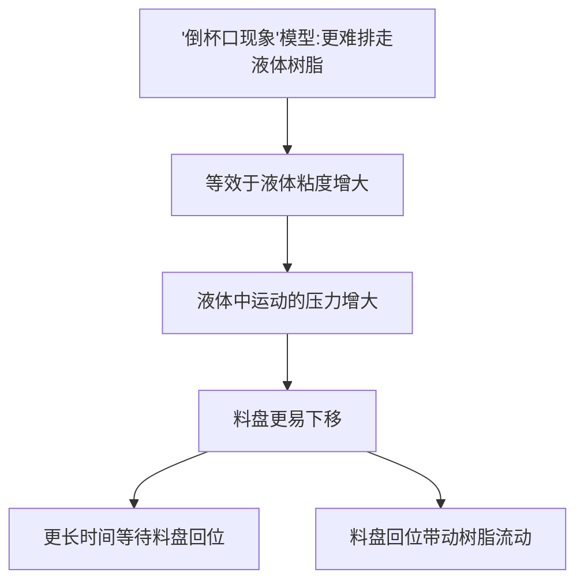

倒杯口问题

**现象：**

在打印过程中，随着打印模型轮廓不断生成，当达到一个临界位置，从此层开始，成型平台运动到接近料盘的指定层厚时，此时曝光，液态树脂变成固体后，打印的模型和料盘表面形成密封腔体

要打印的模型：


过程：


此时中心的腔体和料盘就会组成密封腔体


**导致的问题：**

Stefan公式：两个平行固体圆盘在液体中相对移动的受力情况


$\eta$：粘度

$R$：圆盘半径

$h$：距离高度

$dh/dt$：移动速度


$$
F \propto \frac{\eta R^4} {h^3} \frac{dh}{dt}
$$




打印模型出现倒杯口现象后，此时当模型向下运动，产生这种现象的模型相比不产生这种现象的模型更难将树脂液体排走，等效于液体的粘度增大，此时液体对料盘的作用力会增大，更容易压动料盘下移，从而在曝光前需要更长的等待时间等待料盘上移至指定打印层厚，若此时就曝光，就会导致层厚偏厚。同时，料盘上移又会带动树脂流动，流动的树脂也需要等待时间达到稳定静止状态，如若在树脂未达到稳定静置状态曝光，打印出来的模型表面质量会明显变差。


不仅仅是出现倒杯口现象的模型，任何模型，增加了平台在树脂中的运动时产生的压力，而等待时间又不够的话，都会对打印件表面质量造成影响


**解决办法：**

- 减弱平台在树脂中运动产生的压力
- 增加树脂恢复稳定的时间


- 减弱平台在树脂中运动产生的压力
  - 降低粘度（1. 换低粘度树脂；2. 促进排液——模型开孔）
  - 减小模型接触半径（1. 小尺寸模型；2. 整版模型个数减少）
  - 降低平台运动速度


- 增加树脂恢复稳定的时间
  - 增加等待时间


满版全颌面实心牙模打孔后的力值曲线

146-250左右出现倒杯口


使用波哥M值工艺包只增加了前几段等待时间后的工艺包（用来研究增加等待时间对精度影响的工艺包）

```c++
{
                "MLowerLimit": 160,
                "MUpperLimit": 190,
                "Number": 14,
                "WaitTime": 12100,
                "Z_AxisUp": [
                    { "v": 600, "s": 1800 },
                    { "v": 200, "s": 2400 },
                    { "v": 2000, "s": 3900 },
                    { "v": 6000, "s": 6900 },
                    { "v": 10000, "s": 18900 }
                ],
                "Z_AxisDown": [
                    { "v": 10000, "s": -10850 },
                    { "v": 4000, "s": -16850 },
                    { "v": 2000, "s": -17850 },
                    { "v": 500, "s": -18650 },
                    { "v": 200, "s": -18850 }
                ]
            },
```


```c++
行 30961: [2022-04-14 09:53:06.662] [TRACE] [PrintCtrl] peel up: Curlayer: 55 Number: "14"
	行 30962: [2022-04-14 09:53:06.662] [TRACE] [PrintCtrl] speed[0]: 600, distance[0]: 1800
	行 30963: [2022-04-14 09:53:06.663] [TRACE] [PrintCtrl] speed[1]: 200, distance[1]: 2400
	行 30964: [2022-04-14 09:53:06.663] [TRACE] [PrintCtrl] speed[2]: 2000, distance[2]: 3900
	行 30965: [2022-04-14 09:53:06.663] [TRACE] [PrintCtrl] speed[3]: 6000, distance[3]: 6900
	行 30966: [2022-04-14 09:53:06.663] [TRACE] [PrintCtrl] speed[4]: 10000, distance[4]: 18900
	行 30967: [2022-04-14 09:53:06.663] [TRACE] [PrintCtrl] peel down: Curlayer: 55 Number: "14"
	行 30968: [2022-04-14 09:53:06.663] [TRACE] [PrintCtrl] speed[0]: 10000, distance[0]: -10850
	行 30969: [2022-04-14 09:53:06.663] [TRACE] [PrintCtrl] speed[1]: 4000, distance[1]: -16850
	行 30970: [2022-04-14 09:53:06.664] [TRACE] [PrintCtrl] speed[2]: 2000, distance[2]: -17850
	行 30971: [2022-04-14 09:53:06.664] [TRACE] [PrintCtrl] speed[3]: 500, distance[3]: -18650
	行 30972: [2022-04-14 09:53:06.664] [TRACE] [PrintCtrl] speed[4]: 200, distance[4]: -18850
	行 30974: [2022-04-14 09:53:06.664] [DEBUG] [ "实心全颌面S-打孔.ult" ] step: PrintCtrl::PrintStep(Waiting)
	行 30996: [2022-04-14 09:53:18.763] [DEBUG] [ "实心全颌面S-打孔.ult" ] step: PrintCtrl::PrintStep(Preprocessing)
	行 31006: [2022-04-14 09:53:18.766] [DEBUG] [ "实心全颌面S-打孔.ult" ] step: PrintCtrl::PrintStep(Exposuring)
	行 31063: [2022-04-14 09:53:20.377] [DEBUG] [ "实心全颌面S-打孔.ult" ] step: PrintCtrl::PrintStep(Peeling)
```


LCD打印全颌面牙模


