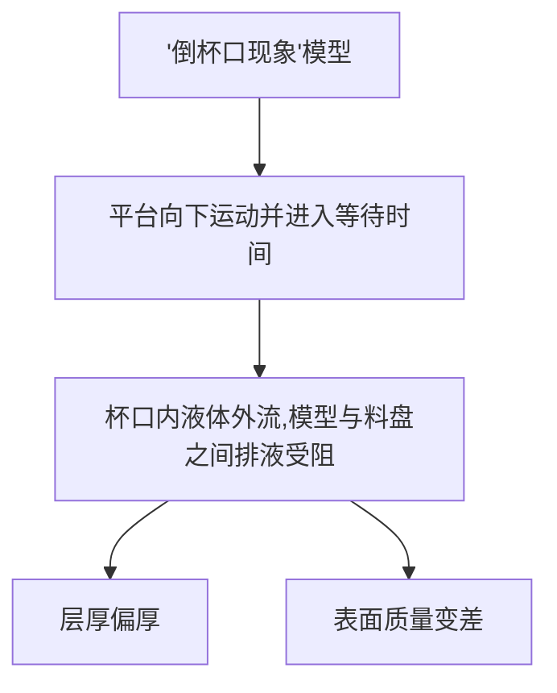

 倒杯口问题

**现象：**

在打印过程中，随着打印模型轮廓不断生成，当达到一个临界位置，从此层开始，成型平台运动到接近料盘的指定层厚时，此时曝光，液态树脂变成固体后，打印的模型和料盘表面形成密封腔体

**例如：打印模型：**

过程：

此时中心的腔体和料盘就会组成密封腔体

**导致问题：**

**对比：产生倒杯口现象的模型和消除倒杯口的模型**

有倒杯口现象模型

消除倒杯口现象模型（开孔）

1. **紫线和红线对比：**

消除了倒杯口现象后，倒杯口层的下压力会大幅下降

Stefan公式：

$\eta$：粘度

$R$：圆盘半径

$h$：距离高度

$dh/dt$：移动速度

适用于两个平行固体圆盘在液体中相对移动的受力情况

$$
F \propto \frac{\eta R^4} {h^3} \frac{dh}{dt}
$$

stefan公式解释，内部开孔后，有效下压圆的半径减小

2. **倒杯口层下压力变化对比：**

3. 非倒杯口层下压力变化

**解决办法：**

- 打孔
- 增加树脂恢复稳定的时间——增加等待时间

