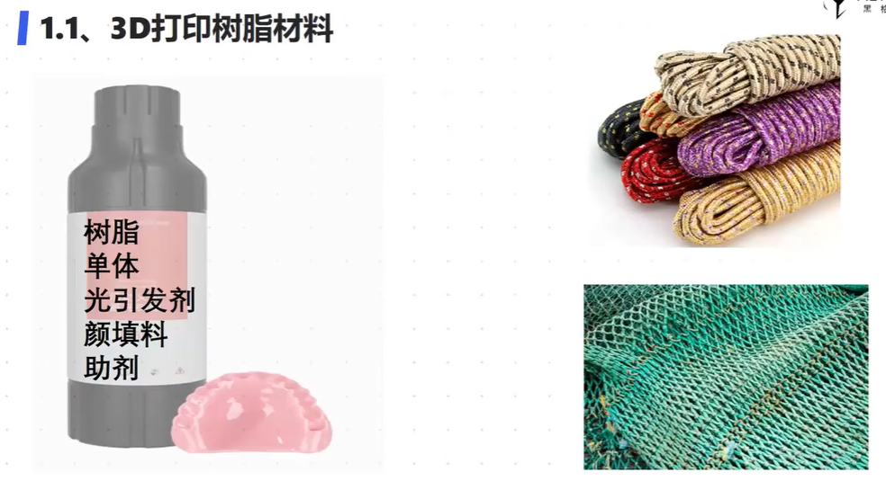
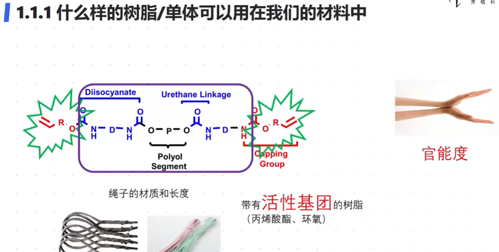
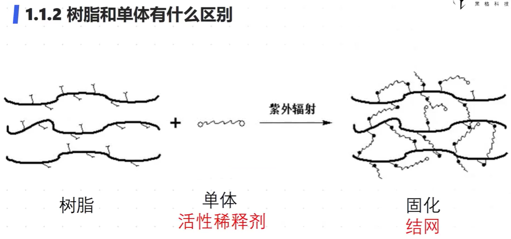
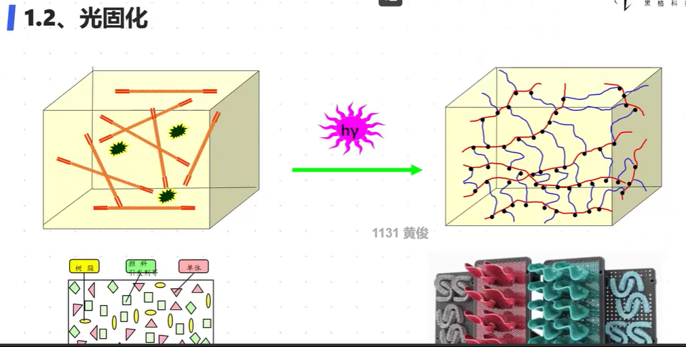
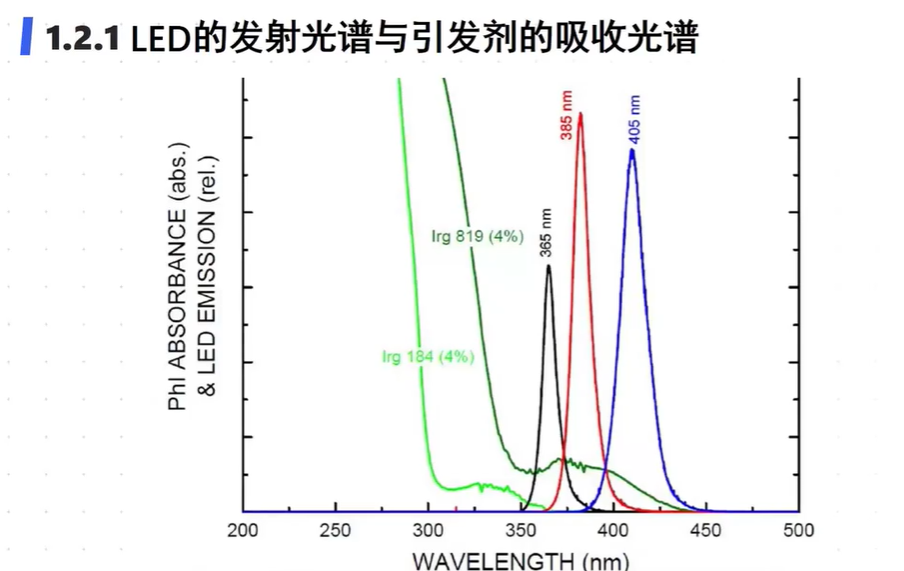
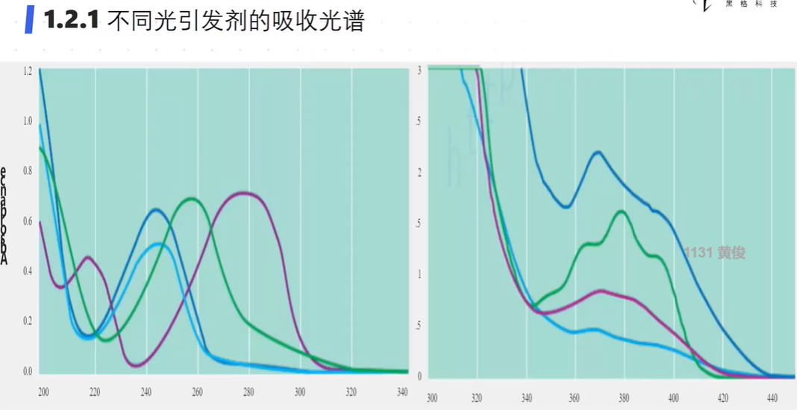
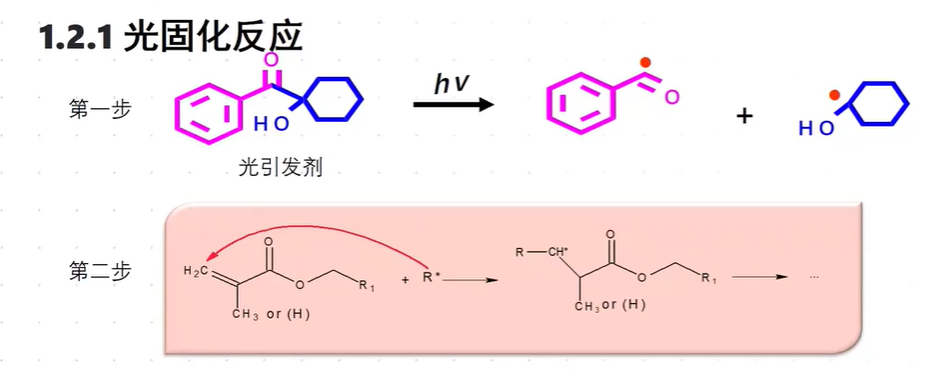

光固化基础：

3D打印树脂材料

- 树脂：粘度较大的透明无色液体
- 单体：降低粘度
- 光引发剂：吸光产生活性物质
- 颜填料：
- 助剂：

什么样的材料才能使用：

- 带有活性基团才能使用：官能度——类似手，材质取决于链中间的物质，官能团在两端

树脂和单体区别：

- 树脂粘度大
- 单体（活性稀释剂），紫外照射固化

引发剂Irg 184 和Irg 819

发射光谱与光引发剂吸收光谱匹配越好越有效（Irg 184 和385nm波普无重叠，效果肯定很差）

左边的吸收光谱在320就结束了，不适合我们的紫外波长，右边的适合

光引发剂吸收光之后，裂解成两个自由基碎片，然后发生交联反应

体积收缩：

单体间间距3-6A：10的-10次方米 反应后 1.56A

- 影响因素：双键密度——衡量反应程度
- 可以添加填充物质降低体积收缩

影响因素

- 光引发剂——自由基——和氧气反应速度更快k=10^6，和树脂反应速度慢k=1

- 反应过程中产生的热对促进反应的作用和对精度下降的影响
- 颜填料对紫外线穿透影响，从而容易产生残渣
  - 吸收窗：光引发剂的吸收能力强于颜填料如钛白
- 光漂白
  - 光源多次照射后，光能穿透进下一层，不会被阻碍，光引发剂反应能力下降
- 气泡
  - 