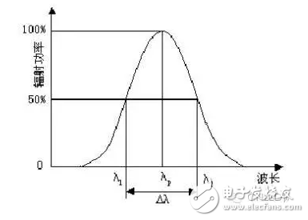

光学

λp：PeakWaveLength，峰值波长。

　　无论什么材料制成的LED，都有一个相对光辐射最强处，与之相对应有一个波长，此波长为峰值波长，它由半导体材料的带隙宽度或发光中心的能级位置决定。

Δλ：SpectralBandwidth，光谱半波宽。

　　相对光谱能量分布曲线上，两个半极大值强度处对应的波长差，如图1所示，它标志着光谱纯度，同时也可以用来衡量半导体材料中对发光有贡献的能量状态离散度，LED的发光光谱的半宽度一般为30－100nm，光谱宽度窄意味着单色性好。

　　

　　图1光谱半波宽Δλ

[维恩位移定律](https://baike.baidu.com/item/维恩位移定律/4234590?fromModule=lemma_inlink)描述辐射能量峰值波长随温度升高向短波长的方向偏移