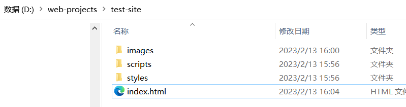
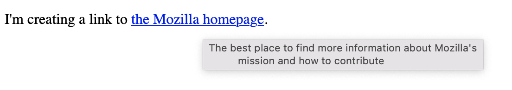

前端

## 网站

### 网站文件结构



## 1. 网站内容(html)

HTML (**H**yper**T**ext **M**arkup **L**anguage) is the code that is used to structure a web page and its content. HTML consists of a series of [elements](https://developer.mozilla.org/en-US/docs/Glossary/Element), which you use to enclose, wrap, or *mark up* different parts of content to make it appear or act in a certain way. 组织网站内容结构

### html代码结构

```html
<!DOCTYPE html>
<html lang="en-US">
  <head>
    <meta charset="utf-8" />
    <meta name="viewport" content="width=device-width" />
    <title>My test page</title>
  </head>
  <body>
    
  </body>
</html>

```


> Here, we have the following:
>
> - `<!DOCTYPE html>` — [doctype](https://developer.mozilla.org/en-US/docs/Glossary/Doctype). It is a required preamble. In the mists of time, when HTML was young (around 1991/92), doctypes were meant to act as links to a set of rules that the HTML page had to follow to be considered good HTML, which could mean automatic error checking and other useful things. However, these days, they don't do much and are basically just needed to make sure your document behaves correctly. That's all you need to know for now.
> - `<html></html>` — the `html` element. This element wraps all the content on the entire page and is sometimes known as the root element. It also includes the `lang` attribute, setting the primary language of the document.
> - `<head></head>` — the [`head`](https://developer.mozilla.org/en-US/docs/Web/HTML/Element/head) element. This element acts as a container for all the stuff you want to include on the HTML page that *isn't* the content you are showing to your page's viewers. This includes things like [keywords](https://developer.mozilla.org/en-US/docs/Glossary/Keyword) and a page description that you want to appear in search results, CSS to style our content, character set declarations, and more.
> - `<meta charset="utf-8">` — This element sets the character set your document should use to UTF-8 which includes most characters from the vast majority of written languages. Essentially, it can now handle any textual content you might put on it. There is no reason not to set this, and it can help avoid some problems later on.
> - `<meta name="viewport" content="width=device-width">` — This [viewport element](https://developer.mozilla.org/en-US/docs/Web/CSS/Viewport_concepts#mobile_viewports) ensures the page renders at the width of viewport, preventing mobile browsers from rendering pages wider than the viewport and then shrinking them down.
> - `<title></title>` — the [`title`](https://developer.mozilla.org/en-US/docs/Web/HTML/Element/title) element. This sets the title of your page, which is the title that appears in the browser tab the page is loaded in. It is also used to describe the page when you bookmark/favorite it.
> - `<body></body>` — the [`body`](https://developer.mozilla.org/en-US/docs/Web/HTML/Element/body) element. This contains *all* the content that you want to show to web users when they visit your page, whether that's text, images, videos, games, playable audio tracks, or whatever else.

#### html: `<html></html>`

##### lang: 语言

Your HTML document will be indexed more effectively by search engines if its language is set (allowing it to appear correctly in language-specific results, for example), and it is useful to people with visual impairments using screen readers (for example, the word "six" exists in both French and English, but is pronounced differently.)

例如："en-US"

```html
<html lang="en-US">
  …
</html>
```


#### head: `<head></head>`

The HTML head is the contents of the [`head`](https://developer.mozilla.org/en-US/docs/Web/HTML/Element/head) element. Unlike the contents of the [`body`](https://developer.mozilla.org/en-US/docs/Web/HTML/Element/body) element (which are displayed on the page when loaded in a browser), the head's content is not displayed on the page. Instead, the head's job is to contain [metadata](https://developer.mozilla.org/en-US/docs/Glossary/Metadata) about the document.

##### title: `<title></title>`

The [`title`](https://developer.mozilla.org/en-US/docs/Web/HTML/Element/title) element is metadata that represents the title of the overall HTML document (not the document's content. 整个HTML文件的标题，是和许多个HTML对比层面的概念

The `<title>` element contents are also used in other ways. For example, if you try bookmarking the page (*Bookmarks > Bookmark This Page* or the star icon in the URL bar in Firefox), you will see the `<title>` contents filled in as the suggested bookmark name. 添加到收藏栏时的名字

##### meta: `<meta />`

###### charset: 

This element specifies the document's character encoding 

例如： "utf-8"

###### name： 

- `name` specifies the type of meta element it is; what type of information it contains.

例如：'author', 'description'

###### content：

- `content` specifies the actual meta content.

Specifying a description that includes keywords relating to the content of your page is useful as it has the potential to make your page appear higher in relevant searches performed in search engines

例如：

```html
<meta name="author" content="Chris Mills" />
<meta
  name="description"
  content="The MDN Web Docs Learning Area aims to provide
complete beginners to the Web with all they need to know to get
started with developing web sites and applications." />
```


### Html文本基础

#### 元素 elements

tags：`<p>`

Tags in HTML are not case-sensitive.


- **The opening tag:** This consists of the name of the element (in this example, *p* for paragraph), wrapped in opening and closing angle brackets. This opening tag marks where the element begins or starts to take effect. In this example, it precedes the start of the paragraph text.
- **The content:** This is the content of the element. In this example, it is the paragraph text.
- **The closing tag:** This is the same as the opening tag, except that it includes a forward slash before the element name. This marks where the element ends. Failing to include a closing tag is a common beginner error that can produce peculiar results.

#### 元素属性 [Attributes](https://developer.mozilla.org/en-US/docs/Learn/HTML/Introduction_to_HTML/Getting_started#attributes)


Attributes contain extra information about the element that won't appear in the content. In this example, the **`class`** attribute is an identifying name used to target the element with style information.

An attribute should have:

- A space between it and the element name. (For an element with more than one attribute, the attributes should be separated by spaces too.)
- The attribute name, followed by an equal sign.
- An attribute value, wrapped with opening and closing quote marks.

#### 内建元素 [Nesting elements](https://developer.mozilla.org/en-US/docs/Learn/HTML/Introduction_to_HTML/Getting_started#nesting_elements)

```html
<p>My cat is <strong>very</strong> grumpy.</p>
```

<p>My cat is <strong>very</strong> grumpy.</p>

多个元素内建时：**tags have to open and close in a way that they are inside or outside one another**. 

#### 块`<p>`

```html
<em>first</em><em>second</em><em>third</em>

<p>fourth</p>
<p>fifth</p>
<p>sixth</p>
```

<em>first</em><em>second</em><em>third</em>

<p>fourth</p>
<p>fifth</p>
<p>sixth</p>

#### 行`<em>`

 the first three elements sit on the same line, with no space in between

```
<em>first</em><em>second</em><em>third</em>
```

<em>first</em><em>second</em><em>third</em>

正文

段落

标题

列表

#### 空元素 void elements

Some elements consist of a single tag, which is typically used to insert/embed something in the document. Such elements are called [void elements](https://developer.mozilla.org/en-US/docs/Glossary/Void_element).

#### 图片``

```

```


#### 超链接`<a>`

##### 属性：

###### 网址：`href`

This attribute's value specifies the web address for the link. For example: `href="https://www.mozilla.org/"`.

###### 标题：`title`

在超链接上添加显示文本，当鼠标移到链接上时显示文本（对使用键盘或者触屏方式的用户无法使用）

The `title` attribute specifies extra information about the link, such as a description of the page that is being linked to. For example, `title="The Mozilla homepage"`. This appears as a tooltip when a cursor hovers over the element.

###### target:`<target>`

The `target` attribute specifies the browsing context used to display the link. For example, `target="_blank"` will display the link in a new tab. If you want to display the linked content in the current tab, just omit this attribute.

###### download:

##### 网络链接

Url: Uniform Resource Locator  is a string of text that defines where something is located on the Web. For example, Mozilla's English homepage is located at `https://www.mozilla.org/en-US/`.

```html
<p>
  I'm creating a link to
  <a href="https://www.mozilla.org/en-US/">the Mozilla homepage</a>.
</p>

```

超链接title属性：在超链接上添加显示文本，当鼠标移到链接上时显示文本（对使用键盘或者触屏方式的用户无法使用）

```html
<p>
  I'm creating a link to
  <a
    href="https://www.mozilla.org/en-US/"
    title="The best place to find more information about Mozilla's
          mission and how to contribute">the Mozilla homepage</a>.
</p>

```



对图片添加超链接

```html
<a href="https://www.mozilla.org/en-US/">
  
</a>
```


##### 本地路径文件


（当前html文件为the top level `index.html`）contacts.html文件和当前的index.html文件在同一个路径文件夹下

```html
<p>
  Want to contact a specific staff member? Find details on our
  <a href="contacts.html">contacts page</a>.
</p>
```

（当前html文件为the top level `index.html`）index.html文件在projects文件夹下

```html
<p>Visit my <a href="projects/index.html">project homepage</a>.</p>
```

（当前html文件为`projects/index.html`）

```html
<p>A link to my <a href="../pdfs/project-brief.pdf">project brief</a>.</p>
```

<p>A link to my <a href="../pdfs/project-brief.pdf">project brief</a>.</p>


做链接时，链接文本尽量简洁，不要说废话


链接到非网址链接时，例如下载链接，在链接文本上注明链接文件类型，大小，同时如果使用download属性，可以不打开新的网页，直接下载

链接带download属性：

```html
<a
  href="https://download.mozilla.org/?product=firefox-latest-ssl&os=win64&lang=en-US"
  download="firefox-latest-64bit-installer.exe">
  Download Latest Firefox for Windows (64-bit) (English, US)
</a>
```

<a
  href="https://download.mozilla.org/?product=firefox-latest-ssl&os=win64&lang=en-US"
  download="firefox-latest-64bit-installer.exe">
  Download Latest Firefox for Windows (64-bit) (English, US)
</a>


##### 邮箱链接

直接打开邮箱应用（可以去掉具体邮箱地址）

```html
<a href="mailto:nowhere@mozilla.org">Send email to nowhere</a>
```

<a href="mailto:nowhere@mozilla.org">Send email to nowhere</a>


还可以在邮件地址中增加其他属性，例如邮件主题，抄送人等等

Here are a few other sample `mailto` URLs:

- mailto:
- mailto:nowhere@mozilla.org
- mailto:nowhere@mozilla.org,nobody@mozilla.org
- mailto:nowhere@mozilla.org?cc=nobody@mozilla.org
- [mailto:nowhere@mozilla.org?cc=nobody@mozilla.org&subject=This%20is%20the%20subject](mailto:nowhere@mozilla.org?cc=nobody@mozilla.org&subject=This is the subject)


#### 输入框`<input>`

##### 属性：

###### type：`type`

###### disabled: `disabled`


```html
<input type="text" disabled="disabled" />
```

#### 转义符

| Literal character | Character reference equivalent |
| :---------------- | :----------------------------- |
| <                 | `<`                            |
| >                 | `>`                            |
| "                 | `"`                            |
| '                 | `'`                            |
| &                 | `&`                            |

The character reference equivalent could be easily remembered because the text it uses can be seen as less than for '&lt;', quotation for ' &quot; ' and similarly for others. To find more about entity reference, see [List of XML and HTML character entity references](https://en.wikipedia.org/wiki/List_of_XML_and_HTML_character_entity_references) (Wikipedia).

```html
<p>In HTML, you define a paragraph using the <p> element.</p>

<p>In HTML, you define a paragraph using the &lt;p&gt; element.</p>
```


#### 代码注释`<!--  -->`

Anything in HTML between `<!--` and `-->` is an **HTML comment**

```html
<p>I'm not inside a comment</p>

<!-- <p>I am!</p> -->
```

<p>I'm not inside a comment</p>
<!-- <p>I am!</p> -->

#### 添加icon

You may see (depending on the browser) favicons displayed in the browser tab containing each open page, and next to bookmarked pages in the bookmarks panel.

```html
<link rel="icon" href="favicon.ico" type="image/x-icon" />
```

A favicon can be added to your page by:

1. Saving it in the same directory as the site's index page, saved in `.ico` format (most also support favicons in more common formats like `.gif` or `.png`)

2. Adding the following line into your HTML's`<head>`block to reference it:

   ```
   <link rel="icon" href="favicon.ico" type="image/x-icon" />
   ```


#### [Document fragments](https://developer.mozilla.org/en-US/docs/Learn/HTML/Introduction_to_HTML/Creating_hyperlinks#document_fragments) 不太理解


### 文本结构

#### 标题

#### 段落

#### 列表

#### 强调

#### 描述性列表 description list

`<dl>: The Description List element`

`<dt>: description term`

`<dd>: description definiton`


```html
<dl>
  <dt>soliloquy</dt>
  <dd>
    In drama, where a character speaks to themselves, representing their inner
    thoughts or feelings and in the process relaying them to the audience (but
    not to other characters.)
  </dd>
  <dt>monologue</dt>
  <dd>
    In drama, where a character speaks their thoughts out loud to share them
    with the audience and any other characters present.
  </dd>
  <dt>aside</dt>
  <dd>
    In drama, where a character shares a comment only with the audience for
    humorous or dramatic effect. This is usually a feeling, thought, or piece of
    additional background information.
  </dd>
</dl>
```

（光标移到下方文字块上，右上角点击</>标志即可切换到html语言）

<dl>
  <dt>soliloquy</dt>
  <dd>
    In drama, where a character speaks to themselves, representing their inner
    thoughts or feelings and in the process relaying them to the audience (but
    not to other characters.)
  </dd>
  <dt>monologue</dt>
  <dd>
    In drama, where a character speaks their thoughts out loud to share them
    with the audience and any other characters present.
  </dd>
  <dt>aside</dt>
  <dd>
    In drama, where a character shares a comment only with the audience for
    humorous or dramatic effect. This is usually a feeling, thought, or piece of
    additional background information.
  </dd>
</dl>

##### 一个dt还可以有多个dd

```html
<dl>
  <dt>aside</dt>
  <dd>
    In drama, where a character shares a comment only with the audience for
    humorous or dramatic effect. This is usually a feeling, thought, or piece of
    additional background information.
  </dd>
  <dd>
    In writing, a section of content that is related to the current topic, but
    doesn't fit directly into the main flow of content so is presented nearby
    (often in a box off to the side.)
  </dd>
</dl>
```

<dl>
  <dt>aside</dt>
  <dd>
    In drama, where a character shares a comment only with the audience for
    humorous or dramatic effect. This is usually a feeling, thought, or piece of
    additional background information.
  </dd>
  <dd>
    In writing, a section of content that is related to the current topic, but
    doesn't fit directly into the main flow of content so is presented nearby
    (often in a box off to the side.)
  </dd>
</dl>

#### 引用

##### 块引用：`<blockquote cite=> <p> </p> </blockquote>`

从其他地方引用到该处

###### cite属性：

表示原文网址

```html
<p>Here is a blockquote:</p>
<blockquote
  cite="https://developer.mozilla.org/en-US/docs/Web/HTML/Element/blockquote">
  <p>
    The <strong>HTML <code>&lt;blockquote&gt;</code> Element</strong> (or
    <em>HTML Block Quotation Element</em>) indicates that the enclosed text is
    an extended quotation.
  </p>
</blockquote>
```

<p>Here is a blockquote:</p>
<blockquote
  cite="https://developer.mozilla.org/en-US/docs/Web/HTML/Element/blockquote">
  <p>
    The <strong>HTML <code>&lt;blockquote&gt;</code> Element</strong> (or
    <em>HTML Block Quotation Element</em>) indicates that the enclosed text is
    an extended quotation.
  </p>
</blockquote>


##### 行引用：`<q></q>`

```html
<p>The quote element — <code>&lt;q&gt;</code> — is <q cite="https://developer.mozilla.org/en-US/docs/Web/HTML/Element/q">intended
for short quotations that don't require paragraph breaks.</q></p>
```

<p>The quote element — <code>&lt;q&gt;</code> — is <q cite="https://developer.mozilla.org/en-US/docs/Web/HTML/Element/q">intended
for short quotations that don't require paragraph breaks.</q></p>


#### 参考cite：`<cite>`

斜体

```html
<p>
  According to the
  <a href="/en-US/docs/Web/HTML/Element/blockquote">
    <cite>MDN blockquote page</cite></a>:
</p>

<blockquote cite="https://developer.mozilla.org/en-US/docs/Web/HTML/Element/blockquote">
  <p>The <strong>HTML <code>&lt;blockquote&gt;</code> Element</strong> (or <em>HTML Block
  Quotation Element</em>) indicates that the enclosed text is an extended quotation.</p>
</blockquote>

<p>The quote element — <code>&lt;q&gt;</code> — is <q cite="https://developer.mozilla.org/en-US/docs/Web/HTML/Element/q">intended
for short quotations that don't require paragraph breaks.</q> — <a href="/en-US/docs/Web/HTML/Element/q">
<cite>MDN q page</cite></a>.</p>
```

<p>
  According to the
  <a href="/en-US/docs/Web/HTML/Element/blockquote">
    <cite>MDN blockquote page</cite></a>:
</p>

<blockquote cite="https://developer.mozilla.org/en-US/docs/Web/HTML/Element/blockquote">
  <p>The <strong>HTML <code>&lt;blockquote&gt;</code> Element</strong> (or <em>HTML Block
  Quotation Element</em>) indicates that the enclosed text is an extended quotation.</p>
</blockquote>

<p>The quote element — <code>&lt;q&gt;</code> — is <q cite="https://developer.mozilla.org/en-US/docs/Web/HTML/Element/q">intended
for short quotations that don't require paragraph breaks.</q> — <a href="/en-US/docs/Web/HTML/Element/q">
<cite>MDN q page</cite></a>.</p>


#### 缩写: `<abbr></abbr>`

##### title: 

```html
<p>
  We use <abbr>HTML</abbr>, Hypertext Markup Language, to structure our web
  documents.
</p>

<p>
  I think <abbr title="Reverend">Rev.</abbr> Green did it in the kitchen with
  the chainsaw.
</p>
```

<p>
  We use <abbr>HTML</abbr>, Hypertext Markup Language, to structure our web
  documents.
</p>

<p>
  I think <abbr title="Reverend">Rev.</abbr> Green did it in the kitchen with
  the chainsaw.
</p>

#### 联系信息`<address></address>`

```html
<address>
  <p>
    Chris Mills<br />
    Manchester<br />
    The Grim North<br />
    UK
  </p>
  <ul>
    <li>Tel: 01234 567 890</li>
    <li>Email: me@grim-north.co.uk</li>
  </ul>
</address>
```

<address>
  <p>
    Chris Mills<br />
    Manchester<br />
    The Grim North<br />
    UK
  </p>
  <ul>
    <li>Tel: 01234 567 890</li>
    <li>Email: me@grim-north.co.uk</li>
  </ul>
</address>
#### 上下标

##### 上标：`<sup></sup>`

##### 下标：`<sub></sub>`

```html
<p>My birthday is on the 25<sup>th</sup> of May 2001.</p>
<p>
  Caffeine's chemical formula is
  C<sub>8</sub>H<sub>10</sub>N<sub>4</sub>O<sub>2</sub>.
</p>
<p>If x<sup>2</sup> is 9, x must equal 3 or -3.</p>
```

<p>My birthday is on the 25<sup>th</sup> of May 2001.</p>
<p>
  Caffeine's chemical formula is
  C<sub>8</sub>H<sub>10</sub>N<sub>4</sub>O<sub>2</sub>.
</p>
<p>If x<sup>2</sup> is 9, x must equal 3 or -3.</p>

#### 电脑代码

##### [`code`](https://developer.mozilla.org/en-US/docs/Web/HTML/Element/code): 代码

For marking up generic pieces of computer code.

##### [`pre`](https://developer.mozilla.org/en-US/docs/Web/HTML/Element/pre): 空白符

For retaining whitespace (generally code blocks) — if you use indentation or excess whitespace inside your text, browsers will ignore it and you will not see it on your rendered page. If you wrap the text in `<pre></pre>` tags however, your whitespace will be rendered identically to how you see it in your text editor.

##### [`var`](https://developer.mozilla.org/en-US/docs/Web/HTML/Element/var): 变量

For specifically marking up variable names.

##### [`kbd`](https://developer.mozilla.org/en-US/docs/Web/HTML/Element/kbd): 键盘按键

For marking up keyboard (and other types of) input entered into the computer.

##### [`samp`](https://developer.mozilla.org/en-US/docs/Web/HTML/Element/samp): 程序输出

For marking up the output of a computer program.

```html
<pre><code>const para = document.querySelector('p');

para.onclick = function() {
  alert('Owww, stop poking me!');
}</code></pre>

<p>
  You shouldn't use presentational elements like <code>&lt;font&gt;</code> and
  <code>&lt;center&gt;</code>.
</p>

<p>
  In the above JavaScript example, <var>para</var> represents a paragraph
  element.
</p>

<p>Select all the text with <kbd>Ctrl</kbd>/<kbd>Cmd</kbd> + <kbd>A</kbd>.</p>

<pre>$ <kbd>ping mozilla.org</kbd>
<samp>PING mozilla.org (63.245.215.20): 56 data bytes
64 bytes from 63.245.215.20: icmp_seq=0 ttl=40 time=158.233 ms</samp></pre>
```

<pre><code>const para = document.querySelector('p');
para.onclick = function() {
  alert('Owww, stop poking me!');
}</code></pre>
<p>
  You shouldn't use presentational elements like <code>&lt;font&gt;</code> and
  <code>&lt;center&gt;</code>.
</p>
<p>
  In the above JavaScript example, <var>para</var> represents a paragraph
  element.
</p>
<p>Select all the text with <kbd>Ctrl</kbd>/<kbd>Cmd</kbd> + <kbd>A</kbd>.</p>
<pre>$ <kbd>ping mozilla.org</kbd>
<samp>PING mozilla.org (63.245.215.20): 56 data bytes
64 bytes from 63.245.215.20: icmp_seq=0 ttl=40 time=158.233 ms</samp></pre>

#### 时间：`<time></time>`

```html
<time datetime="2016-01-20">20 January 2016</time>
```

<time datetime="2016-01-20">20 January 2016</time>

### 网页结构

#### header:`<header>`

Usually a big strip across the top with a big heading, logo, and perhaps a tagline. This usually stays the same from one webpage to another.

#### navigation bar: `<nav>`

Links to the site's main sections; usually represented by menu buttons, links, or tabs. Like the header, this content usually remains consistent from one webpage to another — having inconsistent navigation on your website will just lead to confused, frustrated users. Many web designers consider the navigation bar to be part of the header rather than an individual component, but that's not a requirement; in fact, some also argue that having the two separate is better for [accessibility](https://developer.mozilla.org/en-US/docs/Learn/Accessibility), as screen readers can read the two features better if they are separate.

#### main content: `<main>`

A big area in the center that contains most of the unique content of a given webpage, for example, the video you want to watch, or the main story you're reading, or the map you want to view, or the news headlines, etc. This is the one part of the website that definitely will vary from page to page!

with various content subsections represented by [`article`](https://developer.mozilla.org/en-US/docs/Web/HTML/Element/article), [`section`](https://developer.mozilla.org/en-US/docs/Web/HTML/Element/section), and [`div`](https://developer.mozilla.org/en-US/docs/Web/HTML/Element/div) elements.

##### `<article>`

##### `<section>`

##### `<div>`

#### sidebar: `<aside>`

Some peripheral info, links, quotes, ads, etc. Usually, this is contextual to what is contained in the main content (for example on a news article page, the sidebar might contain the author's bio, or links to related articles) but there are also cases where you'll find some recurring elements like a secondary navigation system.

often placed inside [`main`](https://developer.mozilla.org/en-US/docs/Web/HTML/Element/main).

#### footer: `<footer>`

A strip across the bottom of the page that generally contains fine print, copyright notices, or contact info. It's a place to put common information (like the header) but usually, that information is not critical or secondary to the website itself. The footer is also sometimes used for [SEO](https://developer.mozilla.org/en-US/docs/Glossary/SEO) purposes, by providing links for quick access to popular content.

例如


```html
<!DOCTYPE html>
<html lang="en-US">
  <head>
    <meta charset="utf-8" />
    <meta name="viewport" content="width=device-width" />

    <title>My page title</title>
    <link
      href="https://fonts.googleapis.com/css?family=Open+Sans+Condensed:300|Sonsie+One"
      rel="stylesheet" />
    <link rel="stylesheet" href="style.css" />
  </head>

  <body>
    <!-- Here is our main header that is used across all the pages of our website -->

    <header>
      <h1>Header</h1>
    </header>

    <nav>
      <ul>
        <li><a href="#">Home</a></li>
        <li><a href="#">Our team</a></li>
        <li><a href="#">Projects</a></li>
        <li><a href="#">Contact</a></li>
      </ul>

      <!-- A Search form is another common non-linear way to navigate through a website. -->

      <form>
        <input type="search" name="q" placeholder="Search query" />
        <input type="submit" value="Go!" />
      </form>
    </nav>

    <!-- Here is our page's main content -->
    <main>
      <!-- It contains an article -->
      <article>
        <h2>Article heading</h2>

        <p>
          Lorem ipsum dolor sit amet, consectetur adipisicing elit. Donec a diam
          lectus. Set sit amet ipsum mauris. Maecenas congue ligula as quam
          viverra nec consectetur ant hendrerit. Donec et mollis dolor. Praesent
          et diam eget libero egestas mattis sit amet vitae augue. Nam tincidunt
          congue enim, ut porta lorem lacinia consectetur.
        </p>

        <h3>Subsection</h3>

        <p>
          Donec ut librero sed accu vehicula ultricies a non tortor. Lorem ipsum
          dolor sit amet, consectetur adipisicing elit. Aenean ut gravida lorem.
          Ut turpis felis, pulvinar a semper sed, adipiscing id dolor.
        </p>

        <p>
          Pelientesque auctor nisi id magna consequat sagittis. Curabitur
          dapibus, enim sit amet elit pharetra tincidunt feugiat nist imperdiet.
          Ut convallis libero in urna ultrices accumsan. Donec sed odio eros.
        </p>

        <h3>Another subsection</h3>

        <p>
          Donec viverra mi quis quam pulvinar at malesuada arcu rhoncus. Cum
          soclis natoque penatibus et manis dis parturient montes, nascetur
          ridiculus mus. In rutrum accumsan ultricies. Mauris vitae nisi at sem
          facilisis semper ac in est.
        </p>

        <p>
          Vivamus fermentum semper porta. Nunc diam velit, adipscing ut
          tristique vitae sagittis vel odio. Maecenas convallis ullamcorper
          ultricied. Curabitur ornare, ligula semper consectetur sagittis, nisi
          diam iaculis velit, is fringille sem nunc vet mi.
        </p>
      </article>

      <!-- the aside content can also be nested within the main content -->
      <aside>
        <h2>Related</h2>

        <ul>
          <li><a href="#">Oh I do like to be beside the seaside</a></li>
          <li><a href="#">Oh I do like to be beside the sea</a></li>
          <li><a href="#">Although in the North of England</a></li>
          <li><a href="#">It never stops raining</a></li>
          <li><a href="#">Oh well…</a></li>
        </ul>
      </aside>
    </main>

    <!-- And here is our main footer that is used across all the pages of our website -->

    <footer>
      <p>©Copyright 2050 by nobody. All rights reversed.</p>
    </footer>
  </body>
</html>
```


## 2. 内容风格(CSS)

CSS (Cascading Style Sheets) is the code that styles web content.

### html文件中的放置位置

The [`link`](https://developer.mozilla.org/en-US/docs/Web/HTML/Element/link) element should always go inside the head of your document. This takes two attributes, `rel="stylesheet"`, which indicates that it is the document's stylesheet, and `href`, which contains the path to the stylesheet file:

```
<link rel="stylesheet" href="my-css-file.css" />
```


```html
p {
  color: red;
}
```

Open your `index.html` file. Paste the following line in the head (between the [``](https://developer.mozilla.org/en-US/docs/Web/HTML/Element/head) and `</head>` tags):

 <link href="styles/style.css" rel="stylesheet" />


> - Selector
>
>   This is the HTML element name at the start of the ruleset. It defines the element(s) to be styled (in this example, [``](https://developer.mozilla.org/en-US/docs/Web/HTML/Element/p) elements). To style a different element, change the selector.
>
> - Declaration
>
>   This is a single rule like `color: red;`. It specifies which of the element's **properties** you want to style.
>
> - Properties
>
>   These are ways in which you can style an HTML element. (In this example, `color` is a property of the [``](https://developer.mozilla.org/en-US/docs/Web/HTML/Element/p) elements.) In CSS, you choose which properties you want to affect in the rule.
>
> - Property value
>
>   To the right of the property—after the colon—there is the **property value**. This chooses one out of many possible appearances for a given property. (For example, there are many `color` values in addition to `red`.)
>
> Note the other important parts of the syntax:
>
> - Apart from the selector, each ruleset must be wrapped in curly braces. (`{}`)
> - Within each declaration, you must use a colon (`:`) to separate the property from its value or values.
> - Within each ruleset, you must use a semicolon (`;`) to separate each declaration from the next one.

```html
p {
  color: red;
  width: 500px;
  border: 1px solid black;
}

```

代码注释

Anything in CSS between `/*` and `*/` is a **CSS comment**


## 3. JavaScript

power interactive functionality, such as video players, maps, games, and more. These are most commonly applied to a web page using the [`link`](https://developer.mozilla.org/en-US/docs/Web/HTML/Element/link) element and the [`script`](https://developer.mozilla.org/en-US/docs/Web/HTML/Element/script) element, respectively.

### html文件中放置位置

The [`script`](https://developer.mozilla.org/en-US/docs/Web/HTML/Element/script) element should also go into the head, and should include a `src` attribute containing the path to the JavaScript you want to load, and `defer`, which basically instructs the browser to load the JavaScript after the page has finished parsing the HTML. This is useful as it makes sure that the HTML is all loaded before the JavaScript runs, so that you don't get errors resulting from JavaScript trying to access an HTML element that doesn't exist on the page yet. There are actually a number of ways to handle loading JavaScript on your page, but this is the most reliable one to use for modern browsers (for others, read [Script loading strategies](https://developer.mozilla.org/en-US/docs/Learn/JavaScript/First_steps/What_is_JavaScript#script_loading_strategies)).

```html
<script src="my-js-file.js" defer></script>
```

