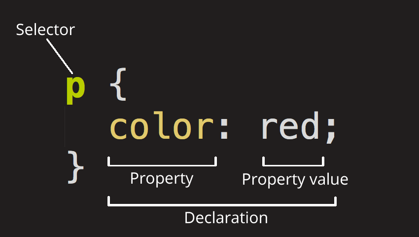

前端

## 网站内容

### 网站文件结构


HTML (**H**yper**T**ext **M**arkup **L**anguage) is the code that is used to structure a web page and its content.组织网站内容结构

### html代码结构

```html
<!DOCTYPE html>
<html lang="en-US">
  <head>
    <meta charset="utf-8" />
    <meta name="viewport" content="width=device-width" />
    <title>My test page</title>
  </head>
  <body>
    
  </body>
</html>

```


> Here, we have the following:
>
> - `<!DOCTYPE html>` — [doctype](https://developer.mozilla.org/en-US/docs/Glossary/Doctype). It is a required preamble. In the mists of time, when HTML was young (around 1991/92), doctypes were meant to act as links to a set of rules that the HTML page had to follow to be considered good HTML, which could mean automatic error checking and other useful things. However, these days, they don't do much and are basically just needed to make sure your document behaves correctly. That's all you need to know for now.
> - `<html></html>` — the [``](https://developer.mozilla.org/en-US/docs/Web/HTML/Element/html) element. This element wraps all the content on the entire page and is sometimes known as the root element. It also includes the `lang` attribute, setting the primary language of the document.
> - `<head></head>` — the [``](https://developer.mozilla.org/en-US/docs/Web/HTML/Element/head) element. This element acts as a container for all the stuff you want to include on the HTML page that *isn't* the content you are showing to your page's viewers. This includes things like [keywords](https://developer.mozilla.org/en-US/docs/Glossary/Keyword) and a page description that you want to appear in search results, CSS to style our content, character set declarations, and more.
> - `<meta charset="utf-8">` — This element sets the character set your document should use to UTF-8 which includes most characters from the vast majority of written languages. Essentially, it can now handle any textual content you might put on it. There is no reason not to set this, and it can help avoid some problems later on.
> - `<meta name="viewport" content="width=device-width">` — This [viewport element](https://developer.mozilla.org/en-US/docs/Web/CSS/Viewport_concepts#mobile_viewports) ensures the page renders at the width of viewport, preventing mobile browsers from rendering pages wider than the viewport and then shrinking them down.
> - `<title></title>` — the [``](https://developer.mozilla.org/en-US/docs/Web/HTML/Element/title) element. This sets the title of your page, which is the title that appears in the browser tab the page is loaded in. It is also used to describe the page when you bookmark/favorite it.
> - `<body></body>` — the [``](https://developer.mozilla.org/en-US/docs/Web/HTML/Element/body) element. This contains *all* the content that you want to show to web users when they visit your page, whether that's text, images, videos, games, playable audio tracks, or whatever else.

#### 代码注释

Anything in HTML between `<!--` and `-->` is an **HTML comment**

### 文本标注元素


## 内容风格

CSS (Cascading Style Sheets) is the code that styles web content.

```html
p {
  color: red;
}
```

Open your `index.html` file. Paste the following line in the head (between the [``](https://developer.mozilla.org/en-US/docs/Web/HTML/Element/head) and `</head>` tags):

 <link href="styles/style.css" rel="stylesheet" />




> - Selector
>
>   This is the HTML element name at the start of the ruleset. It defines the element(s) to be styled (in this example, [``](https://developer.mozilla.org/en-US/docs/Web/HTML/Element/p) elements). To style a different element, change the selector.
>
> - Declaration
>
>   This is a single rule like `color: red;`. It specifies which of the element's **properties** you want to style.
>
> - Properties
>
>   These are ways in which you can style an HTML element. (In this example, `color` is a property of the [``](https://developer.mozilla.org/en-US/docs/Web/HTML/Element/p) elements.) In CSS, you choose which properties you want to affect in the rule.
>
> - Property value
>
>   To the right of the property—after the colon—there is the **property value**. This chooses one out of many possible appearances for a given property. (For example, there are many `color` values in addition to `red`.)
>
> Note the other important parts of the syntax:
>
> - Apart from the selector, each ruleset must be wrapped in curly braces. (`{}`)
> - Within each declaration, you must use a colon (`:`) to separate the property from its value or values.
> - Within each ruleset, you must use a semicolon (`;`) to separate each declaration from the next one.

```html
p {
  color: red;
  width: 500px;
  border: 1px solid black;
}

```

代码注释

Anything in CSS between `/*` and `*/` is a **CSS comment**