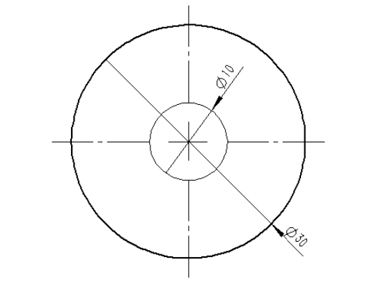

均匀性校准图片生成

- 设备类型：

  - reflex
  - chairside
  - chairside pro
  - A2D 4K
  - 2K
  - A2D

- 幅面参数

  | 设备          | 幅面尺寸(height x width)(mm) | 分辨率（height x width） | 像素大小（mm） |
  | ------------- | ---------------------------- | ------------------------ | -------------- |
  | reflex        |                              | 3600 x 5760              | 0.0344         |
  | chairside     |                              | 1080 x 1920              | 0.065          |
  | chairside pro |                              | 1080 x 1920              | 0.075          |
  | A2D 4K        |                              | 2160 x 3840              | 0.0535         |
  | 2K            |                              | 1528 x 2712              | 0.078          |

  

光度计尺寸

