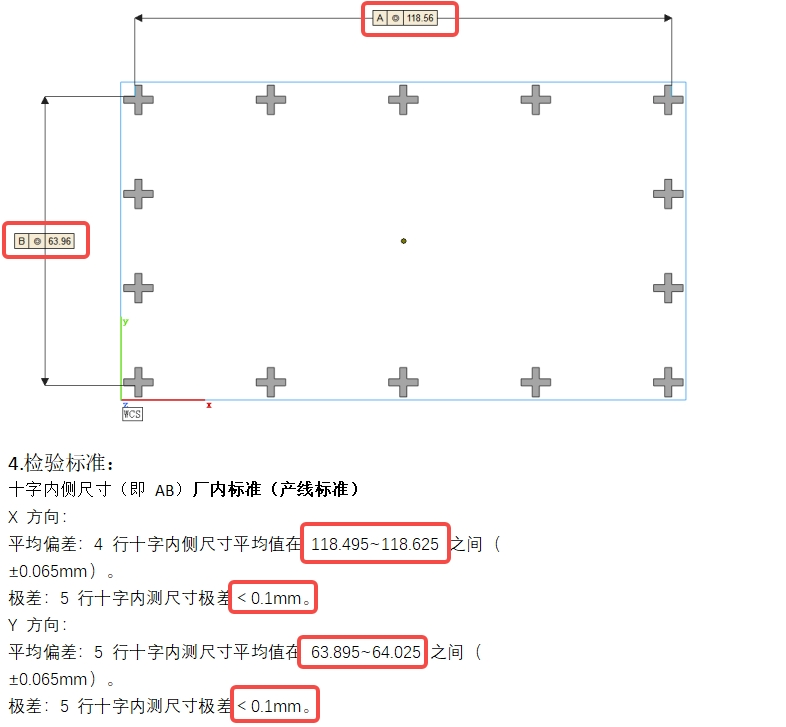
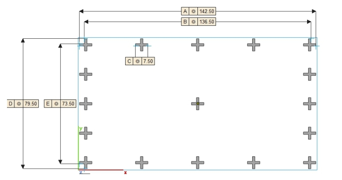
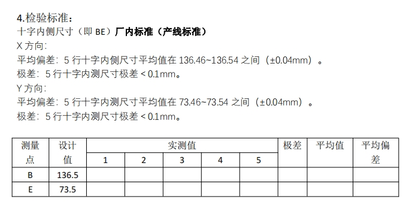
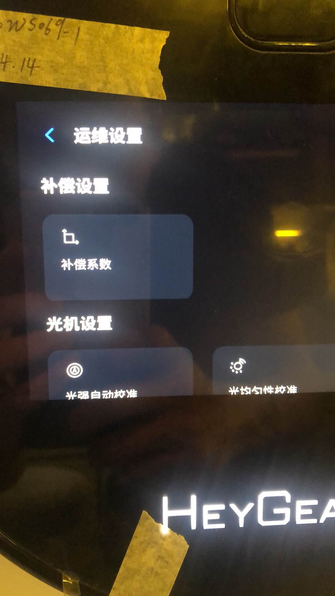
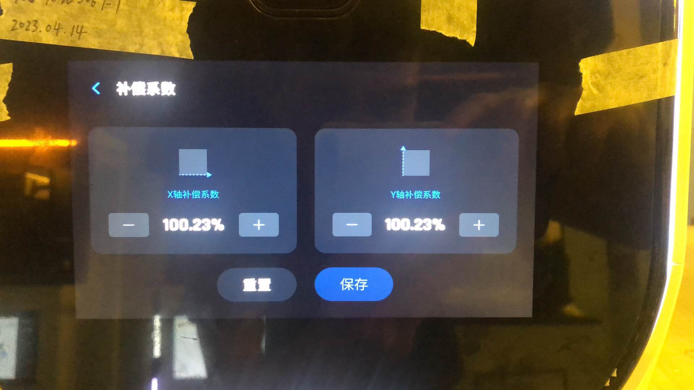

快速标定

需求

- 辅助光源会被拍入照片中，影响标定板识别点
- 放入cloud中，
- 本地运算，然后保存一份备份
- 标定前自己判断自己是否是准确的
  - 陀螺仪
  - 相对平行、居中等对算法的影响大小
- 标定机的移动或固定问题
- 验收及备件
- 标定过程遮光
- 标定板管控、长久紫外照射变黄

相机：可选择分辨率更高相机

- 标定板的圆点在拍摄的图片中所占的像素多少，从而会影响精度

标定板：误差1-3微米

辅助光源：可选择固定强度光源，或者数字控制光源

如何保证相机工作距离变化不大

- 找到算法的区间
- 找到机械结构误差的区间

A3D:

- 双光机均标定正常时，进行错位拼接
  - 分别打印单个光机的十字件，
- 双光机标定不正常
  - 需要先标定好单个光机，然后再进行校正

标定参数

- mapx：其中offset，是对所有点在x轴方向上偏移。角度是对整体旋转对应角度

跨拼接区：

- 跨拼接x轴：双光机打印区——x轴的距离
  - 设计值：151.2mm
  - 测量值合格范围（一个灰度值偏差）：151.2-0.075=151.125~~151.2+0.075=151.275
  - 极差：测量值的最大值减去最小值
- 光机1 x轴：单个光机打印区——x轴的距离
  - 设计值：69.9mm
  - 测量值合格范围（一个灰度值偏差）：69.9-0.075=69.825~~69.9+0.075=69.975

A2D：

幅面物理尺寸：144mm x 81mm

和刘卫同步信息

杨峰讨论需求

CS：

幅面物理尺寸：124.8mm x 70.2mm

**如何将设备放入架子内？**

（02.27-03.03）第1周：确定项目时间线、分割项目主要步骤（可参考文档OA《项目规程》）

找需求方开会了解需求，确定需求，会后提供需求说明文档

查看需求

实际体验需求：感受需求到底是什么样的，实际感受到的痛点，才能真正站在对方解决问题，解决需求；

收集基础信息：和需求有关的信息都要收集起来分析（询问了解的人，网上搜寻资料），寻找他们之间存在的联系，找到需求的可能解决方案，如果没有什么眉头，组织会议一起讨论；

可行性方案：有了可行性方案后，开会评审，主要涉及的是时间、成本、还有当前技术实力可行性方案能否覆盖所有的需求；

项目团队配合：各方进行分工，确定时间节点，结合可行性方案分解成各方的技术需求，对各方提出技术需求，请各方根据自己的需求确定时间节点；

检视项目完成情况：查看各方的完成情况，预判时间节点能否完成，影响时间节点的因素，提前处理；

需求：充分、细致、具体的需求，这个需求前期不一定能说得足够准确，后期过程还要不断跟进更新，同时要不断讨论，基于现有资源能否完成。

- 到底解决什么问题？
- 使用场景：什么场合下使用，和初步的技术方案是否有矛盾点（初步的技术方案的场景是什么样的）
- 数量：决定是否开模、成本等
  - 如何决定数量：和使用该模块的产品的项目经理、使用的人员讨论

- 需求说明书
- 从需求中提取出技术点
- 快速标定：
  - 场景：生产设备装配流程中的哪个步骤使用，从而决定
    - 标定设备的机械安装结构
    - 软件运行平台

  - 便携性：重量、体积
  - 结构复杂程度、操作复杂度
  - 快速：时间长短
  - 结果准确性

- 对公司产生什么样的价值
- 项目背景：我们在哪里？为什么要做这个项目，解决什么问题，可以列出一些数据说明项目的必要性。
- 商业价值：我们去哪里？最关键的重点！大老板们最感兴趣的，做了这个项目以后有什么价值，一定要说在点子上。一般我们还会预测一下相关数字的变化，提出这个项目的商业目标。
- 功能需求描述：我们怎么去？通过做哪些事情来达到目标，把打好包的需求描述一下，可以用功能列表的形式表达，但最好能画出业务逻辑关系。当然我们也经常会搞点技巧性的东西，比如故意加入一些让老板砍的需求，希望老板砍完之后心有愧疚不好意思再砍我们真正想做的东西，这有点类似谈判技巧里的玩意，大家可以试试，但不要在这上面太花心思了。
- 非功能需求描述：提一下重要的非功能需求，如果有的话。
- 资源评估：第二个重点！大老板们要看成本，他们在了解达成项目的目标需要多大的花费以后，才能做出决策。
- 风险和对策：有的项目会有一些潜在风险，这个时候不妨抛给老板们看一下，并且给出自己的对策，说不定你觉得是很大的麻烦，在老板那里一句话就可以搞定。而且由于信息的不对称，我们无法了解某些功能是否会与公司将来的战略冲突，这时候提出来也是让老板们把一下关

需求：

开会前先和相关人员多沟通信息，拿到更多一手信息

CS快速标定：

A3D便携式标定：

将问题抽象出来，协调设备进行复现，

（03.06-03.10）第2周：确定项目团队成员、对机械结构成员提供需求，进行头脑风暴，讨论可能结构方案，搭建平台结构，验证猜想，找出参数，形成技术方案

- 先自己确定需要哪些成员，然后和他们的直接上级对接，提前了解他们现在的项目，了解他们能够出的人力
- 找光学工程师、及更有经验的光学工程师等，进行头脑风暴，确定可能的机械结构方案，因为方案涉及光学布置，所以需要光学及机械一起参加
- 确定光学、机械工程师等的具体任务，然后设置任务节点时间
- 会后搭建结构，测量需要的参数
- 光学工程师寻源，找到合适的光学方案
- 会议结束前最后总结一下各自的任务，及任务节点

（03.13-03.17）第3周：可行性验证测试，找出参数，出结构图、时间紧急可出示意图，期间可以研究算法实现，索要需求说明文档，和大佬讨论需求文档和可行性方案，讨论硬件电气结构方案

- 对于前期需求不明确的需求者，可再次沟通，确定需求，并提供需求说明文档
- 需求说明文档用来确定项目范围，防止后期项目主线偏移，项目范围异动
- 期间可了解一下具体工程师的任务进度，对有延期风险的提前沟通，并准备解决方案
- 找相关负责大佬讨论需求文档和可行性方案，因为可能存在未考虑的点
- 硬件电气结构方案：设备接线及电子设备选型（包括显示器和主机等），要考虑实际的接线场景，软件能否满足要求
- 各方工程师的方案要在组内核对，和他们的上级领导核对后再给到我们

（03.20-03.24）第4周：和大佬评审（仅限研发内部人员，勿拉其他部门），机械、电气结构，确定立项报告

- 不要拉外部人员
- 各专业的方案要他们先经过他们组长看过之后，才收，不要出现在评审会上各组组长不知道他们组的方案的情况
- 项目组成员的工时需要和他们一一确认，

（03.27-03.31）第5周：

快速测试，拿出可行性数据结果后，再拉老板开外部评审，可以找老叶讨论快速走立项流程，先立项后开始采购搭建测试平台获取可行性数据。

（04.03-04.07）第6周：软件算法开发完成、CS及A2D设备标定快速验证

实际：搭建好CS结构，等待算法调试好参数才能使用，标定快速验证和物料采购并行

（04.10-04.14）第7周：3台CS快速验证，A2D算法调试好快速验证，了解标定算法

（04.17-04.21）第8周：调试标定程序，布置到笔记本电脑上

（04.24-04.28）第9周：笔记本上全流程调试

（05.08-05.12）第10周：CS通达验证，A2D算法调试

（05.15-05.19）第11周：CS通达标定验证，算法程序部署到装Ubuntu系统的电脑上。

（05.22-05.26）第12周：CS打印验证，算法程序已部署到ubuntu系统，

（05.29-06.02）第13周：CS再次打印验证（因为上周验证时标定使用的是非抬高组件，打印时又使用的是抬高组件）

（06.05-06.09）第14周：CS快速标定过程失败问题分析

（06.12-06.16）第15周：CS快速标定内部评审通过，调试A2D快速标定

核心问题总结：

- 机械、电气结构

- 算法开发（算法即解决问题的逻辑，开发即开发成可操作的，有交互界面的软件，可以进行交互）
  - 算法：需要知道一步步的逻辑，该怎么做；
  - 开发：获得软件
- 软硬件调试（保证算法程序整个流程跑通，然后才可以拿到设备上去使用，保证不会在设备上跑不通）
  - 需要协调运算平台设备即笔记本电脑，（算力足够、可移动），并确定使用的系统windows或linux。
  - 调试完成输出一份操作sop，才能让测试同学正常操作；
  - 对操作同学进行培训（两名或两名以上），防止之后人力不足时无人可用；
  - 及时更新，不要用旧的操作sop操作新的软件，当算法程序在测试过程中出现问题后并更新后，要及时更新sop。
- 设备测试（在多台设备上测试，拿数据）
  - 需要协调设备
  - 需要协调合格的测试同学，具有对应操作能力的，对结果负责的同学；
  - 人员协调，没有合适的测试验证人员；
  - 设备协调： 
  - 操作培训：输出操作文档，然后你做他看，再你看他做；
  - 过程问题反馈解决：
    - 安装远程操作软件；
    - 建立共享盘，错误信息及文件保存
    - 飞书
  - 算法开发会根据测试结果中的问题迭代更新算法：测试人员如何去反馈问题给算法开发，算法开发完成后测试人员是否会使用新开发的软件版本，例如涉及到linux操作。
  - 人员协调——操作培训——过程问题反馈
  - 根据是否需要工艺测试，可将测试人员安排为工艺同学，因为在打印过程中，需关注工艺相关问题，而在测试的时候，也会对整个过程更熟悉。例如在这次标定过程中，标定使用了非抬高组件，而打印使用了抬高组件，这个问题在工艺同学那里可能就会避免
- 工艺测试（根据项目结果需求，可以要工艺测试或不用）
  - 工艺结果标准
  - 关注工艺打印过程
  - 关注打印结果
- 结论并准备评审。

06.02：最重要的事

- 测完通达剩下的2台CS
- 使用快速标定来标定1台A2D，并在标定机上复检，争取打印十字件。

（06.05-06.09）第14周：完成3台cs打印，发现其中两台打印的十字件即使是场内标定机标定，十字件也偏大，a2d使用自研标定的光学结果四周偏大。

- 完成通达3台CS自研标定的十字件打印（注意使用非抬高组件）

  - 只用关注过程及结果

- A2D的自研标定测试，标定机上验证及十字件打印

  - 协调3台a2d设备；
  - 协调人力一个，整周，会使用标定机标定a2d设备

~~06.05：评审~~

CS的可行性：

- 自研标定数据
- 工艺打印验证结果

CS对应的风险：

（06.12-06.16）第15周：

CS标定过程中的变量风险

A2D标定光学结果偏大原因分析

- 在相同的光学环境下（设备推到标定机旁边），使用自研标定和标定机分别标定，获取calibration文件

（06.19-06.23）第16周：自研快速标定使用AP打印偏大问题排查，定位到是使用离型膜也会偏大，原因是标定距离及焦距影响；

（06.26-06.30）第17周：A2D快速标定全流程跑通，并通过打印验证；调试win版快速标定程序

（07.03-07.07）第18周：CS上AP膜标定复检合格，并打印验证成功，win版本程序调试通过，等待使用一台设备做全流程标定复检

（07.10-07.14）第19周：进行3台A2D设备的准确性及稳定性测试，以及工艺打印验证

07.10：

- 整理分析快速标定软件通讯框架，学习如何功能分割设计程序；

- 协助进行A2D的准确性稳定性测试，测试过程中出现偶发性的电脑和光机屏幕调换，从更换光机控制线之后就经常偶发该问题；
- CS使用AP膜打印验证通过后的设备打印C型标牙出现精度下降问题，为70%，场内标定机标定打印标牙精度80%，可能和打印的工艺包中缩放系数适配场内绷膜抬高方案的有关；
- 

（07.17-07.21）第20周：开发程序界面识别图片灰度，图片放大缩小及重合拍图标定方式。

（07.24-07.28）第21周：分析算法中偏转角度识别方式，并提供使用斜率及极坐标的角度计算方式，及进行相机镜头畸变矫正，找到张正友棋盘格算法代码，拍棋盘格图进行相机畸变矫正。

（07.31-08.04）第22周：使用相机矫正后的结果进行复检验证。

07.31：进行多版使用张正友棋盘格法相机畸变矫正，查看稳定性，结果：只有第一版获得结果最好，黑点间距矫正效果好，其他版都会存在矫正过头情况

08.01：1. 分析旋转角度得到后的旋转矩阵正负问题，结果：需要纠正回来的图形需要在旋转矩阵的角度里变为负；2. 使用相机镜头畸变矫正后的结果进行设备复检，两列标红的数据好转了。

算法流程及数据链流

各个变量之间的相关关系及影响，如何控制；

1. 标定数据运算过程增加中间数据导出；
2. 计时功能：从扫描枪扫描开始，至整个标定过程结束（自动模式需要计时功能，手动模式不需要计时功能）；
3. **自动模式流程图；**
4. 幅面大小检测：只需投图功能即可；
5. 显微镜驱动Linux版；
6. 显示屏大小：17英寸；
7. **标定状态设备到整机状态设备标定数据验证。**

相机镜头的差异性：镜头不同，导致收光面呈现的结果不一样，对结果的影响

相机俯仰角度不同，对结果的影响

- CS和A2D两个项目分开评审
- 根据会议需求确定与会人员（会议范围）
- 工程输出更换A2D光机操作时长（拆卸、安装）
- 光学：辅助光源12V寻源
- 各专业方案输出需经过各专业组长确认
- **算法：预研结果复检和徐工确认**
- 机械：方便CS标定板放入
- 标定板降本（A2D、CS）
- 方案一和方案二的机械结构偏差范围（工作距离、水平）
- **找老叶过项目，先批项目，之后再补外部评审**
- 各专业人力工时确认
- 硬件电气：主机确定（机箱+显示器）
- 可行性结果输出后进行外部评审（预估四月底）
- 撰写立项报告

CS设备，左，时间

A2D设备

主轴上限位偏差

上限位的距离设置是基于哪个基准设置的

整套安装结构的高度偏差

相机镜头安装完成后的水平度

先立项，再走项目变更（请教谢俊是否可行，项目变更范围）

区分项目的核心功能和非核心功能，核心功能先做快速可行性验证，不要把重心放在最后的产品框架方面

[工业相机与镜头选型方法（含实例）_工业相机选型_肯定有人改了我的代码的博客-CSDN博客](https://blog.csdn.net/qq_40770527/article/details/104827855)

极端参数：

相机：x，y，z轴位置及水平度

需要确定下来的工作环境：

相机：x，y，z轴位置及水平度

光机投光电流：（现行标定电流200）

辅助光源光强：使照片背景灰度达到130/140左右

相机工作参数：曝光时间、焦距、光圈等（焦距会影响标定结果，越清晰效果越好）

标定板：去掉上面的字母及十字线

标定板摆放：标定板上黑点和白点在同一水平线上，然后间隔2mm左右间距

CS：

A2D：

短期：

长期：继续深入，例如机器视觉方向

如何接入软件组的工作流程

软件轮岗：

时间：3-6个月

需求：

承担一些标定算法开发工作

- 标定算法在A2D上适配，包括参数调整，尺寸适配
- 基于测试结果进行分析优化

方案开发流程（方案——开发（开发语言、开发平台）——部署）

版本管控

解决问题的逻辑方法

时间点排清楚

硬件测试/工艺测试的同学介入

快速标定所需物件

- CS
  - CS半成品机器
  - CS标定机架
    - 工业相机
    - 相机电源线（或poe交换机）
    - 相机网线
  - 料盘
  - 标定板
  - 
- A2D

CS极端情况验证（算法准确性、稳定性及鲁棒性）

同一情况下拍三次验证算法稳定性

确定没问题后

调节相机高度及辅助光源亮度、位置拍图验证

机械结构的差异性

相机的差异性（一致的物在不同相机内（相机参数相同）呈现的像的像素大小以及畸变情况）

算法对图像处理的过程（畸变情况矫正的影响），光机投出白点每个点每个像素边缘的变化

CS十字件合格标准

如何计算：

CS像素：

（1920个像素-96个像素）* 0.065 = 118.56mm（投图的设计标准）

设计标准上可以±1个像素大小偏差（0.065）即：118.56-0.065=118.495mm ~~ 118.56+0.065=118.625mm

极差：是测量数据的极差，即最大值减最小值。

A2D十字件合格标准

快速标定工艺验证评审

关注的问题：

- 快速标定和通达标定机对比，准确性如何？
  - 全幅面标定结果按区间统计分析；
  - 工艺打印的十字件结果分析；
- 影响快速标定结果的因素？
- 标定不达标时如何处理？

工艺问题：

CS

- 标定时红点比例多少来确定是否合格；
- 标定不合格时如何调整；
- 打印时使用系数调整是什么逻辑？

A2D

- 在0.5的标准下，大于2个红点需要重新标定；
- 不合格时一般擦拭标定板，再重新标定。

周会如何促进大家分享项目中获得的经验

然后将经验制定成流程，给大家使用

CS方向

1. 产品化
   1. 固定式（易于测试及更改）
      1. 高度（激光测距仪）
      2. 对中（）
      3. 相机镜头水平
      4. 辅助光源结构安放
      5. 设备放入
2. 软件测试
   1. 在相同的光学环境下，能否稳定复现结果；
   2. 
3. 批量验证
