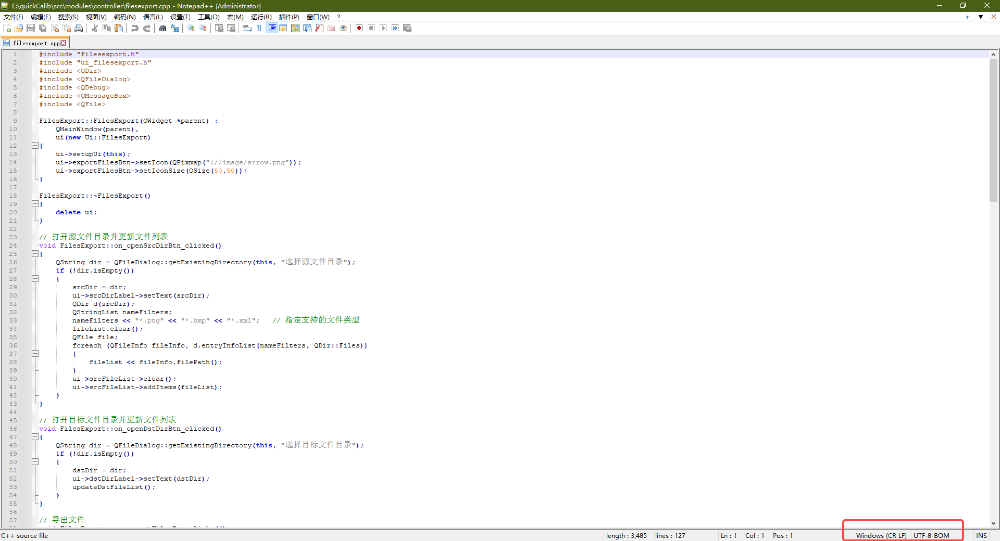
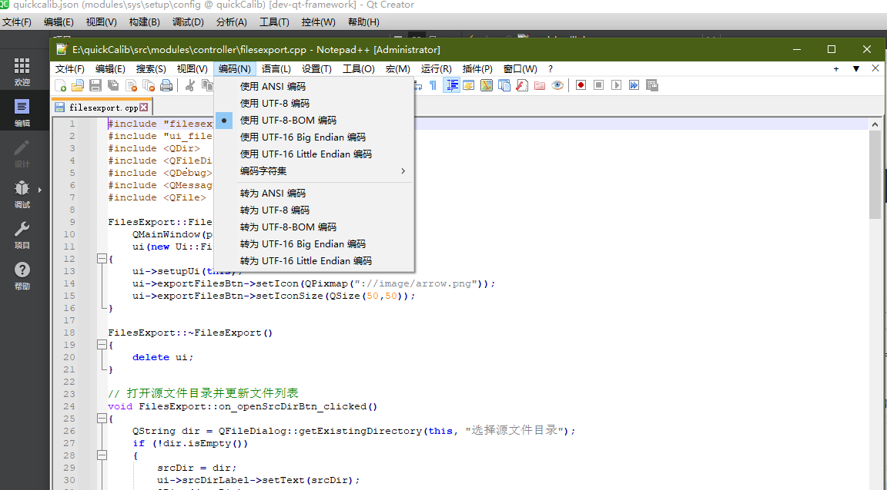

快速标定Windows下exe文件打包

1. 使用profile编译、运行，获得exe文件；
2. 使用qt的exe打包工具（编译运行使用的是什么编译器，就选择对应的打包exe）

3. 打开命令行powershell，将该exe打工工具，及编译运行生成的exe，分别拖入到powershell中，按下enter，即可完成打包
4. 将运行后的exe所在的bin文件夹拷贝，以及lib库一起拷贝到指定电脑
5. 将lib库的路径及bin文件夹的lib路径加入到系统环境变量中

这两个文件夹，要进入对应的文件夹中，然后复制路径

在Windows下的Qt中编译时出现如下错误

`cl: 命令行 warning D9002 :忽略未知选项“-source-charset:utf-8”`

原因：

项目文件的cpp文件中有中文字符

解决办法：

源码文件中有中文字符，一定要utf-8带bom格式；

检查方法：

可以使用notepad++打开该cpp文件，

查看右下角格式，如果不是utf-8带bom格式，则使用编码菜单进行转换成utf-8带bom格式

之后再在Qt中进行编译

://config/quickcalib.json