快速标定不同投图方式

CS：错开投图和重合投图差别

black and bright:

Calibration board info:
  name = CS
  gsize = (16, 16)
  gap_mm = (4.68, 8.32)
  shape = (1080, 1920)
  mm_pixel = 0.065
  square_size = (12, 12)
  black_spot_diameter = 0.5
dark: Dectect params:
  area = 306.3217467361034
  epsilon = 1e-06
  aspect_ratio = 0.7
  filling_ratio = 0.7065
  area_redundancy_ratio = 0.6
  center_confidence_factor = 0.85
bright: Dectect params:
  area = 949.1550115578018
  epsilon = 1e-06
  aspect_ratio = 0.7
  filling_ratio = 0.7065
  area_redundancy_ratio = 0.6
  center_confidence_factor = 0.85
darks: CalibPoints info:
  center = [2629.88539808 1478.62809266]
  angle = -0.16445634629991207

brights: CalibPoints info:
  center = [2635.94297553 1490.23249131]
  angle = 0.02128787570528819

pixel_mm= 39.142
max_mm_dev= 0.583 mm
max_pixel_dev= 8.969 pixels

calib

Calibration board info:
  name = CS
  gsize = (16, 16)
  gap_mm = (4.68, 8.32)
  shape = (1080, 1920)
  mm_pixel = 0.065
  square_size = (12, 12)
  black_spot_diameter = 0.5
dark: Dectect params:
  area = 306.3217467361034
  epsilon = 1e-06
  aspect_ratio = 0.7
  filling_ratio = 0.7065
  area_redundancy_ratio = 0.6
  center_confidence_factor = 0.85
bright: Dectect params:
  area = 949.1550115578018
  epsilon = 1e-06
  aspect_ratio = 0.7
  filling_ratio = 0.7065
  area_redundancy_ratio = 0.6
  center_confidence_factor = 0.85
darks: CalibPoints info:
  center = [2571.41974099 1494.1310243 ]
  angle = -0.4288842095269155

brights: CalibPoints info:
  center = [2636.01668472 1490.11017181]
  angle = 0.0136988321940071

pixel_mm= 39.146
max_mm_dev= 0.551 mm
max_pixel_dev= 8.477 pixels

A2D

文件路径： E:\快速标定\a2d不同标定方式比较

使用相机供应商的软件拍图

black and bright:

Calibration board info:
  name = A2D
  gsize = (16, 16)
  gap_mm = (5.4, 9.6)
  shape = (1080, 1920)
  mm_pixel = 0.075
  square_size = (6, 6)
  black_spot_diameter = 0.5
dark: Dectect params:
  area = 191.78509725713553
  epsilon = 1e-06
  aspect_ratio = 0.7
  filling_ratio = 0.7065
  area_redundancy_ratio = 0.6
  center_confidence_factor = 0.85
bright: Dectect params:
  area = 197.79257963411794
  epsilon = 1e-06
  aspect_ratio = 0.7
  filling_ratio = 0.7065
  area_redundancy_ratio = 0.6
  center_confidence_factor = 0.85
darks: CalibPoints info:
  center = [2376.10316552 1358.49897672]
  angle = 0.3676695929633217

brights: CalibPoints info:
  center = [2377.1379101 1353.202101 ]
  angle = -0.001187049018007258

pixel_mm= 30.798
max_mm_dev= 1.182 mm
max_pixel_dev= 15.76 pixels

calib

Calibration board info:
  name = A2D
  gsize = (16, 16)
  gap_mm = (5.4, 9.6)
  shape = (1080, 1920)
  mm_pixel = 0.075
  square_size = (6, 6)
  black_spot_diameter = 0.5
dark: Dectect params:
  area = 191.78509725713553
  epsilon = 1e-06
  aspect_ratio = 0.7
  filling_ratio = 0.7065
  area_redundancy_ratio = 0.6
  center_confidence_factor = 0.85
bright: Dectect params:
  area = 197.79257963411794
  epsilon = 1e-06
  aspect_ratio = 0.7
  filling_ratio = 0.7065
  area_redundancy_ratio = 0.6
  center_confidence_factor = 0.85
darks: CalibPoints info:
  center = [2323.03259412 1350.6802729 ]
  angle = -0.009263186984597382

brights: CalibPoints info:
  center = [2376.93739319 1353.55338646]
  angle = -0.0022881401909723804

pixel_mm= 30.796
max_mm_dev= 1.17 mm
max_pixel_dev= 15.6 pixels

标定前获取的calibration数据

dx方向：

black_bright

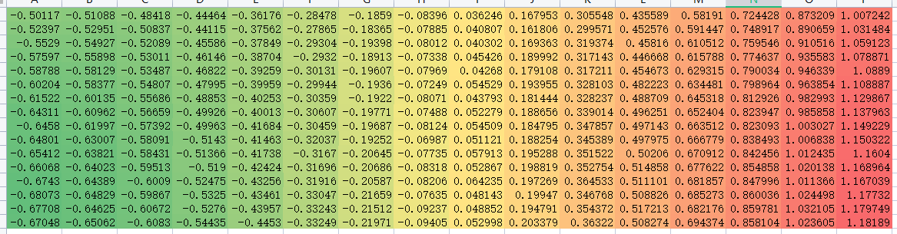

calib

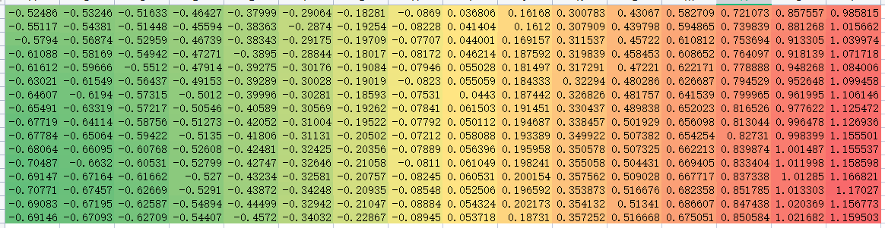

black_bright 减去 calib

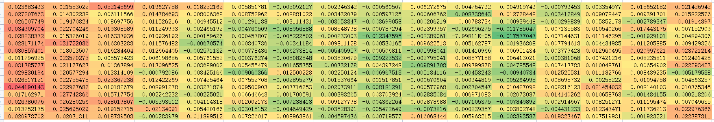

作用标定后的图片

两图最左边进行对比：

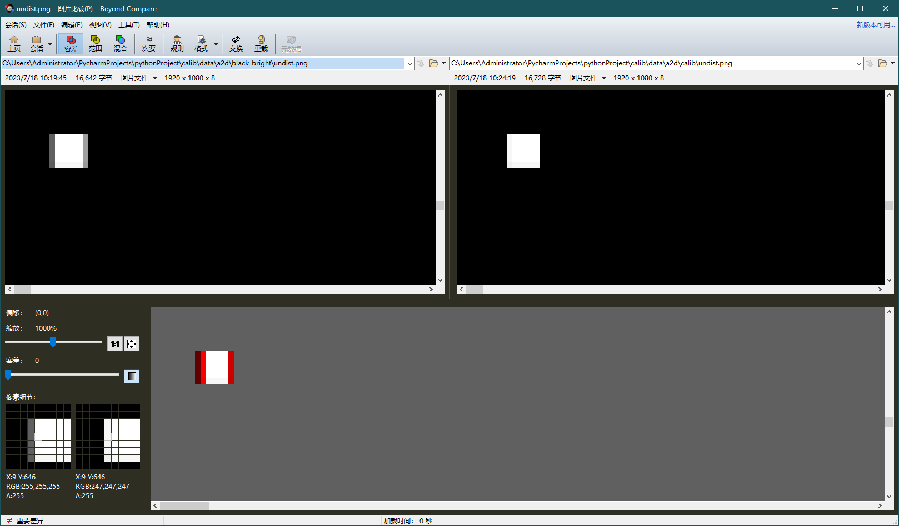

两图最右边进行对比：

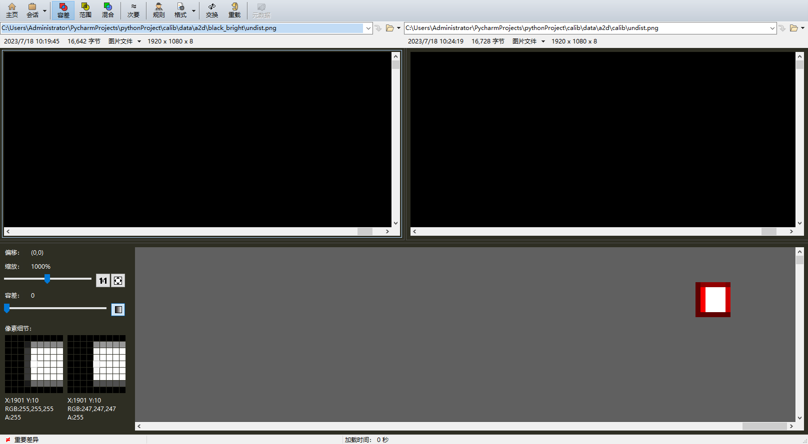

black_bright相比calib有向左拉的效果

标定复检

black_bright

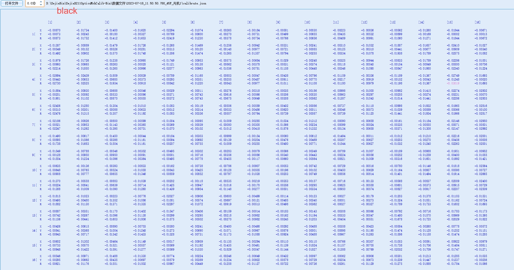

calib

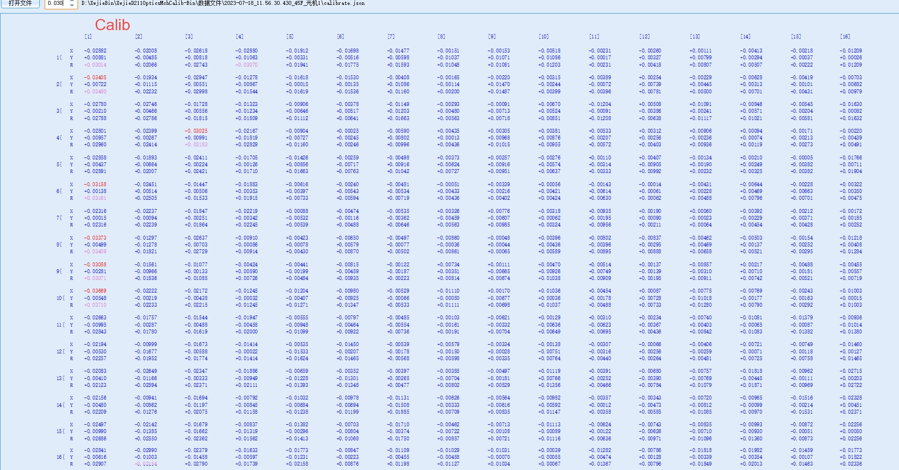

A2D 第2台设备

使用自研软件进行标定

bright-dark:

Calibration board info:
  name = A2D
  gsize = (16, 16)
  gap_mm = (5.4, 9.6)
  shape = (1080, 1920)
  mm_pixel = 0.075
  square_size = (6, 6)
  black_spot_diameter = 0.5
dark: Dectect params:
  area = 176.66428766976185
  epsilon = 1e-06
  aspect_ratio = 0.7
  filling_ratio = 0.7065
  area_redundancy_ratio = 0.6
  center_confidence_factor = 0.85
bright: Dectect params:
  area = 182.1981253349236
  epsilon = 1e-06
  aspect_ratio = 0.7
  filling_ratio = 0.7065
  area_redundancy_ratio = 0.6
  center_confidence_factor = 0.85
darks: CalibPoints info:
  center = [2292.73692457 1297.55617286]
  angle = 0.3036988152398029

brights: CalibPoints info:
  center = [2292.8400924  1296.69987367]
  angle = 0.09467052883571844

pixel_mm= 29.645
max_mm_dev= 0.547 mm
max_pixel_dev= 7.293 pixels

calib

Calibration board info:
  name = A2D
  gsize = (16, 16)
  gap_mm = (5.4, 9.6)
  shape = (1080, 1920)
  mm_pixel = 0.075
  square_size = (6, 6)
  black_spot_diameter = 0.5
dark: Dectect params:
  area = 176.66428766976185
  epsilon = 1e-06
  aspect_ratio = 0.7
  filling_ratio = 0.7065
  area_redundancy_ratio = 0.6
  center_confidence_factor = 0.85
bright: Dectect params:
  area = 182.1981253349236
  epsilon = 1e-06
  aspect_ratio = 0.7
  filling_ratio = 0.7065
  area_redundancy_ratio = 0.6
  center_confidence_factor = 0.85
darks: CalibPoints info:
  center = [2242.01470973 1300.66865017]
  angle = 0.16235122680664676

brights: CalibPoints info:
  center = [2293.02470027 1304.40831881]
  angle = 0.10001313951279892

pixel_mm= 29.648
max_mm_dev= 0.568 mm
max_pixel_dev= 7.573 pixels

标定前的calibration数据

dx方向

bright-dark

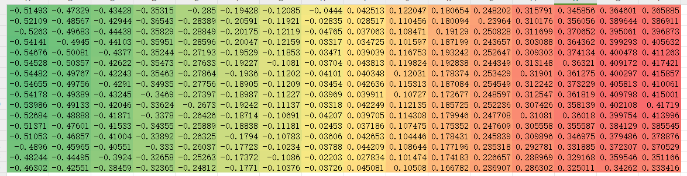

calib

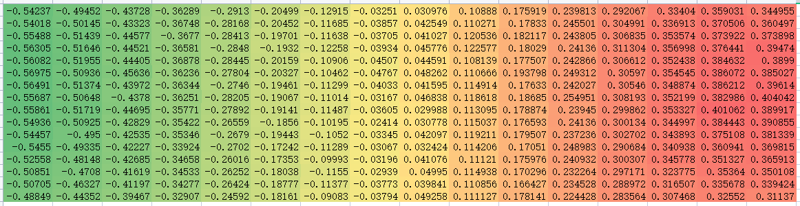

bright-dark 减去 calib

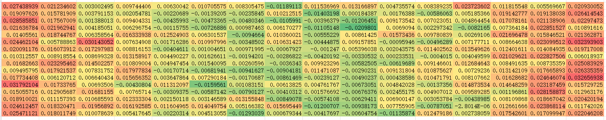

black_bright相比calib有向左拉的效果

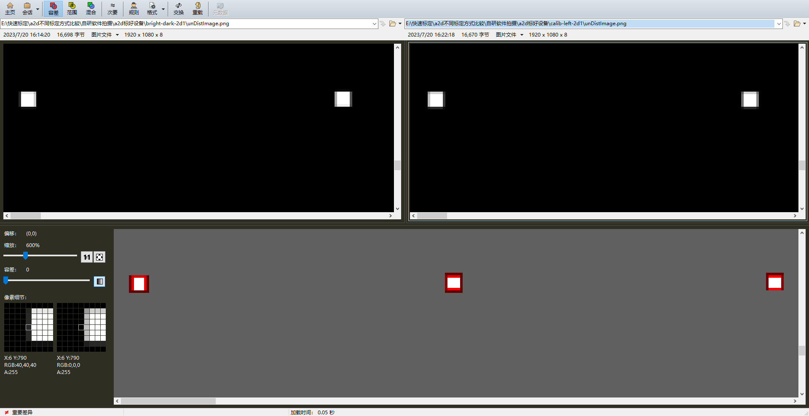

标定复检

bright-dark

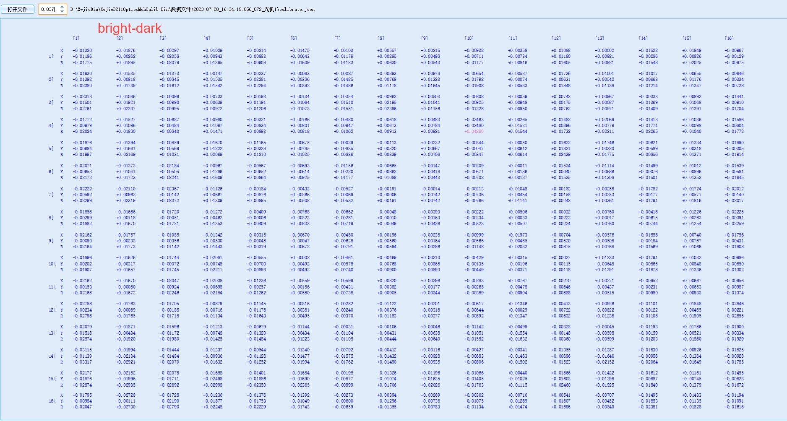

calib

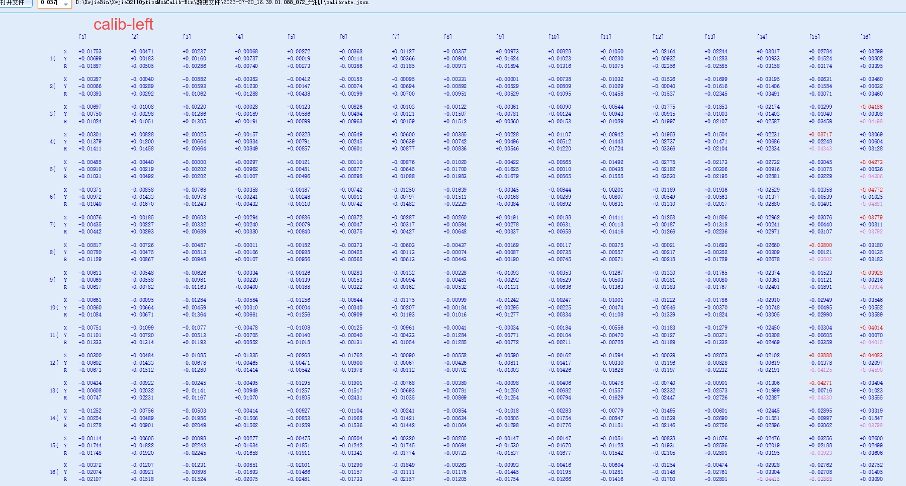

A2D:

路径E:\快速标定\a2d设备标定板左右摆放不同问题\标定板靠左摆放-h215-g120

Calibration board info:
  name = A2D
  gsize = (16, 16)
  gap_mm = (5.4, 9.6)
  shape = (1080, 1920)
  mm_pixel = 0.075
  square_size = (6, 6)
  black_spot_diameter = 0.5
dark: Dectect params:
  area = 178.781665656102
  epsilon = 1e-06
  aspect_ratio = 0.7
  filling_ratio = 0.7065
  area_redundancy_ratio = 0.6
  center_confidence_factor = 0.85
bright: Dectect params:
  area = 184.38182813544518
  epsilon = 1e-06
  aspect_ratio = 0.7
  filling_ratio = 0.7065
  area_redundancy_ratio = 0.6
  center_confidence_factor = 0.85
darks: CalibPoints info:
  center = [2255.48118791 1301.92504603]
  angle = -0.2618977016872819

brights: CalibPoints info:
  center = [2312.36450282 1309.67905043]
  angle = -0.0911431206597205

pixel_mm= 29.849
max_mm_dev= 1.188 mm
max_pixel_dev= 15.84 pixels