快速标定工程在win下结构

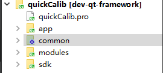

`modules`文件夹下放置各个功能模块，其中`modules.pro`类似于cmake文件，将各个目录组织起来

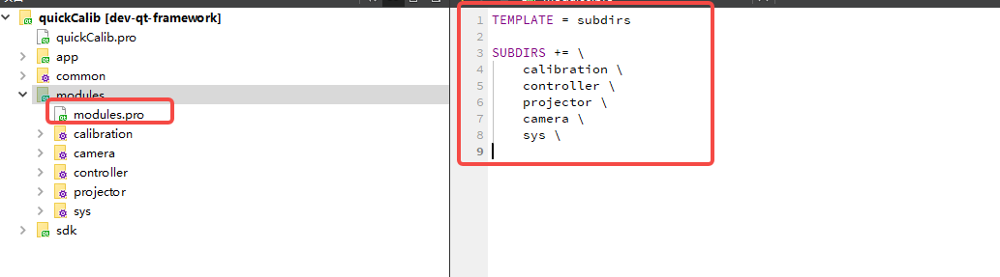

sdk文件夹确定了整体通讯框架，invoke，publish函数等的使用

在文件目录中的文件结构

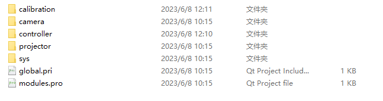

在Qt的.pro文件中，TEMPLATE指定了项目类型。在这个例子中，TEMPLATE的值是subdirs，表示该.pro文件是一个包含多个子目录的项目。

```
TEMPLATE = subdirs
SUBDIRS += \
    subdir1 \
    subdir2 \
    subdir3

```


其中某个模块的结构

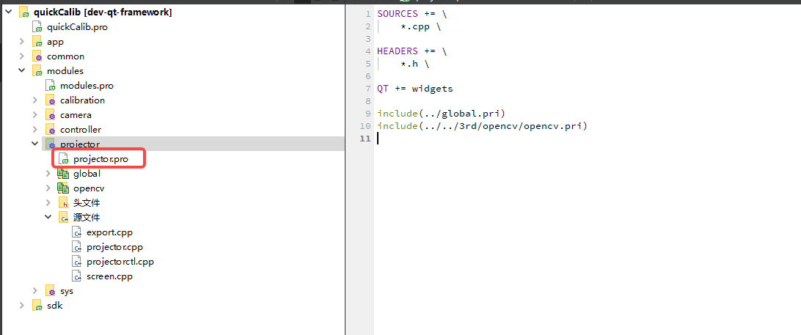


在文件目录中的文件结构

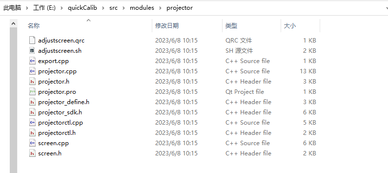


```
SOURCES += \
    *.cpp \

HEADERS += \
    *.h \

QT += widgets

include(../global.pri)
include(../../3rd/opencv/opencv.pri)
```

SOURCES变量：包含所有用于构建项目的源代码文件（.cpp文件），通过使用通配符*.cpp，可以将当前目录下的所有.cpp文件添加到SOURCES变量中。

HEADERS变量：包含所有用于构建项目的头文件（.h文件），通过使用通配符*.h，可以将当前目录下的所有.h文件添加到HEADERS变量中。

QT变量：表示该项目需要使用哪些Qt模块。在这个例子中，该项目需要使用Qt Widgets模块。

include指令被用来包含其他文件。在这个例子中，global.pri和opencv.pri文件被包含到该.pro文件中，它们定义了一些全局变量和与OpenCV相关的变量。

反斜杠`\`是换行符，表示下一行是续行，在语法上仍然是同一个变量


被include进来的文件自动列出来了

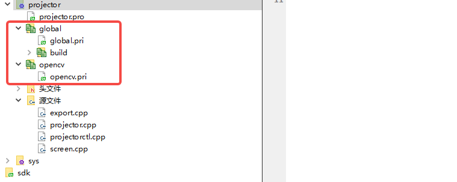


已modules中的projector为例


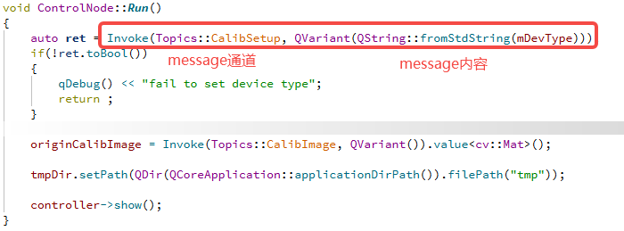

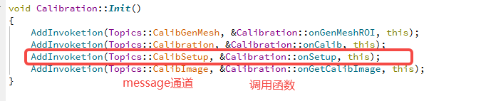

从message通道获取消息后，使用调用函数处理消息


`E:\quickCalib\src\sdk\ultrabus\object.cpp`

invoke：同步处理，发送一个消息，必须要有回应


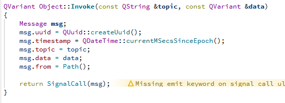

addinvoketion：处理从topic通道获得的内容，进行处理，然后返回消息

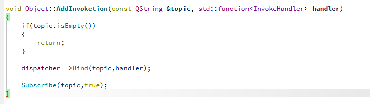


publish：异步处理，发布一个消息，不需要回应

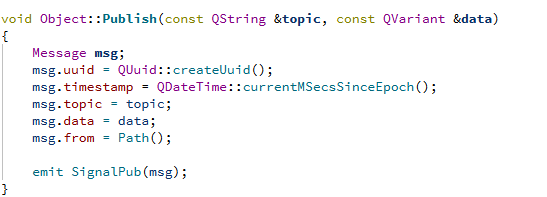

addsubscription：处理从topic通道获取的内容，进行处理，发布消息者不需要等待返回

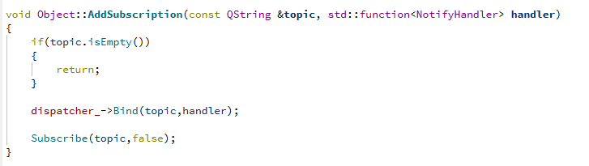


init函数中只适合去定义建立各种联系

例如：

`ControlNode::Init()`

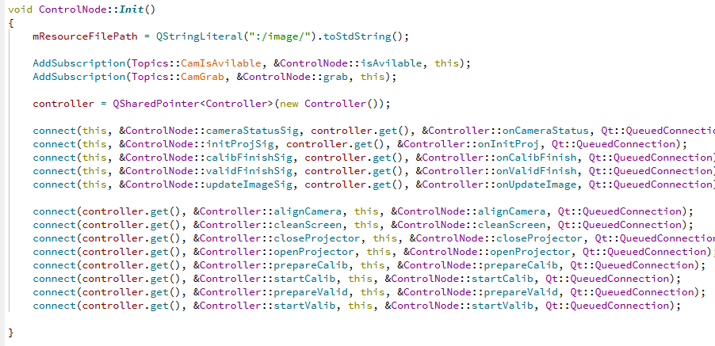

run函数中才会执行订阅消息等操作


invoke同步处理的使用方式：

1. 建立请求（将话题内容通过话题通道传递给处理函数，并等待处理结果）

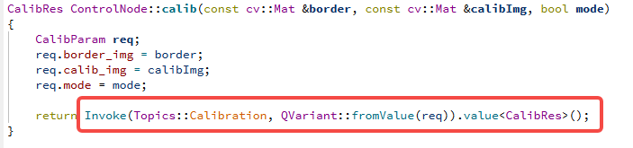

```
Invoke(Topics::Calibration, QVariant::fromValue(req))
```

`Topics::Calibration`：话题通道

`QVariant::fromValue(req)`：传递的内容，该内容的类型是QVariant泛型，可以储存任意类型，使用QVariant::fromValue函数将自己定义的类型变成QVariant类型。

注意：该函数的返回类型是`CalibRes`，所以return的返回结果类型也必须是`CalibRes`，

`Invoke(Topics::Calibration, QVariant::fromValue(req)).value<CalibRes>()`中，

`Invoke(Topics::Calibration, QVariant::fromValue(req))`等待的返回结果类型是QVariant泛型，然后使用`.value`变成`CalibRes`类型，`<CalibRes>`也表示该类型为`CalibRes`类型。

2. 建立联系

建立处理函数，谁来处理请求，将话题通道内的话题内容给处理函数处理

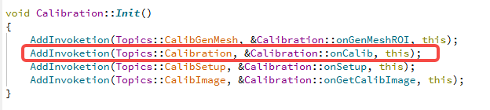

3. 处理请求

处理函数将话题通道内的话题内容进行处理，处理函数的参数就是话题内容

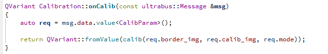

`msg.data.value<CalibParam>()`：

`<CalibParam>`表示`msg.data.value<CalibParam>()`是`CalibParam`类型，


以标定按钮为例

源文件中定义Controller类的成员函数on_calib_clicked()

1. 类名大写；
2. 类的成员函数，该函数前指名类的作用域为Controller；
3. 函数返回值为void；
4. 槽函数的形式on_xxx_clicked()：xxx名的按钮按下后，触发该槽函数

```c++
void Controller::on_calib_clicked()
{
	//将ui类指针的成员calib设置为disabled，表示该calib按钮不可用
    ui->calib->setDisabled(true);
    //发射信号startCalib()，调用信号对应的槽函数
    emit startCalib();
    //生成的label中设置文字
    mLabel->setText(" Calibrating, please waiting...");
    //将对话框展示出来
    mDialog->show();
}
```

头文件中声明槽函数

```c++
private slots:
    void on_calib_clicked();
```

头文件中声明信号

```c++
signals:
    void startCalib();
```


ControlNode::Init()中建立信号与槽关联

```c++
void ControlNode::Init()
{
	//建立信号与槽的连接
    connect(controller.get(), &Controller::startCalib, this, &ControlNode::startCalib, Qt::QueuedConnection);
}

```


```c++
void ControlNode::startCalib()
{
    QtConcurrent::run(&mPool, [&]()->void{
        auto border_img = mBorderImg;

        std::unique_lock<std::mutex> lock(mLock);
        auto calib_img = mFrame;
        lock.unlock();

        cv::imwrite(tmpDir.filePath("calib.bmp").toStdString(), calib_img);

        bool isCalib = true;
        mCalibRes = calib(border_img, calib_img, isCalib);
        emit calibFinishSig(!mCalibRes.image.empty());
    });
}
```

————————完成`mCalibRes = calib(border_img, calib_img, isCalib);`——————该行代码功能的过程

```c++
CalibRes ControlNode::calib(const cv::Mat &border, const cv::Mat &calibImg, bool mode)
{
    CalibParam req;
    req.border_img = border;
    req.calib_img = calibImg;
    req.mode = mode;

    return Invoke(Topics::Calibration, QVariant::fromValue(req)).value<CalibRes>();
}
```

模块间的通讯方式：同步

```c++
void Calibration::Init()
{
    AddInvoketion(Topics::Calibration, &Calibration::onCalib, this);
}
```


```c++
QVariant Calibration::onCalib(const ultrabus::Message &msg)
{
    auto req = msg.data.value<CalibParam>();

    return QVariant::fromValue(calib(req.border_img, req.calib_img, req.mode));
}
```


```c++
CalibRes Calibration::calib(const cv::Mat &border, const cv::Mat &calib, bool mode)
{
    CalibRes res;

    //auto border = cv::imread("D:\\border.bmp", cv::IMREAD_GRAYSCALE);
    //auto calib = cv::imread("D:\\calib.bmp", cv::IMREAD_GRAYSCALE);

    cv::Mat dev = calcDeviation(calib, border);
    res.dev = dev.clone();

    if(mode)
    {
        auto data = calcMapXY(dev / cb.mm_pixel);

        auto image = undistort(cb.image, data.mapx, data.mapy);
        res.image = image.clone();

        cv::imwrite("D:\\srcImage.png", cb.image);
        cv::imwrite("D:\\unDistImage.png", image);
    }

    return res;
}
```

——————————————————————————


```c++
void ControlNode::Init()
{
    connect(this, &ControlNode::calibFinishSig, controller.get(), &Controller::onCalibFinish, Qt::QueuedConnection);
}
```

标定完成后文字显示

```c++
void Controller::onCalibFinish(bool status)
{
    ui->calib->setDisabled(false);
    QString calibRes = status ? "success" : "failed";
    mDialog->close();
    QMessageBox::about(this, "Info", QString(" calibration %1").arg(calibRes));
}
```


\#ifndef ULTRABUS_OBJECT_H 

#define ULTRABUS_OBJECT_H 解释含义

您提供的代码片段是C或C++中常见的预处理器指令。我会逐一为您解释它们的含义：

1. `#ifndef ULTRABUS_OBJECT_H` 这是一个条件编译指令，它的意思是“如果`ULTRABUS_OBJECT_H`没有被定义”。
2. `#define ULTRABUS_OBJECT_H` 这部分代码确实没有显示在您提供的代码中，但通常在`#ifndef`之后会紧随其来。这是一个宏定义指令，它定义了一个名为`ULTRABUS_OBJECT_H`的宏。此行的存在是为了确保整个头文件只会被包含一次，防止因多次包含而导致的重定义。

此技术被称为“包含卫士”或“头文件卫士”。其工作原理如下：

- 当头文件第一次被包含时，`ULTRABUS_OBJECT_H`还未被定义，因此代码会进入`#ifndef`后面的部分，执行下面的内容。
- 在头文件的内容之后，你可能会看到`#endif`，这表示条件编译的结束。
- 如果同一个源文件再次尝试包含这个头文件，`ULTRABUS_OBJECT_H`已经被定义了，因此`#ifndef`后的代码将不会被执行，从而防止了头文件的重复包含。

这种方法是一种常见的C和C++编程实践，用于确保头文件在一个编译单元中只被包含一次。


头文件在一个编译单元中只被包含一次 是什么意思

“头文件在一个编译单元中只被包含一次”是一个重要的C和C++编程概念，与编译过程和头文件的包含机制有关。为了更好地解释这个概念，我们首先需要理解以下几个术语：

1. **头文件 (Header File)**: 它通常包含函数声明、宏定义、数据结构和其他在多个源文件中需要共享的信息。
2. **编译单元 (Compilation Unit)**: 是由一个源文件及其包含的所有头文件组成的一个实体。当源文件（例如`.c`或`.cpp`文件）被编译时，编译器会处理该文件及其所有直接和间接包含的头文件。这整个集合被视为一个编译单元。

现在，让我们回到“头文件在一个编译单元中只被包含一次”的概念。在C和C++中，当一个头文件被另一个文件`#include`时，它的内容实际上是被复制到那个文件中。如果一个头文件被同一个编译单元多次包含，它的内容也会被多次复制到那个编译单元，这可能会导致重复定义的错误。

例如，考虑以下情况：

- 你有一个头文件`A.h`，它定义了一个结构`struct X`。
- 你有两个其他头文件`B.h`和`C.h`，它们都包含`A.h`。
- 你有一个源文件`main.cpp`，它包含了`B.h`和`C.h`。

在这种情况下，当编译`main.cpp`时，`struct X`的定义实际上会出现两次，因为`A.h`被`B.h`和`C.h`分别包含了一次。

为了防止这种情况，我们使用了先前提到的“包含卫士”技术，确保头文件在一个编译单元中只被包含一次，即使它被多个其他头文件或源文件多次引用。


\#ifndef 后面的关键字取名是随便取的吗

`#ifndef` 后面跟随的名称（通常称为宏名称或标识符）不完全是随机选择的，但它确实是由程序员自定义的。当使用这个标识符作为包含卫士的一部分时，有几个普遍遵循的规则或惯例：

1. **唯一性**：该标识符必须在整个项目中是唯一的。这是最重要的原则，因为这样可以确保不会由于两个不同的头文件使用了相同的标识符而导致错误。
2. **相关性**：通常，标识符是基于头文件的名称生成的。例如，对于一个名为`MyHeader.h`的头文件，标识符可能是`MYHEADER_H_`。
3. **全部大写**：按照惯例，宏名称通常全部大写。这与其他的宏和`#define`指令中的常量保持一致，并帮助区分宏与常规的变量或函数名称。
4. **防止冲突**：在某些情况下，可能会加入额外的前缀或后缀以确保其在整个项目或多个项目中的唯一性。例如，如果你正在为一个名为“UltraBus”的库编写代码，那么你可能会选择像`ULTRABUS_MYHEADER_H_`这样的名称。
5. **避免使用特定的字符**：标识符中不应该包含像`-`这样的字符，因为它们在C和C++中不是有效的标识符字符。相反，可以使用`_`替换这些字符。

总的来说，虽然程序员有很大的自由度来选择这些标识符，但遵循上述规则和惯例可以确保代码的清晰性和可维护性。


什么是宏

宏是计算机编程中的一个术语，通常指的是预处理指令，用于在编译前替换代码。在C和C++编程语言中，宏是由预处理器（preprocessor）处理的，并且在实际编译代码之前进行代码替换。

宏的常见用途包括：

1. **代码替换**：可以定义一个宏来替换某个代码段。这可以用于创建简短的别名，或者在编写重复的代码时避免复制和粘贴。

   ```
   cCopy code
   #define SQUARE(x) ((x) * (x))
   ```

   在上面的例子中，`SQUARE(x)`是一个宏，它计算x的平方。使用这个宏时，预处理器会在编译之前替换代码。例如，`SQUARE(5)`会被替换为`((5) * (5))`。

2. **条件编译**：可以使用宏来决定是否包含某些代码段。这对于创建平台特定的代码或在调试和发布版本之间切换功能非常有用。

   ```
   cCopy code#ifdef DEBUG
       printf("Debugging mode active!\n");
   #endif
   ```

   如果在代码的某个地方定义了`DEBUG`宏（例如，通过`#define DEBUG`），则上述代码中的`printf`语句会被包含在编译的结果中。否则，它会被忽略。

3. **防止重复包含**：如前所述，宏常用于确保头文件在一个编译单元中只被包含一次，这称为“包含卫士”。

宏的优点包括代码重用、简化代码和条件编译。但它们也有缺点，如可能导致的代码难以阅读和调试困难（因为宏替换发生在编译之前）。

值得注意的是，宏不仅仅存在于C和C++中。许多其他编程语言和环境也有类似的概念，尽管实现细节和用途可能会有所不同。


什么是预处理器

预处理器是编译过程的一个早期阶段，用于在实际编译代码之前处理源代码。在C和C++编程中，预处理器主要处理以 `#` 开头的指令，这些指令被称为预处理指令。

以下是预处理器可以执行的一些主要任务：

1. **宏替换**：预处理器将所有宏替换为其相应的值或代码块。例如：

   ```
   cCopy code
   #define PI 3.14159
   ```

   在此之后，源代码中的所有 `PI` 实例都将被替换为 `3.14159`。

2. **文件包含**：通过 `#include` 指令，预处理器将指定的文件的内容插入到当前文件的位置。

   ```
   cCopy code
   #include <stdio.h>
   ```

3. **条件编译**：预处理器可以根据给定的条件决定是否包含特定的代码块。这通常用于创建平台特定的代码或在调试和发布版本之间切换功能。例如：

   ```
   cCopy code
   #ifdef DEBUG
       printf("Debugging mode active!\n");
   #endif
   ```

4. **编译指令**：其他的预处理指令，如 `#undef`（用于取消宏定义）和 `#pragma`（用于给编译器提供特定的指令）也由预处理器处理。

预处理器的操作通常是透明的，除非开发者需要深入地调试预处理器相关的问题。预处理的结果是一个“扩展的”源文件，其中包含了所有的宏替换、文件包含和其他预处理操作的结果。这个扩展的源文件然后被传递给编译器进行实际的编译。

总之，预处理器为编译器提供了一种方式来进行宏替换、文件包含和条件编译等任务，这都是在实际编译代码之前完成的。


头文件中using namespace heygears 是什么意思，为什么要使用它以及如何使用

`using namespace` 是 C++ 中的一个指令，用于指定命名空间中的所有名称应该在当前作用域中可用，而无需使用命名空间的前缀。

例如，假设命名空间 `heygears` 中有一个函数 `doSomething()`。如果您不使用 `using namespace heygears;`，则必须这样调用函数：

```
cppCopy code
heygears::doSomething();
```

但如果您在文件中使用了 `using namespace heygears;`，则可以直接调用：

```
cppCopy code
doSomething();
```

**为什么要使用它？**

1. **简化代码**：使用 `using namespace` 可以减少代码的冗余和提高可读性，因为您不再需要为每个名称重复命名空间的前缀。
2. **适应性**：如果您正在使用某个库或框架，并且在代码中频繁地引用其成员，那么 `using namespace` 可以使代码更加简洁。

**如何使用？**

在您想要使用命名空间的地方，简单地添加 `using namespace` 语句：

```
cppCopy code
using namespace heygears;
```

**注意事项和最佳实践**：

1. **头文件中的慎用**：虽然在源文件（`.cpp`）中使用 `using namespace` 是可以的，但在头文件（`.h` 或 `.hpp`）中使用它可能会导致问题。原因是当其他文件包含该头文件时，它们也会不经意地导入这个命名空间，这可能会导致名称冲突或其他意外的行为。
2. **避免使用多个命名空间**：同时使用多个库或框架的多个命名空间可能会导致名称冲突。为了避免这种情况，最好明确指定您想要使用的名称，而不是依赖 `using namespace`。
3. **使用嵌套命名空间**：在 C++17 中，您可以使用嵌套命名空间，这使得使用多级命名空间变得更加简洁。例如，`namespace heygears::utility` 可以替代 `namespace heygears { namespace utility { ... } }`。

总的来说，`using namespace` 是一个强大的工具，可以使代码更加简洁。但它应该谨慎使用，尤其是在头文件中，以避免潜在的问题。


\#define HEYGEARS_TOPICS_BEGIN \    namespace heygears{\    namespace Topics{ 

#define HEYGEARS_TOPICS_END }} 

上面代码的含义

您提供的代码定义了两个宏，它们使用了 C++ 的命名空间概念。这两个宏的目的是简化代码并提高可读性，特别是当你需要在 `heygears::Topics` 命名空间中定义许多内容时。

让我们详细解释每个宏：

1. **`HEYGEARS_TOPICS_BEGIN`**: 这个宏定义了开始进入 `heygears::Topics` 命名空间的代码。当你在代码中使用这个宏，它会被替换为 `namespace heygears { namespace Topics {`，这样就开始了一个新的命名空间块。
2. **`HEYGEARS_TOPICS_END`**: 这个宏定义了结束 `heygears::Topics` 命名空间的代码。使用这个宏会被替换为两个闭合的大括号 `}}`，这表示 `heygears::Topics` 命名空间块的结束。

使用这两个宏的示例如下：

```
HEYGEARS_TOPICS_BEGIN

// Your code inside the heygears::Topics namespace goes here...

HEYGEARS_TOPICS_END
```

这将被预处理器解释为：

```
namespace heygears {
namespace Topics {

// Your code inside the heygears::Topics namespace goes here...

}}
```

此方法的优点是，它提供了一种简洁的方式来定义在特定命名空间内的代码，特别是当你经常需要在这个命名空间中工作时。此外，如果将来需要更改命名空间的结构或名称，只需更改宏定义即可，而无需手动更改大量代码中的每个位置。


std::unique_lock<std::mutex> lock(mLock); 含义及如何使用

`std::unique_lock` 是 C++11 标准库中的一个模板类，它为互斥体（如 `std::mutex`）提供了一个 RAII（资源获取即初始化）包装。这意味着它在创建时自动锁定互斥体，并在销毁时自动解锁互斥体。使用 `std::unique_lock` 可以确保互斥体在作用域结束时被正确地解锁，即使有多个退出路径或在作用域内部抛出异常。

以下是关于 `std::unique_lock` 的一些关键点和使用方法：

1. **基本使用**:

   ```
   cppCopy codestd::mutex mtx;
   {
       std::unique_lock<std::mutex> lock(mtx);
       // Critical section
   }  // mtx will be automatically unlocked here
   ```

2. **灵活性**: `std::unique_lock` 比 `std::lock_guard` 提供了更多的灵活性。例如，您可以在不锁定的情况下创建它，并稍后进行锁定。此外，您还可以随时解锁和重新锁定它。

   ```
   cppCopy codestd::unique_lock<std::mutex> lock(mtx, std::defer_lock);  // Do not lock immediately
   // Some code...
   lock.lock();  // Lock the mutex
   // Critical section
   lock.unlock();  // Manually unlock
   ```

3. **与条件变量配合**: `std::unique_lock` 可以与 `std::condition_variable` 一起使用，以便进行等待操作。

   ```
   cppCopy codestd::mutex mtx;
   std::condition_variable cv;
   bool ready = false;
   
   // In one thread:
   {
       std::unique_lock<std::mutex> lock(mtx);
       cv.wait(lock, [&](){ return ready; });  // Wait until ready becomes true
       // Do something after being signaled
   }
   
   // In another thread:
   {
       std::unique_lock<std::mutex> lock(mtx);
       ready = true;
       cv.notify_one();
   }
   ```

4. **转移所有权**: `std::unique_lock` 的所有权可以通过移动语义转移，但不能通过复制转移。

   ```
   cppCopy codestd::unique_lock<std::mutex> lock1(mtx);
   std::unique_lock<std::mutex> lock2(std::move(lock1));  // Transfer ownership
   ```

总的来说，`std::unique_lock` 提供了一种灵活、自动的方式来管理互斥体的锁定和解锁，尤其是在涉及条件变量或需要多次锁定/解锁的场景中。


我会尝试以更简单和直接的方式解释。

`std::unique_lock` 是一个类，它帮助你管理锁。当你创建一个 `std::unique_lock` 对象时，它会尝试锁定一个互斥体（例如 `std::mutex`），并在其生命周期结束时自动解锁这个互斥体。这样，你不必手动管理锁的状态。

考虑以下场景：

你有一个互斥体（mutex），你想确保在一段代码执行时，其他线程不能同时执行这段代码。你可以这样做：

```
cppCopy codestd::mutex myMutex;

void myFunction() {
    myMutex.lock();

    // ... 你的代码 ...

    myMutex.unlock();
}
```

但这样做有一个问题：如果 `... 你的代码 ...` 部分抛出一个异常，`unlock` 永远不会被调用，这会导致死锁。

`std::unique_lock` 解决了这个问题。它在创建时自动锁定互斥体，并在销毁时自动解锁互斥体。所以，你可以这样写：

```
cppCopy codevoid myFunction() {
    std::unique_lock<std::mutex> lock(myMutex);

    // ... 你的代码 ...
}  // 在此处，当 lock 对象被销毁时，myMutex 会自动解锁
```

这样，即使 `... 你的代码 ...` 部分抛出异常，`myMutex` 仍然会在函数退出时被解锁，因为 `lock` 对象会被销毁，并在其析构函数中解锁互斥体。

总之，`std::unique_lock` 提供了一个自动、安全的方式来锁定和解锁互斥体。你不必担心何时和如何解锁；当 `std::unique_lock` 对象不再存在时，它会为你处理所有事情。
