快速标定技术问题分析

A2D:

1. A2D数据标定不合格问题分析（已定位解决，是光机镜像原因）

   1. 标定环境保持一致，进行a2d自研标定测试及标定机标定；
      1. 先标标定机，**确定标定机可行后**（能否使用自研标定算法计算calibration文件，这样保证算法计算一致）再进行自研标定

   2. 获取两者的calibration数据

   3. 比较dx及dy

标定机拍图幅面大小，黑点的绝对位置

解决办法：增加镜像检测

原因：光机镜像

A2D：

电脑：电脑投图A

打印机：站在打印机正前方，投图发生镜像

相机：相机拍到的图再次镜像，和电脑投图相同

2. A2D设备在使用场内标定机标定数据打印时偏小
3. 

CS:

1. 使用AP膜进行快速标定时，复检数据能合格，但是在标定机上复核时不合格，结果偏大。

自研标定复检数据

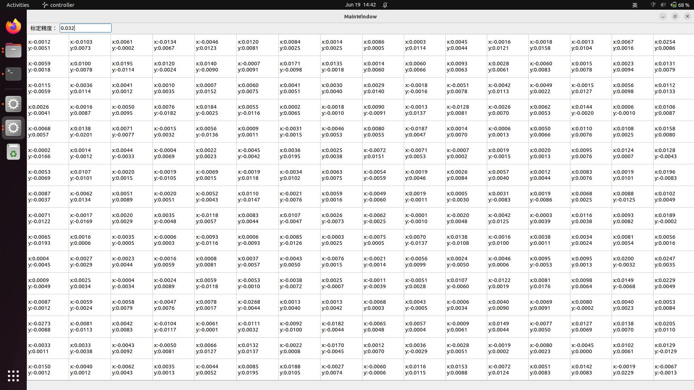

光学数据

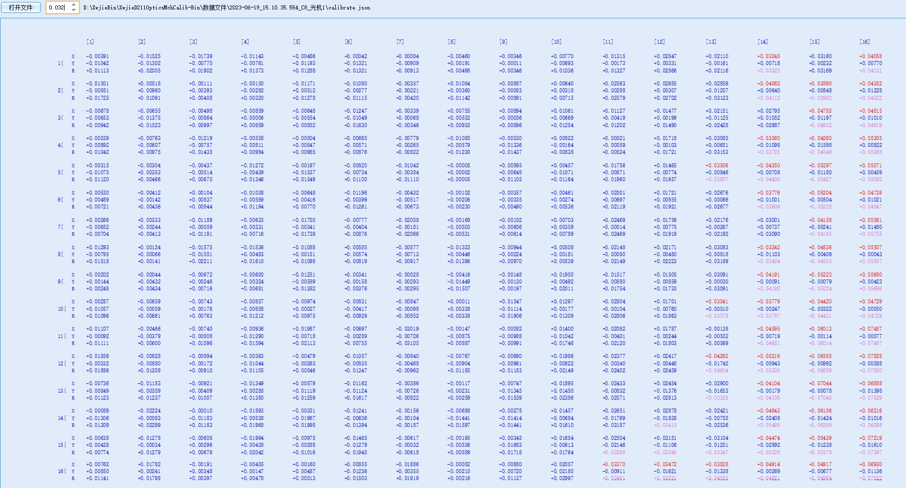

打印结果：

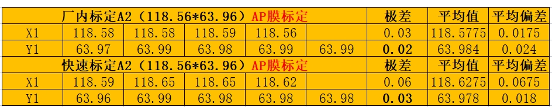

1. 使用0.15双面离型膜标定一下，确定是否由于AP膜的原因；
   1. 使用自研标定标定在不同膜下的数据
      1. 拿到标定结果，calibration.json文件，源图片文件。
      2. 使用标定机复核，获取复核后的结果
      3. 进行对比分析

出货的cs整机拆下来的设备

相同双面离型膜（仅双面离型膜）在自研标定和场内标定机上

自研标定

场内标定机复核

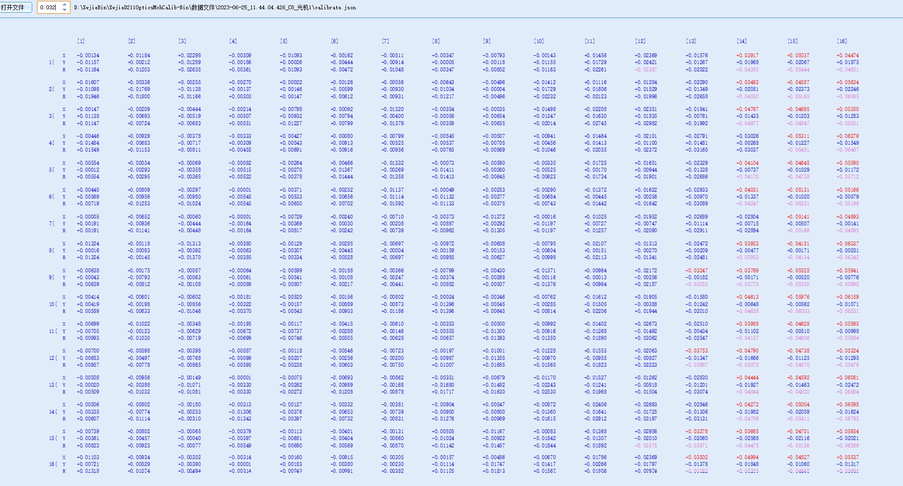

标定过程中的原始光机投图与标定板的calibration数据对比

自研标定：dx

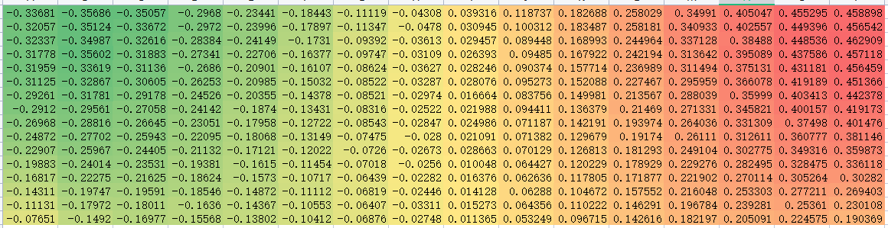

场内标定机：dx

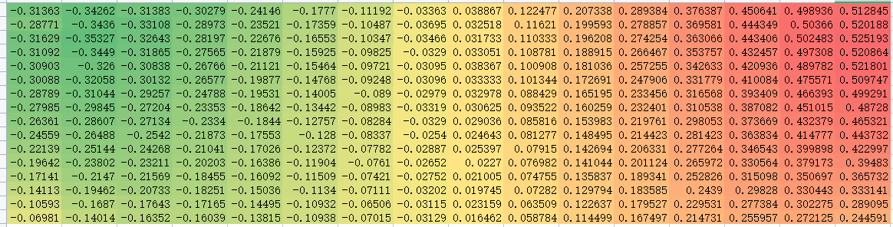

两者偏差：

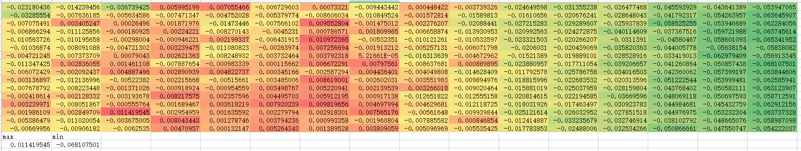

自研标定：dy

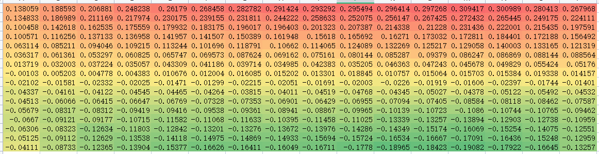

场内标定机：dy

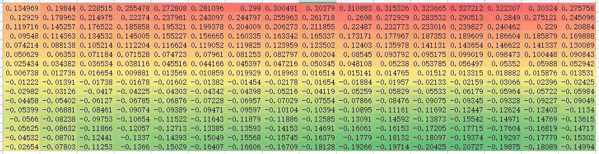

两者偏差：

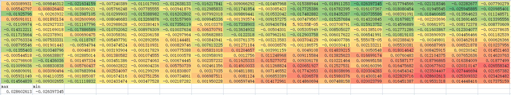

另外一组：

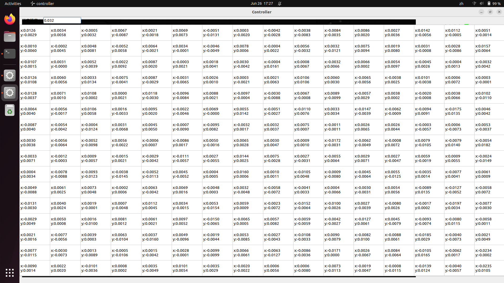

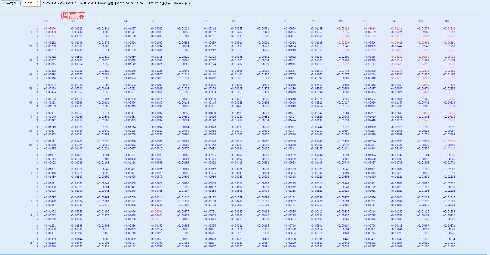

自研标定：dx

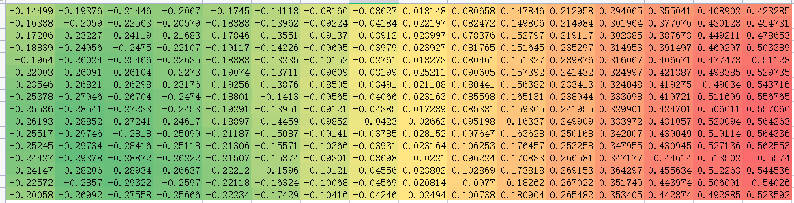

场内标定机：dx

两者偏差：

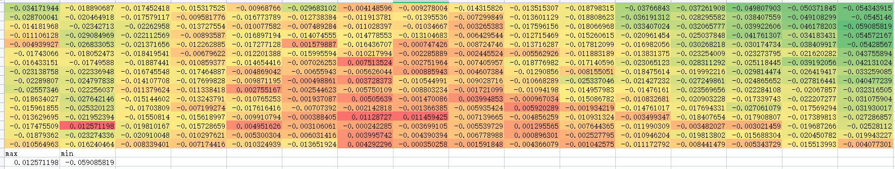

AP膜（AP膜上再覆盖一层双面离型膜）

自研标定：

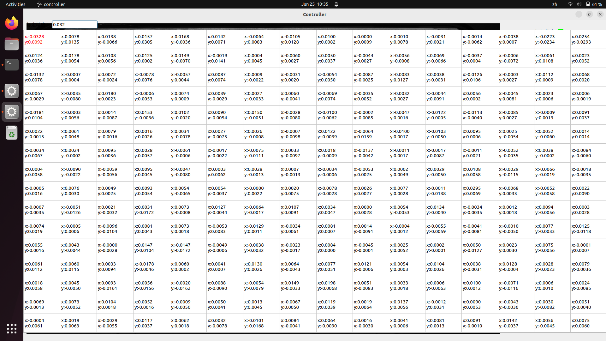

场内标定机复检：

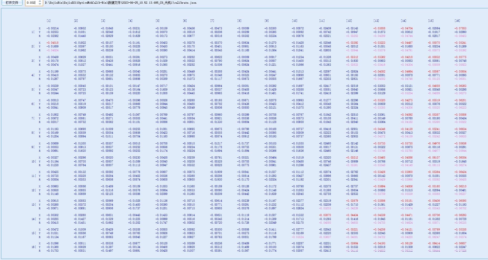

原始状态开始标定时捕获的幅面内白点和黑点偏差

自研标定：dx

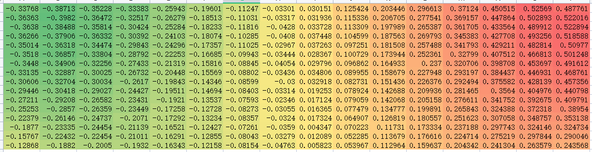

场内标定机：dx

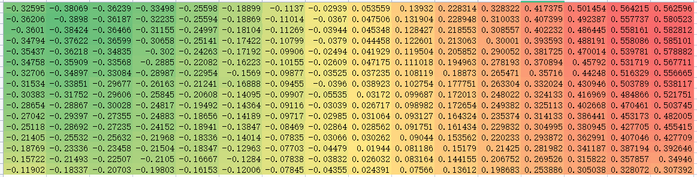

两者偏差：

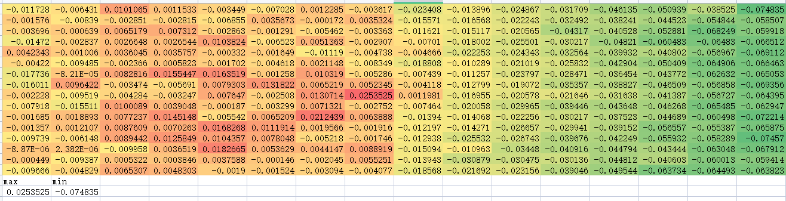

自研标定：dy

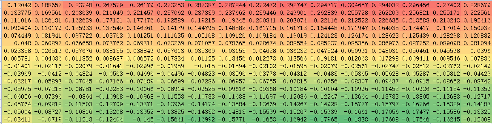

场内标定机：dy

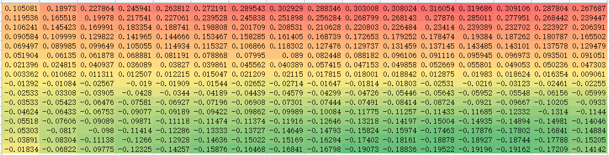

两者偏差：

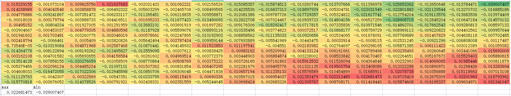

