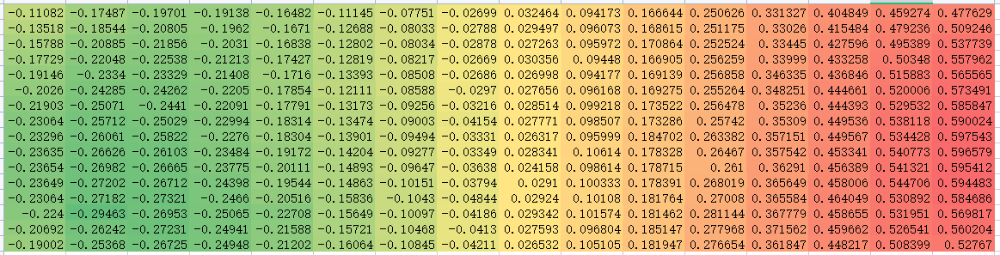
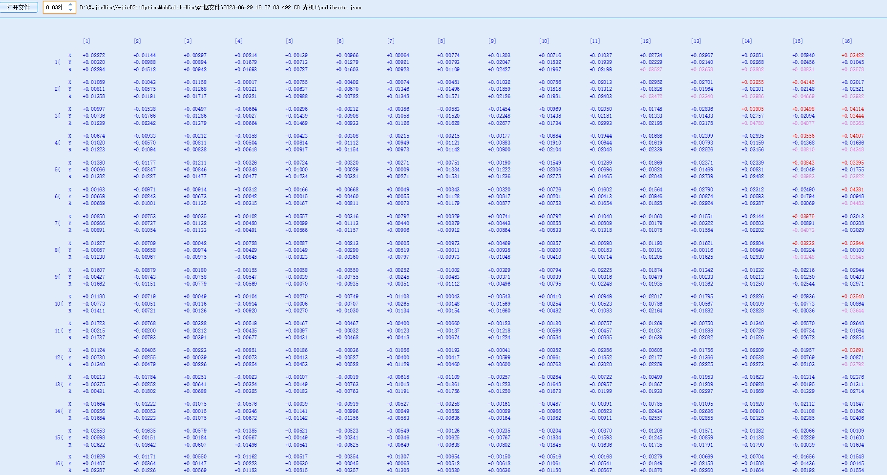
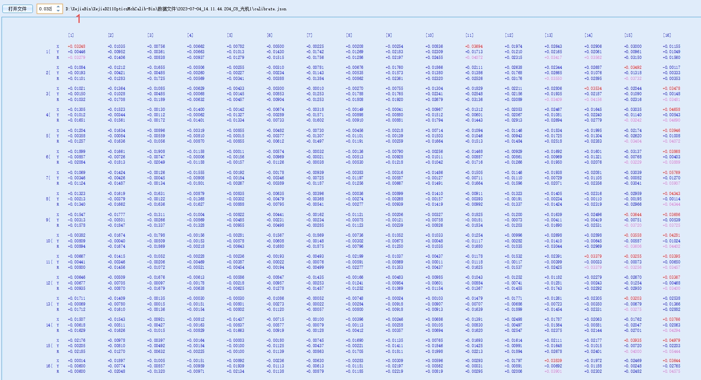
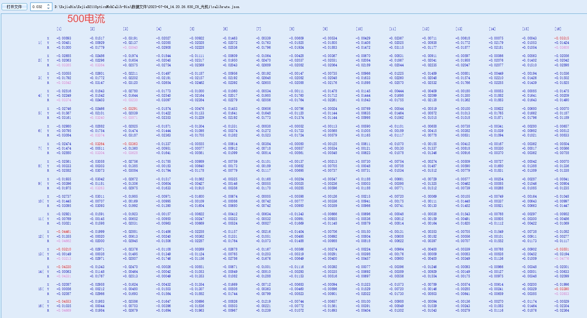
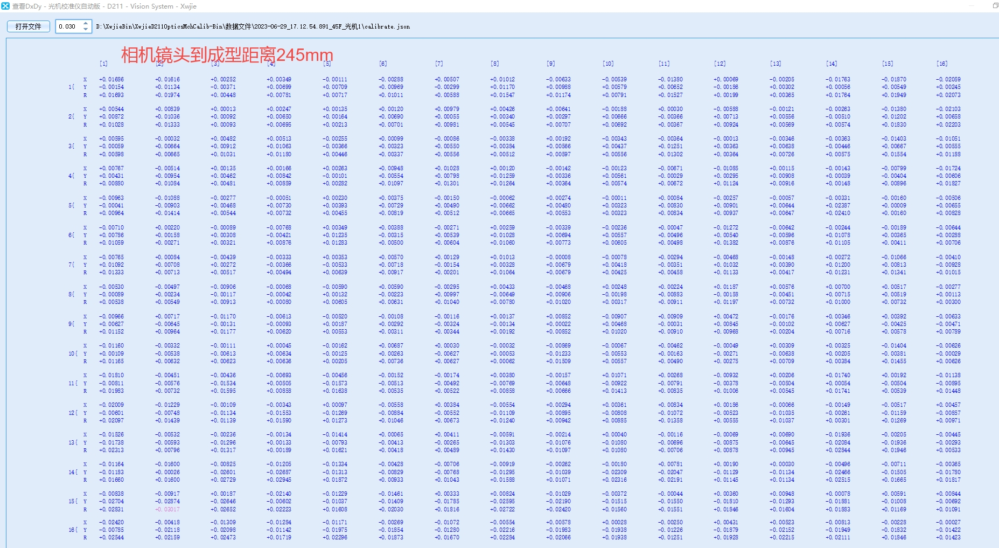

快速标定技术问题分析

A2D:

1. A2D数据标定不合格问题分析（已定位解决，是光机镜像原因）

   1. 标定环境保持一致，进行a2d自研标定测试及标定机标定；
      1. 先标标定机，**确定标定机可行后**（能否使用自研标定算法计算calibration文件，这样保证算法计算一致）再进行自研标定

   2. 获取两者的calibration数据

   3. 比较dx及dy

标定机拍图幅面大小，黑点的绝对位置

解决办法：增加镜像检测

原因：光机镜像

A2D：

电脑：电脑投图A

打印机：站在打印机正前方，投图发生镜像

相机：相机拍到的图再次镜像，和电脑投图相同

2. A2D设备在使用场内标定机标定数据打印时偏小
3. 

CS:

1. 使用AP膜进行快速标定时，复检数据能合格，但是在标定机上复核时不合格，结果偏大。

自研标定复检数据

光学数据

打印结果：

1. 使用0.15双面离型膜标定一下，确定是否由于AP膜的原因；
   1. 使用自研标定标定在不同膜下的数据
      1. 拿到标定结果，calibration.json文件，源图片文件。
      2. 使用标定机复核，获取复核后的结果
      3. 进行对比分析

出货的cs整机拆下来的设备

相同双面离型膜（仅双面离型膜）在自研标定和场内标定机上

自研标定

场内标定机复核

标定过程中的原始光机投图与标定板的calibration数据对比

自研标定：dx

场内标定机：dx

两者偏差：

自研标定：dy

场内标定机：dy

两者偏差：

另外一组：

自研标定：dx

场内标定机：dx

两者偏差：

AP膜（AP膜上再覆盖一层双面离型膜）

自研标定：

场内标定机复检：

原始状态开始标定时捕获的幅面内白点和黑点偏差

自研标定：dx

场内标定机：dx

两者偏差：

自研标定：dy

场内标定机：dy

两者偏差：

排查问题发现，在离型膜时标定就会出现标定机复检不合格的情况

排查快速标定使用离型膜标定情况，是由相机高度，相机焦距导致的

将相机高度调至最低（相机镜头距离标定板距离约为165mm），并调节焦距，使相机拍图最清晰，然后标定，再由标定机复检，只出现少量标定点超标情况，符合实际情况。

下图为复检情况

总结：需要确认高度、焦距（相机拍图是否清晰）

解决了离型膜标定问题后

使用离型膜+AP膜进行标定，不同电流，标定板不同摆放方式

电流250

电流250

1和2的标定板摆放方式不同

1以左边为基准，最左列标定板的点离光机投出的标定点最近，右边最远

2以右边为基准，最右列标定板的点离光机投出的标定点最近，左边最远

电流500

结论：使用离型膜+AP膜进行快速标定，电流使用500合适

A2D

标定高度：相机镜头距离标定板245mm，进行自研标定

标定机复检结果

结论：A2D标定高度为245mm，控制高度和相机焦距

标定前：

1. 检查镜像问题
