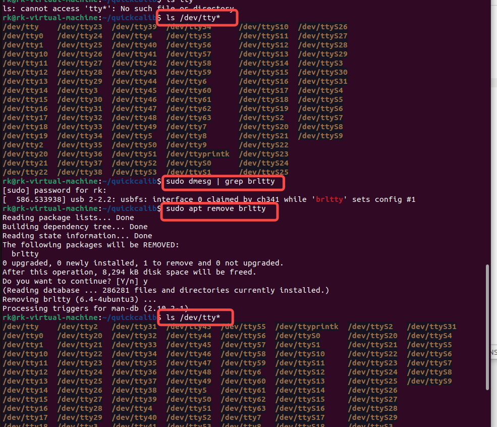

快速标定环境搭建

命令行关闭光机风扇：

`echo -e -n "\x2A\xFB\x0D">/dev/ttyUSB0`

命令行卸载qtcreator-ros

`sudo snap remove qtcreator-ros`

1. 安装虚拟机：VMware Workstation Pro 16
2. 虚拟机内安装Ubuntu 22.04 （humle）
3. 安装ros2 
4. 

[VMware安装Ubuntu 22.04.1笔记_Leung_ManWah的博客-CSDN博客](https://blog.csdn.net/qq_36347513/article/details/126561509)


下载最新boost包1.78，然后安装

https://stackoverflow.com/questions/12578499/how-to-install-boost-on-ubuntu


安装 libqt5serialport5-dev

```
sudo apt-get update
sudo apt-get install libqt5serialport5-dev
```

[How to install libqt5serialport5-dev on Ubuntu](https://howtoinstall.co/en/libqt5serialport5-dev)


`echo $LD_LIBRARY_PATH`

`LD_LIBRARY_PATH=$LD_LIBRARY_PATH:/home/rk/quickcalib/src/camera/lib`


光机hdmi连接后显示不了屏幕（windows中显示不了）

插拔一下光机电源线


查看屏幕的id

xrandr


查看光机通讯线有无连接，即ttyusb0，若无则一般被占用了

解决方案：



需要赋给该连接设备权限

`sudo chmod -R 777 /dev`

否则


确认projectornode中设置一致


工程文件名quickcalib换成quickCalib


启动camera节点时需要

export LD_LIBRARY_PATH=$LD_LIBRARY_PATH:


连接光机，查看屏幕id是否和projectnode.cpp文件中屏幕id一致

- 查看虚拟机是否连接上Qinheng
- 查看Qinheng是否连接上虚拟机 lsusb
- 查看是否有ttyusb0  ls /dev/tty*
- 查看屏幕是否有，以及id是多少：xrandr
-  确认是否和cpp文件中不一致，若不一致则修改为该屏幕id

启动节点

- controller

在workspace（quickcalib）下

. install/setup.bash

ros2 run controller controller

- calib

. install/setup.bash

ros2 run controller controller

若calib节点出现下方问题


需要将py文件在本地编译一下为so文件，在放入calib文件夹下的calib文件夹下


- camera
  - 设置环境变量  export LD_LIBRARY_PATH=$LD_LIBRARY_PATH:xxx
  - . install/setup.bash
  - ros2 run controller controller

- projector

  - 查看虚拟机是否连接上Qinheng
  - 查看Qinheng是否连接上虚拟机 lsusb
  - 查看是否有ttyusb0  ls /dev/tty*
  - 查看屏幕是否有：xrandr
  - . install/setup.bash
  - ros2 run projector projector

  

