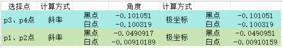

旋转角度计算方式


1. 使用斜率计算方式：

使用中心四个点

    // p1 | p2
    // -------
    // p3 | p4


2. 使用极坐标的方式


3. 只使用行坐标点的极坐标方式


4. 只使用列坐标点计算的极坐标方式


计算p3，p4连接线旋转角度

斜率方式使用p2, p3, p4点

极坐标使用p3、p4点

（前两个是黑点的计算结果，后两个是白点的计算结果）


斜率方式使用p1, p2, p3点

极坐标使用p1、p2点


斜率方式使用p2, p3, p4点

极坐标使用p1、p2点


原因：

p1, p2

p1: [2087.36, 1220.19]   p2: [2371, 1220.44]

p2-p1 [283.639, 0.243]


p3, p4

p3: [2087.5, 1379.5], p4:[2371, 1380]

p4-p3: [283.5, 0.5]




黑点分布情况：


白点分布情况


```
//    vector<vector<cv::Point2f>> com_pairs;
//    Combination(pnts, 2, com_pairs);

//    std::vector<cv::Point2f> vec;
//    cv::Point2f pnt;
//    for(const auto &pair : com_pairs)
//    {
//        pnt.x = pair[1].x - pair[0].x;
//        pnt.y = pair[1].y - pair[0].y;
//        vec.emplace_back(pnt);
//        DEBUG() << "\n" << pair[0] << ", " << pair[1] << std::endl;
//    }

//    cv::Mat pntMat = cv::Mat(vec).reshape(1, static_cast<int>(vec.size()));
//    DEBUG() << "pntMat" << pntMat << std::endl;
//    cv::Mat mags, angles;
//    cv::cartToPolar(pntMat.col(0), pntMat.col(1), mags, angles, true);


//    auto angle = cv::mean(angles);
//    DEBUG() << "angle" << angle << std::endl;
//    angle[0] = angle[0] > 270 ? angle[0] - 360 : angle[0];
//    return -angle[0];
```

