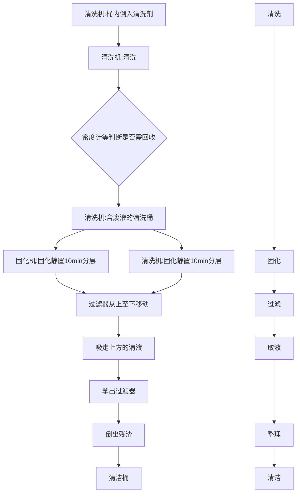

消费级清洗机清洗及废液固化回收业务流程

```mermaid
graph TD;
	清洗机:桶内倒入清洗剂-->清洗机:清洗-->A{密度计等判断是否需回收}-->清洗机:含废液的清洗桶-->固化机:固化静置10min分层-->过滤器从上至下移动-->吸走上方的清液-->拿出过滤器-->倒出残渣-->清洁桶;
	清洗机:含废液的清洗桶-->清洗机:固化静置10min分层-->过滤器从上至下移动;
	
	清洗----->固化-->过滤-->取液--->整理-->清洁
	
```

