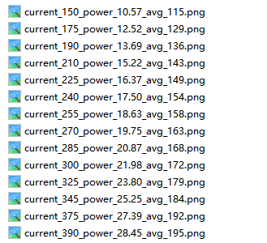

### 相机模组在母光源上自校准验收指引V1.1

#### 验收内容：

1. 相机模组校准完成后的图片正确性检查；
2. 相机模组校准高度和居中情况检查；
3. 相机模组校准完成后图片数量检查；
4. 相机模组校准完成后json文件数量检查；
5. 相机模组校准完成后图片灰度检查。

#### 验收指引：

##### **1. 相机模组校准完成后的图片正确性检查**

**检验方法：**模组正式校准完成后，查看文件夹内以current关键字命名的图片及uni_gamma_100关键字命名的图片。

**文件夹查看方法：**使用xftp软件，进入设备路径：`/home/heygears/app/release/tmp`，文件夹名称以模组编号命名。

**判定方法：**若所有图片均亮暗过渡均匀，不存在横纹及竖纹、黑点等情况 ，则判定通过，否则，判定不通过，需联系对应工程师处理。

下图为以current关键字命名的图片及uni_gamma_100关键字命名的图片的形式。

current关键字命名的图片

 

uni_gamma_100关键字命名的图片

 

例如：

下图为一张以current关键字命名的图片及一张以uni_gamma_100关键字命名的图片，两张图片亮暗过渡均匀，不存在横纹及竖纹、黑点等情况，判定通过。

##### **2. 相机模组校准高度和居中情况检查**

**检验方法：**模组正式校准完成后，查看文件夹内以current关键字命名的图片。

**判定方法：**若图片中的背光膜轮廓和图片外围轮廓基本平行，且两者轮廓间距较小，则判定通过，否则，判定不通过，可能存在摄像头未调居中或模组高度未调节，需要进行调节后再重新校准。

例如：

下图中的红色边框为背光膜轮廓

图中背光膜矩形轮廓和图片矩形轮廓的四条边中对应位置的每一组边基本平行，且对应位置的每一组边间距均较小，判定通过。

如果背光膜矩形轮廓和图片矩形轮廓对应位置的每一组边，有以下情况之一：

- 存在一组边明显不平行；
- 存在一组边间距明显较大；
- 每一组边间距均为0。

则判定不通过，可能存在摄像头未调居中或模组高度未调节，需要进行调节。

例如下方图片背光膜轮廓与图片轮廓对应位置的边明显不平行，存在相交情况，判定不通过，说明摄像头未调居中，需要调节后重新校准。

 

##### **3. 相机模组校准完成后图片数量检查**

**检验方法：**模组正式校准完成后，查看文件夹内图片数量。

**判定方法：**若图片总数为28张，其中，以current关键字命名的图片14张，以uni_gamma_100关键字命名的图片14张，则判定通过。否则，判定不通过，需重新校准。 

下图为以current关键字命名的图片及uni_gamma_100关键字命名的图片的形式。

current关键字命名的图片：14张

 

uni_gamma_100关键字命名的图片：14张

 

##### **4. 相机模组校准完成后json文件数量检查**

**检验方法：**模组正式校准完成后，查看文件夹内json文件数量。

**判定方法：**若存在2个json文件，分别为：uniFile.json和uniFunc.json文件，则判定通过。否则，判定不通过，需重新校准。

下图为uniFile.json和uniFunc.json文件的形式。

 

##### **5. 相机模组校准完成后图片灰度检查**

**检验方法：**模组正式校准完成后，查看文件夹内以current关键字命名的图片名，根据图片名，找到功率为21W对应的灰度，当图片中无正好处于21W时的光强时，使用线性估值的方式预估灰度。

**图片对应光强及灰度查看方法：**图片名中关键字current、power和avg后面的数字分别表示电流大小、电流对应的光强大小及对应的图片平均灰度大小，例如图片名为"current_150_power_10.57_avg_118"表示电流大小为150，光强为10.57W，灰度为118。

**判定方法：**

- 若灰度小于175，则通过；
- 若灰度大于等于175，小于等于185，则让步放行，并做标记，进行匹配跟踪；
- 若灰度大于185，则判定不通过，联系对应工程师进行判定。

例如：

在下图中，预估21W对应的灰度值为170，小于175，判定通过。

 

 

