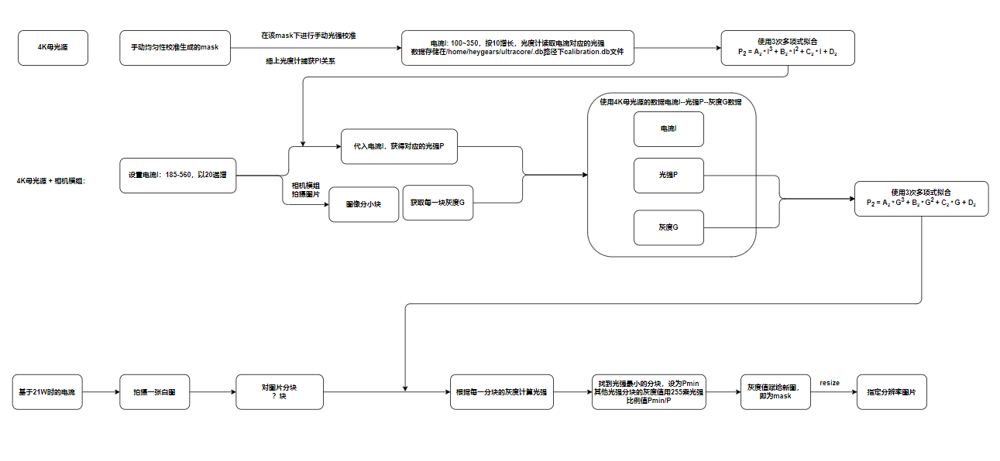
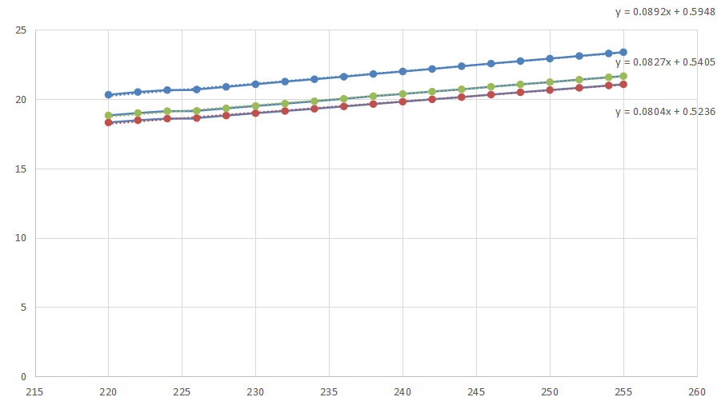
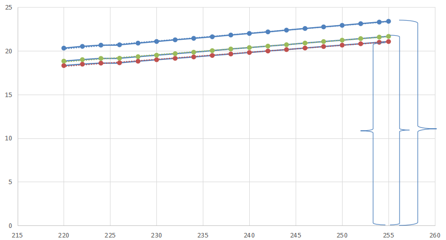

自动均匀性校准

## 自动均匀性校准过程

均匀性校准：

光强校准：

$$
y_1 = f_1(x) = k_1 x +b \\
y_2 = f_2(x) = k_2x+b\\
y_3 = f_3(x) = k_3x+b
$$

灰度G为255时对应的值：
$$
f_1(255) = k_1 * 255 + b_1 \\
f_2(255) = k_2 * 255 + b_2 \\
f_3(255) = k_3 * 255 + b_3 \\
$$
找到最小值 : $min\{f_1(255), f_2(255), f_3(255), ...,f_n(255)\} = f_1(255)$ 

比例法反算灰度：
$$
G_n = \frac{P_{min}}{P_n} * 255 = \frac{f_1(255)}{f_n(255)} * 255
$$
所以
$$
G_1 = \frac{f_1(255)}{f_1(255)} * 255 = 255\\
G_2 = \frac{f_1(255)}{f_2(255)} * 255 = \frac{k_1 * 255 + b_1}{k_2 * 255 + b_2} * 255 \\
G_3 = \frac{f_1(255)}{f_3(255)} * 255 = \frac{k_1 * 255 + b_1}{k_3 * 255 + b_3} * 255\\
$$

精确调节灰度法：

对所有曲线取同一个P，利用公式计算灰度G
$$
P = min\{f_1(255), f_2(255), f_3(255), ...,f_n(255)\} = f_1(255) \\
$$
利用公式计算$G_1'$
$$
G'_1 :  f_1(255) = k_1 * G_1' + b_1=k_1 * 255 + b_1 \implies G_1' = 255 \\
$$
利用公式计算$G_2'$
$$
G_2' :f_1(255) = k_2 * G_2' + b_2 = k_1*255 + b_1 \implies G_2' = \frac{255*k_1+b_1 - b_2}{k_2}\\
$$
利用公式计算$G_3'$
$$
G_3' : f_1(255) = k_3 * G_3' + b_3 = k_1 * 255 + b_1 \implies G_3' = \frac{255*k_1+b_1-b_3}{k_3}
$$
反算法和精确计算法的差值：
$$
\Delta G_1 = G_1' -G_1 = 255 -255 = 0
$$

$$
\begin{align*}
\Delta G_2 = G_2' - G_2 &=  \frac{255*k_1+b_1 - b_2}{k_2} - \frac{k_1 * 255 + b_1}{k_2 * 255 + b_2} * 255 \\
&=\frac{(255*k_1 + b_1-b_2)(255*k_2 + b_2)-255*k_2(255*k_1+b_1)}{k_2(255*k_2+b_2)}\\
&=\frac{255^2 * k_1k_2+255*k_1b_2+255*k_2b_1+b_1b_2-255*k_2b_2-b_2^2-255^2*k_1k_2-255*k_2b_1}{k_2(255*k_2+b_2)}\\
&= \frac{255*k_1b_2-255*k_2b_2+b_1b_2-b_2^2}{k_2(255*k_2+b_2)}\\
&= \frac{b_2[255*(k_1-k_2)+ (b_1-b_2)]}{k_2(255*k_2+b_2)}
\end{align*}
$$

$$
k_1 = 0.0804\\
k_2 = 0.0827\\
b_1 = 0.5236\\
b_2 = 0.5405
$$

