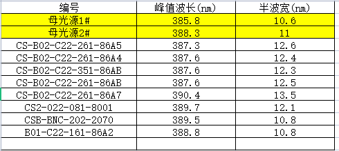

# **自动均匀性校准优化**

## 消费级

立项

之前版本的方案和现行方案的对比


6pin磁吸端子


非技术风险：母光源数量，根据产量计算（4k数量）


reflex消费级技术指标：


12月初开模，结构先行


母光源端代码更新，设备端代码更新

cs、csp

消费级端代码待开发


母光源：开模

机械结构

电气结构

ID设计

预研低成本选型未开始，周期长约6个月

矛盾点：低成本方案——开发时间

先实现时间，

各模块

1. 先给各方产品需求
2. 然后各方给出技术方案


技术方案

- 可行性验证
  - 验证框架
    - 机械结构
    - 硬件电气结构
      - 
    - 算法
      - 要参考硬件电气结构，用什么开发板，开发平台
  - 验证全流程跑通
  - 验证结果

产品化方案

- 产品需求
  - 产品成本
    - 模块选型
    - 模块继续回到上面的可行性验证
  - 技术方案
    - 各专业技术方案：根据产品需求拆分各专业模块需求，提出各专业的技术需求
- 开发时间

## 问题总结

1. 母光源上校准相机模组时，“打开摄像头”投十字图校准相机位置时，如果没有十字出来，首先排查是否相机模组的镜头盖子没有打开
2. 

## 母光源差异比较

camera_0010

同一个相机模组在母光源上采集图片：相同功率下（13.3，13.4）1号母光源比2号母光源的采集的中心区域灰度大5-8个（边缘相差不大，1-3个灰度）

高4.9个灰度


同一个相机模组在1号母光源和2号母光源下生成的方格中G-P函数对比：

（红色是1号母光源，绿色是2号母光源）


同一个相机模组分别在1号和2号母光源上校准后，在同一台设备上采集灰度图片（灰度偏差最大3-4个灰度）


相机模组2:

camera_0011

高4.2个灰度


第3个相机模组：

camera_0002


高度下降50mm

camera_0002


camera_0011


CSP


## 自动均匀性校准总结

- 原理：利用相机模组，起到光度计的作用，识别幅面中真实光强分布，然后反算mask，从而使幅面均匀

- 母光源
- 设备
- 相机模组
- 背光膜

### 格子图

在2号母光源上，利用上位机投影指定图（U盘内图片），然后使用相机拍摄图片

#### 对中：相机中心和投图中心对中

左边：全幅面格子图获取格子灰度后，重新生成一张灰度图片，代表全幅面内灰度情况

右边：小幅面格子图


对比可以看出，**小幅面同位置的灰度和大幅面基本相同**


#### 偏移：相机向右下方偏移70个像素

左边：全幅面格子图获取格子灰度后，重新生成一张灰度图片，代表全幅面内灰度情况

右边：相机相对相机中心向右下方偏移82个像素（右移72个像素，下移41个像素）

（蓝色表示值小于容差，红色表示值大于容差）


可以看出，**偏差在5个灰度以内**


### 波长关系

#### 设备波长测试



##### 波长测试方法

注意测试电流，因为温度对波长存在影响

#### 灰度及波长验证测试结果


#### 相机响应曲线与灰度分析


总结：$$响应系数R = 0.55 - 0.005 * (400 - 波长\lambda) $$

$$\frac{灰度G_1}{灰度G_2} = \frac{响应系数R_1}{响应系数R_2}$$


#### 控制波长相同的情况下（无波长因素干扰），验证格子图的自动校准结果

设备编号：B01-C22-161-86A2

母光源九宫格——CSP九宫格：

母光源（格子定位）白图——CSP（格子定位）白图


使用边框为黑色的黑色料盘

两侧值更小


### 全流程偏差分析

1. 相机模组在母光源上均匀性偏差：0.5W
   - 母光源定期做均匀性校准
2. 母光源及设备端光源波长偏差：388.3（2号母光源）、385.5（1号母光源）：4.6个波长偏差以内，6个灰度偏差
   - 通过乘响应系数比值
3. 相机模组噪声灰度偏差：1-2个灰度
4. 背光膜灰度偏差：2-3个灰度（第一张）
5. 相机模组在母光源及设备端位置偏差：CSP——50个像素，约3mm，5个灰度偏差以内
6. 母光源G-P拟合函数偏差：真实值-拟合值 ： -0.61~0.53W
7. 反算mask偏差：0.4W


## csp设备批量测试

1. 测试波长
2. 自动校准全流程


复原csp设备

1. 杀死前后端

   sudo killall backend

   sudo killall frontend

2. 在app路径下，删除release和release_grid文件夹

3. 将release_orig改为release

4. 将 .heygears/configs 中的 autograycalib.json删除

5. 将Downloads中的文件全部删除

6. 重启设备


### 母光源状态：

新白图：指相机参数进行了调整，修改了之前的bug，拍照和当前图片对应了，修改了白平衡

格子图：9幅格子图


### 批量设备自动校准全流程测试步骤

开会和工程拉通信息：

与会人员：项目经理、工程、质量、协调的操作人员

会议内容：

	1. 研发需要进行的内容
	1. 


准备：

1. 电脑
2. 软件： xftp，xshell
3. 键盘
4. 网线

#### 一、 CSP设备上位机软件导入

1. 命令行杀死上位机

   ```
   sudo killall backend
   sudo killall frontend
   ```

2. 备份现行的release文件夹

   1. 进入如下路径，将`release`文件夹复制一份，并更名为`release_orig`

   

3. 复制新版上位机软件指定文件到release，从而替换对应文件夹

   


4. 同步并重启设备

   ```
   sync
   sudo reboot
   ```

   

#### 二、自动均匀性校准

1. 清洁料盘及相机模组镜头

2. 放好背光膜，插入相机模组

3. 进入mainwindow界面，设置成如下所示（优化）

   

4. 进入高级设置，点击自动光机校准

   

   2. 依次进入下一步

      

   3. 完成自动校准后，进入mainwindow界面，进行复检

#### 三、复检

1. 复检光强设定在21W±0.2W（注意：不同光度计会有偏差，0.2W左右，同一个操作人员使用同一个光度计）

   

2. 开启均匀性检测

   


3. 导出测试结果到Downloads文件夹中

   


1. 注意光机防尘盖是否打开
2. 光路是否清洁（相机镜头、透明玻璃、料盘）
3. 检查mainWindow界面程序版本


## 相机打样

### 注意点

各款相机模组的组成结构（分别是镜头和CMOS特性）

各款相机模组的技术参数（如分辨率，帧率，曝光时间等等）

整体方案的成本，不单单是相机的成本（整体方案包括：相机镜头、CMOS、驱动板、开模件）

碰到不合理的地方，一定要找到原因，而不是只是抛出这个原因告诉大家

### 相机模组

结构：镜头、CMOS感光传感器、驱动板（模数转化器、图像处理器、存储器）、开模结构件

#### 镜头参数：

**焦距**

**光圈：**控制镜头进光量多少的一个参数，一般用f/2.0、f/1.8来表示，后面的数字越小，表示光圈越大

#### CMOS感光传感器参数

**传感器尺寸**：图像传感器尺寸越大，感光面积就越大，捕捉到的光线就越多，传感器的面积一般用英寸来表示，比如1/2、1/1.7、1/1.3英寸，分母越小，表示传感器尺寸越大

**有效像素**：手机的像素越大，解析度就越高，照片的细节也就越清晰

**单像素尺寸**：单位像素尺大小决定了传感器的感光能力，单位为微米（μm），单像素尺寸越高，采光量就越多，像素之间的干扰就越小，画面的清晰度就越高。常见的单像素尺寸有0.8um、1.0μm、1.6μm、1.22μm、2.24μm等

#### 其他参数

曝光时间：

曝光方式：全局  / 卷帘

白平衡：白平衡用于实现色调调节，白平衡的基本概念是"在任何光源下都能将白色物体还原为白色"，对在特定光源下拍摄时出现的偏色现象，通过加强对应的补色来进行补偿。


## 计划

### 2022.12.12

**1号母光源条纹问题**

- 相机模组上EDS问题（更换为之前批次的EDS后，横纹消失，但检查两批次未发现不同）
- 驱动板上EDS问题，更换后再跑相机模组未出现横纹问题（12.11），现在又出现（12.12）
  - 板A上出现横纹问题，更换为板B后，未出现横纹问题（12.11），但是驱动配置不对，又重新更换为板C，变成板C后又出现横纹问题。
- 传输线
  - 将数据传输线一端由插入式pin口换成usb接口，横纹问题消失

**2号母光源和设备不匹配问题**

- 1号母光源波长重新测试
- 2号母光源有防尘罩（可能对光路有影响，反光）
- 曝光面：1号的曝光面为料盘上，2号的曝光面为透光玻璃上

**摄像头样本快速导入打样测试**


### 2022.12.13

**批量设备继续测试**

**极差2W多的设备再做一次均匀性，避免偶然误差**


优盘路径：/mnt/HJ1131/heygears

**复制格子图**

sudo cp -r /mnt/HJ1131/heygears/CSP_software/grid/lib /mnt/HJ1131/heygears/CSP_software/grid/plugin /mnt/HJ1131/heygears/CSP_software/grid/backend /mnt/HJ1131/heygears/CSP_software/grid/frontend /home/heygears/app/release

**复制白图**

sudo cp -r /mnt/HJ1131/heygears/CSP_software/grid_white/lib /mnt/HJ1131/heygears/CSP_software/grid_white/plugin /mnt/HJ1131/heygears/CSP_software/grid_white/backend /mnt/HJ1131/heygears/CSP_software/grid_white/frontend /home/heygears/app/release

**复制autograycalib.json文件**

sudo cp  /mnt/HJ1131/heygears/CSP_software/autograycalib.json 


86B6 388.9

86AE 386.0

86A1- 385.1

86B0 - 00008 - 386.5


批量测试15台csp设备的母光源的模组：

P-G关系

格子图


白图


G-P关系

格子图


白图


使用修改电流改变电流光强获得灰度光强关系方法


使用改变mask修改光强获得灰度光强关系


### 2022.12.19

新批次光机的电流固定列表确定

- 现行的cs设备，电流列表对应的相机模组拍摄得到的光强
- 使用新的光机cs设备，为了获得相同的光强需要多大电流，从而确定电流列表
  - 要使用多台光机，例如3台设备测试

- 新的光机套件
  - 光机并不变，只是光机驱动板上的电阻由R036变成R050，可以直接在驱动板上看到
  - 更换原因：CS有低功率14W，高功率28W打印需求

- 确定电流列表的指标
  - 在母光源的光强范围内
  - 采集到的灰度要符合校准需求，不能太高也不能太低
  - **使用高bin值、低bin值，大波长、小波长设备分别测试指定电流列表下的功率和灰度关系**
    - **高bin值、低bin值对光强影响？，bin值范围跨度？**
      - 跨度大概3.2W
    
  - **母光源的灰度范围需要囊括设备端灰度范围（GP函数定义域）**——所以母光源只适合校准比自己波长更大的设备，同时设备端的电流在最大波长时不能超过母光源获取到的灰度
  
  - **设备端的起始灰度值要比母光源14W对应的灰度值低，比母光源11.3W对应的灰度值高，终止灰度值要比母光源28W对应的灰度值高，比34.03W对应的灰度值低**
  
- 电流列表的使用方式（如何和设备绑定而不是和软件绑定）
  - 拟定固定的电流列表
  - 根据设备的手动校准的PI调用该电流列表

- **手动校准下的PI的电流列表是否确定？**


**测试方案：**

使用大、小波长设备分别测试同一电流下光强及灰度值，使得

- 光强：设备的最低电流光强都在母光源的光强范围内（带均匀性校准后的mask测）

- 灰度：小波长设备（不能比母光源低）的最低电流灰度在母光源灰度内，大波长的最大电流灰度在母光源灰度内

  - 设备端波长比母光源大，光强功率在母光源功率范围内

  母光源的PI列表：**光强11.3W~34.03W**

| 电流值C | 功率P   |
| ------- | ------- |
| 185     | 11.3    |
| 205     | 12.5936 |
| 225     | 13.8801 |
| 245     | 15.1592 |
| 260     | 16.1134 |
| 275     | 17.063  |
| 290     | 18.0079 |
| 305     | 18.9479 |
| 320     | 19.8829 |
| 330     | 20.5034 |
| 340     | 21.1215 |
| 350     | 21.7373 |
| 360     | 22.3505 |
| 375     | 23.2658 |
| 390     | 24.1752 |
| 405     | 25.0788 |
| 425     | 26.2741 |
| 445     | 27.4582 |
| 465     | 28.6308 |
| 485     | 29.7915 |
| 510     | 31.2251 |
| 535     | 32.6388 |
| 560     | 34.0319 |


自适应电流列表（光机老化），而脏物影响时不能变


第3台母光源（大波长光源）在设备端测试


**2022.12.27**

**母光源上管控：**

增加母光源管理日志书面材料，对母光源每次操作均需记录：

- 重点关注配置文件（均匀性相关）是否发生更改
- 导入git版本控制

**光强：**

**灰度：**

- 第一张图片的灰度判断，中间张，最后一张图片灰度判断

**相机模组写入失败处理：**

- 相机模组在母光源上先将函数保存下来，如果出现失败，再使用界面上的 ”**再次写入函数**“ 按钮
