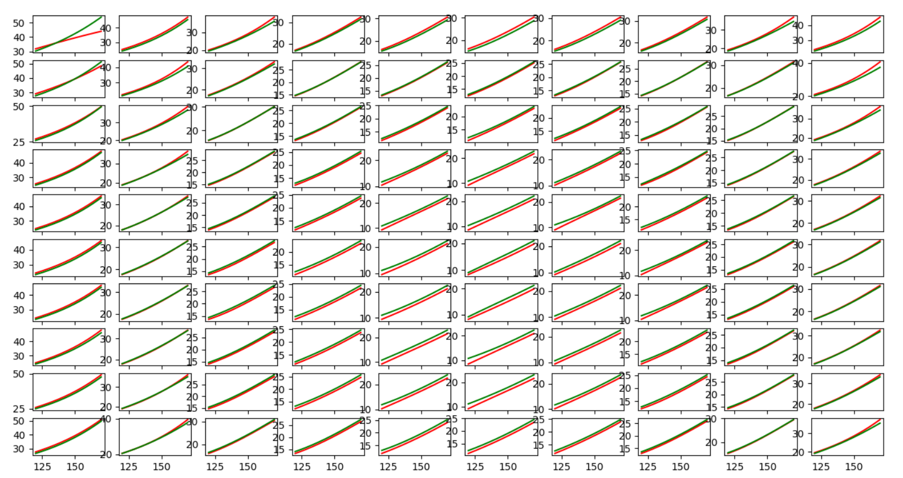

**自动均匀性校准优化**

母光源端代码更新，设备端代码更新

cs、csp

消费级端代码待开发

母光源：开模

机械结构

电气结构

ID设计

预研低成本选型未开始，周期长约6个月

矛盾点：低成本方案——开发时间

先实现时间，

各模块

1. 先给各方产品需求
2. 然后各方给出技术方案

技术方案

- 可行性验证
  - 验证框架
    - 机械结构
    - 硬件电气结构
      - 
    - 算法
      - 要参考硬件电气结构，用什么开发板，开发平台
  - 验证全流程跑通
  - 验证结果

产品化方案

- 产品需求
  - 产品成本
    - 模块选型
    - 模块继续回到上面的可行性验证
  - 技术方案
    - 各专业技术方案：根据产品需求拆分各专业模块需求，提出各专业的技术需求
- 开发时间

母光源差异比较

camera_0010

同一个相机模组在母光源上采集图片：相同功率下（13.3，13.4）1号母光源比2号母光源的采集的中心区域灰度大5-8个（边缘相差不大，1-3个灰度）

高4.9个灰度

同一个相机模组在1号母光源和2号母光源下生成的方格中G-P函数对比：

（红色是1号母光源，绿色是2号母光源）

同一个相机模组分别在1号和2号母光源上校准后，在同一台设备上采集灰度图片（灰度偏差最大3-4个灰度）

相机模组2:

camera_0011

高4.2个灰度

第3个相机模组：

camera_0002

高度下降50mm

camera_0002

camera_0011

CSP

