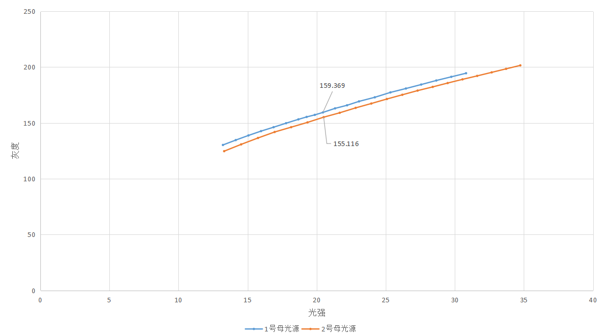
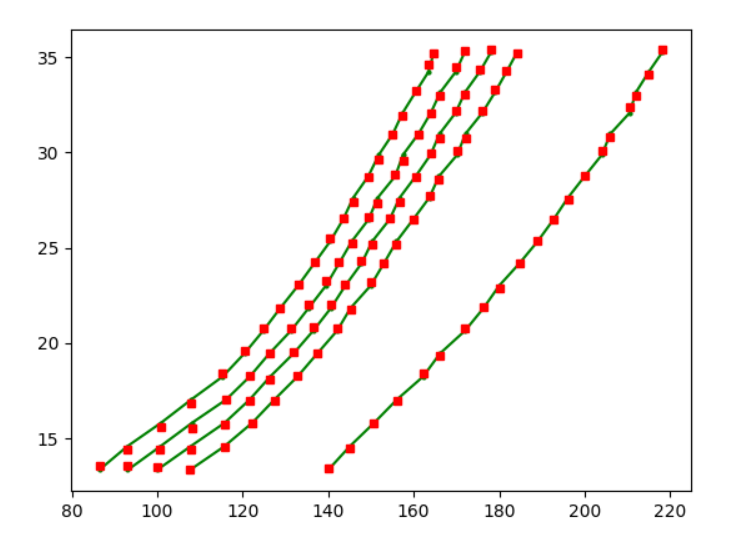

**自动均匀性校准优化**

## 1. 相机模组

### 注意点

各款相机模组的组成结构（分别是镜头和CMOS特性）

各款相机模组的技术参数（如分辨率，帧率，曝光时间等等）

整体方案的成本，不单单是相机的成本（整体方案包括：相机镜头、CMOS、驱动板、开模件）

碰到不合理的地方，一定要找到原因，而不是只是抛出这个原因告诉大家

### 模组结构

结构：镜头、CMOS感光传感器、驱动板（模数转化器、图像处理器、存储器）、开模结构件

#### 镜头参数：

**焦距**

**光圈：**控制镜头进光量多少的一个参数，一般用f/2.0、f/1.8来表示，后面的数字越小，表示光圈越大

#### CMOS感光传感器参数

**传感器尺寸**：图像传感器尺寸越大，感光面积就越大，捕捉到的光线就越多，传感器的面积一般用英寸来表示，比如1/2、1/1.7、1/1.3英寸，分母越小，表示传感器尺寸越大

**有效像素**：手机的像素越大，解析度就越高，照片的细节也就越清晰

**单像素尺寸**：单位像素尺大小决定了传感器的感光能力，单位为微米（μm），单像素尺寸越高，采光量就越多，像素之间的干扰就越小，画面的清晰度就越高。常见的单像素尺寸有0.8um、1.0μm、1.6μm、1.22μm、2.24μm等

#### 其他参数

曝光时间：

曝光方式：全局  / 卷帘

白平衡：白平衡用于实现色调调节，白平衡的基本概念是"在任何光源下都能将白色物体还原为白色"，对在特定光源下拍摄时出现的偏色现象，通过加强对应的补色来进行补偿。

### 相机模组预研


## 2. 光电传感器（自研光度计）

### 预研

基础性测试：PI曲线等等

极端测试：边角、不同温度环境下

批量测试：不同波长设备上测试


## 2. 母光源

### 制作

**第3台母光源**

- 透明玻璃：厚度比2号母光源透明玻璃**大0.4mm**，~~切割时间待李工确定~~（李工表示不用切割，同意使用大玻璃）

  

- 导入格子图母光源上位机（**投图验证一下是否是格子图，检查一下手动校准光斑个数是否和母光源需求的光斑个数相同，判断透明玻璃厚度是否对光强有影响**）

- 测波长（390nm）

- 系统分辨率设置（检查驱动版驱动是否合适，是否有对应分辨率）

- 调节清晰度

- 手动均匀性校准（）

- 安装遮光罩

### 操作问题

1. 母光源上校准相机模组时，“打开摄像头”投十字图校准相机位置时，如果没有十字出来，首先排查是否相机模组的镜头盖子没有打开

### 母光源投图类型

新白图：指相机参数进行了调整，修改了之前的bug，拍照和当前图片对应了，修改了白平衡

格子图：9幅格子图

### 母光源差异比较

camera_0010

同一个相机模组在母光源上采集图片：相同功率下（13.3，13.4）1号母光源比2号母光源的采集的中心区域灰度大5-8个（边缘相差不大，1-3个灰度）

高4.9个灰度


同一个相机模组在1号母光源和2号母光源下生成的方格中G-P函数对比：

（红色是1号母光源，绿色是2号母光源）


同一个相机模组分别在1号和2号母光源上校准后，在同一台设备上采集灰度图片（灰度偏差最大3-4个灰度）


相机模组2:

camera_0011

高4.2个灰度




第3个相机模组：

camera_0002


高度下降50mm

camera_0002


camera_0011


CSP


## 2. 自动均匀性校准总结

- 原理：利用相机模组，起到光度计的作用，识别幅面中真实光强分布，然后反算mask，从而使幅面均匀

- 母光源
- 设备
- 相机模组
- 背光膜

## 2. 基础性测试

**格子图**

在2号母光源上，利用上位机投影指定图（U盘内图片），然后使用相机拍摄图片

**对中：相机中心和投图中心对中**

左边：全幅面格子图获取格子灰度后，重新生成一张灰度图片，代表全幅面内灰度情况

右边：小幅面格子图


对比可以看出，**小幅面同位置的灰度和大幅面基本相同**


**偏移：相机向右下方偏移70个像素**

左边：全幅面格子图获取格子灰度后，重新生成一张灰度图片，代表全幅面内灰度情况

右边：相机相对相机中心向右下方偏移82个像素（右移72个像素，下移41个像素）

（蓝色表示值小于容差，红色表示值大于容差）


可以看出，**偏差在5个灰度以内**


## 3. 波长关系

### 设备波长测试


#### 波长测试方法

注意测试电流，因为温度对波长存在影响，见[SOP](E:\chairside相机模组自动均匀性校准\自动均匀性校准优化\光源波长采集\波长质检方案-20221215.pdf)

#### 波长测试结果

| 编号                           | 峰值波长 |      |
| ------------------------------ | -------- | ---- |
| 母光源1号                      | 386      |      |
| 母光源2号                      | 386.5    |      |
| 母光源3号                      | 390      |      |
| 光学实验室CSP B01-C22-481-86A2 | 385.5    |      |


### 灰度与波长关系


#### 相机响应曲线与灰度分析


总结：$$响应系数R = 0.55 - 0.005 * (400 - 波长\lambda) $$

$$\frac{灰度G_1}{灰度G_2} = \frac{响应系数R_1}{响应系数R_2}$$


#### 母光源和设备端波长相同的情况下，验证格子图和白图的自动校准结果

设备编号：B01-C22-161-86A2

母光源九宫格——CSP九宫格：

母光源（格子定位）白图——CSP（格子定位）白图：


结论：格子图的校准结果更好

使用边框为黑色的黑色料盘

两侧值更小


### 母光源波长对设备端幅面均匀性影响

波长对自动校准结果影响：

|                  | 母光源大波长                                       | 母光源小波长                                       |
| ---------------- | -------------------------------------------------- | -------------------------------------------------- |
| **设备端大波长** | 可以校正，趋近均分                                 | **无法校正，极差往负向偏，幅面分布中间大，两边小** |
| **设备端小波长** | **无法校正，极差往正向偏，幅面分布中间小，两边大** | 可以校正，极差趋近均分                             |


幅面光强分布情况：

母光源大波长，设备端小波长


系数补偿：乘以小于1的数，缩小幅面灰度梯度，使极差往负向偏


母光源小波长，设备端大波长


系数补偿：乘以大于1的数，放大幅面灰度梯度，使极差往正向偏


### 波长补偿优化幅面均匀性

CSP

软件导入CSP ： 对应路径/home/heygears/.heygears/configs下的autograycalib.json文件版本从1.0.0.2开始，否则不起作用


compensation_factor——配置补偿系数


对比图像，验证是否灰度梯度发生变化

补偿前图像：gridConcat_cap_img.png
补偿后图像：AmplifyGrayImg.png

目的：一个母光源能校准任意波长设备的幅面均匀性

问题：大波长母光源无法校准小波长设备，小波长母光源无法校准大波长设备

测试验证：补偿系数的确定


## 4. 校准结果偏差分析

1. 相机模组在母光源上均匀性偏差：0.5W
   - 母光源定期做均匀性校准
2. 母光源及设备端光源波长偏差：388.3（2号母光源）、385.5（1号母光源）：4.6个波长偏差以内，6个灰度偏差
   - 通过乘响应系数比值
3. 相机模组噪声灰度偏差：1-2个灰度
4. 背光膜灰度偏差：2-3个灰度（第一张）
5. 相机模组在母光源及设备端位置偏差：CSP——50个像素，约3mm，5个灰度偏差以内
6. 母光源G-P拟合函数偏差：真实值-拟合值 ： -0.61~0.53W
7. 反算mask偏差：0.4W


## 5. 设备批量测试

### CS

- 模组1个
- CS设备端程序
- 优盘

**CS设备批量测试**

- CS设备：加速器场内设备

- 相机模组：1个

- 波长测试：按照光学波长测试标准进行波长测试（0.5h左右）

- 自动校准新方案测试（0.5h左右）：

  1. 导入软件

     1. 进入后台命令行，杀掉前端和后端

        `sudo killall ultracore-bootloader`

     2. 更改ultracore文件夹的读写权限

        用户目录（`/home/heygears/`）下执行：`sudo chmod 777 ultracore -R`

     3. 备份bin文件，后期复原时直接使用该备份bin文件

        进入到ultracore路径下， 将bin文件夹命名为bin_orig，并新建一个bin文件夹

        `cd ultracore`

        `mv bin bin_orig`

        `mkdir bin`

     4. 将解压后的文件夹内文件传输到bin文件夹内

        

     5. ~~删除`home/heygears/ultracore/.db/config.db`文件~~

     6. 重启

  2. 自动校准

  3. 复检结果

  4. 导出测试结果

     1. `heygears/Downloads`
     2. 
  
- 整理测试结果

  - 波长信息
  - 位置偏移信息
  - 均匀性结果


测试流程：

- 找山哥协调设备，然后找晓君借用运输车

- 运到光学实验室，然后找小鱼指导测量CS波长

- 通过优盘导入软件（**国杰：导入软件是否会更改原设备内容、如何复原**）

- 按照自动校准流程进行自动校准（**注意：擦拭相机镜头、料盘**）（**准备：背光膜、料盘、相机模组、光度计、键盘、Hub**）

- 复检结果（**中间点（第10个斑点）的光强调节到21W，在此电流下复检**）

- 记录数据（**按照模板**）

- 复原设备，运回原处

CS设备上优盘路径为：/media/root/优盘名


### CSP

1. 测试波长
2. 自动校准全流程


复原csp设备

1. 杀死前后端

   sudo killall backend

   sudo killall frontend

2. 在app路径下，删除release和release_grid文件夹

3. 将release_orig改为release

4. 将 .heygears/configs 中的 autograycalib.json删除

5. 将Downloads中的文件全部删除

6. 重启设备


CSP设备文件和U盘之间传输

优盘路径：/mnt/HJ1131/heygears

**复制格子图**

sudo cp -r /mnt/HJ1131/heygears/CSP_software/grid/lib /mnt/HJ1131/heygears/CSP_software/grid/plugin /mnt/HJ1131/heygears/CSP_software/grid/backend /mnt/HJ1131/heygears/CSP_software/grid/frontend /home/heygears/app/release

**复制白图**

sudo cp -r /mnt/HJ1131/heygears/CSP_software/grid_white/lib /mnt/HJ1131/heygears/CSP_software/grid_white/plugin /mnt/HJ1131/heygears/CSP_software/grid_white/backend /mnt/HJ1131/heygears/CSP_software/grid_white/frontend /home/heygears/app/release

**复制autograycalib.json文件**

sudo cp  /mnt/HJ1131/heygears/CSP_software/autograycalib.json 


1号母光源和2号母光源制备相机模组差异（波长——1号母光源：386nm，2号母光源386.5）

批量测试15台csp设备的母光源的模组：

P-G关系

格子图


白图


G-P关系

格子图


白图


使用修改电流改变电流光强获得灰度光强关系方法



使用改变mask修改光强获得灰度光强关系


#### 批量设备自动校准全流程测试步骤

开会和工程拉通信息：

与会人员：项目经理、工程、质量、协调的操作人员

会议内容：

	1. 研发需要进行的内容
	1. 


准备：

1. 电脑
2. 软件： xftp，xshell
3. 键盘
4. 网线

#### 一、 CSP设备上位机软件导入

1. 命令行杀死上位机

   ```
   sudo killall backend
   sudo killall frontend
   ```

2. 备份现行的release文件夹

   1. 进入如下路径，将`release`文件夹复制一份，并更名为`release_orig`

   

3. 复制新版上位机软件指定文件到release，从而替换对应文件夹

   


4. 同步并重启设备

   ```
   sync
   sudo reboot
   ```

   

#### 二、自动均匀性校准

1. 清洁料盘及相机模组镜头

2. 放好背光膜，插入相机模组

3. 进入mainwindow界面，设置成如下所示（优化）

   

4. 进入高级设置，点击自动光机校准

   

   2. 依次进入下一步

      

   3. 完成自动校准后，进入mainwindow界面，进行复检

#### 三、复检

1. 复检光强设定在21W±0.2W（注意：不同光度计会有偏差，0.2W左右，同一个操作人员使用同一个光度计）

   

2. 开启均匀性检测

   


3. 导出测试结果到Downloads文件夹中

   


1. 注意光机防尘盖是否打开
2. 光路是否清洁（相机镜头、透明玻璃、料盘）
3. 检查mainWindow界面程序版本


## 6. 产品导入

### 相机模组和设备匹配增加字段

- 自动校准新方案使用

  - 

- 客户模组丢失情况

  - 寄过去新模组：旧版程序无法识别，必须升级新版程序，新版程序含有两个匹配字段，可以匹配新模组，也可匹配旧模组，如果客户找回旧模组，也可以识别继续使用
  - 旧模组：旧模组可以在新版程序上使用

  

  |                           | 旧版程序（白图）                                             | 新版程序（白图+格子图：字段abc）                             |
  | ------------------------- | :----------------------------------------------------------- | ------------------------------------------------------------ |
  | 旧模组（白图）            | 场景：**当前客户端情况**                                     | **场景1**：**客户端软件升级**；**场景2**：客户端**丢失旧模组找回**（可继续使用旧模组） |
  | 新模组（格子图：字段abc） | **场景1**：**客户模组丢失**，寄送新模组，此时需要客户软件升级，再做自动校准；**场景2**：客户端**软件新版回退到旧版**（字段无法匹配报错，请求升级软件） | 场景：**新版方案导入设备**                                   |
  | 其他版本模组...           |                                                              |                                                              |

  


## 7. CS自动校准电流列表更新

追溯问题：


原因：做完首次自动均匀性校准后，然后再做完自动mask手动PI后，此时接下来会检测18，21，28W时候，反算出来的电流对应上去和18，21，28W相差多少，判断光度计在自动mask下跑出来的PI是否在这三个点上的极差在±0.2，但是由于光度计并没有获取到28W，所以无法计算出此时的电流。

1. ~~该问题不太可能由于光强上不去导致的问题，因为只要存在拟合数据，就能拟合，就能算出对应的光强需要的电流，只是准确不准确，偏差大不大的问题，而不是直接无法拟合。经软件分析，更有可能是流程不正确导致的问题~~
2. 如果出现光强上不去，影响光强校准精度的情况，也只是少数设备（经光学分析，可能是低bin光机导致），测试两台R50设备，当前电流列表是满足要求的，10~32W，产线会上线30台，可以帮忙测试
3. 产线设备辅助测试不会造成生产事故，如果出现少量设备光强不合格的情况，只用在该设备中放入配置文件
4. 同步开发最终全覆盖方案


新批次光机的电流固定列表确定

- 现行的cs设备，电流列表对应的相机模组拍摄得到的光强
- 使用新的光机cs设备，为了获得相同的光强需要多大电流，从而确定电流列表
  - 要使用多台光机，例如3台设备测试

- 新的光机套件
  - 光机并不变，只是光机驱动板上的电阻由R036变成R050，可以直接在驱动板上看到
  - 更换原因：CS有低功率14W，高功率28W打印需求

- 确定电流列表的指标
  - 在母光源的光强范围内
  - 采集到的灰度要符合校准需求，不能太高也不能太低
  - **使用高bin值、低bin值，大波长、小波长设备分别测试指定电流列表下的功率和灰度关系**
    - **高bin值、低bin值对光强影响？，bin值范围跨度？**
      - 跨度大概3.2W

  - **母光源的灰度范围需要囊括设备端灰度范围（GP函数定义域）**——所以母光源只适合校准比自己波长更大的设备，同时设备端的电流在最大波长时不能超过母光源获取到的灰度

  - **设备端的起始灰度值要比母光源14W对应的灰度值低，比母光源11.3W对应的灰度值高，终止灰度值要比母光源28W对应的灰度值高，比34.03W对应的灰度值低**

- 电流列表的使用方式（如何和设备绑定而不是和软件绑定）
  - 拟定固定的电流列表
  - 根据设备的手动校准的PI调用该电流列表

- **手动校准下的PI的电流列表是否确定？**


**测试方案：**

使用大、小波长设备分别测试同一电流下光强及灰度值，使得

- 光强：设备的最低电流光强都在母光源的光强范围内（带均匀性校准后的mask测）

- 灰度：小波长设备（不能比母光源低）的最低电流灰度在母光源灰度内，大波长的最大电流灰度在母光源灰度内

  - 设备端波长比母光源大，光强功率在母光源功率范围内

  母光源的PI列表：**光强11.3W~34.03W**

| 电流值C | 功率P   |
| ------- | ------- |
| 185     | 11.3    |
| 205     | 12.5936 |
| 225     | 13.8801 |
| 245     | 15.1592 |
| 260     | 16.1134 |
| 275     | 17.063  |
| 290     | 18.0079 |
| 305     | 18.9479 |
| 320     | 19.8829 |
| 330     | 20.5034 |
| 340     | 21.1215 |
| 350     | 21.7373 |
| 360     | 22.3505 |
| 375     | 23.2658 |
| 390     | 24.1752 |
| 405     | 25.0788 |
| 425     | 26.2741 |
| 445     | 27.4582 |
| 465     | 28.6308 |
| 485     | 29.7915 |
| 510     | 31.2251 |
| 535     | 32.6388 |
| 560     | 34.0319 |


方案1：

- 旧设备：升级时导入配置文件，配置文件中设定旧设备的电流列表
- 新设备：导入新版软件默认的电流列表

方案2：

- 软件中配置大范围电流列表，在模组中写入灰度范围，取灰度范围内的光强带入计算

方案3：

- 电流列表中电流对应的光强并不是实际参与拟合GG的光强值，而是会对电流列表跑出来的光强值卡范围后再进行GG拟合

**方案4：**

- 使用现有电流列表在R50设备上光强达不到，出现校准报错的情况**小于10%**，可以**争对这些少量设备添加配置文件，使其扩大电流列表**（不用更改程序中的电流列表，易引发已发货设备问题）。同时这些少量设备初步判断可能是低bin值光机，可以在IQC增加选择标准，去掉低bin光机流入产线。


- 50欧电阻光机的PI曲线
  - 电流350时，光强在39.63~42.49（灰度255情况下）
  - 进行线性拟合，电流340对应的光强在38W


- 软件版本中增加自动校准的电流列表

  - 91，100，110， 120，130，140，145，150，160，170，180，190，200，220，240，260，280，**300，320，340**

- 协调3台R50的CS设备做新版软件测试

- 在R36设备做新版软件测试（旧版本设备升级后，模组丢失情况下，需做自动校准全流程（修改GG参数））

  - **结论：增加了电流列表后，产生的光强，并未进入到拟合GG参数需要的光强数据中**
  - 自动mask的手动PI过程中根据电流列表产生的数据和实际使用的数据
  - 蓝色：R36时的电流列表
  - 红色：增加的电流列表

  


**36欧 v.s. 50欧**

设备端电流列表结果（在自动校准生成的mask上的光强）：

36欧：


自适应电流列表（光机老化），而脏物影响时不能变


**批量CS设备：50欧电阻光机驱动版**

**原电流列表（91-280）**


**更改电流列表（110-320）**


电流列表确定标准：

1. 上下限（高低bin值光机都能满足光强需求）
2. 间隔（在检测需求点15、18、21、28W 间隔密一点）

110、**125、140、155**、175、190、**200、210、220、230**、250、**265、280、295、310**、330


**更改电流列表方式（指定路径下增加配置文件）：**


**配置文件内容：**

**autograycalib.json（自动校准中电流列表）**


**autoenergycalibparams.json（自动mask手动PI过程电流列表）**


1. 不更改软件，已发货设备软件升级时不发生改变，不影响已发设备使用；
2. 是否使用场内软件版本，自动路径下包含该配置文件；


第3台母光源（大波长光源）在设备端测试


**母光源上管控：**

增加母光源管理日志书面材料，对母光源每次操作均需记录：

- ~~重点关注配置文件（均匀性相关）是否发生更改~~
- ~~导入git版本控制~~

**光强：**

**灰度：**

- 第一张图片的灰度判断，中间张，最后一张图片灰度判断

**相机模组写入失败处理：**

- 相机模组在母光源上先将函数保存下来，如果出现失败，再使用界面上的 ”**再次写入函数**“ 按钮


## 8. CS、CSP、消费级自动校准程序优化内容

**1、相机问题**

(1)buffer_size；

~~(2)参数设置bug；~~

(3)相机接入的判断逻辑。

**2、母光源问题**

(1)去掉gamma=120的配置；

(2)增加光机屏幕分辨率检测（在自动校准流程开始前）；

(3)EEPROM保存本地，以防首次写入失败，可重写；

(4)去掉无关日志，增加过程数据记录，自动校准相关日志导出至单独log文件；

(5)保存过程图，和当次校准日志文件保存至以模组+日期命名的文件夹中；

(6)统一校准结束后图片打包方式；

(7)白图、格子图校准形式可选；

(8)CS、CSP校准使用的母光源只有一个分支；

(9)增加格子图拍全检测；

(10)自动调节曝光，曝光值写入EEPROM；

(11)光强灰度值范围写入EEPROM，设备使用灰度范围内的电流值进行光强校准；

(12)均匀性使用标准功率值下的灰度值写入EEPROM，设备使用该灰度下的电流值进行均匀性校准。

**3、CS、CSP设备**

新旧自动校准方式共存。形式：新增一个插件来导入新校准方式，通过相机模组的字段识别使用新校准方式还是旧校准方式。

**4、均匀性复检评估标准**

(1)21±0.6W；

(2) 边缘位置允许偏差范围21±1W？

(3) 标准差、期望？


**后期优化点**

1. 相机模组批次不同，导致拍照灰度存在很大差异

   - 母光源设定21w对应的灰度，调整模组曝光时间，使采集灰度基本相同

   - 母光源增加来料检测策略

   - 降低模组来料差异对校准的影响，优化来料检测的流程


2. 光机批次不同，导致相同电流对应功率差异以及相机采集灰度差异

   - 均匀性校准，设备端使用与母光源21w相同灰度对应电流做校准

   - 光强校准，设备端使用与母光源灰度范围相同数据拟合GG参数

   - 可以大幅缩减均匀性校准电流列表范围，降低拟合的失败率


3. 相机通讯异常和光机EMI异常

   - 调整相机检测和打开交互流程

   - 上位机尽可能减少与相机通信的频次


4. 母光源电流列表换成光强列表


## 9. 自动校准报错情况


30605：


