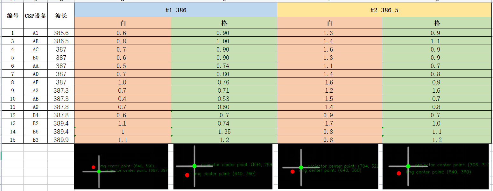
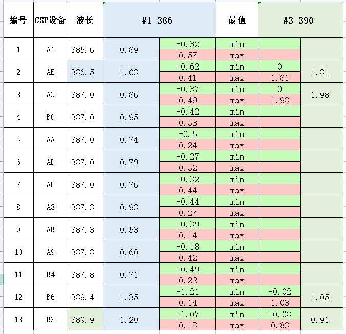
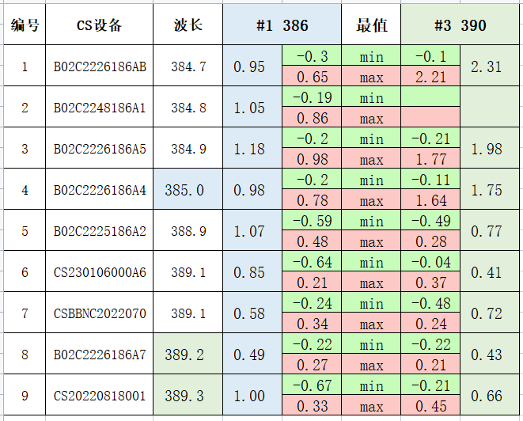
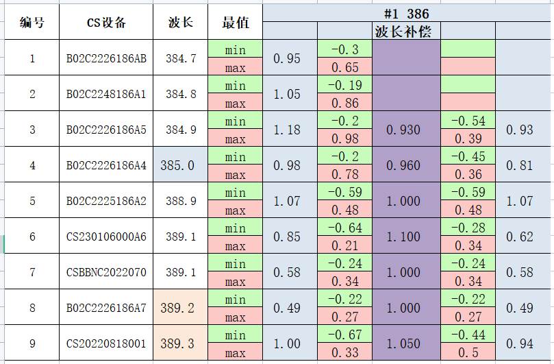
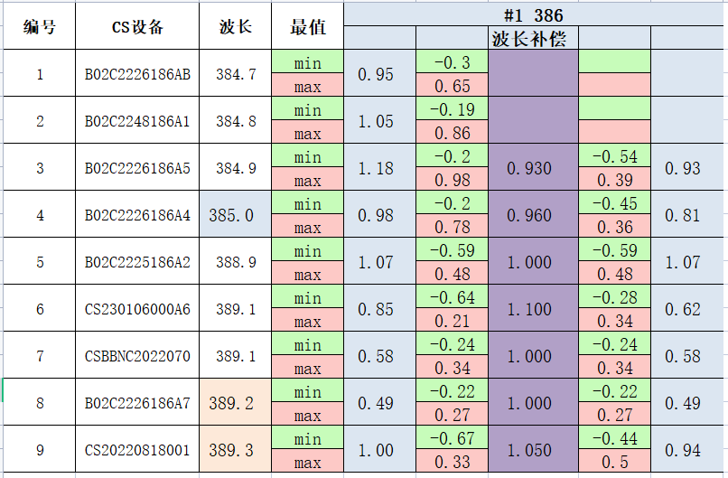

## 自动均匀性校准优化预研整理

## 1. 基础性测试

**格子图**

在2号母光源上，利用上位机投影指定图（U盘内图片），然后使用相机拍摄图片

**对中：相机中心和投图中心对中**

左边：全幅面格子图获取格子灰度后，重新生成一张灰度图片，代表全幅面内灰度情况

右边：小幅面格子图

对比可以看出，**小幅面同位置的灰度和大幅面基本相同**

**偏移：相机向右下方偏移70个像素**

左边：全幅面格子图获取格子灰度后，重新生成一张灰度图片，代表全幅面内灰度情况

右边：相机相对相机中心向右下方偏移82个像素（右移72个像素，下移41个像素）

（蓝色表示值小于容差，红色表示值大于容差）

可以看出，**偏差在5个灰度以内**

**结论：使用格子图投图方式影响小，更准确**

## 2. 新方案（格子图）的校准效果验证测试

#### 母光源和设备端波长、偏移相同的情况下，验证格子图和白图的自动校准结果

设备编号：B01-C22-161-86A2

母光源九宫格——CSP九宫格：

母光源（格子定位）白图——CSP（格子定位）白图：

**结论：格子图的校准结果更好**

## 3. 新方案（格子图）的批量设备测试

CSP测试结果

**结论：格子图的投图方式的准确性及稳定性优于白图**

## 4. 波长对设备均匀性校准的影响

### 灰度与波长关系

#### 相机响应曲线与灰度分析

总结：$$响应系数R = 0.55 - 0.005 * (400 - 波长\lambda) $$

$$\frac{灰度G_1}{灰度G_2} = \frac{响应系数R_1}{响应系数R_2}$$

### 母光源波长对设备端幅面均匀性影响

**测试结果**

CSP设备

CS设备

**总结**

波长对自动校准结果影响：

|                  | 母光源大波长                                       | 母光源小波长                                       |
| ---------------- | -------------------------------------------------- | -------------------------------------------------- |
| **设备端大波长** | 可以校正，趋近均分                                 | **无法校正，极差往负向偏，幅面分布中间大，两边小** |
| **设备端小波长** | **无法校正，极差往正向偏，幅面分布中间小，两边大** | 可以校正，极差趋近均分                             |

**校准后的幅面光强分布情况：**

母光源大波长，设备端小波长

母光源小波长，设备端大波长

## 5. 波长补偿优化幅面均匀性

**测试结果**

1号母光源

3号母光源

**总结：**

母光源大波长，设备端小波长

系数补偿：乘以小于1的数，缩小幅面灰度梯度，使极差往负向偏

母光源小波长，设备端大波长

系数补偿：乘以大于1的数，放大幅面灰度梯度，使极差往正向偏