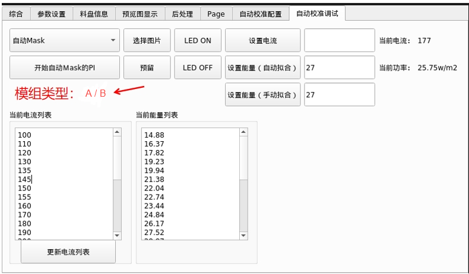
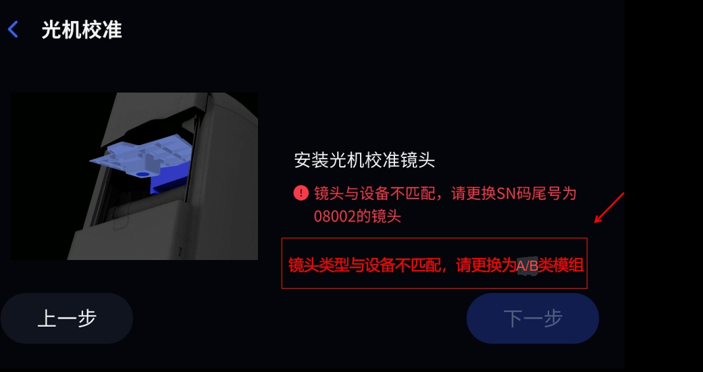
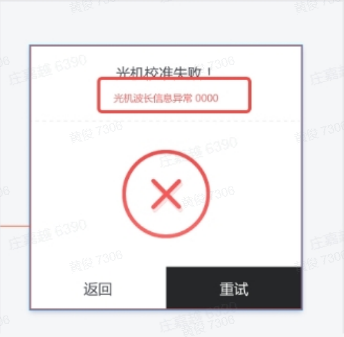
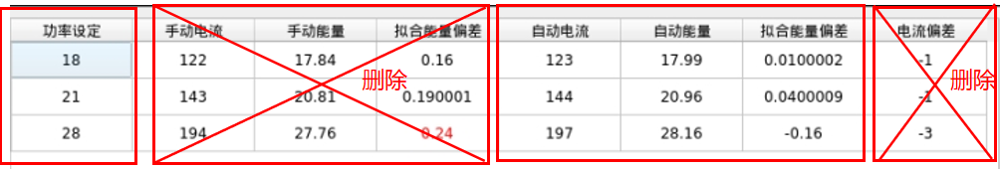
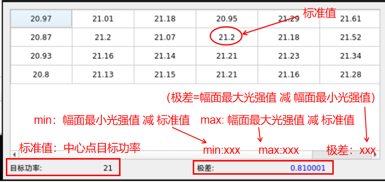
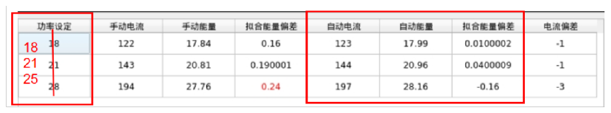
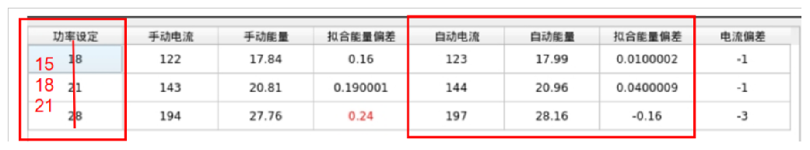

自动校准优化方案后端相关软件开发需求

1. 

- Form界面查看模组类型

判断逻辑：

读取波长json文件中pwl值，若值在以下区间，执行对应操作，在Form界面“模组类型”中输出模组类型数字

if（能从设备指定路径读取到光机波长信息）：

根据光机波长数据值落在对应区间，显示需要使用A/B类模组：

- [ 388, 391 )， B类模组

- [ 386, 388 )， A类模组

- [ 385, 386 )， A类模组

- ( 384, 385 )， A类模组

- 如果波长都不在以上范围，报错

然后确定波长补偿参数：

如果：

B类模组，同时设备光机波长区间为：

[ 388, 391 )，使用默认配置文件参数1.0；

如果：

A类模组，同时设备光机波长区间为：

[ 386, 388 )，使用配置文件参数1.0；

[ 385, 386 )，使用配置文件参数0.96；

( 384, 385 )， 使用配置文件参数0.93；

if（无法从设备指定路径读取到光机波长信息）：

同时全局波长补偿参数设置为1.0

注：全局波长补偿参数在以下条件下使用：

设备的旧版自动校准模组缺失（已发货设备模组丢失情景），且无法提供旧版自动校准模组时，此时只能使用新版自动校准方案及新版自动校准模组，由于该设备可能无光机波长文件，因此新版自动校准方案无法识别波长信息，故配置此参数及其值设为1.0。

- UI界面

如果设备中无波长json文件，自动校准全流程不报错（适用于设备的旧版自动校准模组缺失（已发货设备模组丢失情景），且无法提供旧版自动校准模组时，此时只能使用新版自动校准方案及新版自动校准模组，由于该设备可能无光机波长文件）

在设备波长json文件存在的情况下：

软件逻辑：

读取光机波长json文件中pwl值，及模组中储存的母光源波长数据

只有设备光机波长区间和模组的母光源波长对应，才不报错，否则报错

设备光机波长区间：[ 388, 391 )——模组储存的母光源波长类别：B

设备光机波长区间：( 384, 388 )——模组储存的母光源波长类别：A

模组类型报错和模组SN匹配报错结合一起

报错界面：

如果读取到的设备的波长信息不在以上（384, 391）区间，则在做完流程后弹出出错界面，提示错误码

- 母光源

相机模组中写入母光源波长类别，母光源波长：

母光源波长类别判断逻辑：

母光源波长区间：387.9±0.5， 即 [ 387.4 , 388.4]，母光源波长类别：B

母光源波长区间：386±0.5， 即 [ 385.5, 386.5 ]，母光源波长类别：A

若母光源波长不在以上任一区间，报错

例如：

波长类别：B

波长：387.9

但是具体关键字需开发者和调用者沟通即可

2. 自动mask手动PI

- 投光圆斑

CS：投光圆斑——第10个

CSP：投光圆斑——第20个

- 电流列表

和手动电流列表一致

3. 复核

光强

- 光强复核图表只保留4列

- 投光圆斑

CS：投光圆斑——第10个

CSP：投光圆斑——第20个

均匀性

数值显示

4. 标准：

功率设定值做修改

CS

CSP

光强：

CS：光强在18、21、25 W/m2 时的偏差在±0.4W/m2以内；

CSP：光强在15、18、21 W/m2 时的偏差在±0.4W/m2以内

均匀性：

CS、CSP：在21 W/m2 检测幅面光强时， 均匀性的偏差在±0.8W/m2以内，极差在1.3W/m2以内

依据以上标准输出自动校准是否失败

5. 日志中关于自动校准信息输出：

- 设备波长信息、模组存储的母光源波长及类别信息

- 电流I——灰度G：`I-G`

- 拟合的光强和电流系数：`多项式系数:  QVector`

- 电流I——光强P：`ipPnts`

- 灰度G——光强P：`G-P`

- 拟合GP函数多项式系数： `gpCoeff =  std::vector`

- 保留图片：生成的mask，一张光强校准的过程图片

