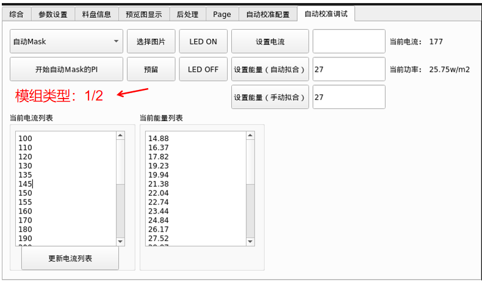
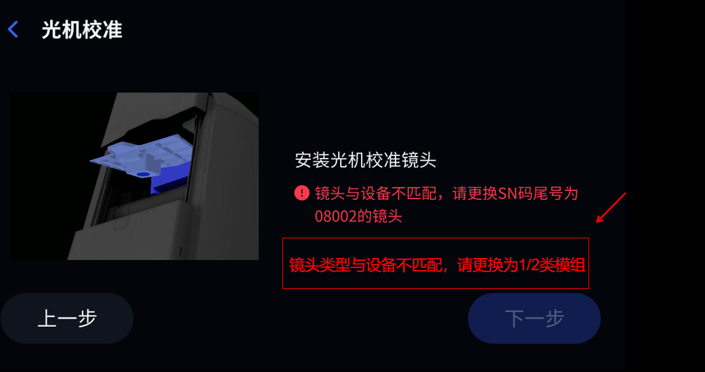
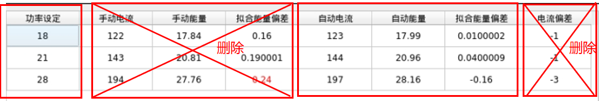
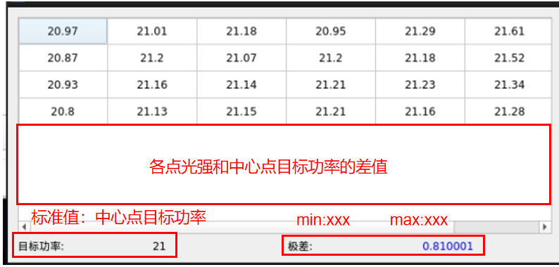
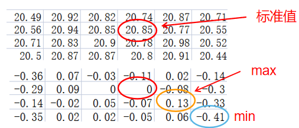
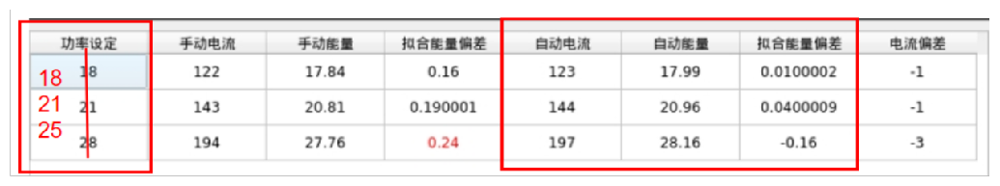
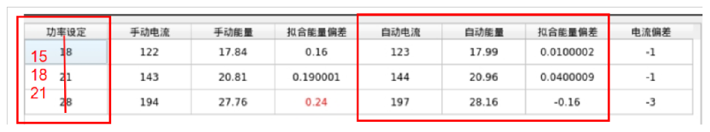

自动校准优化方案后端相关软件开发需求

1. 

- Form界面查看模组类型

判断逻辑：

读取波长json文件中pwl值，若值在以下区间，执行对应操作，在Form界面“模组类型”中输出模组类型数字

[ 388, 391 )， 2类模组+默认配置文件参数

[ 386, 388 )， 1类模组+默认配置文件参数

[ 385, 386 )， 1类模组+配置文件参数0.96

( 384, 385 )， 1类模组+配置文件参数0.93

- UI界面

软件逻辑：

读取光机波长json文件中pwl值，及模组中储存的母光源波长数据

只有光机波长区间和模组的母光源波长对应，才不报错，否则报错

光机波长区间：[ 388, 391 )——模组储存的母光源波长：387.9

光机波长区间：[ 384, 388 )——模组储存的母光源波长：360 

模组类型报错和模组SN匹配报错结合一起

报错界面：

2. 自动mask手动PI

- 投光圆斑

CS：投光圆斑——第10个

CSP：投光圆斑——第20个

- 电流列表

和手动电流列表一致

3. 复核

光强

- 光强复核图表只保留4列

- 投光圆斑

CS：投光圆斑——第10个

CSP：投光圆斑——第20个

均匀性

数值显示

举例：

4. 标准：

功率设定值做修改

CS

CSP

