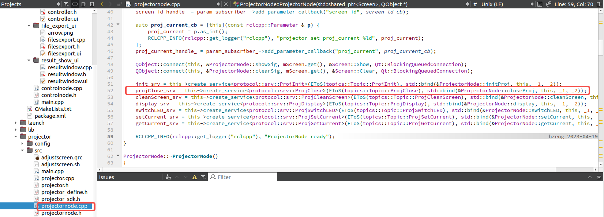

增加光机关机功能

client: controllernode

server: projectornode

service通道


client

**创建client**


1. 新建client

```c++
initProj_cli = this->create_client<protocol::srv::ProjInit>(EToS(topics::Topic::ProjInit));

	//创建projClose_cli client，使用service通道为protocol::srv::ProjClose
    projClose_cli = this->create_client<protocol::srv::ProjClose>(EToS(topics::Topic::ProjClose));

    switchLED_cli = this->create_client<protocol::srv::ProjSwitchLED>(EToS(topics::Topic::ProjSwitchLED));
```

2. 需执行的功能

```c++
bool ControlNode::closeProjector()
{
	//确定request
    //？ 的结构在该路径下protocol::srv::ProjClose::Request
    auto req = std::make_shared<protocol::srv::ProjClose::Request>();

    //ros::Request(client,request,xx,xx)
    auto reply = ros::Request(projClose_cli, req, 5000, 30000);
    if(reply.error)
    {
        return reply.error;
    }
	//返回结果
    return reply.result->ret;
}
```


头文件声明


**创建service通道及其通道文件结构**

创建一个service结构文件，设置其文件结构，client和server交流的通道，service的内容格式（点划线上方为request，下方为response）


**创建server**


1. 创建server

```c++
init_srv = this->create_service<protocol::srv::ProjInit>(EToS(topics::Topic::ProjInit), std::bind(&ProjectorNode::initProj, this, _1, _2));
	//创建server
    projClose_srv = this->create_service<protocol::srv::ProjClose>(EToS(topics::Topic::ProjClose), std::bind(&ProjectorNode::closeProj, this, _1, _2));

    cleanScreen_srv = this->create_service<protocol::srv::ProjCleanScreen>(EToS(topics::Topic::ProjCleanScreen), std::bind(&ProjectorNode::cleanScreen, this, _1, _2));
```

2. 需执行的功能

```c++
void ProjectorNode::closeProj(const protocol::srv::ProjClose_Request::SharedPtr req, const protocol::srv::ProjClose_Response::SharedPtr res)
{
    Q_UNUSED(req);

    res->ret = mProjector->Close();
    return ;
}

```

头文件声明


添加一个空行，让其重新编译，否则cmakelist可以不会编译


添加功能的逻辑

进入`controller.ui`文件

找到按钮（**信号**）


进入到`controller.cpp`文件中，进行功能定义（**槽函数**）

一点击这个按钮，就会执行该函数中的功能，该函数的功能是什么样的呢？

`->`：指针调用成员方式

因此p是一个类的指针，`closeProjector()`是类的成员函数；

p是什么类的指针？类中的该成员函数是什么功能？


光标定位到 `p`，然后按住ctrl键，点击鼠标左键，查看p的声明；

进入到头文件`controller.h`

p是智能指针，是类`ControlNode`的指针。


**进入到node节点的client**


光标定位到`<ControlNode>`，然后按住ctrl键，点击鼠标左键，查看类`ControlNode`的声明。

进入到`controlnode.h`头文件

类`ControlNode`的声明


光标定位到`bool closeProjector`，然后按住ctrl键，点击鼠标左键

进入到`controlnode.cpp`源文件，查看类的成员函数`closeProjector`的功能

`projClose_cli`是client端对象指针

```c++
auto reply = ros::Request(projClose_cli, req, 10000, 30000);
//projClose_cli:client指针；
//req:request指针；
//10000： request to be sent发送request的最大时间（ms）；
//30000：client to receive a response client收到response的最大时间
```


`reply.result`是`Response`类的指针，通过这个类找到其成员，即为response回来的值。


光标定位到`projClose_cli`上，找到`projClose_cli`的声明

可以看到这个client端和server端传输信息的通道为`ProjClose`


光标放在`ProjClose_cli`上点击，无法跳转

通过Qt的搜索功能在cpp源文件中找到`ProjClose_cli`的定义


以及可以看到这个client端和server端传输信息的通道为`ProjClose`

通过Qt的搜索功能搜索service通道名称`ProjClose`，找到该通道定义的request和response

其中response类有个成员为ret


通过Qt的搜索功能搜索service通道名称`ProjClose`，找到server

因为server是另外一个node，所以是另外一个类，所以要在其他文件中找。


**进入node节点的server**

进入`projectornode.cpp`源文件查看server的定义

```
projClose_srv = this->create_service<protocol::srv::ProjClose>(EToS(topics::Topic::ProjClose), std::bind(&ProjectorNode::closeProj, this, _1, _2));
//使用当前对象的"create_service"方法创建一个server，并传入以下参数：
//protocol::srv::ProjClose:service信息的类型定义，service的request和response的结构
//EToS(topics::Topic::ProjClose):service话题名字符串，通过EToS函数将枚举值转换成字符串；
//std::bind(&ProjectorNode::closeProj, this, _1, _2)：回调函数，收到client的request就会被调用，回调函数被定义为ProjectorNode::closeProj，使用std::bind函数绑定在当前对象实例（“this”）上，占位符"_1" and "_2"表示该回调函数需要两个参数，分别是request和response。
```



可以看到该service绑定了函数`ProjectorNode::closeProj`


光标放在`ProjectorNode::closeProj`的`closeProj`上，点击鼠标，跳转到该函数的定义上


光标放在`mProjector`上，点击鼠标，跳转到`mProjector`的定义

`mProjector`是一个智能指针，是`Projector`类的指针


光标放在`Projector`上，点击鼠标，查看该类的声明

存在成员函数`Close()`


光标放在`Close`上，点击鼠标，查看该函数的定义


该函数最后会返回true或false的布尔类型

然后逆着往回看

